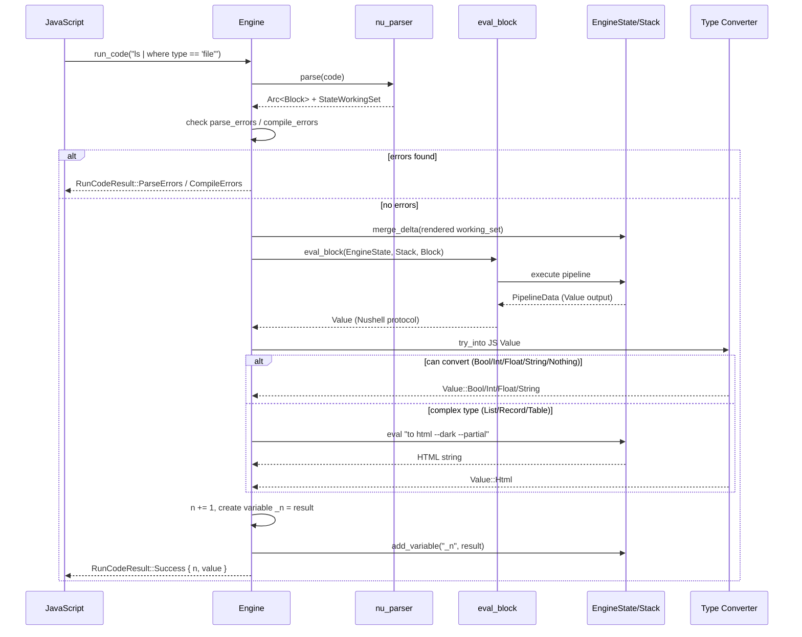

# nu-on-web — WASM Engine

**Source:** `engine.rs` — 290 lines. Engine struct wrapping Nushell's `EngineState` + `Stack` with parse-eval-convert pipeline, command description extraction, pipeline element lookup, and completion fetching.

## Engine Struct — Persistent Nushell Session

```rust
// engine.rs:17-21
pub struct Engine {
    engine_state: EngineState,
    stack: Stack,
    n: u32,                    // result counter for auto-variable naming
}
```

The `Engine` wraps Nushell's core execution components:
- **`EngineState`** — holds registered commands, variables, type definitions, and the span offset tracker
- **`Stack`** — holds runtime state (variable values, environment variables, call stack)
- **`n`** — counter for auto-naming results (`_1`, `_2`, ...) so they persist across calls

### Engine Initialization — Command Context Assembly

```rust
// engine.rs:23-43
impl Engine {
    pub fn new() -> Self {
        let mut engine_state = create_default_context();                    // nu-cmd-lang: basic language constructs
        engine_state = nu_command::add_shell_command_context(engine_state); // nu-command: shell commands (ls, cd, etc.)
        engine_state = nu_cmd_extra::add_extra_command_context(engine_state); // nu-cmd-extra: extra commands

        // Register 3 custom WASM commands
        let mut working_set = StateWorkingSet::new(&engine_state);
        working_set.add_decl(Box::new(commands::Ls));
        working_set.add_decl(Box::new(commands::Cat));
        working_set.add_decl(Box::new(commands::Rm));
        engine_state.merge_delta(working_set.delta).expect("Failed to merge delta");

        let stack = Stack::default();

        Self {
            engine_state,
            stack,
            n: 0,
        }
    }
}
```

**Aha:** Nushell uses a layered command registration approach. `create_default_context()` provides language constructs (`if`, `for`, `let`, etc.), `add_shell_command_context` adds filesystem commands, and `add_extra_command_context` adds more. Then the 3 custom commands (`Ls`, `Cat`, `Rm`) are added — these override or supplement the built-in versions to bridge to ZenFS.

## Code Execution Pipeline



```rust
// engine.rs:52-116
pub fn run_code(&mut self, code: &str) -> RunCodeResult {
    let (block, working_set) = self.parse(code);

    // 1. Check for errors
    if !working_set.parse_errors.is_empty() {
        return RunCodeResult::ParseErrors { values: ... };
    }
    if !working_set.compile_errors.is_empty() {
        return RunCodeResult::CompileErrors { values: ... };
    }

    // 2. Merge the parsed code into engine state (registers new variables, etc.)
    let delta = working_set.render();
    self.engine_state.merge_delta(delta).expect("engine state merge failed");

    // 3. Evaluate the block
    eval_block::<WithoutDebug>(&self.engine_state, &mut self.stack, &block, PipelineData::Empty)
        .and_then(|v| v.into_value(Span::unknown()))
        .inspect(|v| {
            // 4. Auto-assign result to variable _n (REPL behavior)
            let mut working_set = StateWorkingSet::new(&self.engine_state);
            self.n += 1;
            let variable_id = working_set.add_variable(
                format!("_{}", self.n).into(),
                v.span(),
                v.get_type(),
                false,
            );
            working_set.set_variable_const_val(variable_id, v.clone());
            let delta = working_set.render();
            self.engine_state.merge_delta(delta).expect("Failed to assign variable");
        })
        // 5. Convert to JS-friendly Value
        .map(|v| -> crate::types::Value {
            v.try_into()
                .unwrap_or_else(|v| crate::types::Value::html(self.value_to_html(v)))
        })
        // 6. Wrap in Success
        .map(|v| RunCodeResult::Success(IndexedValue { n: self.n, value: v }))
        .unwrap_or_else(|e| RunCodeResult::Error(e.into()))
}
```

### Auto-Variable Assignment

After each successful execution, the result is stored as `_1`, `_2`, `_3`, etc. in the engine state. This means:

```nushell
# First call
> 1 + 2
# Result stored in $_1 = 3

# Second call
> $_1 * 10
# Uses previous result, $_2 = 30
```

**Aha:** The auto-variable uses `StateWorkingSet::add_variable` + `set_variable_const_val` + `merge_delta` — the same mechanism Nushell uses for `let` statements. This means the variables are first-class citizens in the engine, not just a hack. They can be inspected, passed to commands, and persist across calls.

### HTML Fallback for Complex Types

When a Nushell value cannot be directly converted to a JS-friendly type (e.g., `List`, `Record`, `Table`), it's rendered as HTML:

```rust
// engine.rs:118-153
fn value_to_html(&mut self, value: Value) -> String {
    const HTML_COMMAND: &str = "to html --dark --partial";
    let (block, working_set) = self.parse(HTML_COMMAND);
    assert!(working_set.parse_errors.is_empty(), ...);
    assert!(working_set.compile_errors.is_empty(), ...);

    let delta = working_set.render();
    self.engine_state.merge_delta(delta).unwrap_or_else(...);

    let Value::String { val, .. } = eval_block::<WithoutDebug>(
        &self.engine_state,
        &mut self.stack,
        &block,
        PipelineData::value(value, None),  // Feed the complex value as input
    )
    .unwrap_or_else(...).into_value(Span::unknown()).expect(...)
    else { panic!(...) };

    val
}
```

**Aha:** Instead of building a custom serializer for complex Nushell types, the engine feeds the value through Nushell's own `to html --dark --partial` command. This reuses Nushell's rich display system — lists get rendered as HTML tables, records as styled key-value pairs, with dark theme styling. It's a pragmatic choice that delegates rendering to the existing Nushell ecosystem.

## Command Description Extraction

Used for autocompletion tooltips — parses code and extracts the description of each command called:

```rust
// engine.rs:155-178
pub fn get_commands_descriptions(&self, code: &str) -> Vec<GetCommandDescriptionResult> {
    let (block, _) = self.parse(code);

    block.ir_block.as_ref().map_or(vec![], |ir_block| {
        ir_block.instructions.iter()
            .zip(&ir_block.spans)
            .filter_map(|(instruction, &span)| match instruction {
                Instruction::Call { decl_id, src_dst: _ } => Some(GetCommandDescriptionResult {
                    span: span.into(),
                    description: self.engine_state.get_decl(*decl_id).description().to_string(),
                }),
                _ => None,
            })
            .collect()
    })
}
```

The IR (intermediate representation) block contains a flat list of instructions. Each `Instruction::Call` has a `decl_id` (declaration ID) that maps to a registered command. The description is pulled from the command's metadata.

### Span Tracking

```rust
// engine.rs:194-196
pub fn get_next_span_start(&self) -> usize {
    self.engine_state.next_span_start()
}
```

Nushell tracks a "span offset" — the starting position for new spans in the engine state. This is used to offset code positions when multiple code blocks have been parsed. The `next_span_start()` returns the cumulative offset.

## Pipeline Element Lookup by Position

Used to find which command/expression the cursor is currently positioned over:

```rust
// engine.rs:180-188
pub fn get_pipeline_element_by_offset(&self, code: &str, offset: usize) -> Option<Expression> {
    let next_span_start = self.engine_state.next_span_start();
    let (block, working_set) = self.parse(code);
    block.find_map(&working_set, &|expr| {
        find_pipeline_element_by_position(expr, &working_set, next_span_start + offset)
    }).cloned()
}
```

Uses Nushell's `find_map` traversal with a custom closure to find the innermost expression containing the given position offset.

### AST Traversal — find_pipeline_element_by_position

```rust
// engine.rs:237-289 (adapted from nu-cli)
fn find_pipeline_element_by_position<'a>(
    expr: &'a Expression,
    working_set: &'a StateWorkingSet,
    offset: usize,
) -> FindMapResult<&'a Expression> {
    // Skip if position not within this expression's span
    if !expr.span.contains(offset) {
        return FindMapResult::Stop;
    }

    let closure = |expr: &'a Expression| find_pipeline_element_by_position(expr, working_set, offset);

    match &expr.expr {
        Expr::Call(call) => call.arguments.iter()
            .find_map(|arg| arg.expr().and_then(|e| e.find_map(working_set, &closure)))
            .or(Some(expr))  // If no inner expression matched, this call is the answer
            .map(FindMapResult::Found)
            .unwrap_or_default(),

        Expr::ExternalCall(head, arguments) => arguments.iter()
            .find_map(|arg| arg.expr().find_map(working_set, &closure))
            .or(head.as_ref().find_map(working_set, &closure))
            .or(Some(expr))
            .map(FindMapResult::Found)
            .unwrap_or_default(),

        Expr::BinaryOp(lhs, _, rhs) => lhs.find_map(working_set, &closure)
            .or(rhs.find_map(working_set, &closure))
            .or(Some(expr))
            .map(FindMapResult::Found)
            .unwrap_or_default(),

        Expr::FullCellPath(fcp) => fcp.head.find_map(working_set, &closure)
            .or(Some(expr))
            .map(FindMapResult::Found)
            .unwrap_or_default(),

        Expr::Var(_) => FindMapResult::Found(expr),
        Expr::AttributeBlock(ab) => ab.attributes.iter()
            .map(|attr| &attr.expr)
            .chain(Some(ab.item.as_ref()))
            .find_map(|expr| expr.find_map(working_set, &closure))
            .or(Some(expr))
            .map(FindMapResult::Found)
            .unwrap_or_default(),

        _ => FindMapResult::Continue,
    }
}
```

**Aha:** The traversal strategy is "deepest match wins." It recursively searches child expressions, and if no child contains the offset, the current expression is returned. This means for `ls | where type == "file"`, clicking on `"file"` returns the innermost string expression, not the entire pipeline. This copied logic from `nu-cli` is the exact same function used for Nushell's own REPL completions.

## Completion Fetching

```rust
// engine.rs:198-227
pub fn fetch_completions(&mut self, code: &str, pos: usize) -> (Option<Span>, Vec<String>) {
    let offset = self.engine_state.next_span_start();
    let (block, working_set) = self.parse(code);
    let pos_to_search = pos + offset;

    // 1. Find the expression at the cursor position
    let Some(element_expression) = block.find_map(&working_set, &|expr: &Expression| {
        find_pipeline_element_by_position(expr, &working_set, pos_to_search)
    }) else {
        return (None, vec![]);
    };

    // 2. Only complete external calls (command names)
    if let Expr::ExternalCall(expr, _) = &element_expression.expr {
        let start_offset = element_expression.span.start - offset;
        let Some(prefix) = code.get(start_offset..pos) else {
            return (None, vec![]);
        };

        // 3. Find all commands starting with the prefix
        (
            Some(expr.span),
            self.engine_state.find_commands_by_predicate(
                |name| name.starts_with(prefix.as_bytes()), true
            )
            .into_iter()
            .filter_map(|(_, bytes, _, _)| String::from_utf8(bytes).ok())
            .collect(),
        )
    } else {
        (None, vec![])
    }
}
```

**Aha:** Completions only work for **external calls** (command names), not for arguments, variables, or file paths. The predicate `find_commands_by_predicate` searches all registered commands in the engine state, including the 3 custom WASM commands. The second parameter `true` means it searches both built-in and custom commands.

## Type Definitions — The JS Boundary

```rust
// types.rs:135-143
#[derive(Serialize, Debug, Tsify)]
#[tsify(into_wasm_abi)]
#[serde(rename_all = "camelCase", tag = "type", content = "c")]
pub enum RunCodeResult {
    Success(IndexedValue),
    Error(ShellError),
    ParseErrors { values: Vec<ParseError> },
    CompileErrors { values: Vec<CompileError> },
}
```

The `#[serde(tag = "type", content = "c")]` attribute means this enum serializes as a tagged union in TypeScript:

```typescript
type RunCodeResult =
    | { type: "success", c: IndexedValue }
    | { type: "error", c: ShellError }
    | { type: "parseErrors", values: ParseError[] }
    | { type: "compileErrors", values: CompileError[] };
```

### Value Conversion — Limited Type Set

```rust
// types.rs:51-87
impl TryFrom<nu_protocol::Value> for Value {
    type Error = nu_protocol::Value;
    fn try_from(value: nu_protocol::Value) -> Result<Self, nu_protocol::Value> {
        Ok(match value {
            nu_protocol::Value::Bool { val, internal_span } => Value::Bool { val, internal_span: internal_span.into() },
            nu_protocol::Value::Int { val, internal_span } => Value::Int { val, internal_span: internal_span.into() },
            nu_protocol::Value::Float { val, internal_span } => Value::Float { val, internal_span: internal_span.into() },
            nu_protocol::Value::String { val, internal_span } => Value::String { val, internal_span: internal_span.into() },
            nu_protocol::Value::Nothing { internal_span } => Value::Nothing { internal_span: internal_span.into() },
            nu_protocol::Value::Error { error, internal_span } => Value::Error { error: (*error).into(), internal_span: internal_span.into() },
            v => return Err(v),  // Everything else → HTML fallback
        })
    }
}
```

The `TryFrom` returns `Err(nu_protocol::Value)` for unsupported types — this is caught by the `unwrap_or_else` in `run_code` which triggers the HTML fallback.

### ShellError Simplification

```rust
// types.rs:89-126
#[derive(Serialize, Debug, Tsify)]
#[serde(rename_all = "camelCase", tag = "errorType")]
pub enum ShellError {
    GenericError { error: String, msg: String, span: Option<Span>, help: Option<String>, inner: Vec<ShellError> },
    Other { msg: String },
}

impl From<nu_protocol::ShellError> for ShellError {
    fn from(error: nu_protocol::ShellError) -> Self {
        match error {
            nu_protocol::ShellError::GenericError { error, msg, span, help, inner } =>
                ShellError::GenericError { error, msg, span: span.map(|s| s.into()), help, inner: inner.into_iter().map(|e| e.into()).collect() },
            v => {
                warn(format!("Unsupported error type: {v:?}").as_str());
                ShellError::Other { msg: v.to_string() }
            }
        }
    }
}
```

**Aha:** Nushell has dozens of `ShellError` variants. The WASM layer collapses all of them into just two: `GenericError` (for the common case) and `Other` (for everything else). Unsupported error types are logged via `warn` (which calls `console.warn` in the browser) and their `to_string()` output is preserved in the `msg` field.
