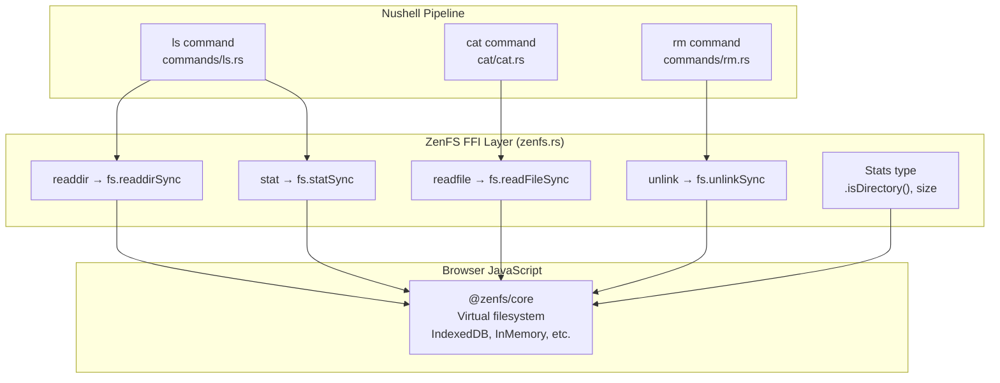
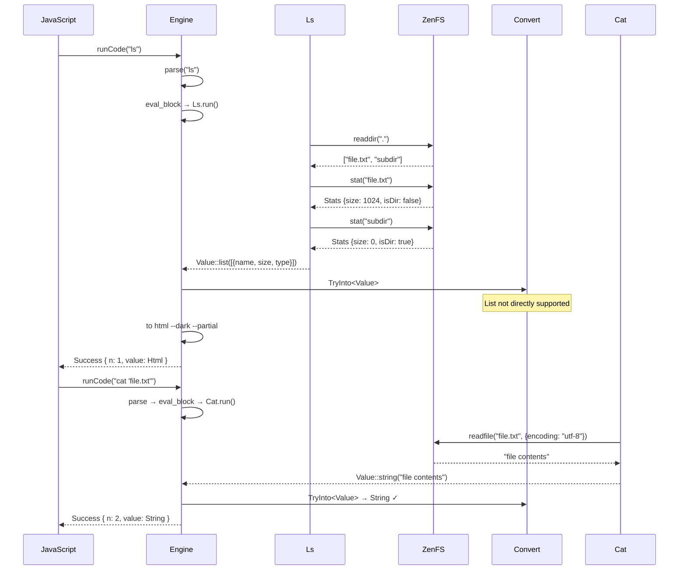

# nu-on-web — Commands and ZenFS Bridge

**Source:** `commands/` (3 files), `zenfs.rs`, `types.rs` — ~250 LOC. Three custom Nushell commands bridging to the browser's ZenFS virtual filesystem via `wasm-bindgen` module imports.

## Architecture — The ZenFS Bridge



## zenfs.rs — The JavaScript FFI Boundary

```rust
// zenfs.rs:1-14
#[wasm_bindgen(module = "@zenfs/core")]
extern "C" {
    #[wasm_bindgen(js_namespace = fs, js_name = readFileSync, catch)]
    pub fn readfile(path: &str, options: Object) -> Result<String, Error>;

    #[wasm_bindgen(js_namespace = fs, js_name = readdirSync, catch)]
    pub fn readdir(path: &str) -> Result<Vec<String>, Error>;

    #[wasm_bindgen(js_namespace = fs, js_name = statSync, catch)]
    pub fn stat(path: &str) -> Result<Stats, Error>;

    #[wasm_bindgen(js_namespace = fs, js_name = unlinkSync, catch)]
    pub fn unlink(path: &str) -> Result<(), Error>;
}
```

**Aha:** `#[wasm_bindgen(module = "@zenfs/core")]` imports directly from the npm package — no JS glue code needed. The `js_namespace = fs` qualifier means these are called as `fs.readFileSync`, `fs.readdirSync`, etc. in JavaScript. The `catch` attribute converts JS exceptions into `Result<T, Error>` returns, so Rust code handles errors idiomatically rather than panicking.

### Stats Type — Bridging JS Object to Rust

```rust
// zenfs.rs:16-31
#[wasm_bindgen]
extern "C" {
    pub type Stats;

    #[wasm_bindgen(structural, method, js_name = isDirectory)]
    pub fn is_directory(this: &Stats) -> bool;
}

impl Stats {
    pub fn size(&self) -> i64 {
        let v = Reflect::get(self.as_ref(), &JsValue::from_str("size"))
            .expect("Failed to get 'size' property from Stats object");
        v.as_f64()
            .expect("Stats 'size' property should be a numeric value") as i64
    }
}
```

**Aha:** `Stats` uses a hybrid approach. `isDirectory()` is a proper method declared via `#[wasm_bindgen(structural, method)]` — `structural` means it checks that the method exists at runtime rather than requiring a specific class. But `size` is accessed via `Reflect::get` on the raw JS object, not as a declared method. This is because `size` is a property, not a function — `wasm-bindgen` doesn't have a clean way to declare JS properties on opaque types, so `Reflect::get` is the workaround.

## Ls Command — Directory Listing via ZenFS

```rust
// commands/ls.rs:10-96
impl Command for Ls {
    fn name(&self) -> &str { "ls" }

    fn signature(&self) -> Signature {
        Signature::build("ls").optional(
            "path",
            SyntaxShape::String,
            "a path to get the directory contents from",
        )
    }

    fn run(&self, engine_state: &EngineState, stack: &mut Stack, call: &Call, input: PipelineData)
        -> Result<PipelineData, ShellError>
    {
        let path = call.opt::<String>(engine_state, stack, 0)?;
        let path = path.unwrap_or_else(|| ".".to_string());

        let items = readdir(&path)?;  // ZenFS bridge call

        Ok(Value::list(
            items.into_iter()
                .map(|f| path::Path::new(&path).join(f))
                .map(|p| p.strip_prefix("./").unwrap_or(&p).to_str().unwrap().to_string())
                .map(|f| {
                    let mut record = Record::new();
                    record.insert("name", Value::string(&f, span));

                    match stat(&f) {
                        Ok(stats) => {
                            record.insert("size", Value::filesize(stats.size(), span));
                            record.insert("type", Value::string(
                                if stats.is_directory() { "dir" } else { "file" }, span));
                        }
                        Err(_) => {
                            record.insert("size", Value::filesize(0, span));
                            record.insert("type", Value::string("?", span));
                        }
                    }
                    Value::record(record, span)
                })
                .collect(),
            span,
        ))
    }
}
```

The `ls` command:

1. **Extracts optional path argument** — defaults to `"."` (current directory)
2. **Calls `readdir(&path)`** — bridges to `fs.readdirSync` in ZenFS, returning `Vec<String>` of filenames
3. **Builds full paths** — joins the directory path with each filename
4. **Strips `./` prefix** — normalizes paths for cleaner display
5. **Stats each entry** — calls `stat(&f)` to get file size and type
6. **Builds Nushell records** — each entry becomes `{ name, size, type }`
7. **Returns as Nushell list** — wrapped in `Value::list` for pipeline consumption

### Error Handling — Graceful Degradation

If `stat` fails for a specific file, the command doesn't abort — it returns `{ name, size: 0, type: "?" }` for that entry. Only a `readdir` failure (directory doesn't exist) stops the entire command.

**Aha:** The command implements the `Command` trait from `nu_engine`, not a custom interface. This means it's registered and dispatched exactly like any built-in Nushell command. The `Signature` defines the accepted arguments, `SyntaxShape::String` tells Nushell to parse the argument as a string, and `call.opt::<String>` extracts it with type checking already done by the parser.

## Cat Command — File Reading

```rust
// commands/cat.rs:33-63
fn run(&self, engine_state: &EngineState, stack: &mut Stack, call: &Call, input: PipelineData)
    -> Result<PipelineData, ShellError>
{
    let path: String = call.req(engine_state, stack, 0)?;  // Required argument
    let span = input.span().unwrap_or(call.head);

    let options = Object::new();
    let _ = Reflect::set(&options, &JsValue::from_str("encoding"), &JsValue::from_str("utf-8"))
        .expect("Failed to set property");

    Ok(Value::string(
        readfile(&path, options).map_err(|e| ShellError::GenericError {
            msg: e.to_string().into(),
            error: e.to_string().into(),
            span: Some(call.head),
            help: None,
            inner: Vec::new(),
        })?,
        span,
    ).into_pipeline_data_with_metadata(metadata))
}
```

The `cat` command:

1. **Requires a path argument** — `call.req` (not `call.opt`) — errors if missing
2. **Creates JS options object** — sets `encoding: "utf-8"` via `Reflect::set`
3. **Calls `readfile(&path, options)`** — bridges to `fs.readFileSync`
4. **Wraps as Nushell string value** — returns `Value::string` for pipeline use

**Aha:** The JS options object construction (`Object::new()` + `Reflect::set`) is the WASM equivalent of writing `{ encoding: "utf-8" }` in JavaScript. Since `wasm-bindgen` doesn't auto-convert Rust structs to JS objects, the options must be built manually via the `js_sys` API.

## Rm Command — File Deletion

```rust
// commands/rm.rs:30-47
fn run(&self, engine_state: &EngineState, stack: &mut Stack, call: &Call, _input: PipelineData)
    -> Result<PipelineData, ShellError>
{
    let path: String = call.req(engine_state, stack, 0)?;

    unlink(&path).map_err(|e| ShellError::GenericError {
        msg: e.to_string().into(),
        error: e.to_string().into(),
        span: Some(call.head),
        help: None,
        inner: Vec::new(),
    })?;

    Ok(PipelineData::empty())
}
```

The `rm` command is the simplest of the three:

1. **Requires a path argument**
2. **Calls `unlink(&path)`** — bridges to `fs.unlinkSync`
3. **Returns empty pipeline** — `Type::Nothing` input and output

**Aha:** The signature declares `.input_output_type(Type::Nothing, Type::Nothing)` — this tells Nushell's type checker that `rm` neither consumes nor produces pipeline data. Contrast with `cat` which declares `(Type::Nothing, Type::String)` and `ls` which produces a list of records.

## Command Registration

```rust
// engine.rs:31-36
let mut working_set = StateWorkingSet::new(&engine_state);
working_set.add_decl(Box::new(commands::Ls));
working_set.add_decl(Box::new(commands::Cat));
working_set.add_decl(Box::new(commands::Rm));
engine_state.merge_delta(working_set.delta).expect("Failed to merge delta");
```

All three commands are registered at engine initialization. Once registered, they participate in Nushell's full command dispatch system — autocompletion, help text, type checking, and pipeline integration.

## Value Conversion — The Type Boundary

```rust
// types.rs:8-43
#[derive(Serialize, Debug, Tsify)]
#[serde(rename_all = "camelCase", tag = "valueType")]
pub enum Value {
    Bool   { val: bool, internal_span: Span },
    Int    { val: i64, internal_span: Span },
    Float  { val: f64, internal_span: Span },
    String { val: String, internal_span: Span },
    Nothing { internal_span: Span },
    Error  { error: ShellError, internal_span: Span },
    Html   { val: String },
}
```

The `Value` enum defines what crosses the WASM boundary. Only 7 variants are supported. Nushell's actual `Value` enum has 30+ variants (Date, Duration, Filesize, Range, CellPath, Closure, Record, List, Binary, Custom, etc.).

### TryFrom Conversion — Explicit Allowlist

```rust
// types.rs:51-87
impl TryFrom<nu_protocol::Value> for Value {
    type Error = nu_protocol::Value;

    fn try_from(value: nu_protocol::Value) -> Result<Self, nu_protocol::Value> {
        Ok(match value {
            nu_protocol::Value::Bool { val, internal_span } => Value::Bool { val, internal_span: internal_span.into() },
            nu_protocol::Value::Int { val, internal_span } => Value::Int { val, internal_span: internal_span.into() },
            nu_protocol::Value::Float { val, internal_span } => Value::Float { val, internal_span: internal_span.into() },
            nu_protocol::Value::String { val, internal_span } => Value::String { val, internal_span: internal_span.into() },
            nu_protocol::Value::Nothing { internal_span } => Value::Nothing { internal_span: internal_span.into() },
            nu_protocol::Value::Error { error, internal_span } => Value::Error { error: (*error).into(), internal_span: internal_span.into() },
            v => return Err(v),  // → HTML fallback
        })
    }
}
```

**Aha:** The `TryFrom` returns `Err(original_value)` for unsupported types — not a descriptive error, but the original `nu_protocol::Value`. This is intentional: the caller (`run_code` in engine.rs) catches this and feeds the value to `to html --dark --partial` for rendering. The `Error` variant is the bridge between the two worlds — a Nushell `ShellError` converts to the simplified `ShellError` enum.

### Span Type — Code Location Tracking

```rust
// types.rs:186-200
#[derive(Serialize, Debug, Tsify, Default)]
#[serde(rename_all = "camelCase")]
pub struct Span {
    pub start: usize,
    pub end: usize,
}

impl From<nu_protocol::Span> for Span {
    fn from(span: nu_protocol::Span) -> Self {
        Span { start: span.start, end: span.end }
    }
}
```

Spans track source code positions for error messages, completions, and command description extraction. The WASM layer uses its own `Span` type (not `nu_protocol::Span`) to decouple from Nushell's internal representation.

### Expression Type — AST Serialization

```rust
// types.rs:227-274
#[derive(Serialize, Debug, Tsify)]
#[tsify(into_wasm_abi)]
#[serde(rename_all = "camelCase")]
pub struct Expression {
    pub expr: Expr,
    pub span: Span,
}

#[derive(Serialize, Debug, Tsify)]
#[serde(rename_all = "camelCase", tag = "type")]
pub enum Expr {
    Call(Call),
}

#[derive(Serialize, Debug, Tsify)]
#[serde(rename_all = "camelCase")]
pub struct Call {
    pub decl_id: usize,
    pub head: Span,
}
```

**Aha:** The `Expression` type only supports `Expr::Call` — a single variant. The `TODO` comment at line 254 says "Add support for ExternalCall, Var, etc. when needed." The `From` impl for unsupported expression types panics (`panic!("Unsupported expression type: {:?}", v)`). This is a known limitation — `find_pipeline_element_by_offset` only works when the result is a `Call` expression. If the cursor is on a variable or external call, the conversion to the WASM `Expression` type will panic.

## Error Type Simplification

```rust
// types.rs:89-126
#[derive(Serialize, Debug, Tsify)]
#[serde(rename_all = "camelCase", tag = "errorType")]
pub enum ShellError {
    GenericError {
        error: String,
        msg: String,
        span: Option<Span>,
        help: Option<String>,
        inner: Vec<ShellError>,
    },
    Other { msg: String },
}

impl From<nu_protocol::ShellError> for ShellError {
    fn from(error: nu_protocol::ShellError) -> Self {
        match error {
            nu_protocol::ShellError::GenericError { error, msg, span, help, inner } =>
                ShellError::GenericError { error, msg, span: span.map(|s| s.into()), help, inner: inner.into_iter().map(|e| e.into()).collect() },
            v => {
                warn(format!("Unsupported error type: {v:?}").as_str());
                ShellError::Other { msg: v.to_string() }
            }
        }
    }
}
```

Nushell's `ShellError` has dozens of variants (`FileNotFound`, `DirectoryNotFound`, `PermissionDenied`, `IoError`, etc.). All of them collapse into `Other` with `to_string()` serialization. The `warn` call emits to `console.warn` in the browser.

### ParseError and CompileError

```rust
// types.rs:145-184
#[derive(Serialize, Debug, Tsify)]
pub struct ParseError {
    span: Span,
    message: String,
}

#[derive(Serialize, Debug, Tsify)]
pub struct CompileError {
    message: String,
    span: Span,
}

impl From<nu_protocol::CompileError> for CompileError {
    fn from(error: nu_protocol::CompileError) -> Self {
        match error {
            nu_protocol::CompileError::RunExternalNotFound { span } => CompileError {
                message: "External command not found".to_string(),
                span: span.into(),
            },
            e => {
                warn(format!("Unknown compile error: {:?}", e).as_str());
                CompileError { message: e.to_string(), span: Span::default() }
            }
        }
    }
}
```

**Aha:** Compile errors are even more aggressively simplified — `RunExternalNotFound` (the common case in WASM where you can't run external binaries) gets a hardcoded message, and everything else gets `to_string()` with a default span. The `warn` call alerts developers to unhandled compile error types.

## Console FFI — Logging from WASM

```rust
// utils.rs:1-9
#[wasm_bindgen]
extern "C" {
    #[wasm_bindgen(js_namespace = console)]
    pub fn log(s: &str);

    #[wasm_bindgen(js_namespace = console)]
    pub fn warn(s: &str);
}
```

Two simple FFI bindings — `console.log` and `console.warn`. Used for:
- `warn` — called when an unsupported `ShellError` or `CompileError` type is encountered
- `log` — available for debugging (not currently used in production code)

## Command Data Flow



**Aha:** Even though `ls` returns a structured list of records, it cannot cross the WASM boundary as a structured type. The `Value::list` is caught by the `TryFrom` error case and rendered as HTML. This means JavaScript cannot programmatically access the individual file entries — only the rendered HTML table. This is a fundamental limitation of the current type conversion strategy.
