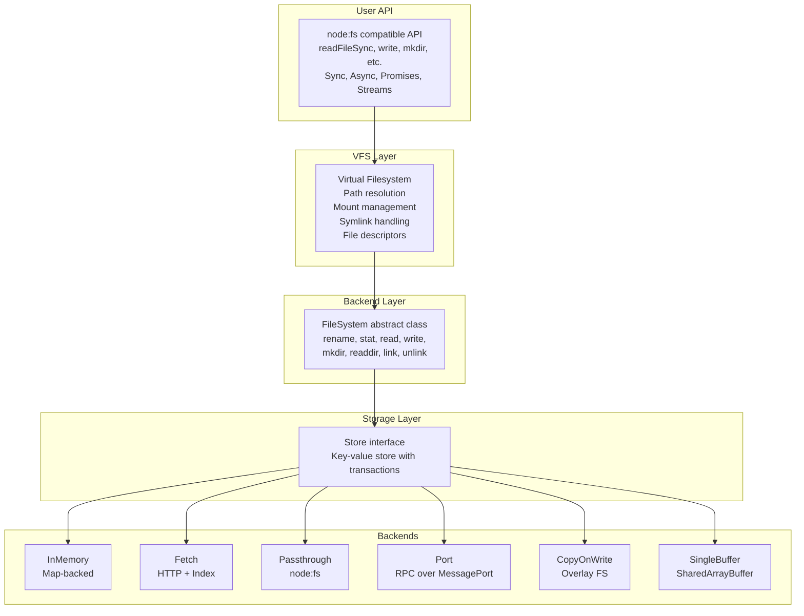
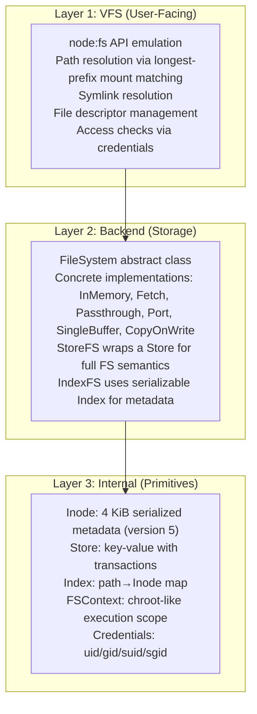

# zenfs — Overview

**Source:** 12 packages, 178 TypeScript files. `@zenfs/core` v2.5.6 — cross-platform Node.js `fs` API emulation.

ZenFS is a virtual filesystem library for TypeScript that emulates the Node.js `fs` API in any environment — browsers, Web Workers, Deno, or Node.js itself. It achieves this through a pluggable backend system where different storage mechanisms can be mounted at different paths, creating a unified virtual filesystem.

## Architecture



## Package Structure

| Package | Purpose |
|---------|---------|
| **core** | Main VFS, backends, Node.js API emulation |
| **cloud** | Cloud backends: S3, Dropbox, Google Drive |
| **archives** | Archive formats: ISO, ZIP filesystems |
| **iso** | ISO 9660 CD-ROM filesystem parser |
| **emscripten** | Emscripten WASM integration |
| **dom** | DOM-specific backends and device drivers |
| **devices** | Device driver interface |
| **linux** | Linux VFS drivers and filesystems |
| **bundle** | Bundled distribution |
| **playground** | Interactive demo app |

## Core Source Structure

```
core/src/
├── index.ts            # Main entry, exports fs default
├── config.ts           # configure(), resolveMountConfig()
├── constants.ts        # FS constants (O_*, S_*, etc.)
├── context.ts          # bindContext() for chroot-like isolation
├── path.ts             # POSIX path utilities
├── utils.ts            # Helpers (normalizePath, globToRegex)
├── polyfills.ts        # Runtime polyfills
│
├── backends/           # Storage backend implementations
│   ├── backend.ts      # Backend interface, type system
│   ├── memory.ts       # InMemory backend
│   ├── cow.ts          # CopyOnWrite (overlay)
│   ├── fetch.ts        # Fetch (HTTP)
│   ├── passthrough.ts  # Passthrough to node:fs
│   ├── port.ts         # Worker/MessagePort RPC
│   ├── single_buffer.ts # SharedArrayBuffer-backed
│   └── store/
│       ├── store.ts    # Store interface, Transaction
│       ├── map.ts      # SyncMapStore/AsyncMapStore
│       └── fs.ts       # StoreFS - primary filesystem impl
│
├── internal/           # Core primitives
│   ├── filesystem.ts   # FileSystem abstract base class
│   ├── inode.ts        # Inode class, Attributes, InodeFlags
│   ├── file_index.ts   # Index class (serializable metadata)
│   ├── index_fs.ts     # IndexFS abstract filesystem
│   ├── contexts.ts     # FSContext, BoundContext
│   ├── credentials.ts  # Unix-like credentials (uid/gid)
│   ├── devices.ts      # DeviceFS, DeviceDriver
│   ├── error.ts        # Error handling utilities
│   └── rpc.ts          # RPC system for Port backend
│
├── vfs/                # VFS operations
│   ├── shared.ts       # mounts Map, mount/umount, resolveMount
│   ├── async.ts        # Async VFS operations
│   ├── sync.ts         # Sync VFS operations
│   ├── file.ts         # Handle class (file descriptors)
│   ├── dir.ts          # Dirent class
│   ├── flags.ts        # Open flag parsing
│   ├── ioctl.ts        # ioctl implementation
│   ├── xattr.ts        # Extended attributes
│   └── watchers.ts     # File watchers
│
├── mixins/             # Composable behavior
│   ├── async.ts        # Async mixin (sync ops on async FS)
│   ├── sync.ts         # Sync mixin
│   ├── mutexed.ts      # Mutexed mixin
│   └── readonly.ts     # Readonly mixin
│
└── node/               # Node.js API compatibility
    ├── sync.ts         # fs.readFileSync, etc.
    ├── async.ts        # fs.readFile, etc.
    ├── promises.ts     # fs.promises API
    ├── streams.ts      # ReadStream, WriteStream
    ├── dir.ts          # Dir class
    ├── readline.ts     # readline emulation
    └── stats.ts        # Stats, BigIntStatsFs, StatsFs
```

## Quick Start

```typescript
import { configure, fs } from '@zenfs/core';

// Default: in-memory filesystem at /
fs.writeFileSync('/hello.txt', 'Hello, world!');
console.log(fs.readFileSync('/hello.txt', 'utf8'));

// Configure with custom mounts
await configure({
    mounts: {
        '/data': { backend: 'IndexedDB', storeName: 'my-data' },
        '/assets': { backend: 'Fetch', baseUrl: '/assets/' },
    },
});
```

**Aha:** The default configuration mounts an `InMemory` backend at `/` — no setup required. The `configure()` function can mount multiple backends at different paths, and each path becomes part of a unified filesystem. Cross-mount operations (like `rename` across mounts) fail with `EXDEV`.

## Three-Layer Architecture



## Dependencies

| Dependency | Purpose |
|------------|---------|
| `memium` (^0.4.0) | Binary struct serialization with decorators |
| `utilium` (^3.0.0) | Utilities: UTF8 encoding, BufferView, Resource cache |
| `kerium` (^1.3.4) | Error handling, logging, errno-based exceptions |
| `buffer` (^6.0.3) | Cross-platform Buffer polyfill |
| `eventemitter3` (^5.0.1) | Event emitter (used by Journal in COW) |
| `readable-stream` (^4.5.2) | Stream polyfill |

## Key Design Patterns

- **Mixin composition** — `Async(FileSystem)`, `Sync(FileSystem)` are higher-order classes adding capabilities
- **Backend as factory** — `Backend` is a factory object with `create()`, `name`, `options` schema
- **Transaction with rollback** — `WrappedTransaction` stashes original data for undo
- **Attribute-driven behavior** — `FileSystemAttributes` Map controls behavior without subclassing
- **Binary structs via decorators** — `@struct.packed()` defines serializable layouts in TypeScript
- **Atomics-based locking** — `SharedArrayBuffer` backends use `Atomics.wait/notify` for cross-thread sync
