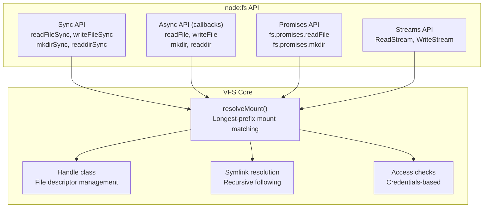
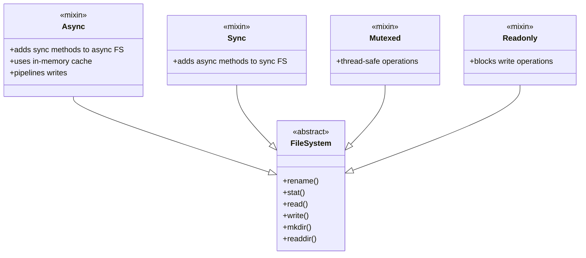

# zenfs — VFS Architecture

**Source:** `core/src/vfs/`, `core/src/internal/`, `core/src/node/`, `core/src/mixins/` — ~800 LOC. Three-layer architecture: VFS (user API), Backend (storage), Internal (primitives).

## Layer 1: VFS — User-Facing API



### Path Resolution — Longest Prefix Match

```typescript
// core/src/vfs/shared.ts:92
export function resolveMount(path: string): { fs: FileSystem, path: string } {
    // Sorts mounts by path length descending
    // Finds the deepest matching mount point
    // Returns the FileSystem and the path relative to that mount
}
```

**Aha:** Mount resolution sorts all registered mounts by path length (longest first) and returns the first match. This means `/home/user` takes precedence over `/home` which takes precedence over `/`. You can mount specific subtrees independently — `/home/user` on IndexedDB, `/home` on InMemory, `/` on InMemory.

### Handle — File Descriptor Management

```typescript
// core/src/vfs/file.ts:19
export class Handle {
    private position: number;
    private dirty: boolean;
    private closed: boolean;

    // Read/write at current position, advance
    // Truncate, chmod, chown, utimes
    // close() — releases the FD
    // Implements Symbol.dispose and Symbol.asyncDispose
}
```

File descriptors are managed through a global registry:

```typescript
// core/src/vfs/file.ts:399-418
export function toFD(handle: Handle): number;    // Allocate new FD
export function fromFD(fd: number): Handle;      // Get handle by FD
export function deleteFD(fd: number): void;      // Release FD
```

**Aha:** The `Handle` class implements `Symbol.dispose` and `Symbol.asyncDispose` — meaning it works with JavaScript's `using` and `await using` declarations for automatic cleanup:

```typescript
using fd = fs.openSync('/file.txt', 'r');
// fd.close() called automatically when scope exits
```

### FSContext — Chroot-Like Isolation

```typescript
// core/src/internal/contexts.ts:21
export class FSContext {
    root: string;              // Root path for this context
    pwd: string;               // Current working directory
    credentials: Credentials;  // uid/gid
    fds: Map<number, Handle>;  // Open file descriptors
    parent: FSContext | null;
    children: Set<FSContext>;
}

// core/src/internal/contexts.ts:71
export function bindContext(root: string): BoundContext;
```

**Aha:** `bindContext()` creates child contexts with isolated roots — like `chroot` in Unix. The child inherits credentials but has its own file descriptor table and root path. This enables sandboxing: a web worker can be given a filesystem context rooted at `/sandbox` with no access to `/etc` or `/home`.

### Credentials — Unix-Like Permissions

```typescript
// core/src/internal/credentials.ts:8
export interface Credentials {
    uid: number;     // User ID
    gid: number;     // Group ID
    suid: number;    // Saved user ID
    sgid: number;    // Saved group ID
    euid: number;    // Effective user ID
    egid: number;    // Effective group ID
    groups: number[]; // Supplementary groups
}
```

Access checks use these credentials to verify read/write/execute permissions on inodes.

## Layer 2: Internal Primitives

### Inode — 4 KiB Serialized Metadata

```typescript
// core/src/internal/inode.ts:322
@struct.packed(4096)  // Packed to exactly 4 KiB
class Inode {
    @t.uint32 accessor data: number;       // Data block ID
    @t.uint32 accessor size: number;       // File size
    @t.uint32 accessor mode: number;       // File mode (permissions + type)
    @t.uint32 accessor nlink: number;      // Hard link count
    @t.uint32 accessor uid: number;        // Owner user ID
    @t.uint32 accessor gid: number;        // Owner group ID
    @t.uint64 accessor atimeMs: number;    // Access time
    @t.uint64 accessor birthtimeMs: number; // Creation time
    @t.uint64 accessor mtimeMs: number;    // Modification time
    @t.uint64 accessor ctimeMs: number;    // Change time
    @t.uint64 accessor ino: number;        // Inode number
    @t.uint32 accessor flags: number;      // InodeFlags
    @t.uint32 accessor version: number;    // Format version (5)
}
```

**Aha:** The inode format has evolved through 5 versions (comment at line 257). The current 4 KiB layout is padded for ABI stability — future versions can add fields without breaking existing data. The `@struct.packed()` decorator from `memium` generates binary serialization code automatically.

### InodeFlags

```typescript
// core/src/internal/inode.ts
export class InodeFlags {
    // Append-only, immutable, compression, encryption flags
    // Mirrors Linux ext4 inode flags
}
```

### Store — Key-Value Abstraction

```typescript
// core/src/backends/store/store.ts:21
export interface Store {
    sync(): Promise<void>;
    transaction(): Transaction;
    flags?: StoreFlags;
    usage?(): Promise<StoreUsage>;
    uuid?(): Promise<string>;
}
```

The Store is the lowest-level abstraction — a key-value store where keys are inode/data IDs and values are `Uint8Array` blobs. All filesystem semantics (directories, permissions, symlinks) are built on top by `StoreFS`.

### Transaction with Rollback

```typescript
// core/src/backends/store/store.ts:221
class WrappedTransaction implements Transaction {
    // Wraps any inner transaction
    // Stashes original data before modifications
    // commit() — applies changes
    // abort() — restores stashed data
    // Implements Symbol.dispose and Symbol.asyncDispose
}
```

**Aha:** `WrappedTransaction` enables atomic operations across any Store implementation. Before modifying data, it saves the original value. On `abort()`, it restores all stashed values. On `Symbol.dispose` (scope exit without explicit commit), it auto-aborts — preventing partial writes.

### Index — Serializable File Metadata

```typescript
// core/src/internal/file_index.ts:30
export class Index {
    private map: Map<string, Inode>;

    // toJSON() / fromJSON() for serialization
    // Version tracking for format migration
    // Used by FetchFS and IndexFS for metadata caching
}
```

The Index maps paths to inodes — it's the metadata cache for filesystems that don't use a Store (like FetchFS, which loads metadata from a JSON index over HTTP).

## Layer 3: Node.js API Emulation

### Sync API

```typescript
// core/src/node/sync.ts
export function readFileSync(path: PathLike, options?: EncodingOption): string | Buffer;
export function writeFileSync(file: PathLike, data: string | Buffer | Uint8Array, options?: WriteFileOptions): void;
export function mkdirSync(path: PathLike, options?: Mode | MakeDirectoryOptions): string | undefined;
export function readdirSync(path: PathLike, options?: readdirOptions): string[];
// ... 50+ more functions
```

### Async API (Callbacks)

```typescript
// core/src/node/async.ts
export function readFile(path: PathLike, callback: (err: ErrnoException | null, data: Buffer) => void): void;
export function writeFile(file: PathLike, data: string | Buffer | Uint8Array, callback: (err: ErrnoException | null) => void): void;
// ... mirrored from sync API
```

### Promises API

```typescript
// core/src/node/promises.ts
export const promises: {
    readFile(path: PathLike, options?: { encoding: string }): Promise<string>;
    writeFile(file: PathLike, data: string | Buffer | Uint8Array): Promise<void>;
    // ... full promises interface
};
```

### Streams

```typescript
// core/src/node/streams.ts
export class ReadStream extends Readable { ... }
export class WriteStream extends Writable { ... }
```

**Aha:** The Node.js API layer is a thin wrapper over the VFS operations. Every function resolves the path to a mount, finds or creates a Handle, and delegates to the appropriate backend. This means adding a new backend automatically gets the full Node.js API — no per-backend API code needed.

## Mixins — Composable Behavior



### Async Mixin

```typescript
// core/src/mixins/async.ts:48
export function Async<TBase extends new (...args: any[]) => FileSystem>(Base: TBase) {
    // Adds sync methods to an async filesystem
    // Sync ops execute on an in-memory _sync cache
    // Writes are pipelined async to the backing store
    // _patchAsync() auto-syncs cache after async operations
}
```

**Aha:** The Async mixin is the key to supporting sync `fs.readFileSync` on async backends (like IndexedDB or HTTP fetch). It maintains an in-memory `_sync` cache: sync reads hit the cache, sync writes update the cache and pipeline the write to the backing store asynchronously. This means sync operations appear synchronous to the caller while the actual I/O happens in the background.

## Configuration

```typescript
// core/src/config.ts:160
export interface Configuration {
    mounts: Record<string, BackendConfig>;  // Path → backend mapping
    uid?: number;                           // User ID
    gid?: number;                           // Group ID
    addDevices?: boolean;                   // Mount /dev
    defaultDirectories?: boolean;           // Create /tmp, /home
    disableAccessChecks?: boolean;          // Skip permission checks
    onlySyncOnClose?: boolean;              // Defer sync for async backends
    log?: LogLevel;                         // Logging level
}

export async function configure(config: Configuration): Promise<void>;
```

```typescript
// Example configuration
await configure({
    mounts: {
        '/': { backend: 'InMemory' },
        '/data': { backend: 'IndexedDB', storeName: 'my-app' },
        '/assets': { backend: 'Fetch', baseUrl: '/assets/', index: true },
    },
    uid: 1000,
    gid: 1000,
    addDevices: true,
    defaultDirectories: true,
});
```
