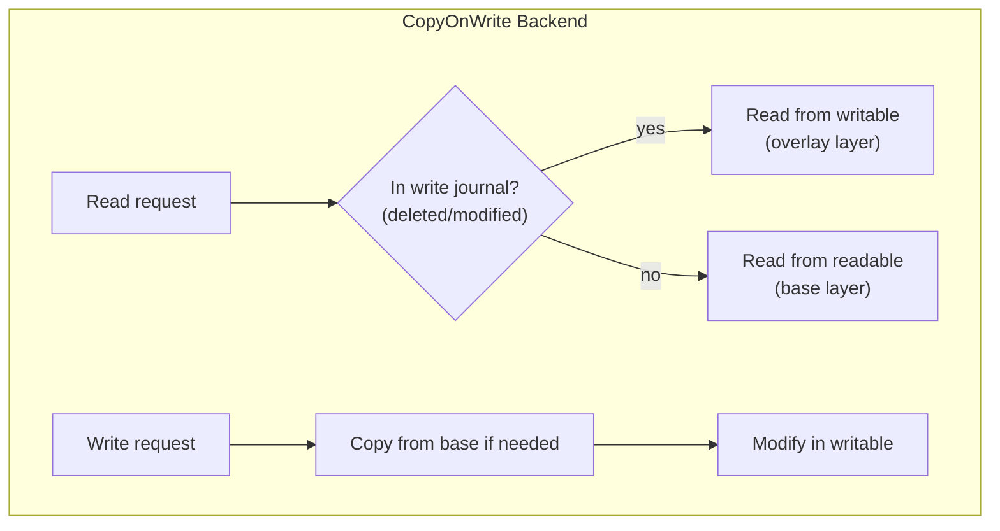

# zenfs — Backends and Stores

**Source:** `core/src/backends/` — ~600 LOC. Six storage backends plus the Store abstraction, each implementing the `FileSystem` interface.

## Backend Interface

```typescript
// core/src/backends/backend.ts:63
export interface Backend<FS extends FileSystem = FileSystem, TOptions extends object = object> {
    create(options: TOptions & Partial<SharedConfig>): FS | Promise<FS>;
    name: string;
    options: OptionsConfig<TOptions>;
    isAvailable?(config: TOptions): boolean | Promise<boolean>;
}
```

**Aha:** The Backend is a factory object, not a class constructor. It has a `name` (string identifier), an `options` schema for validation, a `create()` method that produces a `FileSystem`, and an optional `isAvailable()` check (e.g., IndexedDB checks if the browser supports it). This enables declarative configuration — you specify backends by name in the config, and the factory creates them.

## StoreFS — The Primary Filesystem

```typescript
// core/src/backends/store/fs.ts:23
export class StoreFS<T extends Store> extends FileSystem {
    private store: T;
    private _ids: Map<string, number>;      // path → inode ID
    private _paths: Map<number, Set<string>>; // inode ID → paths

    // Implements all FileSystem operations:
    // rename, stat, read, write, mkdir, readdir, link, unlink, chmod, chown, utimes
}
```

**Aha:** `StoreFS` is the workhorse — it wraps any `Store` (key-value store) and provides full filesystem semantics. It maintains two lookup tables: `_ids` (path to inode ID) and `_paths` (inode ID to set of paths). This enables O(1) path lookups and handles hard links (one inode, multiple paths). The `no_id_tables` attribute can disable these for SharedArrayBuffer compatibility where `Map` iteration is problematic.

## Backend Inventory

| Backend | File | Line | Storage | Sync? | Async? |
|---------|------|------|---------|-------|--------|
| **InMemory** | `memory.ts` | 80 | `Map<number, Uint8Array>` | Yes | Via mixin |
| **CopyOnWrite** | `cow.ts` | 496 | Two FS layers (overlay) | Both | Both |
| **Fetch** | `fetch.ts` | 192 | HTTP + Index cache | Partial | Yes |
| **Passthrough** | `passthrough.ts` | 257 | `node:fs` | Yes | Yes |
| **Port** | `port.ts` | 223 | Remote FS via RPC | No | Yes |
| **SingleBuffer** | `single_buffer.ts` | 520 | `SharedArrayBuffer` | Yes | Via mixin |

## InMemory — Default Backend

```typescript
// core/src/backends/memory.ts:80
export const InMemory: Backend<StoreFS<InMemoryStore>, {}> = {
    name: 'InMemory',
    options: {},
    create() {
        return new StoreFS(new InMemoryStore());
    },
};

// Simple Map-backed store
class InMemoryStore implements SyncMapStore {
    private data = new Map<number, Uint8Array>();
}
```

This is the default backend — mounted at `/` with no configuration needed.

## CopyOnWrite — Overlay Filesystem



```typescript
// core/src/backends/cow.ts:126
// CopyOnWrite uses two filesystems:
// - readable: base layer (read-only, e.g., Fetch, assets)
// - writable: overlay layer (read-write, e.g., InMemory)
//
// A Journal tracks deletions and modifications:
// - When a file is deleted, its path is added to the journal
// - When reading, check the journal first
// - If journaled, the file doesn't exist (even if it does in the base)
// - If not journaled, read from the writable layer, falling back to base
```

**Aha:** CopyOnWrite is perfect for browser apps with bundled assets. Mount a read-only `Fetch` backend at `/assets` (loaded from HTTP) and overlay it with an `InMemory` backend at `/`. Users see the merged view: assets from the server, user files in memory. Modifications are written to the overlay without touching the base.

## Fetch — HTTP Filesystem

```typescript
// core/src/backends/fetch.ts:192
export const Fetch: Backend<FetchFS, FetchConfig> = {
    name: 'Fetch',
    options: {
        baseUrl: { type: 'string', required: true },
        index: { type: 'boolean', default: true },
        // ... caching, headers, etc.
    },
    create(options) {
        return new FetchFS(options);
    },
};
```

FetchFS extends `IndexFS` — it loads a JSON index of all files at mount time, then uses `fetch()` with Range requests for individual file reads.

```typescript
// core/src/internal/index_fs.ts:22
export abstract class IndexFS extends FileSystem {
    protected index: Index;  // Path → Inode map

    // Subclasses only need to implement:
    // read(path, position, length) → Uint8Array
    // remove(path) → void
    // The Index handles: stat, readdir, mkdir, rename, link, etc.
}
```

**Aha:** `IndexFS` is a clever abstraction — most filesystem operations (stat, readdir, mkdir) only need metadata, not file contents. By loading an Index (path → inode map) upfront, these operations are instant. Only `read` and `remove` need backend-specific implementations. `FetchFS` uses this pattern: it downloads a JSON index at mount time, then uses HTTP Range requests for partial file reads.

## Passthrough — Node.js fs Bridge

```typescript
// core/src/backends/passthrough.ts:257
export const Passthrough: Backend<PassthroughFS, PassthroughConfig> = {
    name: 'Passthrough',
    options: {
        prefix: { type: 'string', required: true },
    },
    create(options) {
        return new PassthroughFS(options.prefix);
    },
};
```

Passthrough delegates directly to `node:fs` — it maps virtual paths to real filesystem paths using a configurable prefix. Useful for running the same code in Node.js and browsers.

## Port — Remote Filesystem via RPC

```typescript
// core/src/backends/port.ts:223
export const Port: Backend<PortFS, PortConfig> = {
    name: 'Port',
    create(options) {
        return new PortFS(options.port);  // MessagePort, Worker, WebSocket
    },
};
```

PortFS communicates with a remote filesystem via the RPC protocol (`core/src/internal/rpc.ts`). The remote can be:

- **WebMessagePort** — cross-tab communication
- **NodeMessagePort** — Node.js worker threads
- **WebSocket** — remote server

**Aha:** The RPC system (`rpc.ts`) supports structured cloning natively, but falls back to JSON encoding with base64 prefix (`$`) for `Uint8Array` when structured cloning is unavailable. This means PortFS works even in environments without `postMessage` structured clone support.

## SingleBuffer — SharedArrayBuffer Filesystem

```typescript
// core/src/backends/single_buffer.ts:520
export const SingleBuffer: Backend<SingleBufferFS, SingleBufferConfig> = {
    name: 'SingleBuffer',
    create(options) {
        return new SingleBufferFS(options.buffer);
    },
};
```

### SuperBlock — Filesystem Header

```typescript
// core/src/backends/single_buffer.ts:173
@struct.packed(4096)
class SuperBlock {
    @t.uint32 accessor magic: number;       // Magic number
    @t.uint32 accessor version: number;     // Format version
    @t.uint64 accessor size: number;        // Total buffer size
    @t.uint32 accessor metadataBlock: number; // Offset to metadata
    @t.uint32 accessor freeList: number;     // Offset to free list
    // CRC32C checksum for integrity
}
```

### MetadataBlock Chaining

```typescript
// core/src/backends/single_buffer.ts:67
@struct.packed(4096)
class MetadataBlock {
    @t.uint32 accessor inodeId: number;
    @t.uint32 accessor next: number;  // Offset to next block (linked list)
    @t.uint64 accessor mtimeMs: number;
    // ... inode metadata fields
    // CRC32C checksum
}
```

**Aha:** SingleBuffer stores the entire filesystem in one contiguous buffer — ideal for `SharedArrayBuffer` where multiple threads need concurrent access. It uses a linked-list of 4 KiB metadata blocks (no B-tree), and `Atomics.store/wait/notify` for cross-thread synchronization (lines 142-154). The CRC32C checksums detect corruption.

### Atomics-Based Locking

```typescript
// core/src/backends/single_buffer.ts:142-154
lock() {
    // Uses Atomics.store(lock, 1) and Atomics.wait(lock, 1)
    // Other threads call Atomics.notify(lock) to release
}
```

This is the only place in the codebase that uses `Atomics` — necessary because `SharedArrayBuffer` requires explicit synchronization across threads.

## Store Types

### SyncMapStore / AsyncMapStore

```typescript
// core/src/backends/store/map.ts:9
export class SyncMapStore implements Store {
    private data = new Map<number, Uint8Array>();
    sync() { return Promise.resolve(); }
    transaction() { return new SyncMapTransaction(this.data); }
}

// core/src/backends/store/map.ts:51
export class AsyncMapStore implements Store {
    private data = new Map<number, Uint8Array>();
    private cache = new Map<number, Uint8Array>();
    async sync() { /* flush cache to data */ }
    transaction() { return new AsyncMapTransaction(this.data, this.cache); }
}
```

## FileSystemAttributes — Behavior Control

```typescript
// core/src/internal/filesystem.ts:48
export interface FileSystemAttributes {
    no_async_preload: boolean;  // Don't preload async data
    no_write: boolean;          // Read-only mode
    case_fold: boolean;         // Case-insensitive paths
    no_atime: boolean;          // Don't update access time
    sync: boolean;              // Force sync after writes
    // ... more attributes
}
```

**Aha:** Instead of creating subclasses for each behavior variation (ReadOnlyFS, CaseInsensitiveFS, etc.), ZenFS uses an attribute Map. Any backend can be configured with any combination of attributes. This is the open-closed principle in action — behavior is extended without modifying the class hierarchy.

## Backend Configuration Example

```typescript
await configure({
    mounts: {
        // Root filesystem in memory
        '/': { backend: 'InMemory' },

        // Cloud storage at /cloud
        '/cloud': { backend: 'S3', bucket: 'my-bucket' },

        // HTTP assets (read-only, overlaid)
        '/assets': { backend: 'Fetch', baseUrl: '/assets/', index: true },

        // Persistent user data
        '/data': { backend: 'IndexedDB', storeName: 'my-app-data' },
    },
    addDevices: true,        // Mount /dev/null, /dev/zero, etc.
    defaultDirectories: true, // Create /tmp, /home
});
```
