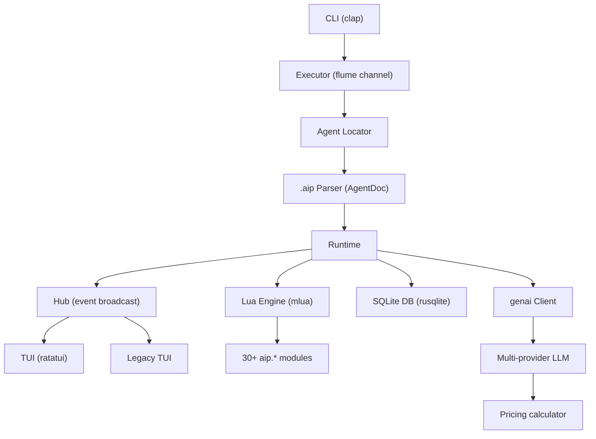

# Aipack -- Overview

Aipack is a command-line AI agent runner built in Rust (edition 2024, MSRV 1.95). Agents are defined as `.aip` markdown files containing Lua scripts, TOML configuration, and prompt templates. The system supports a pack ecosystem of namespaced, installable agent packages, a ratatui TUI for interactive monitoring, SQLite-backed run tracking with detailed per-stage timing, multi-provider LLM routing with automatic pricing calculation, and an extensive Lua standard library with 30+ modules.

Source: `aipack/src/main.rs` — entry point
Source: `aipack/Cargo.toml` — dependencies and configuration

## Technology Stack

| Category | Crates | Purpose |
|----------|--------|---------|
| **Async runtime** | `tokio`, `tokio-util`, `tokio-stream`, `flume`, `futures` | Async I/O, channels, streams |
| **AI/LLM** | `genai` (0.6.0-beta.18), `udiffx` (0.1.42) | Multi-provider LLM client, unified diff parsing |
| **CLI** | `clap` (4.5), `ratatui` (0.30), `crossterm` (0.29) | Argument parsing, terminal UI |
| **Database** | `rusqlite` (0.39), `modql` (0.5.0-alpha.8) | SQLite ORM, field-derive queries |
| **Scripting** | `mlua` (0.11, Lua 5.4 vendored), `handlebars` (6) | Lua VM, template rendering |
| **Serialization** | `serde`, `serde_json`, `toml`, `serde_yaml_ng`, `csv`, `jsonc-parser` | Data format handling |
| **Parsing** | `logos`, `aho-corasick`, `lazy-regex`, `regex`, `markex` | Lexers, pattern matching, markdown |
| **Documents** | `lopdf` (0.40), `quick-xml` (0.39), `html-escape`, `htmd`, `html-helpers` | PDF, XML, HTML processing |
| **Web** | `reqwest` (0.13) | HTTP requests with streaming |
| **Filesystem** | `simple-fs` (0.12), `zip` (8), `walkdir`, `trash` | File I/O, archives, trash |
| **Cryptography** | `blake3`, `sha2`, `base64`, `bs58`, `hex` | Hashing, encoding |
| **Credentials** | `keyring` (3) | Native OS credential storage |
| **Tracing** | `tracing`, `tracing-subscriber`, `tracing-appender` | Structured logging |
| **Utilities** | `derive_more`, `strum`, `uuid` (v4/v7), `semver`, `sysinfo`, `time`, `dashmap`, `arc-swap` | Misc utilities |

## Architecture



## Source Structure

| Module | Files | Purpose |
|--------|-------|---------|
| `src/main.rs` | 1 | Entry point, CLI parsing, TUI dispatch |
| `src/exec/` | ~10 | Executor, action dispatch, init, packer |
| `src/run/` | ~15 | Run orchestration, AI processing, pricing |
| `src/agent/` | 6 | Agent definition, .aip parsing, options |
| `src/script/` | ~30 | Lua engine, aip.* modules, helpers |
| `src/model/` | ~25 | SQLite entities, BMCs, types |
| `src/tui/` | ~30 | Ratatui views, state, components |
| `src/tui_v1/` | ~10 | Legacy terminal UI |
| `src/dir_context/` | 7 | Workspace paths, pack resolution |
| `src/event/` | 3 | Channels, cancellation |
| `src/hub/` | 2 | Global event hub |
| `src/runtime/` | 4 | Clonable runtime, logging, model ops |
| `src/types/` | ~15 | Common data types |
| `src/support/` | ~25 | Utility library (markdown, files, docs) |
| `src/cfg/` | ~5 | Configuration loading |
| `src/cmd/` | ~15 | Subcommand implementations |
| `src/steam/` | ~5 | Stream processing |
| `src/exe/` | ~5 | Code execution, flow control |
| `src/code/` | ~5 | Code parsing, diff handling |
| `src/tmpl/` | ~3 | Handlebars templates |
| `src/pack/` | ~5 | Pack metadata, loading |
| `src/lua/` | ~5 | Lua VM integration |
| `src/db/` | ~3 | SQLite wrapper |

## Key Design Decisions

**Lua as the scripting layer.** All agent logic — before_all, data processing, output transformation, after_all — runs as Lua scripts with extensive Rust-exposed modules. This allows agent authors to write business logic in a safe, sandboxed language while leveraging Rust's performance for heavy operations (file I/O, HTTP, document parsing).

**Event-driven architecture.** All subsystems communicate through the Hub (broadcast channel) and flume channels (point-to-point). The TUI subscribes to the Hub and renders events as they arrive, enabling real-time monitoring of multi-task agent runs.

**SQLite-backed run tracking.** Every run, task, log entry, and error is stored in SQLite with microsecond-precision timestamps. The `modql` crate provides field-derive query generation, making CRUD operations type-safe and ergonomic.

**Pack ecosystem.** Agents are packaged into namespaces (`ns@name`), archived as `.aipack` files, and installed into `~/.aipack-base/pack/installed/`. Custom agents live in `.aipack/pack/custom/`. Version checking uses semver with prerelease support.

**Cancellation via generation counter.** Custom `CancelTrx`/`CancelRx` uses an atomic generation counter rather than a simple boolean flag, avoiding stale cancellation issues when tokens are reused across runs.

## Core Execution Flow

```
CLI → Executor → find_agent → parse .aip → before_all (Lua) → run_tasks (concurrent)
  → for each task: data (Lua) → AI (genai) → output (Lua)
  → after_all (Lua) → response
```

See [CLI Structure](01-cli-structure.md) for subcommands and argument parsing.
See [Agent System](02-agent-system.md) for .aip file parsing.
See [Execution Engine](03-execution-engine.md) for the executor and action dispatch.
