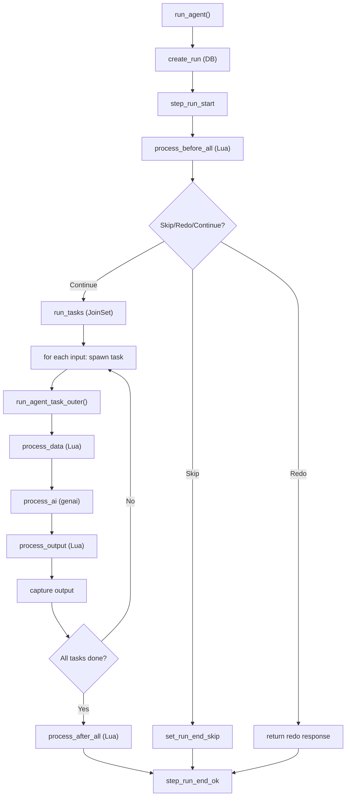

# Aipack -- Run System

The run system orchestrates the core agent execution flow: before_all → tasks (concurrent) → after_all. Each task goes through data → AI → output phases with detailed timing tracked at every stage.

Source: `aipack/src/run/run_agent.rs` — core orchestration
Source: `aipack/src/run/proc_ai.rs` — LLM interaction
Source: `aipack/src/run/pricing/` — cost calculation

## Run Orchestration



## run_agent() Flow

```rust
// run_agent.rs
async fn run_agent(runtime: Runtime, agent: Agent, options: RunAgentOptions) -> Result<RunAgentResponse, Error> {
    // Create run record in DB
    let run_uid = RtModel::create_run(&runtime, &agent, &options).await?;
    let runtime = runtime.with_run_uid(run_uid);
    let log = RtLog::new(runtime.clone());

    // Step: run_start
    RtStep::run_start(&runtime).await;

    // Cancellation select! between run_inner and cancel_rx
    let result = tokio::select! {
        result = run_agent_inner(runtime.clone(), agent.clone(), options.clone()) => result,
        _ = runtime.cancel_rx().cancelled() => {
            RtStep::run_end_canceled(&runtime).await;
            return Ok(RunAgentResponse::canceled());
        }
    };

    match result {
        Ok(response) => {
            RtStep::run_end_ok(&runtime).await;
            Ok(response)
        }
        Err(err) => {
            RtModel::set_run_end_error(&runtime, &err).await;
            RtStep::run_end_err(&runtime).await;
            Err(err)
        }
    }
}
```

The `select!` macro enables cancellation: if the cancellation token fires while the run is executing, the run is immediately marked as canceled and returns early.

## before_all Processing

```rust
// proc_before_all.rs
async fn process_before_all(runtime: &Runtime, agent: &Agent) -> Result<BeforeAllResult, Error> {
    let Some(script) = &agent.before_all_script else {
        return Ok(BeforeAllResult::Continue);
    };

    let lua = runtime.lua_engine().new_with_ctx(CTX::new(&runtime));
    let result = lua.eval_async(script).await?;

    // Parse return value
    if let Some(custom) = extract_aipack_custom(&result)? {
        match custom.kind {
            "Skip" => Ok(BeforeAllResult::Skip { reason: custom.data.reason }),
            "Redo" => Ok(BeforeAllResult::Redo),
            "BeforeAllResponse" => Ok(BeforeAllResult::Response {
                inputs: custom.data.inputs,
                before_all: custom.data.before_all,
                options: custom.data.options,
            }),
        }
    } else {
        // No special return → continue normally
        Ok(BeforeAllResult::Continue)
    }
}
```

The before_all script can return special `AipackCustom` responses to control the run flow:
- **Skip**: abort the run with a reason message
- **Redo**: restart the run (increments flow_redo_count)
- **BeforeAllResponse**: dynamically modify the inputs, options, and before_all data before proceeding

## Task Concurrency

```rust
// run_agent.rs — run_tasks()
async fn run_tasks(runtime: Runtime, agent: Agent, inputs: Vec<TaskInput>) -> Result<Vec<TaskOutput>, Error> {
    let concurrency = agent.options.input_concurrency.unwrap_or(1);
    let mut join_set = JoinSet::new();
    let mut outputs = Vec::new();

    // Create all task DB records in a batch
    let task_uids = RtModel::create_tasks_batch(&runtime, &inputs).await?;

    // Spawn tasks respecting concurrency limit
    for (idx, input) in inputs.into_iter().enumerate() {
        // Wait if at capacity
        while join_set.len() >= concurrency {
            if let Some(result) = join_set.join_next().await {
                outputs.push(result??);
            }
        }

        let task_runtime = runtime.clone();
        let task_agent = agent.clone();
        join_set.spawn(async move {
            run_agent_task_outer(task_runtime, task_agent, input, task_uids[idx]).await
        });
    }

    // Wait for remaining tasks
    while let Some(result) = join_set.join_next().await {
        outputs.push(result??);
    }

    Ok(outputs)
}
```

The `JoinSet` pattern provides controlled concurrency: tasks are spawned up to the concurrency limit, and the executor waits for a slot to open before spawning the next one. This prevents overwhelming the LLM API with too many concurrent requests.

## AI Processing

```rust
// proc_ai.rs
async fn process_ai(runtime: &Runtime, task: &Task, agent: &Agent) -> Result<AiResult, Error> {
    // Step: ai_start, ai_gen_start
    RtStep::task_ai_start(&runtime).await;
    RtStep::task_ai_gen_start(&runtime).await;

    // Build chat messages from prompt parts
    let messages = build_chat_messages(agent, task, runtime).await?;

    // Attach files to messages
    let messages_with_files = attach_files(messages, task.attachments)?;

    // Parse cache options
    let messages_with_cache = apply_cache_options(messages_with_files, agent);

    // Send to genai client
    let start = Instant::now();
    let response = client.exec_chat(messages_with_cache).await?;
    let elapsed = start.elapsed();

    // Extract content and reasoning
    let content = extract_content(&response)?;
    let reasoning_content = extract_reasoning(&response)?;

    // Get usage data (prompt_tokens, completion_tokens, etc.)
    let usage = response.usage;

    // Calculate pricing
    let pricing = price_it(provider, model, &usage);

    // Update task usage/cost in DB
    RtModel::update_task_usage(&runtime, &usage).await;
    RtModel::update_task_cost(&runtime, &pricing).await;

    // Step: ai_gen_end, ai_end
    RtStep::task_ai_gen_end(&runtime).await;
    RtStep::task_ai_end(&runtime).await;

    Ok(AiResult { content, reasoning_content, usage, pricing, elapsed })
}
```

## Pricing Calculator

```rust
// run/pricing/price.rs
fn price_it(provider: ProviderType, model: &str, usage: &Usage) -> AiPrice {
    // Find provider data file
    let provider_data = load_provider_data(provider)?;

    // Longest-prefix-match for model
    let pricing = find_model_pricing(provider_data, model);

    // Split prompt tokens: normal vs cached vs cache-creation
    let normal_tokens = usage.prompt_tokens - usage.cache_read_tokens - usage.cache_creation_tokens;

    // Calculate costs
    let input_cost = normal_tokens * pricing.input_per_million / 1_000_000;
    let cache_read_cost = usage.cache_read_tokens * pricing.cache_read_per_million / 1_000_000;
    let cache_write_cost = usage.cache_creation_tokens * pricing.cache_creation_per_million / 1_000_000;

    // Cache creation cost = 1.25 * input_normal (Anthropic-style)
    let cache_creation_multiplier = 1.25;

    // Split completion tokens: normal vs reasoning
    let completion_cost = usage.completion_tokens * pricing.output_per_million / 1_000_000;
    let reasoning_cost = usage.reasoning_tokens * pricing.reasoning_per_million / 1_000_000;

    AiPrice {
        cost: input_cost + cache_read_cost + cache_write_cost + completion_cost + reasoning_cost,
        cost_cache_write: cache_write_cost,
        cost_cache_saving: cache_read_cost,
    }
}
```

Provider data files are bundled for: Anthropic, DeepSeek, Fireworks, Gemini, Groq, OpenAI, Together, xAI, ZAI. Each file contains per-model pricing with input, output, cache read, cache creation, and reasoning costs per million tokens.

See [Lua Scripting](05-lua-scripting.md) for before_all/data/output/after_all scripts.
See [Model & LLM](12-model-llm.md) for model routing and pricing details.
