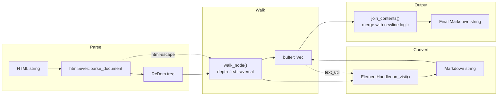
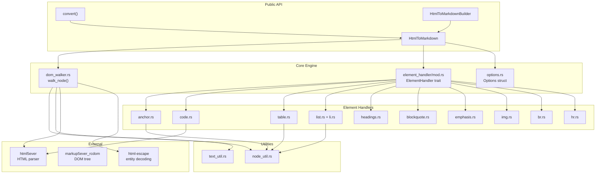

# fork-htmd — Overview

**Source:** `fork-htmd/src/` — 17 Rust files, ~2,700 lines. Version 0.2.1. Apache-2.0.

fork-htmd is a Rust crate that converts HTML to Markdown. It parses HTML with `html5ever` into a DOM tree, walks the tree depth-first, and converts each element to its Markdown equivalent via a handler registry. The architecture is inspired by the JavaScript `turndown.js` library.

**Aha:** fork-htmd does NOT use regex or string manipulation on raw HTML. It parses HTML into a proper DOM tree using `html5ever` (the same parser behind Servo), then walks the tree structurally. This means it handles nested elements, malformed HTML, and complex DOM trees correctly — things that regex-based HTML-to-Markdown converters struggle with.

## Architecture at a Glance



The conversion happens in four stages:
1. **Parse** — `html5ever` parses the HTML string into an `RcDom` tree
2. **Walk** — `walk_node()` traverses the DOM depth-first, collecting raw text in a buffer
3. **Convert** — After children are visited, `ElementHandler.on_visit()` converts each element to Markdown
4. **Join** — `join_contents()` merges buffer entries with intelligent newline handling

## Public API

Two entry points: a one-liner `convert()` function and a builder-pattern `HtmlToMarkdown` for customization.

```rust
// lib.rs:27 — Simple conversion
pub fn convert(html: &str) -> Result<String, std::io::Error> {
    HtmlToMarkdown::new().convert(html)
}

// Usage:
let md = htmd::convert("<h1>Hello</h1>").unwrap();
assert_eq!("# Hello", md);
```

```rust
// lib.rs:63 — Full converter with builder
pub struct HtmlToMarkdown {
    options: Options,
    handlers: ElementHandlers,
    scripting_enabled: bool,
}

// Usage:
let converter = HtmlToMarkdown::builder()
    .skip_tags(vec!["img"])
    .add_handler(vec!["video"], |element: Element| {
        Some(format!("", element.content))
    })
    .options(Options { heading_style: HeadingStyle::Setex, ..Default::default() })
    .build();
let md = converter.convert("<h1>Title</h1>").unwrap();
assert_eq!("Title\n=====", md);
```

## Key Types

| Type | Source | Purpose |
|------|--------|---------|
| `HtmlToMarkdown` | `lib.rs` | Main converter — holds options + handlers |
| `HtmlToMarkdownBuilder` | `lib.rs` | Builder for customizing options and handlers |
| `Element` | `lib.rs` | Element context passed to handlers (node, tag, attrs, content, options) |
| `ElementHandler` | `element_handler/mod.rs` | Trait for custom element conversion |
| `ElementHandlers` | `element_handler/mod.rs` | Handler registry — maps tags to handlers |
| `Options` | `options.rs` | Conversion options (heading style, code fence, etc.) |

## Supported HTML Elements

The built-in handler registry covers 30+ HTML tags:

| Category | Tags | Markdown Output |
|----------|------|-----------------|
| Headings | `h1`–`h6` | `# Heading` (ATX) or `Heading\n=====` (Setext) |
| Code | `code` (inline) | `` `code` `` |
| Code | `pre > code` (block) | ```` ```lang\ncode\n``` ```` or indented |
| Emphasis | `strong`, `b` | `**bold**` |
| Emphasis | `i`, `em` | `_italic_` |
| Links | `a` | `[text](url)` or `[text][1]` + `[1]: url` |
| Images | `img` | `` |
| Lists (ul) | `ul > li` | `* item` or `- item` |
| Lists (ol) | `ol > li` | `1. item` (with `start` attr support) |
| Blockquotes | `blockquote` | `> quote` |
| Tables | `table` | `\| col1 \| col2 \|` pipe syntax |
| Horizontal rule | `hr` | `* * *` or `- - -` or `_ _ _` |
| Line break | `br` | `  \n` or `\\\n` |
| Block | `p`, `div`, `section`, `article`, etc. | `\n\ncontent\n\n` |
| Ignored | `head`, `script`, `style`, `body` | Pass-through or skip |

## Options Summary

| Option | Default | Choices |
|--------|---------|---------|
| `heading_style` | `Atx` | `Atx` (`#`), `Setex` (`===`/`---`) |
| `hr_style` | `Asterisks` | `Dashes` (`- - -`), `Asterisks` (`* * *`), `Underscores` (`_ _ _`) |
| `br_style` | `TwoSpaces` | `TwoSpaces` (`  \n`), `Backslash` (`\\\n`) |
| `link_style` | `Inlined` | `Inlined`, `InlinedPreferAutolinks`, `Referenced` |
| `link_reference_style` | `Full` | `Full` (`[text][1]`), `Collapsed` (`[text][]`), `Shortcut` (`[text]`) |
| `code_block_style` | `Fenced` | `Fenced` (`` ``` ``), `Indented` (4 spaces) |
| `code_block_fence` | `Backticks` | `Backticks` (`` ``` ``), `Tildes` (`~~~`) |
| `bullet_list_marker` | `Asterisk` | `Asterisk` (`*`), `Dash` (`-`) |
| `ul_bullet_spacing` | `3` | Spaces between bullet and content |
| `ol_number_spacing` | `2` | Spaces between number and content |
| `preformatted_code` | `false` | If true, inline code preserves whitespace |

## Dependency Graph



## What to Read Next

- [Architecture](01-architecture.md) for the full module map and data flow
- [DOM Walker](02-dom-walker.md) for the traversal algorithm and text processing
- [Element Handlers](03-element-handlers.md) for each handler's conversion logic
- [Options](04-options-config.md) for all configuration options
