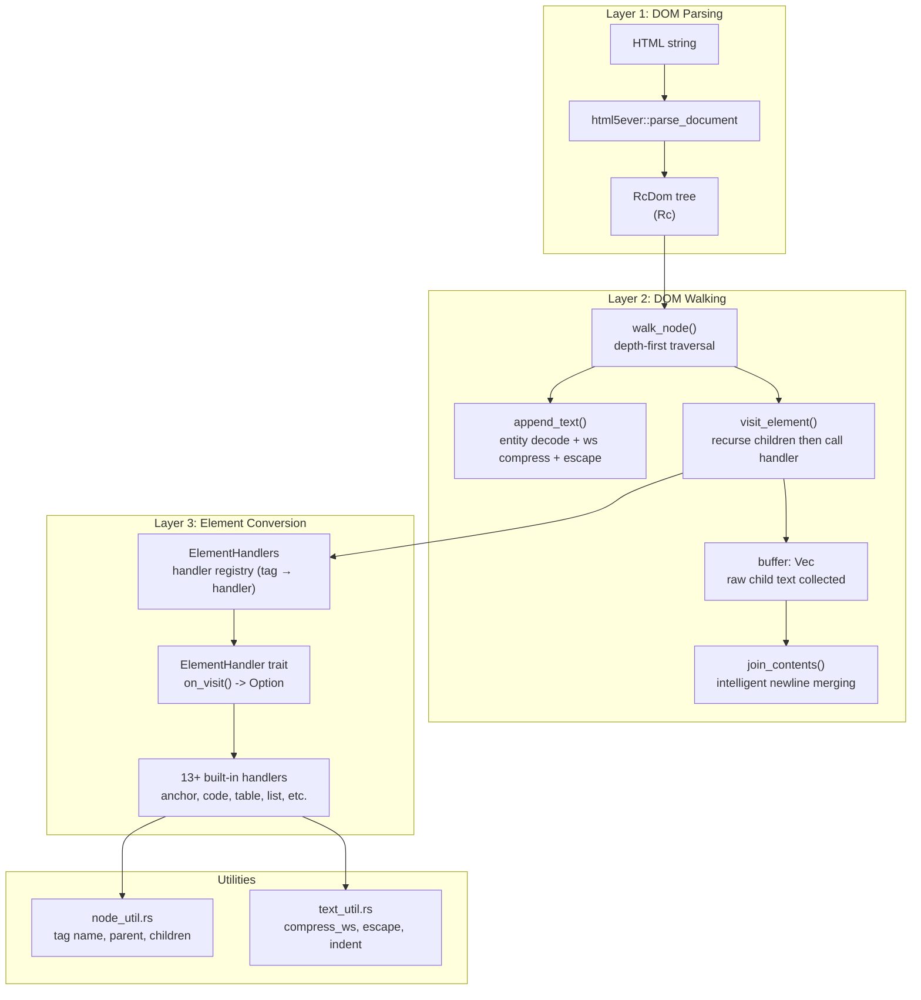
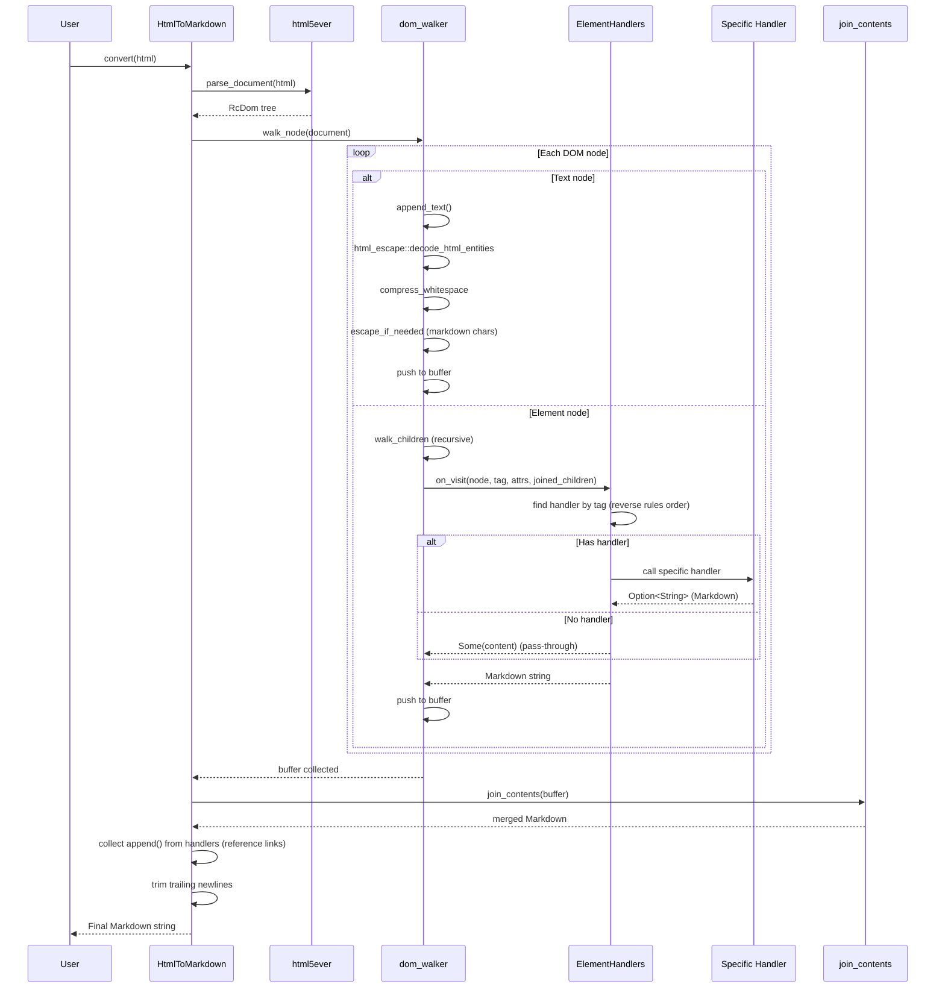
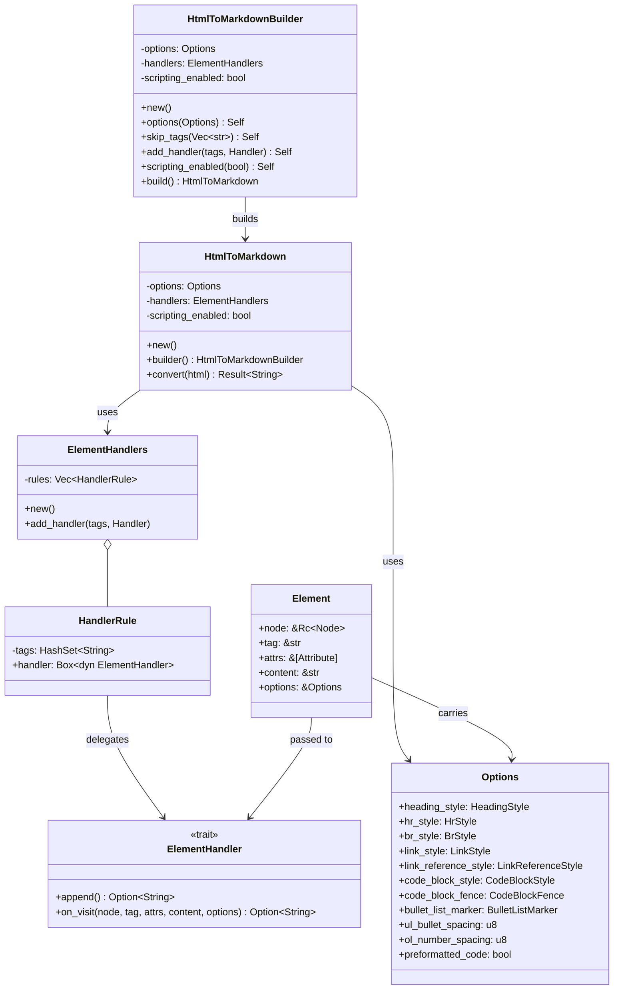
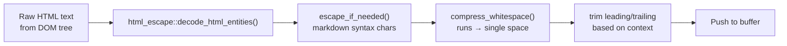

# fork-htmd — Architecture

**Source:** `fork-htmd/src/` — 17 Rust files, ~2,700 lines.

fork-htmd is structured as a three-layer system: DOM parsing (html5ever), tree walking (dom_walker), and element conversion (element_handler registry). The text utility layer handles HTML entity decoding, whitespace compression, and Markdown syntax escaping throughout.

## Module Structure

```
fork-htmd/src/
├── lib.rs                          # Public API: convert(), HtmlToMarkdown, Element
├── dom_walker.rs                   # DOM traversal + text escaping + whitespace handling
├── node_util.rs                    # Node helpers: tag name, parent, children, content
├── text_util.rs                    # Whitespace compression, Markdown escaping, concat macro
├── options.rs                      # Options struct + all config enums
│
└── element_handler/
    ├── mod.rs                      # ElementHandler trait + ElementHandlers registry
    ├── anchor.rs                   # <a> → [text](url) with thread-local reference links
    ├── code.rs                     # <code> inline/block with fence adaptation
    ├── table.rs                    # <table> → pipe-markdown table
    ├── list.rs                     # <ul>/<ol> wrapper
    ├── li.rs                       # <li> item with numbering and indentation
    ├── headings.rs                 # <h1>-<h6> → ATX or Setext
    ├── blockquote.rs               # <blockquote> → > prefix
    ├── emphasis.rs                 # <strong>/<em> → **bold**/_italic_
    ├── img.rs                      #  → 
    ├── br.rs                       # <br> → "  \n" or "\\\n"
    └── hr.rs                       # <hr> → "* * *" or "- - -" or "_ _ _"
```

## Layer Architecture



## Conversion Pipeline: Full Data Flow



## Core Types and Relationships



## Handler Registration

Built-in handlers are registered in `ElementHandlers::new()` in reverse order of specificity:

```rust
// element_handler/mod.rs:80-129
pub fn new() -> Self {
    let mut handlers = Self { rules: Vec::new() };
    
    handlers.add_handler(vec!["img"], img_handler);           // specific
    handlers.add_handler(vec!["a"], AnchorElementHandler::new());
    handlers.add_handler(vec!["ol", "ul"], list_handler);
    handlers.add_handler(vec!["li"], list_item_handler);
    handlers.add_handler(vec!["blockquote"], blockquote_handler);
    handlers.add_handler(vec!["code"], code_handler);
    handlers.add_handler(vec!["strong", "b"], bold_handler);
    handlers.add_handler(vec!["i", "em"], italic_handler);
    handlers.add_handler(vec!["h1".."h6"], headings_handler);
    handlers.add_handler(vec!["br"], br_handler);
    handlers.add_handler(vec!["hr"], hr_handler);
    handlers.add_handler(vec!["table"], table_handler);
    handlers.add_handler(vec!["p", "pre", "div", ...], block_handler); // catch-all
    
    handlers
}
```

Handler lookup uses **reverse iteration** through the rules:

```rust
// element_handler/mod.rs:154
match self.rules.iter().rev().find(|rule| rule.tags.contains(tag)) {
    Some(rule) => rule.handler.on_visit(...),
    None => Some(content.to_string()),  // pass-through for unregistered tags
}
```

**Aha:** Custom handlers are added via `add_handler()` which appends to the end of the rules vector. Since lookup is in reverse order, custom handlers take precedence over built-in handlers. This means you can override any built-in handler by adding your own for the same tag — a simple but effective override mechanism.

## Text Processing Pipeline

Every text node passes through a multi-stage pipeline:



The `escape_if_needed()` function handles Markdown syntax conflicts:

```rust
// dom_walker.rs:236-289
fn escape_if_needed(text: Cow<str>) -> Cow<'_, str> {
    // First char triggers: = ~ > - + # 0-9
    // Any char triggers: \ * _ ` [ ]
    // Then escape specific chars with backslash
}
```

## Security/Safety Model

The `scripting_enabled` flag controls how `<noscript>` content is handled:

- `scripting_enabled: true` (default) — `<noscript>` content is treated as raw text (not parsed as DOM)
- `scripting_enabled: false` — `<noscript>` content is parsed as normal DOM elements

This is passed through to `html5ever`'s `TreeBuilderOpts`:

```rust
// lib.rs:106-110
ParseOpts {
    tree_builder: TreeBuilderOpts {
        scripting_enabled: self.scripting_enabled,
        ..Default::default()
    },
}
```

## What to Read Next

- [DOM Walker](02-dom-walker.md) for the traversal algorithm and text escaping
- [Element Handlers](03-element-handlers.md) for each handler's conversion logic
- [Options](04-options-config.md) for all configuration options
