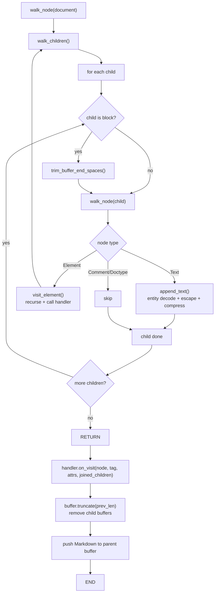
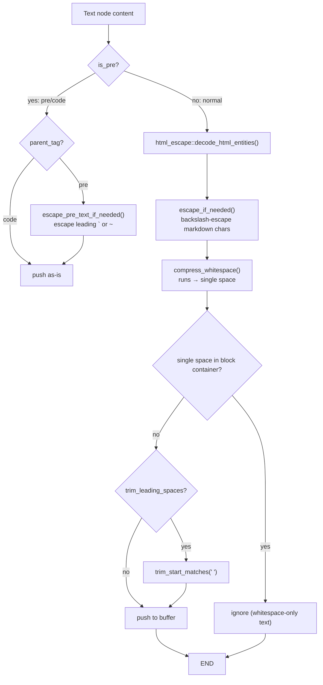

# fork-htmd — DOM Walker

**Source:** `fork-htmd/src/dom_walker.rs` (342 lines), `node_util.rs` (48 lines).

The DOM walker is the engine of fork-htmd. It traverses the `html5ever` DOM tree depth-first, collecting child content in a string buffer, then converting each element to Markdown via the handler registry. The walker also handles whitespace normalization, HTML entity decoding, and Markdown syntax escaping for all text nodes.

## Walker Entry Point

```rust
// dom_walker.rs:15-60
pub(crate) fn walk_node(
    node: &Rc<Node>,
    parent_tag: Option<&str>,
    buffer: &mut Vec<String>,
    handler: &dyn ElementHandler,
    options: &Options,
    is_pre: bool,
    trim_leading_spaces: bool,
)
```

The function dispatches on node type:

```rust
match node.data {
    NodeData::Document => {
        walk_children(buffer, node, true, handler, options, false);
        trim_buffer_end(buffer);
    }
    NodeData::Text { ref contents } => {
        append_text(buffer, parent_tag, contents.borrow().to_string(), is_pre, trim_leading_spaces);
    }
    NodeData::Element { ref name, ref attrs, .. } => {
        visit_element(buffer, node, handler, options, &name.local, &attrs.borrow(), is_pre);
    }
    NodeData::Comment { .. } => {}     // ignored
    NodeData::Doctype { .. } => {}     // ignored
    NodeData::ProcessingInstruction { .. } => unreachable!(),
}
```

Document and Element nodes recurse into children. Text nodes are processed and pushed to the buffer. Comments and doctypes are silently ignored.

## Depth-First Traversal



The key insight is **post-order processing**: children are walked first, their raw text collected in the buffer, then the element's handler is called with the joined child content. The handler returns Markdown, which replaces the child buffers in the parent's buffer.

## visit_element — Post-Order Conversion

```rust
// dom_walker.rs:106-134
fn visit_element(
    buffer: &mut Vec<String>,
    node: &Rc<Node>,
    handler: &dyn ElementHandler,
    options: &Options,
    tag: &str,
    attrs: &[Attribute],
    is_pre: bool,
) {
    let is_head = tag == "head";
    let is_pre = is_pre || tag == "pre" || tag == "code";  // propagate pre flag
    let prev_buffer_len = buffer.len();                     // snapshot buffer position
    let is_block = is_block_element(tag);
    
    walk_children(buffer, node, is_block, handler, options, is_pre);  // recurse first
    
    let md = handler.on_visit(                               // then convert
        node, tag, attrs, &join_contents(&buffer[prev_buffer_len..]), options,
    );
    
    buffer.truncate(prev_buffer_len);                        // remove child buffers
    if let Some(text) = md {
        if !text.is_empty() || !is_head {
            buffer.push(text);                               // push Markdown
        }
    }
}
```

The `is_pre` flag propagates down through `pre` and `code` elements, changing how text nodes inside them are processed (no whitespace compression, different escaping).

## join_contents — Intelligent Newline Merging

```rust
// dom_walker.rs:138-164
fn join_contents(contents: &[String]) -> String {
    let mut result = String::new();
    for content in contents {
        if content.is_empty() { continue; }
        
        let left = result.trim_end_matches('\n');             // strip trailing newlines
        let right = content.trim_start_matches('\n');         // strip leading newlines
        
        let max_trimmed = std::cmp::max(
            result_len - left.len(),                         // how many were stripped
            content_len - right.len()
        );
        let separator_new_lines = std::cmp::min(max_trimmed, 2);  // cap at 2
        let separator = "\n".repeat(separator_new_lines);
        
        // Rebuild: left + separator + right
    }
    result
}
```

**Aha:** This is directly inspired by turndown.js's approach. The key idea: when joining child content, preserve newlines but cap them at 2. If the left side had 3 trailing newlines and the right side had 1 leading newline, the separator becomes `min(3, 2) = 2` newlines. This prevents excessive blank lines while preserving the structure that block elements (like `<p>` which adds `\n\n`) intend.

## Text Node Processing (append_text)

Text nodes go through different pipelines depending on context:



### escape_if_needed

Escapes Markdown syntax characters in text content to prevent them from being interpreted as Markdown:

```rust
// dom_walker.rs:236-289
fn escape_if_needed(text: Cow<str>) -> Cow<'_, str> {
    // Check first char for: = ~ > - + # 0-9
    // Check any char for: \ * _ ` [ ]
    // If trigger found, escape: \ → \\, * → \*, _ → \_, ` → \`, [ → \[, ] → \]
    // Then handle first-char special cases:
    //   -, + → only escape if followed by space (list item)
    //   # → only escape if ATX heading pattern
    //   0-9 → only escape if followed by ". " pattern (ordered list)
    //   =, ~, > → always escape at start
}
```

Examples:
- `"\`\`\`"` → `"\`\`\`"` (escaped, would start code fence)
- `"1. Item"` → `"1\. Item"` (escaped, would start ordered list)
- `"> Quote"` → `"\> Quote"` (escaped, would start blockquote)
- `"Hello *world*"` → `"Hello \*world\*"` (escaped, would start emphasis)

### compress_whitespace

Collapses runs of whitespace into single spaces:

```rust
// text_util.rs:106-146
pub(crate) fn compress_whitespace(input: &str) -> Cow<'_, str> {
    // Check if compression needed (consecutive whitespace or non-space whitespace)
    // If not needed, return borrowed (zero allocation)
    // If needed, replace each whitespace run with single space
}
```

Uses `Cow` to avoid allocation when no compression is needed.

## Block vs Inline Element Classification

```rust
// dom_walker.rs:308-341
fn is_block_container(tag: &str) -> bool {
    matches!(tag, "html" | "body" | "div" | "ul" | "ol" | "li" | "table" | "tr"
        | "header" | "head" | "footer" | "nav" | "section" | "article"
        | "aside" | "main" | "blockquote" | "script" | "style")
}

fn is_block_element(tag: &str) -> bool {
    if is_block_container(tag) { return true; }
    matches!(tag, "p" | "h1" | "h2" | "h3" | "h4" | "h5" | "h6" | "pre" | "hr" | "br")
}
```

The distinction matters for:
1. **Whitespace trimming** — block elements trigger `trim_buffer_end_spaces()` before processing the next sibling
2. **Leading space trimming** — first child of a block element has its leading whitespace trimmed
3. **Single-space handling** — a lone space in a block container is ignored

## walk_children — Child Iteration with Flags

```rust
// dom_walker.rs:166-203
fn walk_children(
    buffer: &mut Vec<String>,
    node: &Rc<Node>,
    is_parent_blok_element: bool,
    handler: &dyn ElementHandler,
    options: &Options,
    is_pre: bool,
) {
    let mut trim_leading_spaces = !is_pre && is_parent_blok_element;
    
    for child in node.children.borrow().iter() {
        let is_block = get_node_tag_name(child).is_some_and(is_block_element);
        
        if is_block {
            trim_buffer_end_spaces(buffer);  // trim previous block's trailing spaces
        }
        
        let buffer_len = buffer.len();
        walk_node(child, tag, buffer, handler, options, is_pre, trim_leading_spaces);
        
        if buffer.len() > buffer_len {
            trim_leading_spaces = is_block;  // next sibling should trim if this was block
        }
    }
}
```

The `trim_leading_spaces` flag is a state machine: it starts true for block container children, then flips to true whenever a block element is encountered, ensuring whitespace between blocks is trimmed.

## Buffer Trimming

Two trimming functions handle trailing whitespace cleanup:

```rust
// dom_walker.rs:205-223
fn trim_buffer_end(buffer: &mut [String]) {
    // Trim ASCII whitespace from end of all strings (reverse order, stop at first no-op)
    for content in buffer.iter_mut().rev() {
        let trimmed = content.trim_end_ascii_whitespace();
        if trimmed.len() == content.len() { break; }
        *content = trimmed.to_string();
    }
}

fn trim_buffer_end_spaces(buffer: &mut [String]) {
    // Same but only for space characters (not all ASCII whitespace)
}
```

The first is used at the document level (trims all whitespace), the second between blocks (only trims spaces, preserving newlines that mark block boundaries).

## Node Utilities (node_util.rs)

```rust
// node_util.rs
pub(crate) fn get_node_tag_name(node: &Rc<Node>) -> Option<&str>
pub(crate) fn get_parent_node(node: &Rc<Node>) -> Option<Rc<Node>>
pub(crate) fn get_node_children(node: &Rc<Node>) -> Vec<Rc<Node>>
pub(crate) fn get_node_content(node: &Rc<Node>) -> String
```

`get_parent_node()` uses `RefCell`-based parent access — it temporarily takes the parent `Weak` reference, upgrades it, then puts it back. This is necessary because `markup5ever_rcdom` uses `RefCell` for parent links.

```rust
// node_util.rs:13-24
pub(crate) fn get_parent_node(node: &Rc<Node>) -> Option<Rc<Node>> {
    let value = node.parent.take();         // take the Weak
    let parent = value.as_ref()?.upgrade(); // upgrade to Rc
    node.parent.set(value);                 // put it back
    parent
}
```

## What to Read Next

- [Element Handlers](03-element-handlers.md) for each handler's conversion logic
- [Options](04-options-config.md) for all configuration options
- [Architecture](01-architecture.md) for the full module map
