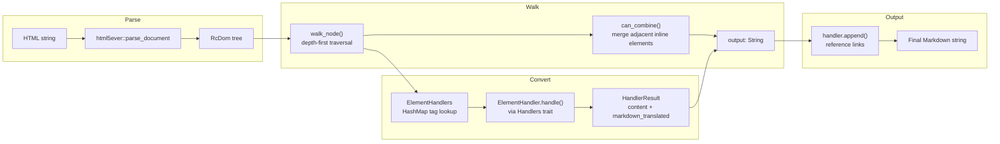

# htmd — Overview

**Source:** `htmd/src/` — 29 Rust files. Version 0.5.4. Apache-2.0.

htmd is a Rust crate that converts HTML to Markdown. It uses `html5ever` for DOM parsing and a handler-based architecture for element conversion. Version 0.5.4 introduces significant architectural changes over earlier versions: two translation modes, a `Handlers` trait for handler delegation, and adjacent inline element merging.

**Aha:** The key innovation in v0.5.4 is the **dual translation mode**. In `Pure` mode, all HTML is converted to Markdown (same as previous versions). In `Faithful` mode, the converter embeds raw HTML when Markdown can't express the original semantics — preserving attributes, classes, and styles that would otherwise be lost. This makes htmd suitable for both Markdown generation (Pure) and HTML round-tripping (Faithful).

## Architecture at a Glance



## Public API

### One-liner

```rust
// lib.rs:32
pub fn convert(html: &str) -> Result<String, std::io::Error> {
    HtmlToMarkdown::new().convert(html)
}
```

### Split conversion

```rust
// lib.rs:108-145
pub fn html_to_tree(&self, html: &str) -> std::io::Result<Rc<Node>>  // parse HTML → DOM
pub fn tree_to_markdown(&self, tree: &Rc<Node>) -> String              // convert DOM → Markdown
```

**Aha:** The `html_to_tree()` and `tree_to_markdown()` methods are new in v0.5.4. They allow users to parse HTML once and convert to Markdown multiple times with different options, or to inspect/modify the DOM tree before conversion.

### Builder pattern

```rust
// lib.rs:154-223
pub struct HtmlToMarkdownBuilder {
    handlers: ElementHandlers,
    scripting_enabled: bool,
}

// Usage:
let converter = HtmlToMarkdown::builder()
    .options(Options { translation_mode: TranslationMode::Faithful, ..Default::default() })
    .skip_tags(vec!["img"])
    .add_handler(vec!["video"], |handlers, element| {
        let content = handlers.walk_children(element.node);
        Some(format!("[Video: {}]", content.content).into())
    })
    .build();
```

## Key Types

| Type | Source | Purpose |
|------|--------|---------|
| `HtmlToMarkdown` | `lib.rs` | Main converter — holds handlers + scripting flag |
| `HtmlToMarkdownBuilder` | `lib.rs` | Builder for customizing handlers and options |
| `Element` | `lib.rs` | Element context (node, tag, attrs, markdown_translated, skipped_handlers) |
| `ElementHandler` | `element_handler/mod.rs` | Trait: `handle(handlers, element) -> Option<HandlerResult>` |
| `Handlers` | `element_handler/mod.rs` | Trait: delegation, child walking, fallback |
| `HandlerResult` | `element_handler/mod.rs` | Result: `content: String` + `markdown_translated: bool` |
| `ElementHandlers` | `element_handler/mod.rs` | Handler registry with HashMap tag lookup |
| `Options` | `options.rs` | Conversion options + TranslationMode enum |

## Translation Modes

| Mode | Behavior | Use Case |
|------|----------|----------|
| `Pure` (default) | Always convert to Markdown, drop attributes | Markdown generation |
| `Faithful` | Embed raw HTML when Markdown can't express semantics | HTML round-tripping, preserving classes/styles |

## New in v0.5.4 vs v0.2.1

| Feature | v0.2.1 | v0.5.4 |
|---------|--------|--------|
| Translation modes | Single mode | Pure + Faithful |
| Handler trait | `Fn(Element) -> Option<String>` | `Fn(&dyn Handlers, Element) -> Option<HandlerResult>` |
| Delegation | None | `Handlers` trait with `fallback()`, `handle()`, `walk_children()` |
| Tag lookup | Vec reverse iteration | HashMap tag → handler indices |
| Inline merging | None | `can_combine()` merges adjacent `<i>/<em>`, `<b>/<strong>` |
| Plain text optimization | None | `is_plain_text()` byte-level check skips escaping |
| HTML escape | `html-escape` crate | Custom `html_escape.rs` |
| Block classification | `matches!()` macro | `phf::Set` perfect hash set |
| Separated API | `convert()` only | `html_to_tree()` + `tree_to_markdown()` |
| Granular handlers | 13 handlers | 22+ handlers (tbody, thead, tr, td/th, caption, p, pre, span, html, head/body) |
| Edition | 2021 | 2024 |

## Dependency Graph

```mermaid
flowchart TD
    subgraph "Public API"
        CONV["convert()"]
        HTM["HtmlToMarkdown"]
        HTMB["HtmlToMarkdownBuilder"]
    end

    subgraph "Core Engine"
        WALK["dom_walker.rs\nwalk_node + walk_children + can_combine"]
        HANDLERS["element_handler/mod.rs\nElementHandler + Handlers traits"]
        OPTS["options.rs\nOptions + TranslationMode"]
    end

    subgraph "Element Handlers (22+)"
        ANCHOR["anchor.rs"]
        CODE["code.rs"]
        TABLE["table.rs + tbody.rs + thead.rs + tr.rs + td_th.rs + caption.rs"]
        LIST["list.rs + li.rs"]
        HEAD["headings.rs"]
        BQ["blockquote.rs"]
        EMPH["emphasis.rs"]
        IMG["img.rs"]
        BR["br.rs"]
        HR["hr.rs"]
        P["p.rs"]
        PRE["pre.rs"]
        SPAN["span.rs"]
        HTML["html.rs + head_body.rs"]
        ELEM_UTIL["element_util.rs\nserialize_element + handle_or_serialize_by_parent"]
    end

    subgraph "Utilities"
        NODE["node_util.rs"]
        TEXT["text_util.rs"]
        ESCAPE["html_escape.rs\ncustom HTML escaping"]
        PHF["phf::Set\nblock element classification"]
    end

    subgraph "External"
        HTML5EVER["html5ever 0.38"]
        RCDOM["markup5ever_rcdom 0.38"]
    end

    CONV --> HTM
    HTMB --> HTM
    HTM --> WALK
    HTM --> HANDLERS
    HTM --> OPTS
    HANDLERS --> ANCHOR
    HANDLERS --> CODE
    HANDLERS --> TABLE
    HANDLERS --> LIST
    HANDLERS --> HEAD
    HANDLERS --> BQ
    HANDLERS --> EMPH
    HANDLERS --> IMG
    HANDLERS --> BR
    HANDLERS --> HR
    HANDLERS --> P
    HANDLERS --> PRE
    HANDLERS --> SPAN
    HANDLERS --> HTML
    HANDLERS --> ELEM_UTIL
    WALK --> NODE
    WALK --> TEXT
    WALK --> ESCAPE
    WALK --> PHF
    WALK --> HTML5EVER
```



## What to Read Next

- [Architecture](01-architecture.md) for the Handlers trait and translation modes
- [DOM Walker](02-dom-walker.md) for can_combine and is_plain_text optimizations
- [Element Handlers](03-element-handlers.md) for all 22+ granular handlers
- [Faithful Mode](04-faithful-mode.md) for HTML embedding and serialize_element
