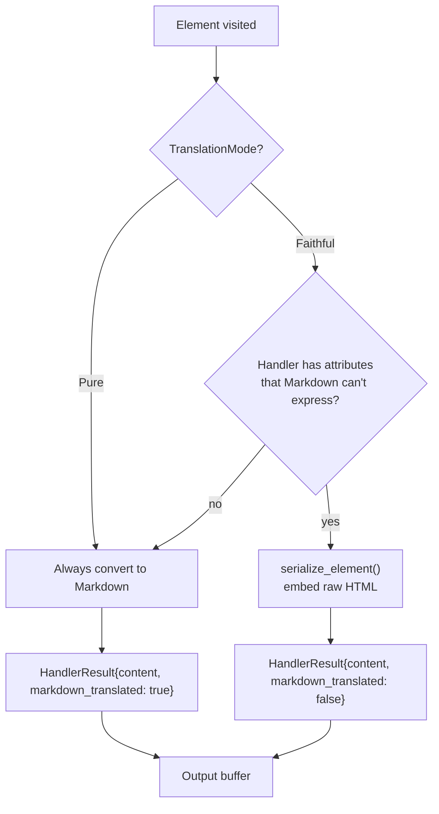

# htmd — Architecture

**Source:** `htmd/src/` — 29 Rust files. Version 0.5.4.

htmd v0.5.4 introduces a redesigned handler architecture with the `Handlers` trait for delegation, `TranslationMode` for pure vs faithful conversion, and `HandlerResult` for tracking whether content was Markdown-translated or HTML-serialized.

## Module Structure

```
htmd/src/
├── lib.rs                          # Public API: convert(), HtmlToMarkdown, Element
├── dom_walker.rs                   # DOM traversal + can_combine + is_plain_text + phf
├── html_escape.rs                  # Custom HTML escape for HTML-like sequences
├── node_util.rs                    # Node helpers
├── text_util.rs                    # Whitespace utilities, concat_strings macro
├── options.rs                      # Options + TranslationMode enum
│
└── element_handler/
    ├── mod.rs                      # ElementHandler + Handlers traits + HandlerResult
    ├── element_util.rs             # serialize_element + handle_or_serialize_by_parent + macro
    ├── anchor.rs                   # <a> with thread-local reference links
    ├── code.rs                     # <code> inline/block
    ├── table.rs                    # <table> → pipe table
    ├── tbody.rs                    # <tbody> wrapper
    ├── thead.rs                    # <thead> wrapper
    ├── tr.rs                       # <tr> wrapper
    ├── td_th.rs                    # <td>/<th> → pipe cells
    ├── caption.rs                  # <caption> handling
    ├── list.rs                     # <ul>/<ol>
    ├── li.rs                       # <li>
    ├── headings.rs                 # <h1>-<h6>
    ├── blockquote.rs               # <blockquote>
    ├── emphasis.rs                 # <strong>/<em>
    ├── img.rs                      # 
    ├── br.rs                       # <br>
    ├── hr.rs                       # <hr>
    ├── p.rs                        # <p> paragraph
    ├── pre.rs                      # <pre> block
    ├── span.rs                     # <span> inline
    ├── head_body.rs                # <head>/<body>
    └── html.rs                     # <html> root
```

## New Handler Architecture

```mermaid
flowchart TD
    subgraph "Traits"
        EH["ElementHandler trait\nhandle(handlers, element) -> HandlerResult"]
        H["Handlers trait\nfallback() + handle() + walk_children() + options()"]
    end

    subgraph "Registry"
        REG["ElementHandlers\nhandlers: Vec&lt;Box&lt;dyn ElementHandler&gt;&gt;\ntag_to_handler_indices: HashMap"]
    end

    subgraph "Result"
        HR["HandlerResult\ncontent: String\nmarkdown_translated: bool"]
    end

    subgraph "Impls"
        CLOSURE["Closure impl\nFn(&dyn Handlers, Element) -> HandlerResult"]
        BUILTIN["22+ builtin handlers"]
    end

    EH -. blanket impl -> CLOSURE
    REG --> EH : finds handler
    REG -. implements -> H
    H --> REG : delegation
    EH --> HR
    BUILTIN --> EH
```

**Aha:** The `Handlers` trait enables **recursive delegation**. Handlers can now call `handlers.walk_children(node)` to recursively process child nodes, or `handlers.fallback(element)` to skip to the next registered handler for the same tag. This eliminates the previous model where handlers had no way to delegate or access child content beyond what was pre-collected.

## Handlers Trait

```rust
// element_handler/mod.rs:306-318
pub trait Handlers {
    fn fallback(&self, element: Element) -> Option<HandlerResult>;
    fn handle(&self, node: &Rc<Node>) -> Option<HandlerResult>;
    fn walk_children(&self, node: &Rc<Node>) -> HandlerResult;
    fn options(&self) -> &Options;
}
```

Implemented by `ElementHandlers`:

```rust
// element_handler/mod.rs:320-356
impl Handlers for ElementHandlers {
    fn fallback(&self, element: Element) -> Option<HandlerResult> {
        self.handle(element.node, element.tag, element.attrs,
                    element.markdown_translated, element.skipped_handlers + 1)
    }

    fn handle(&self, node: &Rc<Node>) -> Option<HandlerResult> {
        let mut output = String::new();
        let md = walk_node(node, &mut output, self, None, true, false);
        Some(HandlerResult { content: output, markdown_translated: md })
    }

    fn walk_children(&self, node: &Rc<Node>) -> HandlerResult {
        let mut output = String::new();
        let tag = get_node_tag_name(node);
        let is_block = tag.is_some_and(is_block_element);
        let is_pre = tag.is_some_and(|t| t == "pre" || t == "code") || is_inside_pre(node);
        let md = walk_children(node, &mut output, self, is_block, is_pre);
        HandlerResult { content: output, markdown_translated: md }
    }

    fn options(&self) -> &Options { &self.options }
}
```

## ElementHandler Trait (New Signature)

```rust
// element_handler/mod.rs:84-92
pub trait ElementHandler: Send + Sync {
    fn append(&self) -> Option<String> { None }
    fn handle(&self, handlers: &dyn Handlers, element: Element) -> Option<HandlerResult>;
}
```

The key change: handlers now receive `&dyn Handlers` as the first parameter, enabling delegation. The return type changed from `Option<String>` to `Option<HandlerResult>`.

## HandlerResult

```rust
// element_handler/mod.rs:58-81
pub struct HandlerResult {
    pub content: String,
    pub markdown_translated: bool,
}

impl From<String> for HandlerResult { ... }  // markdown_translated: true
impl From<&str> for HandlerResult { ... }    // markdown_translated: true
```

The `markdown_translated` flag tracks whether the content was produced as Markdown or as embedded HTML. This is used in `Faithful` mode to know which parts of the output are pure Markdown vs embedded HTML.

## Element Struct (New Fields)

```rust
// lib.rs:37-53
pub struct Element<'a> {
    pub node: &'a Rc<Node>,
    pub tag: &'a str,
    pub attrs: &'a [Attribute],
    pub markdown_translated: bool,  // NEW: whether children were Markdown-translated
    pub(crate) skipped_handlers: usize,  // NEW: for handler fallback chaining
}
```

## HashMap-Based Tag Lookup

```rust
// element_handler/mod.rs:104-108
pub(crate) struct ElementHandlers {
    pub(crate) handlers: Vec<Box<dyn ElementHandler>>,
    pub(crate) tag_to_handler_indices: HashMap<String, Vec<usize>>,
    pub(crate) options: Options,
}
```

Tag registration:

```rust
// element_handler/mod.rs:237-252
pub fn add_handler<Handler>(&mut self, tags: Vec<&str>, handler: Handler) {
    let handler_idx = self.handlers.len();
    self.handlers.push(Box::new(handler));
    for tag in tags {
        self.tag_to_handler_indices.entry(tag.to_owned()).or_default().push(handler_idx);
    }
}
```

Lookup:

```rust
// element_handler/mod.rs:296-300
fn find_handler(&self, tag: &str, skipped_handlers: usize) -> Option<&dyn ElementHandler> {
    let handler_indices = self.tag_to_handler_indices.get(tag)?;
    let idx = handler_indices.iter().rev().nth(skipped_handlers)?;
    Some(self.handlers[*idx].as_ref())
}
```

**Aha:** The HashMap lookup is O(1) per tag, compared to O(n) reverse Vec iteration in v0.2.1. The `skipped_handlers` field enables the fallback mechanism: when a handler calls `handlers.fallback(element)`, it increments `skipped_handlers` and re-searches, finding the next handler for the same tag.

## Translation Mode Decision Flow



## Block Element Classification (phf)

```rust
// dom_walker.rs:399-470
static BLOCK_ELEMENTS: phf::Set<&'static str> = phf_set! {
    "address", "article", "aside", "base", "basefont", "blockquote", "body",
    "caption", "center", "col", "colgroup", "dd", "details", "dialog", "dir",
    "div", "dl", "dt", "fieldset", "figcaption", "figure", "footer", "form",
    "frame", "frameset", "h1", "h2", "h3", "h4", "h5", "h6", "head", "header", "hr", "html", "iframe",
    "legend", "li", "link", "main", "menu", "menuitem", "nav", "noframes",
    "ol", "optgroup", "option", "p", "param", "pre", "script", "search",
    "section", "style", "summary", "table", "tbody", "td", "textarea",
    "tfoot", "th", "thead", "title", "tr", "track", "ul",
};

pub(crate) fn is_block_element(tag: &str) -> bool {
    BLOCK_ELEMENTS.contains(tag)
}
```

The `phf` crate provides O(1) perfect hash set lookup with compile-time construction. The block element list is taken from the CommonMark spec.

## What to Read Next

- [DOM Walker](02-dom-walker.md) for can_combine and is_plain_text
- [Element Handlers](03-element-handlers.md) for all 22+ handlers
- [Faithful Mode](04-faithful-mode.md) for HTML embedding
- [Overview](00-overview.md) for the public API
