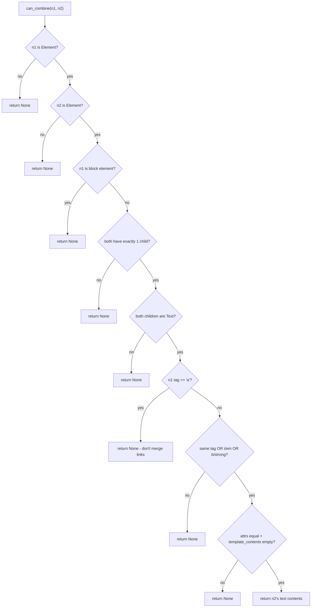
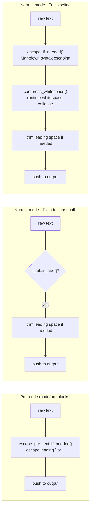

# htmd — DOM Walker

**Source:** `htmd/src/dom_walker.rs` — 471 lines.

The DOM walker is the engine of htmd. Version 0.5.4 adds `can_combine()` for merging adjacent inline elements, `is_plain_text()` for byte-level plain-text detection, and `append_normalized_content()` for whitespace normalization.

## Node Visit Flow

```mermaid
flowchart TD
    ENTRY["walk_node()"] --> ND{node.data?}

    ND -->|Document| DOC["walk_children() + trim_output_end()"]
    ND -->|Text| TXT{is_pre?}
    ND -->|Element| ELEM["handlers.handle()"]
    ND -->|Comment| FAITH{Faithful mode?}
    ND -->|Doctype| SKIP

    TXT -->|yes| PRE["escape_pre_text_if_needed()"]
    TXT -->|no| NRM{is_plain_text()?}
    NRM -->|yes| PLAIN["minimal trim + push"]
    NRM -->|no| ESC["escape_if_needed() + compress_whitespace()"]

    FAITH -->|yes| CMT["<!-- contents -->"]
    FAITH -->|no| SKIP

    ELEM --> RES["HandlerResult{content, markdown_translated}"]
    RES --> APPEND["append_normalized_content()"]

    DOC --> OUT
    PRE --> OUT
    PLAIN --> OUT
    ESC --> OUT
    CMT --> OUT
    SKIP --> OUT

    OUT["output: String"]
```

## walk_node — The Visitor

```rust
// dom_walker.rs:16-114
pub(crate) fn walk_node(
    node: &Rc<Node>,
    output: &mut String,
    handlers: &ElementHandlers,
    parent_tag: Option<&str>,
    trim_leading_spaces: bool,
    is_pre: bool,
) -> bool
```

The visitor dispatches on `NodeData` variant:

| Variant | Action |
|---------|--------|
| `Document` | Calls `walk_children()` for the entire tree, then trims trailing whitespace |
| `Text` | Either raw push (pre mode), plain-text fast path, or full escape+compress pipeline |
| `Element` | Delegates to `handlers.handle()` and appends the `HandlerResult` |
| `Comment` | Only preserved in `Faithful` mode — emits `<!-- ... -->` literally |
| `Doctype` | Silently skipped |

**Aha:** The `is_plain_text()` fast path (`dom_walker.rs:44`) is new in v0.5.4. When text contains zero Markdown-significant characters, it bypasses the expensive `escape_if_needed()` + `compress_whitespace()` pipeline entirely — a single pass byte scan replaces two `Cow`-allocating transformations.

## walk_children — Child Traversal with Pre-Merging

```rust
// dom_walker.rs:144-205
pub(crate) fn walk_children(
    node: &Rc<Node>,
    output: &mut String,
    handlers: &ElementHandlers,
    is_parent_block_element: bool,
    is_pre: bool,
) -> bool
```

Two-phase operation:

### Phase 1: Pre-merge Adjacent Inlines

```rust
// dom_walker.rs:152-173
if node.children.borrow().len() > 1 {
    let mut children = node.children.borrow_mut();
    let mut index = 1;
    while index < children.len() {
        if let Some(text) = can_combine(&children[index - 1], &children[index]) {
            children.remove(index);
            index -= 1;
            // Merge text contents into children[index]
            let children_of_index = children.get(index).unwrap().children.borrow();
            let text_data = &children_of_index.first().unwrap().data;
            let NodeData::Text { contents } = text_data else { panic!("") };
            let mut inner_contents = contents.clone().into_inner();
            inner_contents.push_tendril(&text.take());
            contents.replace(inner_contents);
        }
        index += 1;
    }
}
```

This mutates the DOM tree in-place before walking. Adjacent qualifying inline elements are fused into a single element with concatenated text. This runs once per node before any children are visited.

### Phase 2: Sequential Walk

```rust
// dom_walker.rs:175-204
let mut trim_leading_spaces = !is_pre && is_parent_block_element;
for child in node.children.borrow().iter() {
    let is_block = match &child.data {
        NodeData::Element { name, .. } => is_block_element(&name.local),
        _ => false,
    };

    if is_block {
        trim_output_end_spaces(output);
    }

    let output_len = output.len();
    markdown_translated &= walk_node(child, output, handlers, tag, trim_leading_spaces, is_pre);

    if output_len < output.len() {
        trim_leading_spaces = is_block;
    }
}
```

The `trim_leading_spaces` flag toggles based on whether the previous child was a block element. This prevents leading spaces from accumulating between inline elements inside block containers.

## can_combine — Adjacent Inline Merging

```rust
// dom_walker.rs:209-267
fn can_combine(n1: &Node, n2: &Node) -> Option<RefCell<Tendril<UTF8>>>
```

The `can_combine()` algorithm decides whether two adjacent DOM nodes should be fused. Both nodes must satisfy all criteria:



**Combination criteria** (all must pass):

| Criterion | Check | Rationale |
|-----------|-------|-----------|
| Both are elements | `NodeData::Element` match | Only elements carry semantic tags |
| Neither is block | `!is_block_element()` | Block elements must stay separate |
| Single text child | `children.len() == 1` + `NodeData::Text` | Complex subtrees can't be safely merged |
| Not a link | `name1.local != "a"` | Adjacent `<a>` tags must not merge |
| Same or equivalent tag | `name1 == name2` OR `i`/`em` OR `b`/`strong` | Semantically equivalent formatting |
| Equal attributes | `attrs1 == attrs2` | Different classes/styles must not merge |
| No template contents | `template_contents.is_none()` | Shadow DOM boundaries must be preserved |

**Aha:** The `i`/`em` and `b`/`strong` equivalence (`dom_walker.rs:254-257`) means `<em>hello</em><i> world</i>` merges into a single element with text "hello world". This is correct because Markdown renders both as `*hello world*` — separate tags would produce `*hello* *world*`, which renders with a visible gap.

## is_plain_text — Byte-Level Optimization

```rust
// dom_walker.rs:116-142
fn is_plain_text(text: &str) -> bool {
    let bytes = text.as_bytes();
    let Some(&first) = bytes.first() else {
        return true;
    };

    // First char: reject Markdown-significant starters
    if matches!(first, b'=' | b'~' | b'>' | b'-' | b'+' | b'#' | b'0'..=b'9') {
        return false;
    }

    let mut previous_was_space = false;
    for &byte in bytes {
        match byte {
            b'\\' | b'*' | b'_' | b'`' | b'[' | b']' | b'<' => return false,
            b' ' => {
                if previous_was_space {
                    return false;  // double space = significant
                }
                previous_was_space = true;
            }
            b'\t' | b'\n' | b'\r' | 0x0C | 0x0B => return false,
            _ => previous_was_space = false,
        }
    }

    true
}
```

This is a **byte-level** scan (not char-level) for performance. It rejects text containing:

| Byte | Reason |
|------|--------|
| `\\`, `*`, `_`, `` ` ``, `[`, `]`, `<` | Markdown syntax characters |
| Double space | Significant formatting |
| `\t`, `\n`, `\r`, `\f`, `\v` | Control whitespace |
| `=`, `~`, `>`, `-`, `+`, `#` at start | Setext heading, code fence, blockquote, list |
| `0`-`9` at start | Ordered list item |

When `is_plain_text()` returns `true`, the text bypasses `escape_if_needed()` and `compress_whitespace()` entirely — it is pushed directly to the output buffer with only minimal leading-space trimming.

## Text Processing Pipelines



### escape_if_needed — Markdown Syntax Escaping

```rust
// dom_walker.rs:322-377
fn escape_if_needed(text: Cow<'_, str>) -> Cow<'_, str>
```

This function prevents HTML text from being misinterpreted as Markdown syntax:

| Input pattern | Escape applied | Markdown meaning prevented |
|---------------|----------------|---------------------------|
| `===` | `\===` | Setext H1 underline |
| `---` | `\---` | Setext H2 underline / hr |
| `# Heading` | `\# Heading` | ATX heading |
| `1. Item` | `1\. Item` | Ordered list item |
| `- Item` | `\- Item` | Unordered list item |
| `+ Item` | `\+ Item` | Unordered list item |
| `> Quote` | `\> Quote` | Blockquote |
| ```` ``` ``` | `\`\`\`` | Code fence |
| `~~~` | `\~~~` | Code fence |
| `*bold*` | `\*bold\*` | Emphasis |
| `_italic_` | `\_italic\_` | Emphasis |
| `[link]` | `\[link\]` | Link syntax |
| `\` | `\\` | Backslash escape |

The function uses `Cow<'_, str>` to avoid allocation when no escaping is needed.

### escape_pre_text_if_needed — Pre-Block Escaping

```rust
// dom_walker.rs:382-395
fn escape_pre_text_if_needed(text: Cow<'_, str>) -> Cow<'_, str>
```

Only escapes leading `` ` `` or `~` to prevent code fence confusion inside `<pre>` blocks:

```rust
// dom_walker.rs:386-394
match first {
    '`' | '~' => {
        let mut escaped = String::with_capacity(text.len() + 1);
        escaped.push('\\');
        escaped.push_str(text.as_ref());
        Cow::Owned(escaped)
    }
    _ => text,
}
```

### compress_whitespace — Runtime Whitespace Collapse

```rust
// text_util.rs:156-209
pub(crate) fn compress_whitespace(input: &str) -> Cow<'_, str>
```

Collapses runs of whitespace into single spaces, converting all whitespace types (tabs, newlines, form feeds) to regular spaces. Uses a lazy `Cow` strategy: if no whitespace collapsing is needed, returns a borrowed reference; otherwise allocates a new `String`.

```rust
// text_util.rs:161-201 — lazy Cow allocation
let mut result: Option<String> = None;  // None = no changes yet
for (byte_index, c) in input.char_indices() {
    if c.is_ascii_whitespace() {
        if in_whitespace {
            // Skip consecutive whitespace — allocate on first skip
            if result.is_none() {
                let mut s = String::with_capacity(input.len());
                s.push_str(&input[..byte_index]);
                result = Some(s);
            }
        } else {
            in_whitespace = true;
            if c == ' ' {
                // Single space — valid, only allocate if already modified
                if let Some(res) = &mut result { res.push(' '); }
            } else {
                // Non-space whitespace → convert to space
                if result.is_none() {
                    let mut s = String::with_capacity(input.len());
                    s.push_str(&input[..byte_index]);
                    result = Some(s);
                }
                result.as_mut().unwrap().push(' ');
            }
        }
    } else {
        in_whitespace = false;
        if let Some(res) = &mut result { res.push(c); }
    }
}
```

## append_normalized_content — Output Whitespace Control

```rust
// dom_walker.rs:272-299
fn append_normalized_content(output: &mut String, mut content: String, is_pre: bool)
```

Normalizes whitespace at the boundary between existing output and new content:

| Rule | Condition | Action |
|------|-----------|--------|
| Max 2 newlines | `total_newlines > 2` | Drain excess from content start |
| Collapse inline spaces | `!is_pre && last_newlines == 0 && content_newlines == 0 && output.ends_with(' ') && content starts with ' '` | Remove leading space from content |

```rust
// dom_walker.rs:278-286 — newline collapsing
let last_newlines = output.chars().rev().take_while(|c| *c == '\n').count();
let content_newlines = content.chars().take_while(|c| *c == '\n').count();
let total_newlines = last_newlines + content_newlines;

if total_newlines > 2 {
    let to_remove = std::cmp::min(total_newlines - 2, content_newlines);
    content.drain(..to_remove);
}
```

This ensures the output never has more than two consecutive newlines (one blank paragraph), regardless of how the handlers emit content.

## Block Element Classification (phf)

```rust
// dom_walker.rs:399-470
static BLOCK_ELEMENTS: phf::Set<&'static str> = phf_set! {
    "address", "article", "aside", "base", "basefont", "blockquote", "body",
    "caption", "center", "col", "colgroup", "dd", "details", "dialog", "dir",
    "div", "dl", "dt", "fieldset", "figcaption", "figure", "footer", "form",
    "frame", "frameset", "h1", "h2", "h3", "h4", "h5", "h6", "head", "header", "hr", "html", "iframe",
    "legend", "li", "link", "main", "menu", "menuitem", "nav", "noframes",
    "ol", "optgroup", "option", "p", "param", "pre", "script", "search",
    "section", "style", "summary", "table", "tbody", "td", "textarea",
    "tfoot", "th", "thead", "title", "tr", "track", "ul",
};

pub(crate) fn is_block_element(tag: &str) -> bool {
    BLOCK_ELEMENTS.contains(tag)
}
```

The `phf` crate provides O(1) compile-time perfect hash set lookup. The element list is taken from the CommonMark spec section on HTML blocks. Any tag not in this set is treated as inline (including custom elements).

## text_util — Whitespace and Joining

```rust
// text_util.rs:1-17 — TrimDocumentWhitespace trait
pub(crate) trait TrimDocumentWhitespace {
    fn trim_document_whitespace(&self) -> &str;
    fn trim_start_document_whitespace(&self) -> &str;
    fn trim_end_document_whitespace(&self) -> &str;
}
```

Document whitespace is defined as `\t`, `\n`, `\r`, ` ` — a narrower set than Rust's built-in `trim()`, which also strips Unicode whitespace characters.

```rust
// text_util.rs:121-154 — join_blocks
pub(crate) fn join_blocks(contents: &[String]) -> String
```

Joins text blocks with controlled newline separation. Trims trailing newlines from the left block and leading newlines from the right block, then inserts 1-2 newlines based on how many were trimmed (max 2). This prevents excessive blank lines in the output.

## What to Read Next

- [Element Handlers](03-element-handlers.md) for all 22+ granular handlers
- [Faithful Mode](04-faithful-mode.md) for HTML embedding and serialize_element
- [Architecture](01-architecture.md) for the Handlers trait and delegation
