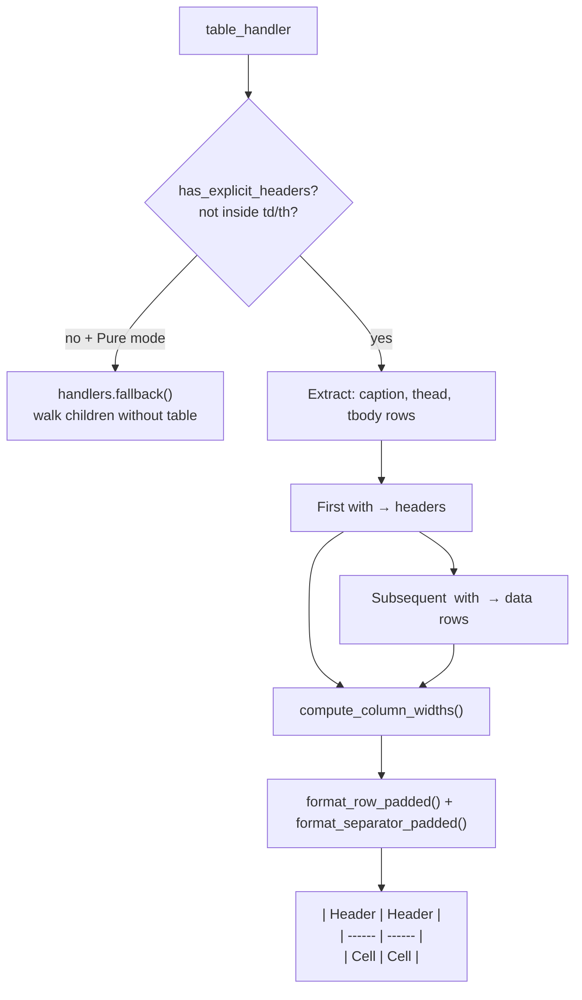

# htmd — Element Handlers

**Source:** `htmd/src/element_handler/` — 22 handler files, ~1200 LOC.

htmd v0.5.4 registers 22+ built-in element handlers plus a catch-all for unrecognized block elements. Each handler implements `ElementHandler` and receives `&dyn Handlers` for delegation.

## Handler Registry

```mermaid
flowchart TD
    REG["ElementHandlers::new()"] --> H[/"22+ handlers registered"/]

    subgraph "Structured handlers (struct)"
        A["AnchorElementHandler\nthread-local links"]
    end

    subgraph "Function handlers (fn)"
        IMG["img_handler"]
        CODE["code_handler"]
        TABLE["table_handler"]
        LIST["list_handler"]
        LI["list_item_handler"]
        BQ["blockquote_handler"]
        EMPH["emphasis_handler"]
        HEAD["headings_handler"]
        BR["br_handler"]
        HR["hr_handler"]
        P["p_handler"]
        PRE["pre_handler"]
        SPAN["span_handler"]
        TB["tbody_handler"]
        TH["thead_handler"]
        TR["tr_handler"]
        TD["td_th_handler"]
        CAP["caption_handler"]
        HB["head_body_handler"]
        HTML["html_handler"]
        BLK["block_handler"]
    end

    H --> A
    H --> IMG
    H --> CODE
    H --> TABLE
    H --> LIST
    H --> LI
    H --> BQ
    H --> EMPH
    H --> HEAD
    H --> BR
    H --> HR
    H --> P
    H --> PRE
    H --> SPAN
    H --> TB
    H --> TH
    H --> TR
    H --> TD
    H --> CAP
    H --> HB
    H --> HTML
    H --> BLK
```



## All Registered Handlers

| Tags | Handler | Type | Markdown output |
|------|---------|------|-----------------|
| `<a>` | `AnchorElementHandler` | struct | `[text](url)` or `[text][n]` |
| `` | `img_handler` | fn | `` |
| `<code>` | `code_handler` | fn | `` `code` `` or fenced block |
| `<ol>`, `<ul>` | `list_handler` | fn | `1. ` or `- ` lists |
| `<li>` | `list_item_handler` | fn | indented list item |
| `<blockquote>` | `blockquote_handler` | fn | `> quote` |
| `<strong>`, `<b>` | `bold_handler` → `emphasis_handler` | fn | `**text**` |
| `<i>`, `<em>` | `italic_handler` → `emphasis_handler` | fn | `*text*` |
| `<h1>`–`<h6>` | `headings_handler` | fn | `## text` or setext |
| `<br>` | `br_handler` | fn | `  \n` or `\\\n` |
| `<hr>` | `hr_handler` | fn | `- - -` / `* * *` / `_ _ _` |
| `<table>` | `table_handler` | fn | pipe table |
| `<thead>` | `thead_handler` | fn | pass-through |
| `<tbody>` | `tbody_handler` | fn | pass-through |
| `<tr>` | `tr_handler` | fn | pass-through |
| `<td>`, `<th>` | `td_th_handler` | fn | pipe cell |
| `<caption>` | `caption_handler` | fn | caption text |
| `<p>` | `p_handler` | fn | block with blank lines |
| `<pre>` | `pre_handler` | fn | preserved content |
| `<span>` | `span_handler` | fn | pass-through or `$math$` |
| `<html>` | `html_handler` | fn | root pass-through |
| `<head>`, `<body>` | `head_body_handler` | fn | pass-through |
| Catch-all blocks | `block_handler` | fn | walk children or serialize |

## Handler Result Types

```rust
// element_handler/mod.rs:57-81
pub struct HandlerResult {
    pub content: String,
    pub markdown_translated: bool,
}

impl From<String> for HandlerResult { ... }  // markdown_translated: true
impl From<&str> for HandlerResult { ... }    // markdown_translated: true
```

Handlers return `Option<HandlerResult>`. `None` means "skip this element entirely." The `From` impls allow ergonomic `Some("text".into())` syntax.

## Anchor Handler — Thread-Local Reference Links

```rust
// element_handler/anchor.rs:14-16
thread_local! {
    static LINKS: RefCell<Vec<String>> = const { RefCell::new(vec![]) };
}
```

The anchor handler uses thread-local storage to defer reference link definitions until the end of conversion:

```rust
// element_handler/anchor.rs:19-38
impl ElementHandler for AnchorElementHandler {
    fn append(&self) -> Option<String> {
        AnchorElementHandler::LINKS.with(|links| {
            let mut links = links.borrow_mut();
            if links.is_empty() { return None; }
            let mut result = String::with_capacity(...);
            result.push_str("\n\n");
            for (index, link) in links.iter().enumerate() {
                if index > 0 { result.push('\n'); }
                result.push_str(link);
            }
            result.push_str("\n\n");
            links.clear();
            Some(result)
        })
    }
```

Three link styles supported:

| Style | Inline output | Reference output |
|-------|--------------|-----------------|
| `Inlined` | `[text](url)` | — |
| `InlinedPreferAutolinks` | `<url>` (when text==url) | — |
| `Referenced` | `[text][1]` | `[1]: url "title"` appended at end |

Reference styles for `Referenced` mode:

```rust
// element_handler/anchor.rs:148-162
LinkReferenceStyle::Full =>      // [text][1] ... [1]: url
LinkReferenceStyle::Collapsed => // [text][]  ... [text]: url
LinkReferenceStyle::Shortcut =>  // [text]    ... [text]: url
```

**Aha:** The `append()` method on `ElementHandler` is called once at the very end of conversion (in `lib.rs`). This is how reference links work — each `<a>` tag stores its definition in thread-local `LINKS`, and `append()` dumps them all at the bottom. The thread-local design makes the handler safe for concurrent conversions on different threads.

## Code Handler — Inline vs Block

```rust
// element_handler/code.rs:15-43
pub(super) fn code_handler(handlers: &dyn Handlers, element: Element) -> Option<HandlerResult> {
    // Faithful mode: serialize if children aren't all text
    if handlers.options().translation_mode == TranslationMode::Faithful
        && !element.node.children.borrow().iter()
            .all(|node| matches!(node.data, NodeData::Text { .. }))
    {
        return Some(HandlerResult {
            content: serialize_element(handlers, &element),
            markdown_translated: false,
        });
    }

    // Block code if parent is <pre>, inline otherwise
    let parent_node = get_parent_node(element.node);
    let is_code_block = parent_node.as_ref()
        .map(|p| get_node_tag_name(p).is_some_and(|t| t == "pre"))
        .unwrap_or(false);

    if is_code_block {
        handle_code_block(handlers, element, &parent_node.unwrap())
    } else {
        handle_inline_code(handlers, element)
    }
}
```

### Code Block Fence Detection

```rust
// element_handler/code.rs:85-97
fn get_code_fence_marker(symbol: &str, content: &str) -> String {
    let three_chars = symbol.repeat(3);
    if content.contains(&three_chars) {
        let four_chars = symbol.repeat(4);
        if content.contains(&four_chars) {
            symbol.repeat(5)
        } else { four_chars }
    } else { three_chars }
}
```

This adapts the fence marker to the content — code containing triple backticks gets 4 backticks, code containing 4 gets 5. Supports both backtick and tilde fences.

### Language Detection

```rust
// element_handler/code.rs:99-110
fn find_language_from_attrs(attrs: &[Attribute]) -> Option<String> {
    attrs.iter()
        .find(|attr| &attr.name.local == "class")
        .map(|attr| attr.value.split(' ')
            .find(|cls| cls.starts_with("language-"))
            .map(|lang| lang.split('-').skip(1).join("-")))
        .unwrap_or(None)
}
```

Extracts `language-*` from the `class` attribute. Supports multi-part language names like `language-c-sharp` → `c-sharp`.

### Inline Code with Backtick Handling

```rust
// element_handler/code.rs:112-148
fn handle_inline_code(handlers: &dyn Handlers, element: Element) -> Option<HandlerResult> {
    // Detect backticks inside content → use double backticks
    let mut use_double_backticks = false;
    let mut surround_with_spaces = false;
    for (idx, c) in chars.iter().enumerate() {
        if c == &'`' {
            let prev = if idx > 0 { chars[idx - 1] } else { '\0' };
            let next = if idx < len - 1 { chars[idx + 1] } else { '\0' };
            if prev != '`' && next != '`' {
                use_double_backticks = true;
                surround_with_spaces = idx == 0;  // leading backtick needs space
                break;
            }
        }
    }
```

Handles edge cases:
- `` <code>foo ` bar</code> `` → ``` ``foo ` bar`` ```
- `` <code>`foo</code> `` → ``` `` `foo `` ```

### Preformatted Code Option

```rust
// element_handler/code.rs:150-172
fn handle_preformatted_code(code: &str) -> String {
    // Newlines become spaces, with an extra space at start/end
    for ch in code.chars() {
        if ch == '\n' {
            result.push(' ');
            is_prev_ch_new_line = true;
        } else {
            if is_prev_ch_new_line && !in_middle {
                result.push(' ');  // extra space at start of line
            }
            result.push(ch);
        }
    }
}
```

When `options.preformatted_code` is `true`, newlines in inline code become spaces — useful for keeping inline code on a single line.

## Table Handler — Pipe Table Conversion

```rust
// element_handler/table.rs:18-185
pub(crate) fn table_handler(handlers: &dyn Handlers, element: Element) -> Option<HandlerResult>
```

The table handler extracts structure from the DOM:



Key logic:

```rust
// element_handler/table.rs:187-209
fn has_explicit_headers(node: &Rc<Node>) -> bool {
    fn visit(node: &Rc<Node>, is_root: bool) -> bool {
        for child in get_node_children(node) {
            if let NodeData::Element { name, .. } = &child.data {
                let tag_name = name.local.as_ref();
                if !is_root && tag_name == "table" { continue; }  // skip nested tables
                if matches!(tag_name, "th" | "thead") { return true; }
            }
            if visit(&child, false) { return true; }
        }
        false
    }
    visit(node, true)
}
```

In Pure mode, if a table has no explicit headers or is nested inside a table cell, it falls back to walking children — preventing nested tables from producing broken pipe syntax.

### Cell Normalization

```rust
// element_handler/table.rs:252-258
fn normalize_cell_content(content: &str) -> String {
    content
        .replace('\n', " ")       // newlines → spaces
        .replace('\r', "")        // strip CR
        .replace('|', "&#124;")   // escape pipe chars
        .trim_document_whitespace()
        .to_string()
}
```

### Column Width Computation

```rust
// element_handler/table.rs:283-301
fn compute_column_widths(headers: &[String], rows: &[Vec<String>], num_columns: usize) -> Vec<usize> {
    let mut widths = vec![0; num_columns];
    // Max character count across all cells per column
    for (i, header) in headers.iter().enumerate() { widths[i] = header.chars().count(); }
    for row in rows {
        for (i, cell) in row.iter().enumerate().take(num_columns) {
            widths[i] = widths[i].max(cell.chars().count());
        }
    }
    widths
}
```

Columns are padded to the widest cell for readable alignment:

```markdown
| Name    | Description   |
| ------- | ------------- |
| Short   | A short desc  |
| Longer  | A much longer description here |
```

## List Handler — Ordered List Alignment

```rust
// element_handler/list.rs:149-161
fn add_ol_li_marker(options: &Options, content: &str, index: usize, highest_index: usize) -> String {
    let index_str = index.to_string();
    let spacing = " ".repeat(
        options.ol_number_spacing as usize + digits(highest_index) - index_str.len()
    );
    let content = content.trim_start_matches('\n');
    let content = indent_text_except_first_line(content, index_str.len() + 1 + spacing.len(), true);
    concat_strings!("\n", index_str, ".", spacing, content)
}
```

This aligns all list markers to the same column width:

```markdown
  1. First item
  2. Second item
 10. Tenth item
100. Hundredth item
```

The `digits()` function computes the width needed:

```rust
// element_handler/list.rs:142-147
fn digits(num: usize) -> usize {
    if num == 0 { return 1; }
    ((num + 1) as f32).log10().ceil() as usize
}
```

## Table Sub-Elements — Pass-Through Pattern

The `<thead>`, `<tbody>`, `<tr>`, `<td>`, `<th>`, and `<caption>` handlers all follow the same pattern:

```rust
// element_handler/thead.rs:8-18
pub(super) fn thead_handler(handlers: &dyn Handlers, element: Element) -> Option<HandlerResult> {
    serialize_if_faithful!(handlers, element, 0);
    handle_or_serialize_by_parent(
        handlers, &element, &vec!["table"], element.markdown_translated,
    )
}
```

`handle_or_serialize_by_parent` walks children in Pure mode, but in Faithful mode serializes to HTML if the parent tag is not in the allowed list (e.g., `<thead>` outside `<table>`):

```rust
// element_handler/element_util.rs:16-42
pub(super) fn handle_or_serialize_by_parent(
    handlers: &dyn Handlers,
    element: &Element,
    tag_names: &Vec<&str>,
    markdown_translated: bool,
) -> Option<HandlerResult> {
    if handlers.options().translation_mode == TranslationMode::Faithful
        && !parent_tag_name_equals(element.node, tag_names)
    {
        Some(HandlerResult {
            content: serialize_element(handlers, element),
            markdown_translated: false,
        })
    } else {
        let content = handlers.walk_children(element.node).content;
        let content = content.trim_matches('\n');
        Some(HandlerResult {
            content: concat_strings!("\n\n", content, "\n\n"),
            markdown_translated,  // Propagate the flag from children
        })
    }
}
```

| Handler | Allowed parent | Rationale |
|---------|---------------|-----------|
| `thead_handler` | `table` | `<thead>` only valid inside `<table>` |
| `tbody_handler` | `table` | `<tbody>` only valid inside `<table>` |
| `tr_handler` | `tbody`, `thead` | `<tr>` only valid inside row groups |
| `td_th_handler` | `tr` | Cells only valid inside rows |
| `caption_handler` | `table` | Captions only valid inside tables |

### Table Cell with Block Elements

```rust
// element_handler/td_th.rs:10-27
pub(super) fn td_th_handler(handlers: &dyn Handlers, element: Element) -> Option<HandlerResult> {
    // In Faithful mode, cells containing block elements must serialize as HTML
    let has_block_elements = handlers.options().translation_mode == TranslationMode::Faithful
        && element.node.children.borrow().iter()
            .any(|child| get_node_tag_name(child).is_some_and(is_block_element));
    serialize_if_faithful!(handlers, element, if has_block_elements { -1 } else { 0 });
    handle_or_serialize_by_parent(handlers, &element, &vec!["tr"], true)
}
```

Passing `-1` as `num_attrs_allowed` means "always serialize in Faithful mode" — even with zero attributes, block content inside cells can't be expressed in pipe table syntax.

## Emphasis Handler — Shared by Bold and Italic

```rust
// element_handler/emphasis.rs:8-33
pub(super) fn emphasis_handler(
    handlers: &dyn Handlers, element: Element, marker: &str,
) -> Option<HandlerResult> {
    serialize_if_faithful!(handlers, element, 0);
    let content = handlers.walk_children(element.node).content;
    if content.is_empty() { return None; }

    // Strip leading/trailing whitespace (per CommonMark spec)
    let (content, leading_whitespace) = content.strip_leading_whitespace();
    let (content, trailing_whitespace) = content.strip_trailing_whitespace();
    if content.is_empty() { return None; }

    Some(concat_strings!(
        leading_whitespace.unwrap_or(""),
        marker, content, marker,
        trailing_whitespace.unwrap_or("")
    ).into())
}
```

Called by two wrappers:

```rust
// element_handler/mod.rs:384-390
fn bold_handler(handlers: &dyn Handlers, element: Element) -> Option<HandlerResult> {
    emphasis_handler(handlers, element, "**")
}
fn italic_handler(handlers: &dyn Handlers, element: Element) -> Option<HandlerResult> {
    emphasis_handler(handlers, element, "*")
}
```

Whitespace is preserved around the markers: `  <em>text</em>  ` → `  *text*  `.

## Span Handler — Math Support

```rust
// element_handler/span.rs:10-36
pub(super) fn span_handler(handlers: &dyn Handlers, element: Element) -> Option<HandlerResult> {
    // Detect KaTeX math spans
    if element.attrs.len() == 1
        && let attr = &element.attrs[0]
        && *attr.name.local == *"class"
        && let children = element.node.children.borrow()
        && children.len() == 1
        && let NodeData::Text { contents } = &children[0].data
    {
        if *attr.value == *"math math-inline" {
            return Some(concat_strings!("$", contents.borrow().to_string(), "$").into());
        }
        if *attr.value == *"math math-display" {
            return Some(concat_strings!("$$", contents.borrow().to_string(), "$$").into());
        }
    }

    // Faithful mode: always serialize <span>
    serialize_if_faithful!(handlers, element, -1);

    // Pure mode: pass through children
    let content = handlers.walk_children(element.node).content;
    Some(content.trim_matches('\n').into())
}
```

**Aha:** The span handler has special support for KaTeX math rendering (`span.rs:19-24`). `<span class="math math-inline">E = mc²</span>` → `$E = mc²$`, and `<span class="math math-display">∑x</span>` → `$$∑x$$`. This is the only handler that converts to a non-standard Markdown syntax (LaTeX delimiters).

## serialize_element — HTML Serialization

```rust
// element_handler/element_util.rs:46-177
pub(crate) fn serialize_element(handlers: &dyn Handlers, element: &Element) -> String
```

Serializes an element back to raw HTML. The serialization differs for inline vs block elements:

| Element type | Serialization | Rationale |
|-------------|---------------|-----------|
| Inline | Serialize start tag + children + end tag | Per CommonMark: raw HTML inlines can contain Markdown |
| Block | Full `html5ever::serialize()` + newline escaping | Per CommonMark: HTML blocks cannot contain Markdown |

For block elements, consecutive newlines are escaped to prevent terminating the HTML block:

```rust
// element_handler/element_util.rs:110-169 — newline escaping for blocks
// \r\n → \r&#10;  (escape the second newline)
// \n\n → &#10;     (escape the second newline)
while let Some(c) = chars.next() {
    if c == '\r' || c == '\n' {
        result.push(c);
        // Skip trailing whitespace after newline
        while let Some(&next) = chars.peek() {
            if next.is_whitespace() && next != '\r' && next != '\n' {
                result.push(next); chars.next();
            } else { break; }
        }
        // If another newline follows, escape it
        if let Some(c) = chars.next() {
            if c == '\r' || c == '\n' {
                // ... emit &#13;&#10; or &#10; ...
            }
        }
    }
}
```

## serialize_if_faithful! Macro

```rust
// element_handler/element_util.rs:181-204
#[macro_export]
macro_rules! serialize_if_faithful {
    ($handlers: expr, $element: expr, $num_attrs_allowed: expr) => {
        if $handlers.options().translation_mode == TranslationMode::Faithful
            && $element.attrs.len() as i64 > $num_attrs_allowed
        {
            return Some(HandlerResult {
                content: serialize_element($handlers, &$element),
                markdown_translated: false,
            });
        }
    };
}
```

This macro is the first line in most handlers. It checks: in Faithful mode, does this element have more attributes than Markdown can express? If so, serialize to HTML immediately.

| `$num_attrs_allowed` | Meaning |
|---------------------|---------|
| `0` | No attributes allowed — any attribute triggers HTML serialization |
| `1` | One attribute allowed (e.g., `<ol start="5">`) |
| `-1` | Always serialize in Faithful mode (used for `<span>`, unknown blocks) |

## What to Read Next

- [Faithful Mode](04-faithful-mode.md) for deep dive into HTML embedding and serialize_element
- [DOM Walker](02-dom-walker.md) for the traversal algorithm
- [Architecture](01-architecture.md) for the Handlers trait
