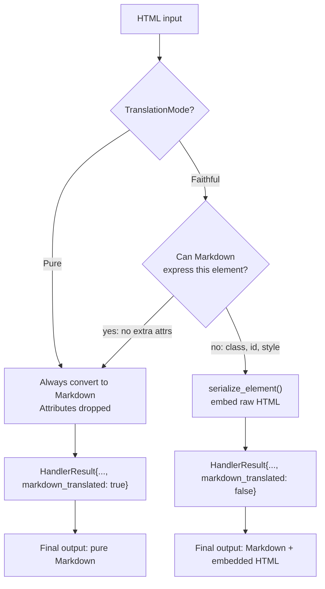
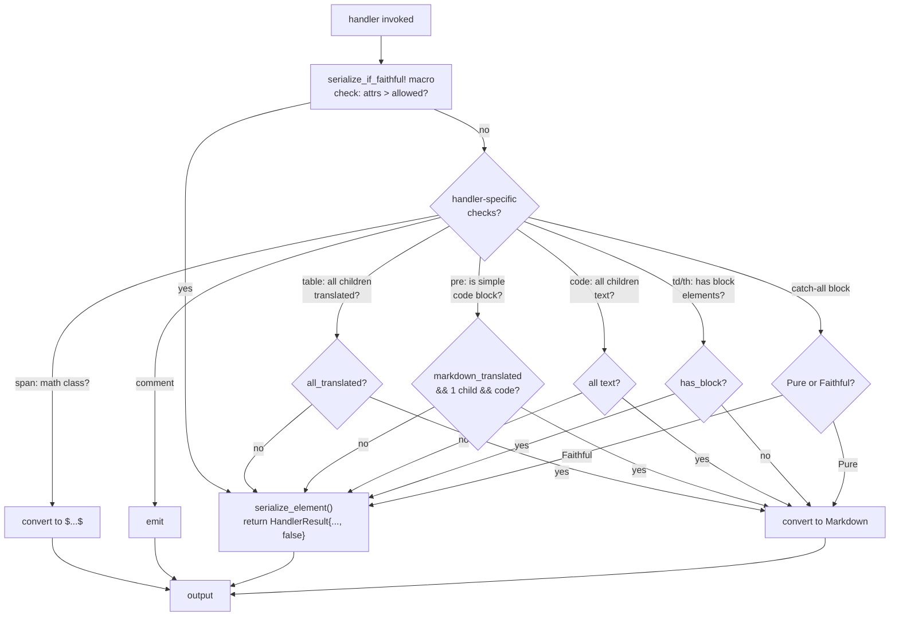

# htmd — Faithful Mode

**Source:** `htmd/src/options.rs`, `htmd/src/element_handler/element_util.rs`, and handler files.

Faithful mode is the key innovation in htmd v0.5.4. When Markdown can't express the semantics of an HTML element (attributes, classes, styles, structure), the converter embeds raw HTML instead of losing information.

## Pure vs Faithful



```rust
// options.rs:100-109
pub enum TranslationMode {
    /// Always translate to Markdown, even when that drops attributes.
    Pure,
    /// Preserve the original HTML by embedding HTML tags when Markdown
    /// can't express semantics. Round-trips back to (almost) identical HTML.
    Faithful,
}
```

## The Faithful Decision Tree

Each handler makes a local decision about whether to serialize to HTML or convert to Markdown. The decision follows a consistent pattern:



## serialize_if_faithful! Macro

```rust
// element_handler/element_util.rs:181-204
#[macro_export]
macro_rules! serialize_if_faithful {
    ($handlers: expr, $element: expr, $num_attrs_allowed: expr) => {
        if $handlers.options().translation_mode == TranslationMode::Faithful
            && $element.attrs.len() as i64 > $num_attrs_allowed
        {
            return Some(HandlerResult {
                content: serialize_element($handlers, &$element),
                markdown_translated: false,
            });
        }
    };
}
```

This macro is the first line in almost every handler. It checks: in Faithful mode, does the element have more attributes than Markdown can natively express?

| `$num_attrs_allowed` | Used by | Rationale |
|---------------------|---------|-----------|
| `0` | Most handlers | Markdown links support `href`+`title`, images support `src`+`alt`+`title` — any other attribute (like `class`, `id`, `style`) triggers serialization |
| `1` | `list_handler` (`<ol>`) | `<ol start="5">` has one attribute that Markdown can't express but is sometimes needed |
| `-1` | `span_handler`, `block_handler` | Always serialize — these elements have no Markdown equivalent |

## serialize_element — Inline vs Block Serialization

```rust
// element_handler/element_util.rs:46-177
pub(crate) fn serialize_element(handlers: &dyn Handlers, element: &Element) -> String {
    if !is_block_element(element.tag) {
        // Inline: serialize start tag + children content + end tag
        // Children are Markdown, not escaped
        ser.start_elem(name, attrs)?;
        ser.writer.write_all(handlers.walk_children(element.node).content.as_bytes())?;
        ser.end_elem(name)?;
    } else {
        // Block: full serialization with html5ever
        let sh: SerializableHandle = SerializableHandle::from(element.node.clone());
        serialize(&mut bytes, &sh, so)?;
        // Then escape consecutive newlines to avoid terminating HTML block
    }
}
```

The distinction follows the CommonMark spec:

| Type | Content treatment | CommonMark rule |
|------|-------------------|-----------------|
| Inline | Children are Markdown | [Raw HTML inlines](https://spec.commonmark.org/0.31.2/#raw-html) can contain Markdown |
| Block | Children are HTML | [HTML blocks](https://spec.commonmark.org/0.31.2/#html-blocks) contain only HTML |

**Aha:** For inline elements, `serialize_element` walks the children and writes their Markdown content unescaped between the start and end tags. This means `<span class="highlight">**bold**</span>` becomes `<span class="highlight">**bold**</span>` — the `**bold**` stays as Markdown, only the wrapper is HTML. For block elements, the entire subtree is serialized as raw HTML, and consecutive newlines are escaped.

## Newline Escaping in HTML Blocks

When a block element is serialized, consecutive newlines must be escaped because they would terminate the HTML block per the CommonMark spec:

```rust
// element_handler/element_util.rs:85-169
// \r\n → \r&#10;   (escape the second newline as HTML entity)
// \n\n → &#10;     (escape the second newline as HTML entity)
```

The state machine follows the comments in the code:

| Step | Condition | Action |
|------|-----------|--------|
| 1 | Current char is `\r` or `\n` | Output it |
| 2 | Current is `\r` and next is not `\n` | Restart (skip `\r`) |
| 3 | Next char is whitespace (not `\r`/`\n`) | Output it, repeat step 3 |
| 4 | Next is `\r` and following is not `\n` | Output `\r`, restart |
| 5 | Following is `\n` | Output `&#13;&#10;` or `&#10;` |
| 6 | Next is whitespace | Output it, repeat step 6 |

The result: `\n\nfoo` becomes `\n&#10;foo` — the first newline is literal (part of the HTML block), the second is escaped so it doesn't terminate the block.

## Handler-Level Faithful Decisions

### Table Handler

```rust
// element_handler/table.rs:132-138
if handlers.options().translation_mode == TranslationMode::Faithful && !all_children_translated {
    return Some(HandlerResult {
        content: serialize_element(handlers, &element),
        markdown_translated: false,
    });
}
```

The table handler tracks `all_children_translated` across all its child elements (`<thead>`, `<tbody>`, `<tr>`, `<td>`). If any child could not be translated to Markdown (e.g., a `<td>` with a `class` attribute), the entire table serializes as HTML.

### Pre Handler

```rust
// element_handler/pre.rs:21-26
let is_simple_code_block = {
    let children = element.node.children.borrow();
    element.markdown_translated
        && children.len() == 1
        && get_node_tag_name(&children[0]) == Some("code")
};
```

A `<pre>` is only markdown-translatable in Faithful mode if it's the classic `<pre><code>...</code></pre>` pattern. Any other structure (text nodes, nested elements) triggers HTML serialization.

### Code Handler

```rust
// element_handler/code.rs:18-30
if handlers.options().translation_mode == TranslationMode::Faithful
    && !element.node.children.borrow().iter()
        .all(|node| matches!(node.data, NodeData::Text { .. }))
```

In Faithful mode, `<code>` must contain only text children. If it contains nested elements (like `<code><span class="hl-keyword">fn</span></code>` from a syntax highlighter), the entire code block serializes as HTML.

### Table Cell with Block Content

```rust
// element_handler/td_th.rs:12-25
let has_block_elements = handlers.options().translation_mode == TranslationMode::Faithful
    && element.node.children.borrow().iter()
        .any(|child| get_node_tag_name(child).is_some_and(is_block_element));
serialize_if_faithful!(handlers, element, if has_block_elements { -1 } else { 0 });
```

A `<td>` containing block elements (like `<p>`, `<div>`) can't be expressed in pipe table syntax. Passing `-1` forces serialization regardless of attributes.

### Comment Preservation

```rust
// dom_walker.rs:102-108
NodeData::Comment { ref contents } => {
    if handlers.options.translation_mode == TranslationMode::Faithful {
        output.push_str("<!--");
        output.push_str(contents);
        output.push_str("-->");
    }
}
```

Comments are silently dropped in Pure mode, preserved as-is in Faithful mode.

### Span Handler — Math

```rust
// element_handler/span.rs:10-36
// KaTeX math spans → $...$ or $$...$$
if *attr.value == *"math math-inline" {
    return Some(concat_strings!("$", contents.borrow().to_string(), "$").into());
}
if *attr.value == *"math math-display" {
    return Some(concat_strings!("$$", contents.borrow().to_string(), "$$").into());
}
// All other <span>: always serialize in Faithful mode
serialize_if_faithful!(handlers, element, -1);
```

### HTML Handler — Root Detection

```rust
// element_handler/html.rs:14-22
let markdown_translatable = if handlers.options().translation_mode == TranslationMode::Faithful
    && let Some(parent) = get_parent_node(element.node)
    && let NodeData::Document = parent.data
{
    true  // <html> at document root is still walkable
} else {
    handlers.options().translation_mode == TranslationMode::Pure
};
```

In Faithful mode, `<html>` is only walkable when it's the direct child of the DOM `Document`. A `<html>` element nested inside another element serializes as raw HTML.

## Block Handler — Catch-All

```rust
// element_handler/mod.rs:371-382
fn block_handler(handlers: &dyn Handlers, element: Element) -> Option<HandlerResult> {
    if handlers.options().translation_mode == TranslationMode::Pure {
        let content = handlers.walk_children(element.node).content;
        Some(concat_strings!("\n\n", content.trim_matches('\n'), "\n\n").into())
    } else {
        Some(HandlerResult {
            content: serialize_element(handlers, &element),
            markdown_translated: false,
        })
    }
}
```

Registered for all block elements that don't have dedicated handlers (`<div>`, `<article>`, `<section>`, `<form>`, etc.). In Pure mode, walks children. In Faithful mode, always serializes.

## Markdown Translated Flag

The `markdown_translated` field on `HandlerResult` tracks whether content was produced as Markdown or embedded HTML. This flag is used by parent handlers to make their own faithful decisions:

```rust
// element_handler/table.rs:29
let mut all_children_translated = true;
// ... for each child:
all_children_translated &= translated;

// element_handler/list.rs:24
if !element.markdown_translated || !element.node.children.borrow().iter()
    .all(|node| tag_name == Some("li") || tag_name.is_none())
{
    return Some(HandlerResult {
        content: serialize_element(handlers, &element),
        markdown_translated: false,
    });
}
```

**Aha:** The `markdown_translated` flag creates a bottom-up propagation mechanism. If a deeply nested `<span class="highlight">` inside a `<td>` inside a `<tr>` inside a `<tbody>` inside a `<table>` cannot be translated, the flag bubbles up and eventually causes the entire `<table>` to serialize as HTML.

## Usage Example

```rust
use htmd::{HtmlToMarkdown, options::{Options, TranslationMode}};

// Pure mode (default): clean Markdown, attributes dropped
let md = HtmlToMarkdown::new().convert(
    r#"<p class="intro">Hello</p>"#
).unwrap();
// Result: "Hello"

// Faithful mode: preserve attributes as embedded HTML
let converter = HtmlToMarkdown::builder()
    .options(Options {
        translation_mode: TranslationMode::Faithful,
        ..Default::default()
    })
    .build();
let md = converter.convert(
    r#"<p class="intro">Hello</p>"#
).unwrap();
// Result: "<p class=\"intro\">Hello</p>"
```

## What to Read Next

- [Architecture](01-architecture.md) for the Handlers trait and delegation
- [Element Handlers](03-element-handlers.md) for all handler implementations
- [DOM Walker](02-dom-walker.md) for the traversal algorithm
