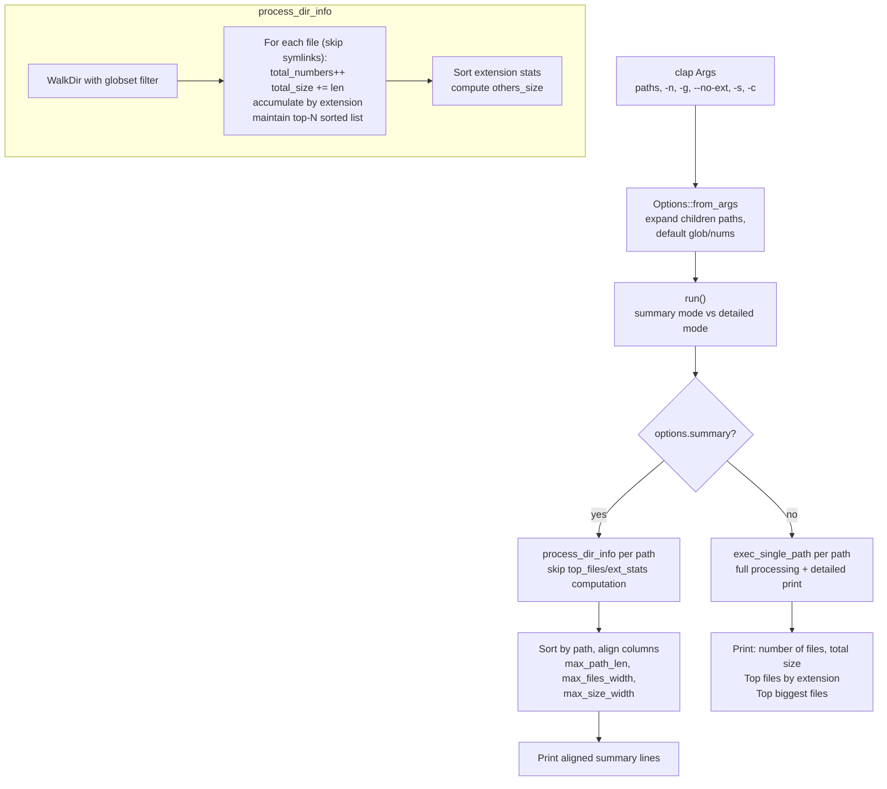

# rust-dinf — Overview

**Source:** `src/` — 6 Rust files. CLI binary for directory information analysis.

`dinf` is a command-line tool that analyzes directories and reports: total file count, total size, top N biggest files, and top N biggest file extensions. It supports glob filtering, summary mode for comparing multiple directories, and children mode for analyzing direct subdirectories.

## CLI Usage

```
dinf [OPTIONS] [PATHS...]
```

### Flags and Options

| Flag | Short | Description |
|------|-------|-------------|
| `--no-ext` | | Don't group by file extension |
| `--children` | `-c` | Process direct children of the specified path(s) |
| `--summary` | `-s` | Show only summary (number of files and total size) |
| `--nums` | `-n` | Number of biggest files to display (default: 5) |
| `--glob` | `-g` | Globs, comma-separated, for filtering files |

### Examples

```bash
# Analyze current directory (default)
dinf

# Analyze specific directories
dinf ./src ./target

# Show top 10 biggest files
dinf -n 10

# Filter to only Rust files
dinf -g '**/*.rs'

# Summary mode — compare multiple directories
dinf -s ./src ./target ./docs

# Analyze direct children of ./src (each subdirectory separately)
dinf -c ./src

# Combine: children + summary + custom nums
dinf -c -s -n 10 ./src
```

## Architecture



## Output Formats

### Detailed Mode (default)

```
==== Directory info on './src'

  Number of files: 1,234
     Total size: 12.3 MB

== Top 5 biggest size by extension
   5.1 MB - rs
 892.3 KB - md
 456.1 KB - json
  12.3 KB - toml
   1.2 KB - txt
   3.4 KB - (others)

== Top 5 biggest files
  2.1 MB - src/main.rs
  1.5 MB - src/lib.rs
  892 KB - README.md
  456 KB - Cargo.toml
  123 KB - src/utils.rs

=====
```

### Summary Mode (`-s`)

```
./src    -    1,234 files | total size:  12.3 MB
./target -  456,789 files | total size: 234.5 MB
./docs   -       42 files | total size:   0.5 MB
```

Columns are auto-aligned based on the longest path, largest file count, and widest size string across all directories being compared.

## Size Formatting

dinf uses **decimal (1000-based)** units, not binary (1024-based):

| Unit | Bytes |
|------|-------|
| KB | 1,000 |
| MB | 1,000,000 |
| GB | 1,000,000,000 |
| TB | 1,000,000,000,000 |
| PB | 1,000,000,000,000,000 |

### Unit Transition Logic

```rust
// support.rs:25-70
fn format_size(bytes: u64, left_align: bool) -> String {
    // Threshold: if a value is >= 999.95 in the current unit,
    // scale to the next larger unit (rounding would produce 1000.0+)
    const UNIT_THRESHOLD_EXCLUSIVE: f64 = 999.95;

    // For bytes: always show as KB with 3 decimals
    // For KB+: use 1 decimal, transition to next unit at threshold
}
```

The transition threshold of `999.95` ensures values don't display as `1000.0 KB` — they round to `1.0 MB` instead. Below the threshold, 1 decimal place; for values under 1 KB, 3 decimal places for precision.

```rust
// support.rs:86-130 — Test fixtures
(0,          "  0.000 KB")   // Zero → 0.000 KB
(999,        "  0.999 KB")   // < 1 KB → 3 decimals
(1_000,      "  1.0 KB")     // Exactly 1 KB → 1 decimal
(999_940,    "999.9 KB")     // Near threshold
(999_950,    "  1.0 MB")     // Crosses → transitions to MB
(1_000_000,  "  1.0 MB")     // Exactly 1 MB
(u64::MAX,   "18446.7 PB")   // Max u64
```

Two display modes:
- **`left_align: true`** — no padding, used in summary mode columns
- **`left_align: false`** — right-aligned with fixed width (`{:>5.1}` or `{:>7.3}`), used in detailed file listings

## File Number Formatting

```rust
// support.rs:1-5
pub fn format_num(num: impl ToFormattedString) -> String {
    num.to_formatted_string(&num_format::Locale::en)
}
```

Uses `num_format` crate for locale-aware comma-separated numbers: `1234567` → `"1,234,567"`.

## Directory Processing

```rust
// dir_info.rs:41-138
pub fn process_dir_info(path_str: &str, options: &Options) -> Result<DirInfo>
```

Single-pass `WalkDir` iteration that simultaneously:
1. Counts files and accumulates total size
2. Accumulates size by file extension (in a `HashMap<String, u64>`)
3. Maintains a sorted top-N list of biggest files (sorted insertion + pop if over capacity)

**Aha:** The top-N algorithm sorts after every insertion and pops the smallest if the list exceeds capacity. For small N (default 5), this is efficient enough. For large N, a min-heap would be better — but since the default is 5 and typical usage rarely exceeds 20, the simplicity wins.

When `options.summary` is true, steps 2 and 3 are skipped entirely — only total count and size are computed.

### Glob Filtering

```rust
// dir_info.rs:51-75
let glob_set = options.glob.as_ref().map(|vs| {
    let mut builder = GlobSetBuilder::new();
    for v in vs { builder.add(Glob::new(v)?); }
    builder.build()
}).transpose()?;

let entries = WalkDir::new(path_str).into_iter().filter_map(|e| e.ok())
    .filter(|e| {
        if let Some(gs) = &glob_set { gs.is_match(e.path()) } else { true }
    });
```

Multiple glob patterns are combined into a single `GlobSet`. A file passes if it matches **any** pattern in the set.

### Children Mode

```rust
// exec.rs:38-57
let final_paths = if args.children {
    let mut children_paths = Vec::new();
    for path_str in &initial_paths {
        let read_dir = fs::read_dir(path_str)?;
        for entry_result in read_dir {
            let entry = entry_result?;
            if entry.path().is_dir() {
                children_paths.push(path_string);
            }
        }
    }
    children_paths
} else {
    initial_paths
};
```

Expands each input path into its direct child directories. So `dinf -c ./src` becomes equivalent to `dinf ./src/common ./src/lib ./src/bin ...` — each subdirectory analyzed separately.

## Module Structure

```
src/
├── main.rs          # CLI entry point: Args::parse → Options → run()
├── argc.rs          # clap argument definitions
├── exec.rs          # Options::from_args, run(), exec_single_path()
├── dir_info.rs      # process_dir_info(), DirInfo, DirEntryInfo, ExtStats
├── support.rs       # format_num(), format_size()
└── error.rs         # Error enum (Io, Clap, Glob, Walkdir, PathNotUtf8, InvalidNumberOfFiles)
```

## Dependencies

| Dependency | Purpose |
|------------|---------|
| `clap` | CLI argument parsing with derive macros |
| `derive_more` | `From`, `Display` derive for Error enum |
| `globset` | Glob pattern matching for file filtering |
| `walkdir` | Recursive directory traversal |
| `simple_fs` | `SPath` for UTF-8 path handling |
| `num_format` | Locale-aware number formatting |

## Error Model

```rust
// error.rs:5-21
pub enum Error {
    #[display("-n must be a number but was {}", _0)]
    InvalidNumberOfFiles(String),
    PathNotUtf8(String),
    Io(std::io::Error),
    Clap(clap::Error),
    Glob(globset::Error),
    Walkdir(walkdir::Error),
}
```

All external error types are auto-converted via `#[from]`. The `InvalidNumberOfFiles` error is currently unused (nums parsing is handled by clap's built-in `usize` parsing).
