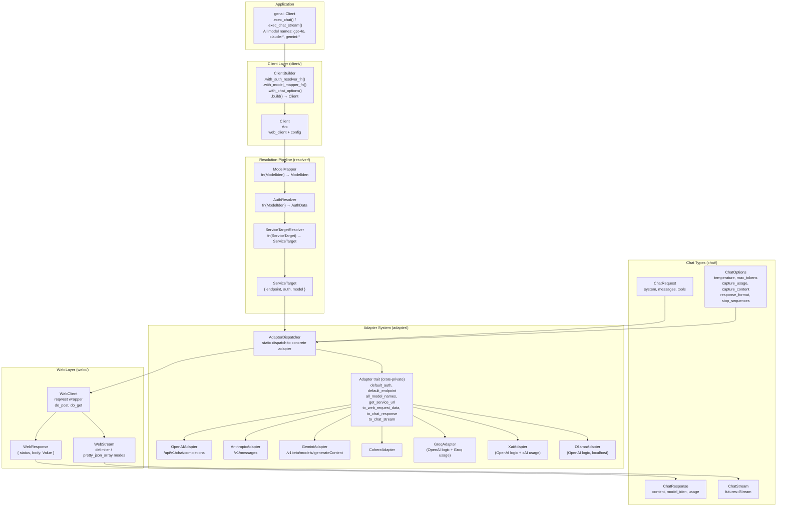
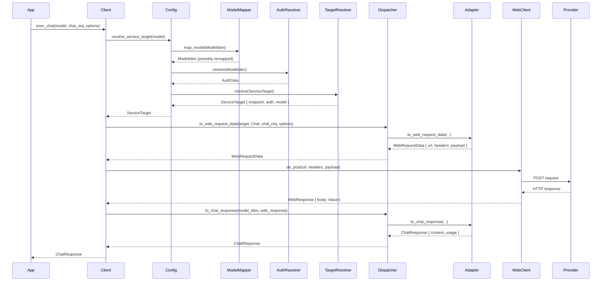

# rust-genai — Overview

**Source:** `src/` — ~50 Rust files across 8 modules. Multi-provider AI client library implementing unified chat interface across 7 adapters (OpenAI, Anthropic, Gemini, Cohere, Groq, xAI, Ollama).

`rust-genai` (published as `genai` on crates.io) is a typed, multi-provider AI client library that provides a unified `Client::exec_chat` / `Client::exec_chat_stream` API across different AI providers. It builds on an **Adapter pattern** with static dispatch, a **resolution pipeline** (auth → model mapper → service target), and a **two-tier streaming architecture** (provider SSE → InterStreamEvent → ChatStreamEvent).

## Architecture



## Public API Surface

```rust
// lib.rs — public re-exports
pub use client::*;          // Client, ClientBuilder, ClientConfig
pub use common::*;          // ModelIden, ModelName
pub use error::{Error, Result};

pub mod adapter;            // AdapterKind (public), rest is crate-private
pub mod chat;               // ChatRequest, ChatResponse, ChatStream, ChatMessage, etc.
pub mod resolver;           // AuthResolver, ModelMapper, ServiceTargetResolver
pub mod webc;               // webc::Error (public), rest is crate-private
```

**Aha:** The `Adapter` trait is **crate-private** — only `AdapterKind` is publicly exported. This means users cannot create custom adapters without modifying the library. The design enforces that all adapters are first-class, maintained within the library.

## Adapter Kind Auto-Detection

```rust
// adapter/adapter_kind.rs:79-108
pub fn from_model(model: &str) -> Result<Self> {
    if model.starts_with("gpt") || model.starts_with("chatgpt") || model.starts_with("o1-") {
        Ok(Self::OpenAI)
    } else if model.starts_with("claude") {
        Ok(Self::Anthropic)
    } else if model.starts_with("command") {
        Ok(Self::Cohere)
    } else if model.starts_with("gemini") {
        Ok(Self::Gemini)
    } else if model.starts_with("grok") {
        Ok(Self::Xai)
    } else if GROQ_MODELS.contains(&model) {
        Ok(Self::Groq)
    } else {
        Ok(Self::Ollama)  // fallback for anything else
    }
}
```

**Aha:** The fallback to `Ollama` for unknown model names is intentional — it means any arbitrary model string like `"llama3"` will be routed to the Ollama adapter (localhost only). This makes the library forgiving for local development.

## Quick Usage Example

```rust
use genai::{Client, chat::{ChatRequest, ChatMessage}};

// Zero-config: reads OPENAI_API_KEY from env
let client = Client::default();

let chat_req = ChatRequest::new(vec![
    ChatMessage::system("Answer in one sentence"),
    ChatMessage::user("Why is the sky red?"),
]);

// Non-streaming
let chat_res = client.exec_chat("gpt-4o-mini", chat_req.clone(), None).await?;
println!("{}", chat_res.content_text_as_str().unwrap());

// Streaming
let chat_res = client.exec_chat_stream("gpt-4o-mini", chat_req, None).await?;
while let Some(Ok(event)) = chat_res.stream.next().await {
    // process ChatStreamEvent
}
```

## Adapter-to-Model Mapping

| Model Prefix | Adapter | Default Env Var | Default Endpoint |
|-------------|---------|----------------|-----------------|
| `gpt-*`, `chatgpt-*`, `o1-*` | OpenAI | `OPENAI_API_KEY` | `https://api.openai.com/v1/` |
| `claude-*` | Anthropic | `ANTHROPIC_API_KEY` | `https://api.anthropic.com/v1/` |
| `command-*` | Cohere | `COHERE_API_KEY` | (Cohere endpoint) |
| `gemini-*` | Gemini | `GEMINI_API_KEY` | `https://generativelanguage.googleapis.com/v1beta/` |
| `grok-*` | xAI | `XAI_API_KEY` | (xAI endpoint) |
| Groq hardcoded models | Groq | `GROQ_API_KEY` | (Groq endpoint) |
| Anything else | Ollama | (none, localhost) | `http://localhost:11434/v1/` |

## Request → Response Flow



## Key Design Principles

1. **Stateless Adapter trait** — all methods take kind/auth/endpoint as arguments rather than storing state, simplifying adapter implementations
2. **Static dispatch** — `AdapterDispatcher` uses explicit match arms to route to concrete adapter structs, avoiding trait object overhead
3. **Arc-based Client** — `Client` wraps `Arc<ClientInner>` for cheap cloning and thread-safe sharing
4. **Cascading options** — `ChatOptionsSet` resolves per-call options first, then client defaults
5. **Two-tier streaming** — adapters produce `InterStreamEvent` (internal), which `ChatStream` translates to public `ChatStreamEvent`
6. **Builder pattern** — `ClientBuilder` provides fluent API for all configuration, producing an immutable `Client`

## Dependencies

| Dependency | Purpose |
|------------|---------|
| `reqwest` | HTTP client for all provider communication |
| `reqwest-eventsource` | SSE event parsing (OpenAI, Anthropic) |
| `serde` / `serde_json` | JSON serialization/deserialization |
| `value_ext` | JSON value manipulation (`x_take`, `x_insert`, `x_walk`) |
| `derive_more` | `Display`, `From` error conversions |
| `futures` | Stream trait and utilities |
| `tokio` | Async runtime |
