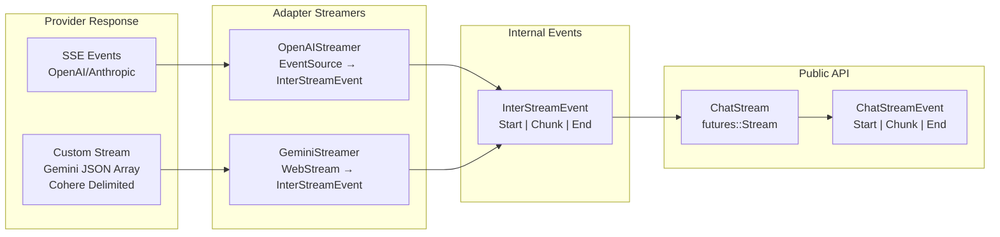
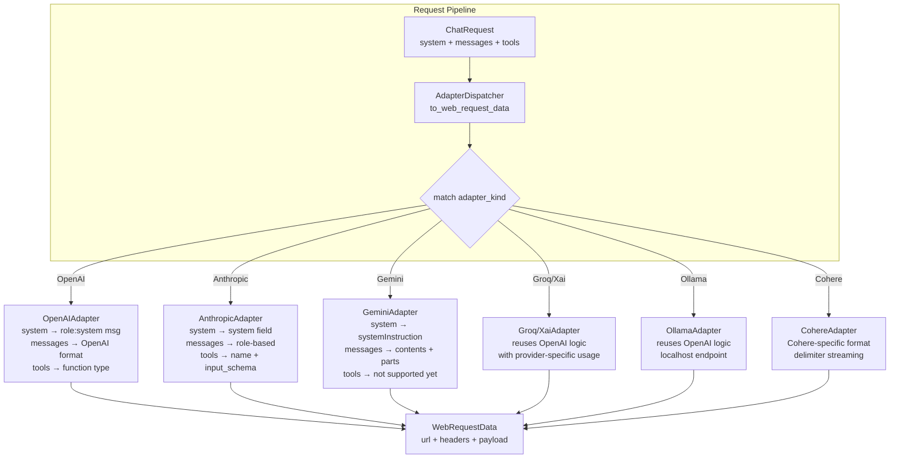
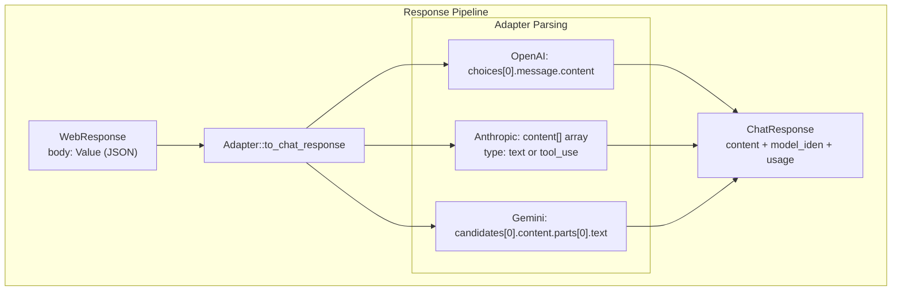

# rust-genai — Adapter System

**Source:** `adapter/`, `adapter/adapters/` — ~25 files. `Adapter` trait (crate-private), `AdapterDispatcher` for static dispatch, 7 adapter implementations, `InterStreamEvent` for internal streaming.

## Adapter Trait — Stateless Design

```rust
// adapter/adapter_types.rs:10-42
pub trait Adapter {
    fn default_auth() -> AuthData;
    fn default_endpoint() -> Endpoint;
    async fn all_model_names(kind: AdapterKind) -> Result<Vec<String>>;
    fn get_service_url(model_iden: &ModelIden, service_type: ServiceType, endpoint: Endpoint) -> String;
    fn to_web_request_data(
        service_target: ServiceTarget,
        service_type: ServiceType,
        chat_req: ChatRequest,
        options_set: ChatOptionsSet<'_, '_>,
    ) -> Result<WebRequestData>;
    fn to_chat_response(model_iden: ModelIden, web_response: WebResponse) -> Result<ChatResponse>;
    fn to_chat_stream(
        model_iden: ModelIden,
        reqwest_builder: RequestBuilder,
        options_set: ChatOptionsSet<'_, '_>,
    ) -> Result<ChatStreamResponse>;
}
```

**Aha:** All methods are **static** (no `&self`). The trait is crate-private, so adapter implementations are first-class citizens maintained within the library. Each adapter is a zero-sized struct (`pub struct OpenAIAdapter;`) — no state is stored, everything flows through arguments.

## AdapterKind — Provider Enum

```rust
// adapter/adapter_kind.rs:13-31
pub enum AdapterKind {
    OpenAI,     // gpt-4o, gpt-4o-mini, o1-preview, o1-mini
    Ollama,     // any model name not matched (localhost fallback)
    Anthropic,  // claude-3-5-sonnet, claude-3-haiku, etc.
    Cohere,     // command-light, command-r, etc.
    Gemini,     // gemini-1.5-pro, gemini-1.5-flash, etc.
    Groq,       // groq-specific models (uses OpenAI logic internally)
    Xai,        // grok-beta (uses OpenAI logic internally)
}
```

### From-Model Auto-Detection

```rust
// adapter/adapter_kind.rs:90-108
pub fn from_model(model: &str) -> Result<Self> {
    if model.starts_with("gpt") || model.starts_with("chatgpt") || model.starts_with("o1-") {
        Ok(Self::OpenAI)
    } else if model.starts_with("claude") {
        Ok(Self::Anthropic)
    } else if model.starts_with("command") {
        Ok(Self::Cohere)
    } else if model.starts_with("gemini") {
        Ok(Self::Gemini)
    } else if model.starts_with("grok") {
        Ok(Self::Xai)
    } else if GROQ_MODELS.contains(&model) {
        return Ok(Self::Groq);
    } else {
        Ok(Self::Ollama)  // fallback for anything else
    }
}
```

**Aha:** Groq uses a hardcoded `MODELS` list rather than prefix matching, because Groq hosts models from multiple providers (including `gemma`, `llama`, etc.) that would otherwise match other adapters.

## AdapterDispatcher — Static Dispatch

```rust
// adapter/dispatcher.rs:22-120
pub struct AdapterDispatcher;

impl AdapterDispatcher {
    pub fn default_endpoint(kind: AdapterKind) -> Endpoint {
        match kind {
            AdapterKind::OpenAI => OpenAIAdapter::default_endpoint(),
            AdapterKind::Anthropic => AnthropicAdapter::default_endpoint(),
            // ... 5 more arms
        }
    }

    pub fn to_web_request_data(
        target: ServiceTarget,
        service_type: ServiceType,
        chat_req: ChatRequest,
        options_set: ChatOptionsSet<'_, '_>,
    ) -> Result<WebRequestData> {
        let adapter_kind = &target.model.adapter_kind;
        match adapter_kind {
            AdapterKind::OpenAI => OpenAIAdapter::to_web_request_data(target, service_type, chat_req, options_set),
            AdapterKind::Anthropic => AnthropicAdapter::to_web_request_data(target, service_type, chat_req, options_set),
            // ... 5 more arms
        }
    }

    // ... default_auth, all_model_names, get_service_url, to_chat_response, to_chat_stream
}
```

**Aha:** The dispatcher uses explicit match arms rather than a trait object. This is a deliberate performance choice — static dispatch allows the compiler to inline adapter methods. Each method dispatches on `adapter_kind` independently.

## WebRequestData — Unified Request Format

```rust
// adapter/adapter_types.rs:57-62
pub struct WebRequestData {
    pub url: String,
    pub headers: Vec<(String, String)>,
    pub payload: Value,
}
```

Every adapter translates its provider-specific request into this common format. The `Client` then uses `WebClient::do_post` to send it.

## ServiceType — Chat vs Streaming

```rust
// adapter/adapter_types.rs:46-50
pub enum ServiceType {
    Chat,       // Non-streaming: single JSON response
    ChatStream, // Streaming: SSE or custom stream format
}
```

Adapters use `ServiceType` to determine the correct endpoint URL and whether to set `"stream": true` in the payload.

## Adapter Implementations

### OpenAI Adapter

```rust
// adapter/adapters/openai/adapter_impl.rs:18-107
pub struct OpenAIAdapter;

impl Adapter for OpenAIAdapter {
    fn default_endpoint() -> Endpoint {
        Endpoint::from_static("https://api.openai.com/v1/")
    }

    fn default_auth() -> AuthData {
        AuthData::from_env("OPENAI_API_KEY")
    }

    fn get_service_url(_model: &ModelIden, service_type: ServiceType, endpoint: Endpoint) -> String {
        let base_url = endpoint.base_url();
        format!("{base_url}chat/completions")  // same URL for both Chat and ChatStream
    }

    fn to_chat_response(model_iden: ModelIden, web_response: WebResponse) -> Result<ChatResponse> {
        // Uses x_take to extract usage and content from OpenAI's JSON structure
        // Supports both text content and tool_calls
    }
}
```

Key details:
- URL: `/v1/chat/completions`
- Auth: `Authorization: Bearer {api_key}` header
- Response: `choices[0].message.content` for text, `choices[0].message.tool_calls` for tools
- Usage: `usage.prompt_tokens`, `usage.completion_tokens`, `usage.total_tokens`
- **Shared by**: Groq and Xai adapters (with usage capture differences)

### Anthropic Adapter

```rust
// adapter/adapters/anthropic/adapter_impl.rs:17-195
pub struct AnthropicAdapter;

const MAX_TOKENS_8K: u32 = 8192;  // for claude-3-5-* models
const MAX_TOKENS_4K: u32 = 4096;  // for older models
const ANTRHOPIC_VERSION: &str = "2023-06-01";

impl Adapter for AnthropicAdapter {
    fn default_endpoint() -> Endpoint {
        Endpoint::from_static("https://api.anthropic.com/v1/")
    }

    fn to_web_request_data(...) -> Result<WebRequestData> {
        // Headers: x-api-key + anthropic-version
        // max_tokens is REQUIRED for Anthropic (defaults to 8k or 4k based on model name)
        // System is a separate top-level field, not a role:"system" message
    }

    fn to_chat_response(...) -> Result<ChatResponse> {
        // Content is an array of { type: "text" | "tool_use", ... }
        // Text items are concatenated; tool_use takes precedence
    }
}
```

**Aha:** Anthropic doesn't use `role: "system"` — instead, system content goes in a separate top-level `system` field. The adapter collects `ChatRole::System` messages and joins them with newlines into this single field.

### Gemini Adapter

```rust
// adapter/adapters/gemini/adapter_impl.rs:16-167
pub struct GeminiAdapter;

impl Adapter for GeminiAdapter {
    fn default_endpoint() -> Endpoint {
        Endpoint::from_static("https://generativelanguage.googleapis.com/v1beta/")
    }

    fn get_service_url(model: &ModelIden, service_type: ServiceType, endpoint: Endpoint) -> String {
        let base_url = endpoint.base_url();
        let model_name = model.model_name.clone();
        match service_type {
            ServiceType::Chat => format!("{base_url}models/{model_name}:generateContent"),
            ServiceType::ChatStream => format!("{base_url}models/{model_name}:streamGenerateContent"),
        }
    }

    fn to_web_request_data(...) -> Result<WebRequestData> {
        // API key goes in the URL query param (?key=...), NOT in headers!
        // All options go under generationConfig (temperature, maxOutputTokens, etc.)
        // Empty headers vector — auth is entirely in the URL
    }
}
```

**Aha:** Gemini places the API key in the URL query string (`?key=...`) rather than in headers, which the code comments explicitly call out as "an antipattern from a security point of view." The adapter uses `WebStream::new_with_pretty_json_array` for streaming because Gemini doesn't use standard SSE — it returns a pretty-printed JSON array.

### Groq & Xai Adapters

These adapters reuse `OpenAIAdapter::util_to_web_request_data` for request building but have custom streaming logic for their provider-specific usage capture patterns:

- **Groq**: Usage captured in `/x_groq/usage` during the finish-reason message
- **Xai**: Usage captured in `usage` field during streaming, similar to OpenAI

### Ollama Adapter

```rust
// Uses OpenAI adapter logic internally
// Default endpoint: http://localhost:11434/v1/
// No API key required (env_name is None)
// Falls back to Ollama for any unrecognized model name
```

### Cohere Adapter

Uses a **custom delimiter-based stream** (`WebStream::new_with_delimiter("\n")`) instead of SSE, because Cohere doesn't use `text/event-stream` format.

## Streaming Architecture

### Two-Tier Stream Pipeline



### InterStreamEvent — Internal Events

```rust
// adapter/inter_stream.rs:20-25
pub enum InterStreamEvent {
    Start,                                    // Stream opened
    Chunk(String),                            // Text content chunk
    End(InterStreamEnd),                      // Stream closed
}

pub struct InterStreamEnd {
    pub captured_usage: Option<MetaUsage>,    // When capture_usage = true
    pub captured_content: Option<String>,     // When capture_content = true
}
```

**Aha:** `InterStreamEvent` is internal and allows flexibility — if a provider emits events that don't map cleanly to public events, the adapter can capture them internally without polluting the public API.

### ChatStream — Public Stream Wrapper

```rust
// chat/chat_stream.rs:12-52
pub struct ChatStream {
    inter_stream: InterStreamType,  // Pin<Box<dyn Stream<Item = Result<InterStreamEvent>>>>
}

impl Stream for ChatStream {
    type Item = Result<ChatStreamEvent>;

    fn poll_next(self: Pin<&mut Self>, cx: &mut Context<'_>) -> Poll<Option<Self::Item>> {
        // Maps: InterStreamEvent::Start → ChatStreamEvent::Start
        //       InterStreamEvent::Chunk(c) → ChatStreamEvent::Chunk(StreamChunk{content: c})
        //       InterStreamEvent::End(e) → ChatStreamEvent::End(StreamEnd{...})
    }
}
```

### WebStream — Custom Stream for Non-SSE Providers

```rust
// webc/web_stream.rs:17-57
pub struct WebStream {
    stream_mode: StreamMode,
    // ... request builder, response future, bytes stream, partial message handling
}

pub enum StreamMode {
    Delimiter(&'static str),     // Cohere: single \n delimiter
    PrettyJsonArray,             // Gemini: standard JSON array, pretty formatted
}
```

**Aha:** `WebStream` handles partial messages across byte chunks — it maintains `partial_message` (incomplete text carried over) and `remaining_messages` (multiple messages extracted from one buffer). This is essential because HTTP byte streams can split messages at arbitrary boundaries.

### Streamer Options

```rust
// adapter/adapters/support.rs:18-33
pub struct StreamerOptions {
    pub capture_content: bool,
    pub capture_usage: bool,
    pub model_iden: ModelIden,
}

impl StreamerOptions {
    pub fn new(model_iden: ModelIden, options_set: ChatOptionsSet<'_, '_>) -> Self {
        Self {
            capture_content: options_set.capture_content().unwrap_or(false),
            capture_usage: options_set.capture_usage().unwrap_or(false),
            model_iden,
        }
    }
}
```

## Adapter Request Transformation Flow





## Adapter Request Transformation Examples

### OpenAI Message Transformation

```rust
// ChatRequest → OpenAI JSON
ChatRequest {
    system: Some("Answer briefly"),
    messages: [
        ChatMessage::user("Why is the sky red?"),
    ],
}
// →
{
    "model": "gpt-4o-mini",
    "messages": [
        {"role": "system", "content": "Answer briefly"},
        {"role": "user", "content": "Why is the sky red?"}
    ],
    "stream": false
}
```

### Anthropic Message Transformation

```rust
// ChatRequest → Anthropic JSON
{
    "model": "claude-3-haiku-20240307",
    "system": "Answer briefly",    // Separate field, not a message role!
    "messages": [
        {"role": "user", "content": "Why is the sky red?"}
    ],
    "max_tokens": 8192,             // Required!
    "stream": false
}
```

### Gemini Message Transformation

```rust
// ChatRequest → Gemini JSON
{
    "contents": [
        {"role": "user", "parts": [{"text": "Why is the sky red?"}]}
    ],
    "systemInstruction": {          // Separate field
        "parts": [{"text": "Answer briefly"}]
    },
    "generationConfig": {
        "temperature": 0.7,
        "maxOutputTokens": 1024
    }
}
```

## Default Endpoints Summary

| Adapter | Base URL | Chat Endpoint | Auth Header |
|---------|----------|---------------|-------------|
| OpenAI | `https://api.openai.com/v1/` | `/chat/completions` | `Authorization: Bearer {key}` |
| Anthropic | `https://api.anthropic.com/v1/` | `/messages` | `x-api-key: {key}` + `anthropic-version` |
| Gemini | `https://generativelanguage.googleapis.com/v1beta/` | `models/{name}:generateContent` | URL param `?key={key}` |
| Ollama | `http://localhost:11434/v1/` | `/chat/completions` | (none) |
| Groq | (Groq endpoint) | `/chat/completions` | `Authorization: Bearer {key}` |
| Xai | (xAI endpoint) | `/chat/completions` | `Authorization: Bearer {key}` |
| Cohere | (Cohere endpoint) | (custom) | (custom) |
