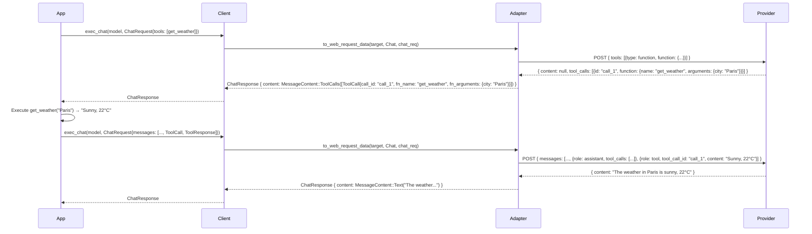
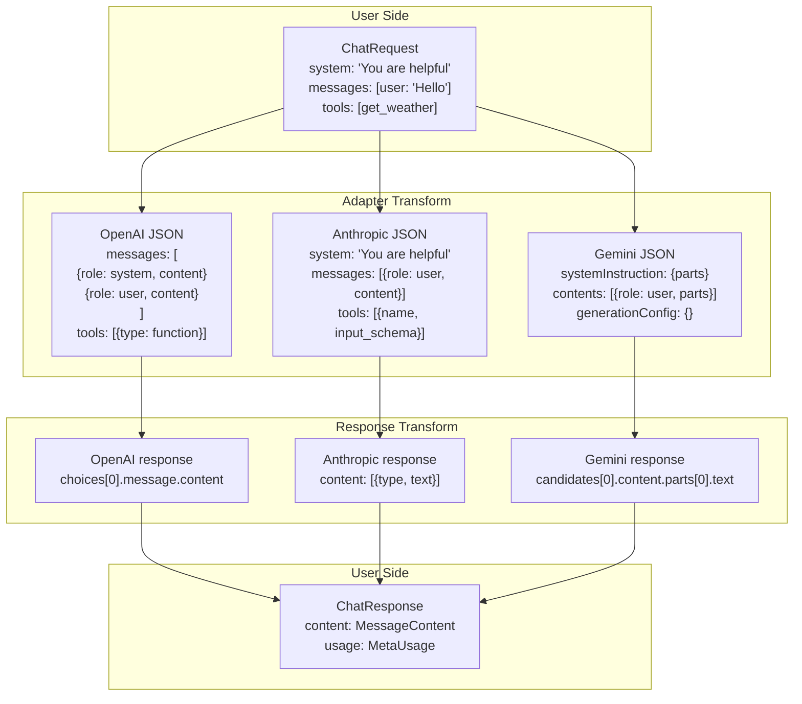

# rust-genai — Chat System

**Source:** `chat/` — 10 files. ChatRequest, ChatResponse, ChatStream, ChatMessage, MessageContent, ChatOptions, Tool types, and a printer utility.

## ChatRequest — Building Conversations

```rust
// chat/chat_request.rs:9-18
pub struct ChatRequest {
    pub system: Option<String>,           // Top-level system prompt
    pub messages: Vec<ChatMessage>,       // Conversation history
    pub tools: Option<Vec<Tool>>,         // Available tools for the LLM
}
```

### Constructors

```rust
// From scratch
ChatRequest::new(vec![
    ChatMessage::system("You are a helpful assistant"),
    ChatMessage::user("Hello!"),
]);

// Quick single-message
ChatRequest::from_user("Why is the sky red?");

// With system prompt
ChatRequest::from_system("Answer in one sentence")
    .with_tools(vec![weather_tool]);
```

### Chainable Setters

```rust
ChatRequest::new(messages)
    .with_system("You are helpful")
    .append_message(ChatMessage::user("Hi"))
    .append_messages(more_messages)
    .with_tools(vec![tool1, tool2])
    .append_tool(another_tool)
```

### System Message Handling

```rust
// chat/chat_request.rs:93-130
pub fn iter_systems(&self) -> impl Iterator<Item = &str> {
    self.system.iter().map(|s| s.as_str())
        .chain(self.messages.iter().filter_map(|message| match message.role {
            ChatRole::System => match message.content {
                MessageContent::Text(ref content) => Some(content.as_str()),
                _ => None,
            },
            _ => None,
        }))
}

pub fn combine_systems(&self) -> Option<String> {
    // Joins all system content with "\n\n" separators,
    // handling trailing newlines gracefully
}
```

**Aha:** `ChatRequest` supports system content in two places: the top-level `system` field AND messages with `ChatRole::System`. The `iter_systems` and `combine_systems` methods unify both sources. Individual adapters then handle this differently — OpenAI converts both to `role: "system"` messages, Anthropic concatenates into its separate `system` field.

## ChatMessage — Typed Messages

```rust
// chat/chat_message.rs:5-12
pub struct ChatMessage {
    pub role: ChatRole,
    pub content: MessageContent,
}

// chat/chat_message.rs:42-49
pub enum ChatRole {
    System,
    User,
    Assistant,
    Tool,
}
```

### Constructors

```rust
ChatMessage::system("You are helpful")      // role: System
ChatMessage::user("Hello")                  // role: User
ChatMessage::assistant("Hi there")          // role: Assistant
```

### From Tool Calls and Responses

```rust
// From Vec<ToolCall> → ChatMessage with role: Assistant
let tool_calls: Vec<ToolCall> = ...;
let msg: ChatMessage = tool_calls.into();   // role becomes Assistant

// From ToolResponse → ChatMessage with role: Tool
let tool_resp: ToolResponse = ...;
let msg: ChatMessage = tool_resp.into();    // role becomes Tool
```

## MessageContent — Content Abstraction

```rust
// chat/message_content.rs:7-19
pub enum MessageContent {
    Text(String),                           // Simple text content
    ToolCalls(Vec<ToolCall>),               // Assistant tool calls
    ToolResponses(Vec<ToolResponse>),       // Tool execution results
}
```

**Aha:** Despite only having three variants, the code contains comments indicating a planned `Parts(Vec<ContentPart>)` variant for future multipart support (images, binary data). The current design is intentionally minimal.

### Convenience Conversions

```rust
// From various string types
let mc: MessageContent = "Hello".into();
let mc: MessageContent = String::from("Hello").into();

// From tool data
let mc: MessageContent = ToolResponse::new("call_123", "result").into();
let mc: MessageContent = MessageContent::from_tool_calls(vec![tool_call]);
```

### Getters

```rust
mc.text_as_str()          // Option<&str> — only for Text variant
mc.text_into_string()     // Option<String> — consumes self
mc.is_empty()             // true if content/calls/responses are empty
```

## Tool Types

### Tool Definition

```rust
// chat/tool/tool_base.rs:4-37
pub struct Tool {
    pub name: String,                    // Function name: "get_weather"
    pub description: Option<String>,     // Description for the LLM
    pub schema: Option<Value>,           // JSON Schema for parameters
}

impl Tool {
    pub fn new("get_weather")
        .with_description("Get weather for a city")
        .with_schema(json!({
            "type": "object",
            "properties": {
                "city": { "type": "string", "description": "The city name" },
                "unit": { "type": "string", "enum": ["C", "F"] }
            },
            "required": ["city", "unit"],
        }))
}
```

### ToolCall — LLM Requested Action

```rust
// chat/tool/tool_call.rs:6-10
pub struct ToolCall {
    pub call_id: String,         // Unique call identifier
    pub fn_name: String,         // Function name: "get_weather"
    pub fn_arguments: Value,     // JSON arguments from LLM
}
```

### ToolResponse — Execution Result

```rust
// chat/tool/tool_response.rs:4-8
pub struct ToolResponse {
    pub call_id: String,         // Must match the ToolCall.call_id
    pub content: String,         // Result (usually serialized JSON)
}
```

## ChatResponse — LLM Answer

```rust
// chat/chat_respose.rs:11-22
pub struct ChatResponse {
    pub content: Option<MessageContent>,   // The LLM's response
    pub model_iden: ModelIden,             // AdapterKind + ModelName used
    pub usage: MetaUsage,                  // Token usage info
}
```

### Content Accessors

```rust
chat_res.content_text_as_str()        // Option<&str>
chat_res.content_text_into_string()   // Option<String>
chat_res.tool_calls()                 // Option<Vec<&ToolCall>>
chat_res.into_tool_calls()            // Option<Vec<ToolCall>>
```

### MetaUsage — Token Counts

```rust
// chat/chat_respose.rs:73-82
pub struct MetaUsage {
    pub input_tokens: Option<i32>,     // Prompt tokens
    pub output_tokens: Option<i32>,    // Completion tokens
    pub total_tokens: Option<i32>,     // Total (or sum of input+output)
}
```

**Aha:** `MetaUsage` comments say "NOT SUPPORTED for now" — it's a placeholder for the API direction. However, adapters do populate it when providers return usage data.

## Tool Use Flow



## ChatStream — Streaming Responses

```rust
// chat/chat_stream.rs:12-28
pub struct ChatStream {
    inter_stream: InterStreamType,  // Internal stream wrapper
}

// ChatStreamEvent — the public event type
pub enum ChatStreamEvent {
    Start,                           // Stream opened
    Chunk(StreamChunk),              // Text content chunk
    End(StreamEnd),                  // Stream closed
}

pub struct StreamChunk {
    pub content: String,             // Text content for this chunk
}

pub struct StreamEnd {
    pub captured_usage: Option<MetaUsage>,    // If capture_usage was true
    pub captured_content: Option<MessageContent>, // If capture_content was true
}
```

### Stream Consumption

```rust
let chat_res = client.exec_chat_stream("gpt-4o-mini", chat_req, None).await?;

while let Some(Ok(event)) = chat_res.stream.next().await {
    match event {
        ChatStreamEvent::Start => println!("-- Stream started"),
        ChatStreamEvent::Chunk(StreamChunk { content }) => print!("{}", content),
        ChatStreamEvent::End(StreamEnd { captured_usage, captured_content }) => {
            println!("\n-- Stream ended");
            if let Some(usage) = captured_usage {
                println!("Tokens: {:?}", usage);
            }
        }
    }
}
```

### ChatStreamResponse

```rust
// chat/chat_respose.rs:60-66
pub struct ChatStreamResponse {
    pub stream: ChatStream,        // The stream to iterate
    pub model_iden: ModelIden,     // Model used for this request
}
```

## ChatOptions — Request Configuration

```rust
// chat/chat_options.rs:16-44
pub struct ChatOptions {
    pub temperature: Option<f64>,              // Creativity control
    pub max_tokens: Option<u32>,               // Max output length
    pub top_p: Option<f64>,                    // Nucleus sampling
    pub stop_sequences: Vec<String>,           // End markers
    pub capture_usage: Option<bool>,           // Stream: capture token usage
    pub capture_content: Option<bool>,         // Stream: concatenate all chunks
    pub response_format: Option<ChatResponseFormat>, // JSON mode, structured output
}
```

### Chainable Setters

```rust
ChatOptions::default()
    .with_temperature(0.7)
    .with_max_tokens(1024)
    .with_top_p(0.9)
    .with_capture_usage(true)
    .with_capture_content(true)
    .with_stop_sequences(vec!["\n\n".to_string()])
    .with_response_format(ChatResponseFormat::JsonMode)
```

### ChatOptionsSet — Cascading Resolution

```rust
// chat/chat_options.rs:112-183
pub(crate) struct ChatOptionsSet<'a, 'b> {
    client: Option<&'a ChatOptions>,    // Client defaults
    chat: Option<&'b ChatOptions>,      // Per-call options
}

impl ChatOptionsSet<'_, '_> {
    pub fn temperature(&self) -> Option<f64> {
        self.chat.and_then(|c| c.temperature)       // 1. Per-call
            .or_else(|| self.client.and_then(|c| c.temperature))  // 2. Client default
    }
    // Same pattern for max_tokens, top_p, capture_usage, etc.
}
```

**Aha:** Every option follows the same cascade: per-call first, client default second. This is a classic "defaults with overrides" pattern that makes it easy to set global preferences while allowing per-request customization.

## ChatResponseFormat — Structured Output

```rust
// chat/chat_req_response_format.rs:10-19
pub enum ChatResponseFormat {
    JsonMode,                           // OpenAI-style JSON mode
    JsonSpec(JsonSpec),                 // Schema-based structured output
}

pub struct JsonSpec {
    pub name: String,                   // Schema name (OpenAI requirement)
    pub description: Option<String>,    // Schema description
    pub schema: Value,                  // JSON Schema
}
```

### OpenAI JSON Schema Processing

When using `JsonSpec` with OpenAI, the adapter modifies the schema to add `"additionalProperties": false` at every object level — this is required for OpenAI's strict mode:

```rust
// adapter/adapters/openai/adapter_impl.rs:166-174
schema.x_walk(|parent_map, name| {
    if name == "type" {
        let typ = parent_map.get("type").and_then(|v| v.as_str()).unwrap_or("");
        if typ == "object" {
            parent_map.insert("additionalProperties".to_string(), false.into());
        }
    }
    true
});
```

**Aha:** The `x_walk` method traverses the entire JSON schema tree, inserting `additionalProperties: false` into every object. This is necessary because OpenAI's strict JSON schema mode requires it at every level.

## Printer Utility

```rust
// chat/printer.rs:33-42
pub async fn print_chat_stream(
    chat_res: ChatStreamResponse,
    options: Option<&PrintChatStreamOptions>,
) -> Result<String> {
    // Writes to stdout in real-time, returns concatenated content
}

pub struct PrintChatStreamOptions {
    print_events: Option<bool>,    // Print event metadata alongside content
}
```

**Aha:** The printer is a debugging utility with its own `Error` type — it deliberately doesn't integrate with the main crate error because it's not part of the core API, just a testing helper.

## Chat Flow — Message Round Trip


