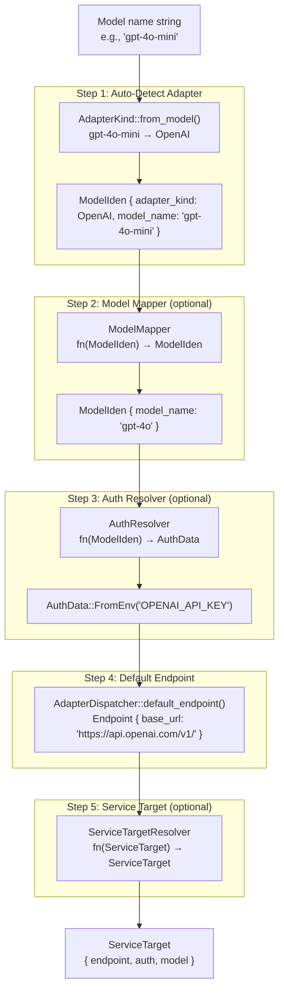

# rust-genai — Client and Resolution Pipeline

**Source:** `client/`, `resolver/`, `common/` — ~15 files. Arc-based Client, fluent builder, three-stage resolution pipeline (model mapper → auth resolver → service target resolver), AuthData/Endpoint types.

## Client — Arc-Based Immutable Core

```rust
// client/client_types.rs:10-13
pub struct Client {
    pub(super) inner: Arc<ClientInner>,
}

pub(super) struct ClientInner {
    pub(super) web_client: WebClient,
    pub(super) config: ClientConfig,
}
```

**Aha:** `Client` wraps `Arc<ClientInner>` for cheap cloning and thread-safe sharing. Once built, the client is fully immutable — no runtime mutation possible. This is a deliberate design choice to avoid `Mutex` overhead and data races.

```rust
// Default constructor — zero-config, uses env vars for auth
let client = Client::default();

// Equivalent via builder
let client = Client::builder().build();
```

## ClientBuilder — Fluent Configuration

```rust
// client/builder.rs:14-100
pub struct ClientBuilder {
    web_client: Option<WebClient>,
    config: Option<ClientConfig>,
}

impl ClientBuilder {
    // HTTP client customization
    pub fn with_reqwest(self, reqwest_client: reqwest::Client) -> Self

    // Full config
    pub fn with_config(self, config: ClientConfig) -> Self

    // Shorthand: sets nested ClientConfig.chat_options
    pub fn with_chat_options(self, options: ChatOptions) -> Self

    // Auth resolver (full object)
    pub fn with_auth_resolver(self, auth_resolver: AuthResolver) -> Self
    // Auth resolver (closure shortcut)
    pub fn with_auth_resolver_fn(self, f: impl IntoAuthResolverFn) -> Self

    // Service target resolver
    pub fn with_service_target_resolver(self, resolver: ServiceTargetResolver) -> Self
    pub fn with_service_target_resolver_fn(self, f: impl IntoServiceTargetResolverFn) -> Self

    // Model mapper
    pub fn with_model_mapper(self, mapper: ModelMapper) -> Self
    pub fn with_model_mapper_fn(self, f: impl IntoModelMapperFn) -> Self

    // Build the immutable Client
    pub fn build(self) -> Client {
        Client {
            inner: Arc::new(ClientInner {
                web_client: self.web_client.unwrap_or_default(),
                config: self.config.unwrap_or_default(),
            }),
        }
    }
}
```

### Example: Custom Auth and Model Mapping

```rust
let client = Client::builder()
    .with_auth_resolver_fn(|model_iden: ModelIden| {
        // Dynamic key selection based on model
        if model_iden.model_name.starts_with("gpt-4") {
            Ok(Some(AuthData::from_env("PREMIUM_OPENAI_KEY")))
        } else {
            Ok(Some(AuthData::from_env("OPENAI_API_KEY")))
        }
    })
    .with_model_mapper_fn(|model_iden: ModelIden| {
        // Map "gpt-4o-mini" to "gpt-4o" for production
        if model_iden.model_name.to_string() == "gpt-4o-mini" {
            Ok(ModelIden::new(model_iden.adapter_kind, "gpt-4o"))
        } else {
            Ok(model_iden)
        }
    })
    .with_chat_options(ChatOptions::default()
        .with_temperature(0.5)
        .with_capture_usage(true))
    .build();
```

## ClientConfig — Configuration Container

```rust
// client/config.rs:8-14
pub struct ClientConfig {
    pub(super) auth_resolver: Option<AuthResolver>,
    pub(super) service_target_resolver: Option<ServiceTargetResolver>,
    pub(super) model_mapper: Option<ModelMapper>,
    pub(super) chat_options: Option<ChatOptions>,
}
```

## Resolution Pipeline

The resolution pipeline transforms a model name string into a fully resolved `ServiceTarget` containing endpoint, auth, and model identifier.



```rust
// client/config.rs:74-121
impl ClientConfig {
    pub fn resolve_service_target(&self, model: ModelIden) -> Result<ServiceTarget> {
        // 1. Model Mapper — remap model names
        let model = match self.model_mapper() {
            Some(model_mapper) => model_mapper.map_model(model.clone()),
            None => Ok(model.clone()),
        }?;

        // 2. Auth Resolver — get API key
        let auth = self.auth_resolver()
            .map(|resolver| resolver.resolve(model.clone()))
            .transpose()?
            .flatten()
            .unwrap_or_else(|| AdapterDispatcher::default_auth(model.adapter_kind));

        // 3. Default Endpoint
        let endpoint = AdapterDispatcher::default_endpoint(model.adapter_kind);

        // 4. Service Target Resolver — final override
        let service_target = ServiceTarget {
            model: model.clone(),
            auth,
            endpoint,
        };
        let service_target = match self.service_target_resolver() {
            Some(resolver) => resolver.resolve(service_target)?,
            None => service_target,
        };

        Ok(service_target)
    }
}
```

**Aha:** The resolution order matters: model mapper runs first, so auth and endpoint resolvers see the *mapped* model, not the original. This allows mapping `"my-custom-gpt"` → `"gpt-4o"` and then using OpenAI's auth/endpoint automatically.

## Resolver Trait Object Pattern

All three resolvers (AuthResolver, ModelMapper, ServiceTargetResolver) share the same architecture:

```mermaid
classDiagram
    class AuthResolver {
        +ResolverFn(Arc~Box~dyn AuthResolverFn~~)
        +from_resolver_fn(resolver_fn)
        +resolve(ModelIden) Result~AuthData~
    }

    class AuthResolverFn {
        <<trait>>
        +exec_fn(ModelIden) Result~AuthData~
        +clone_box() Box~dyn AuthResolverFn~
    }

    class IntoAuthResolverFn {
        <<trait>>
        +into_resolver_fn() Arc~Box~dyn AuthResolverFn~~
    }

    class "closure\nfn(ModelIden) -> Result<Option<AuthData>>" as Closure

    AuthResolver --> AuthResolverFn : holds
    IntoAuthResolverFn ..> AuthResolverFn : produces
    Closure ..|> IntoAuthResolverFn : implements
    Closure ..|> AuthResolverFn : blanket impl

    class ModelMapper {
        +MapperFn(Arc~Box~dyn ModelMapperFn~~)
        +map_model(ModelIden) Result~ModelIden~
    }

    class ModelMapperFn {
        <<trait>>
        +exec_fn(ModelIden) Result~ModelIden~
        +clone_box() Box~dyn ModelMapperFn~
    }

    ModelMapper --> ModelMapperFn : holds
    Closure ..|> ModelMapperFn : blanket impl
```

**Aha:** The `clone_box` method on the trait object enables cloning `Arc<Box<dyn Trait>>` — a standard Rust pattern for making trait objects cloneable without requiring the trait itself to inherit `Clone`.

## ModelIden — Model Identity

```rust
// common/model_iden.rs:11-16
pub struct ModelIden {
    pub adapter_kind: AdapterKind,    // Which provider
    pub model_name: ModelName,        // Which model
}

impl ModelIden {
    pub fn new(adapter_kind: AdapterKind, model_name: impl Into<ModelName>) -> Self
}

// Convenient tuple construction
let iden: ModelIden = (AdapterKind::OpenAI, "gpt-4o").into();
```

## ModelName — Efficient String

```rust
// common/model_name.rs:7-8
pub struct ModelName(Arc<str>);    // Cheap clone via Arc
```

**Aha:** `ModelName` wraps `Arc<str>` rather than `String` so cloning is cheap — just an `Arc` reference count bump. This is important because `ModelIden` is passed through the entire resolution pipeline.

## AuthData — Authentication Information

```rust
// resolver/auth_data.rs:5-16
pub enum AuthData {
    FromEnv(String),                     // Read from environment variable
    Key(String),                         // Direct key value
    MultiKeys(HashMap<String, String>),  // Multi-part credentials (future)
}
```

### Debug Redaction

```rust
// resolver/auth_data.rs:57-65
impl std::fmt::Debug for AuthData {
    fn fmt(&self, f: &mut std::fmt::Formatter<'_>) -> std::fmt::Result {
        match self {
            AuthData::FromEnv(_) => write!(f, "AuthData::FromEnv(REDACTED)"),
            AuthData::Key(_) => write!(f, "AuthData::Single(REDACTED)"),
            AuthData::MultiKeys(_) => write!(f, "AuthData::Multi(REDACTED)"),
        }
    }
}
```

**Aha:** All variants redact their values in `Debug` output. Even `FromEnv` — the env var *name* is hidden, not just the value. This prevents accidental key exposure in logs.

## AuthResolver — Dynamic Key Resolution

```rust
// resolver/auth_resolver.rs:17-21
pub enum AuthResolver {
    ResolverFn(Arc<Box<dyn AuthResolverFn>>),
}

// Trait object with Into* adapter
pub trait AuthResolverFn: Send + Sync {
    fn exec_fn(&self, model_iden: ModelIden) -> Result<Option<AuthData>>;
    fn clone_box(&self) -> Box<dyn AuthResolverFn>;
}

// Blanket impl for closures
impl<F> AuthResolverFn for F
where
    F: FnOnce(ModelIden) -> Result<Option<AuthData>> + Send + Sync + Clone + 'static,
{
    fn exec_fn(&self, model_iden: ModelIden) -> Result<Option<AuthData>> {
        (self.clone())(model_iden)
    }
    fn clone_box(&self) -> Box<dyn AuthResolverFn> { Box::new(self.clone()) }
}
```

**Aha:** The `IntoAuthResolverFn` trait + blanket impl pattern lets users pass plain closures without implementing any trait. The `clone_box` method on the trait object enables cloning the `Arc<Box<dyn AuthResolverFn>>` — a standard pattern for cloneable trait objects in Rust.

## ModelMapper — Model Name Remapping

```rust
// resolver/model_mapper.rs:9-13
pub enum ModelMapper {
    MapperFn(Arc<Box<dyn ModelMapperFn>>),
}

pub trait ModelMapperFn: Send + Sync {
    fn exec_fn(&self, model_iden: ModelIden) -> Result<ModelIden>;
    fn clone_box(&self) -> Box<dyn ModelMapperFn>;
}
```

Returns `Result<ModelIden>` — can return an error if the model name is invalid. The closure receives the already-resolved `ModelIden` (with adapter kind determined from the original model name).

## ServiceTargetResolver — Full Override

```rust
// resolver/service_target_resolver.rs:14-18
pub enum ServiceTargetResolver {
    ResolverFn(Arc<Box<dyn ServiceTargetResolverFn>>),
}

pub trait ServiceTargetResolverFn: Send + Sync {
    fn exec_fn(&self, service_target: ServiceTarget) -> Result<ServiceTarget>;
    fn clone_box(&self) -> Box<dyn ServiceTargetResolverFn>;
}
```

**Aha:** This is the most powerful resolver — it receives the fully constructed `ServiceTarget` and can override any field. This is the escape hatch for scenarios like:
- Using a custom API gateway URL
- Switching auth credentials per request
- Routing to a different model entirely

## Endpoint — Service URL

```rust
// resolver/endpoint.rs:6-15
pub struct Endpoint {
    inner: EndpointInner,
}

enum EndpointInner {
    Static(&'static str),     // For compile-time URLs (no allocation)
    Owned(Arc<str>),          // For runtime URLs (cheap clone)
}

impl Endpoint {
    pub fn from_static(url: &'static str) -> Self
    pub fn from_owned(url: impl Into<Arc<str>>) -> Self
    pub fn base_url(&self) -> &str
}
```

**Aha:** The dual storage (`Static` vs `Owned`) avoids allocating for the common case where endpoints are compile-time constants (`Endpoint::from_static("https://api.openai.com/v1/")`).

## ServiceTarget — Resolved Destination

```rust
// client/service_target.rs:10-14
pub struct ServiceTarget {
    pub endpoint: Endpoint,    // Where to send the request
    pub auth: AuthData,        // How to authenticate
    pub model: ModelIden,      // Which model to target
}
```

This is the final output of the resolution pipeline, consumed by `AdapterDispatcher::to_web_request_data`.

## Client::exec_chat — Full Execution Flow

```rust
// client/client_impl.rs:45-75
pub async fn exec_chat(
    &self,
    model: &str,
    chat_req: ChatRequest,
    options: Option<&ChatOptions>,
) -> Result<ChatResponse> {
    // 1. Resolve options (chat-level + client-level)
    let options_set = ChatOptionsSet::default()
        .with_chat_options(options)
        .with_client_options(self.config().chat_options());

    // 2. Resolve model → ServiceTarget (full pipeline)
    let model = self.default_model(model)?;
    let target = self.config().resolve_service_target(model)?;
    let model = target.model.clone();

    // 3. Adapter transforms ChatRequest → WebRequestData
    let WebRequestData { headers, payload, url } =
        AdapterDispatcher::to_web_request_data(target, ServiceType::Chat, chat_req, options_set)?;

    // 4. HTTP POST
    let web_res = self.web_client()
        .do_post(&url, &headers, payload)
        .await
        .map_err(|webc_error| Error::WebModelCall { model_iden: model.clone(), webc_error })?;

    // 5. Adapter transforms WebResponse → ChatResponse
    let chat_res = AdapterDispatcher::to_chat_response(model, web_res)?;

    Ok(chat_res)
}
```

**Aha:** The `model` variable is cloned from `target.model` after resolution — this captures any remapping done by `ModelMapper`. The `ChatResponse` returns this resolved model identity, so callers know exactly which model was used.

## Resolver Error Model

```rust
// resolver/error.rs:8-21
pub enum Error {
    ApiKeyEnvNotFound { env_name: String },
    ResolverAuthDataNotSingleValue,
    #[from]
    Custom(String),
}
```

This is a separate error type from the main crate `Error`. The main crate wraps it:

```rust
// error.rs:82-85
Resolver {
    model_iden: ModelIden,
    resolver_error: resolver::Error,
}
```

Always includes the `model_iden` context so errors can be traced back to the specific model being resolved.
