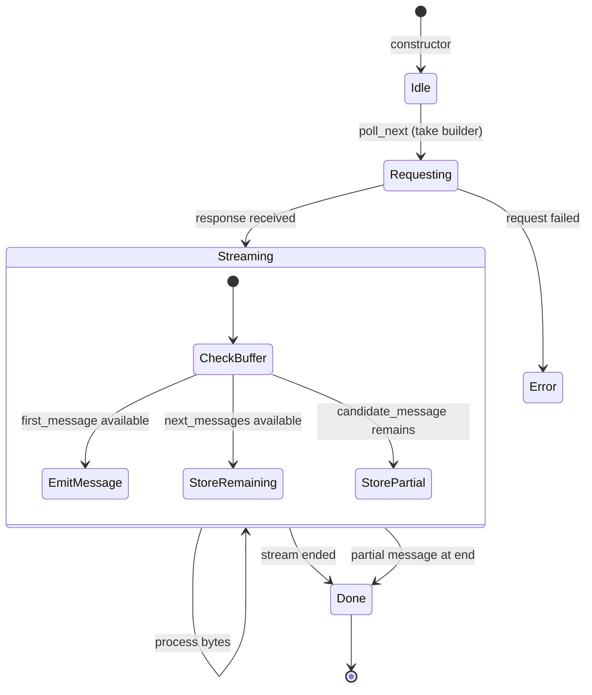
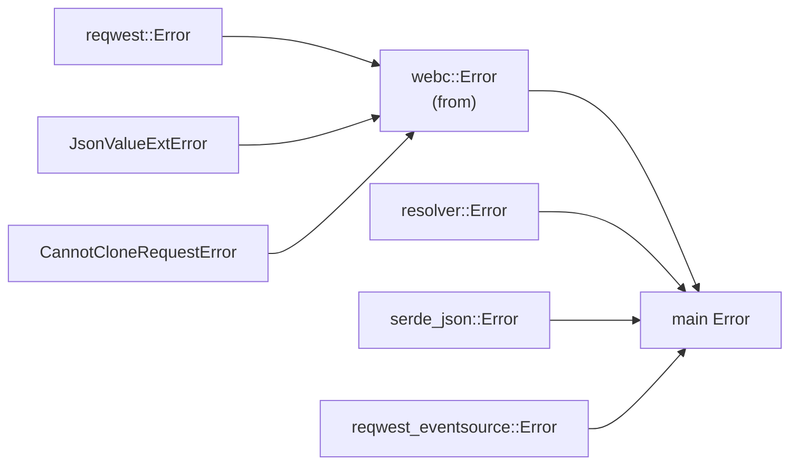

# rust-genai — Web Layer and Error Model

**Source:** `webc/` — 4 files. WebClient wrapper over reqwest, WebResponse, WebStream for custom streaming, and a submodule error type.

## WebClient — HTTP Abstraction

```rust
// webc/web_client.rs:7-18
pub struct WebClient {
    reqwest_client: reqwest::Client,
}

impl Default for WebClient {
    fn default() -> Self {
        WebClient { reqwest_client: reqwest::Client::new() }
    }
}

impl WebClient {
    pub fn from_reqwest_client(reqwest_client: reqwest::Client) -> Self
    pub async fn do_post(&self, url: &str, headers: &[(String, String)], content: Value) -> Result<WebResponse>
    pub async fn do_get(&self, url: &str, headers: &[(String, String)]) -> Result<WebResponse>
    pub fn new_req_builder(&self, url: &str, headers: &[(String, String)], content: Value) -> Result<RequestBuilder>
}
```

**Aha:** `WebClient` is a thin reqwest wrapper with only `do_post` and `do_get` methods. All requests send `Content-Type: application/json` headers. The `new_req_builder` method exists so the streaming code can get a `RequestBuilder` without sending — used for `EventSource` construction.

## WebResponse — Parsed HTTP Response

```rust
// webc/web_client.rs:76-81
pub struct WebResponse {
    pub status: StatusCode,
    pub body: Value,        // Already parsed as JSON
}
```

```rust
// Response parsing logic:
pub(crate) async fn from_reqwest_response(mut res: reqwest::Response) -> Result<WebResponse> {
    let status = res.status();

    // 1. Check success status
    if !status.is_success() {
        let body = res.text().await?;
        return Err(Error::ResponseFailedStatus { status, body });
    }

    // 2. Check Content-Type
    let ct = header_map.get("content-type").and_then(|v| v.to_str().ok()).unwrap_or_default();
    let body = if ct.starts_with("application/json") {
        res.json::<Value>().await?
    } else {
        return Err(Error::ResponseFailedNotJson { content_type: ct.to_string() });
    };

    Ok(WebResponse { status, body })
}
```

**Aha:** The response body is eagerly parsed as `serde_json::Value`. Adapters then use `x_take` (from `value_ext`) to extract specific fields via JSON path syntax like `"/choices/0/message/content"`. This defers typed deserialization to the adapter level, allowing each adapter to handle its provider's unique JSON structure.

## WebStream — Custom Stream for Non-SSE Providers

Some providers don't use standard `text/event-stream` format. `WebStream` handles these with two delimiter modes:

```rust
// webc/web_stream.rs:17-57
pub struct WebStream {
    stream_mode: StreamMode,
    reqwest_builder: Option<RequestBuilder>,
    response_future: Option<Pin<Box<dyn Future<Output = Result<Response, ...>> + Send>>>,
    bytes_stream: Option<Pin<Box<dyn Stream<Item = Result<Bytes, ...>> + Send>>>,
    partial_message: Option<String>,        // Incomplete text carried over
    remaining_messages: Option<VecDeque<String>>,  // Multiple messages from one buffer
}

pub enum StreamMode {
    Delimiter(&'static str),    // Cohere: single \n delimiter
    PrettyJsonArray,            // Gemini: pretty-printed JSON array
}
```

### Delimiter Mode (Cohere)

```rust
// For Cohere: each line is a separate message
WebStream::new_with_delimiter(reqwest_builder, "\n");
```

Splits incoming byte chunks on `\n` delimiters. Handles partial messages across chunk boundaries:

```
Chunk 1: "data: hello\n"        → emits "data: hello"
Chunk 2: "world\nfoo\n"          → emits "world", "foo"
Chunk 3: "bar"                   → stored as partial
Chunk 4: "\nbaz\n"               → emits "barbaz", "baz"
```

### Pretty JSON Array Mode (Gemini)

```rust
// For Gemini: parses pretty-printed JSON array
WebStream::new_with_pretty_json_array(reqwest_builder);
```

Gemini returns a formatted JSON array like:
```json
[
  { "candidates": [...] },
  { "candidates": [...] },
  { "candidates": [...] }
]
```

The streamer splits this into individual messages:
```
"[{candidates...}]"  → "["          (array start marker)
"  {candidates...},"  → "{candidates...}"  (each item)
"]"                  → "]"          (array end marker)
```

**Aha:** The pretty JSON array mode assumes each JSON object fits within a single byte buffer — the code comments note: "This probably needs to be made more robust later." For Gemini's formatted output, this works because each object is on its own line.

### WebStream State Machine



## Error Model

### Main Crate Error

```rust
// error.rs:13-96
pub enum Error {
    // -- Chat Input
    ChatReqHasNoMessages { model_iden: ModelIden },
    LastChatMessageIsNotUser { model_iden: ModelIden, actual_role: ChatRole },
    MessageRoleNotSupported { model_iden: ModelIden, role: ChatRole },
    MessageContentTypeNotSupported { model_iden: ModelIden, cause: &'static str },
    JsonModeWithoutInstruction,

    // -- Chat Output
    NoChatResponse { model_iden: ModelIden },
    InvalidJsonResponseElement { info: &'static str },

    // -- Auth
    RequiresApiKey { model_iden: ModelIden },
    NoAuthResolver { model_iden: ModelIden },
    NoAuthData { model_iden: ModelIden },

    // -- ModelMapper
    ModelMapperFailed { model_iden: ModelIden, cause: resolver::Error },

    // -- Web Call
    WebAdapterCall { adapter_kind: AdapterKind, webc_error: webc::Error },
    WebModelCall { model_iden: ModelIden, webc_error: webc::Error },

    // -- Streaming
    StreamParse { model_iden: ModelIden, serde_error: serde_json::Error },
    StreamEventError { model_iden: ModelIden, body: Value },
    WebStream { model_iden: ModelIden, cause: String },

    // -- Modules
    Resolver { model_iden: ModelIden, resolver_error: resolver::Error },

    // -- Externals
    #[from] EventSourceClone(reqwest_eventsource::CannotCloneRequestError),
    #[from] JsonValueExt(JsonValueExtError),
    ReqwestEventSource(reqwest_eventsource::Error),
    #[from] SerdeJson(serde_json::Error),
}
```

**Aha:** Nearly every error variant includes `model_iden` context. This is a deliberate design choice — when debugging, you always know which model triggered the error. The `#[from]` derive_more attribute automatically generates `From` implementations for external error types.

### WebC Error (Submodule)

```rust
// webc/error.rs:9-29
pub enum Error {
    ResponseFailedNotJson { content_type: String },
    ResponseFailedStatus { status: StatusCode, body: String },

    #[from] JsonValueExt(JsonValueExtError),
    #[from] Reqwest(reqwest::Error),
    #[from] EventSourceClone(reqwest_eventsource::CannotCloneRequestError),
}
```

Only exported publicly as `webc::Error`. Used within the main crate and wrapped by `Error::WebModelCall` and `Error::WebAdapterCall`.

### Resolver Error (Submodule)

```rust
// resolver/error.rs:8-21
pub enum Error {
    ApiKeyEnvNotFound { env_name: String },
    ResolverAuthDataNotSingleValue,
    #[from] Custom(String),
}
```

Wrapped by `Error::Resolver` which adds the `model_iden` context.

### Error Conversion Flow



## ValueExt — JSON Manipulation

The library uses `value_ext::JsonValueExt` for flexible JSON manipulation. This external crate provides extension methods on `serde_json::Value`:

```rust
// Usage in adapters
let mut payload = json!({ "model": model_name, "stream": false });

// Insert at path (creates intermediate objects)
payload.x_insert("/tools", tools_value)?;
payload.x_insert("temperature", 0.7)?;
payload.x_insert("/generationConfig/temperature", 0.7)?;

// Extract and take (remove) from path
let usage = body.x_take("usage")?;
let content = body.x_take::<Option<String>>("/choices/0/message/content")?;

// Walk the JSON tree
schema.x_walk(|parent_map, name| {
    if name == "type" && parent_map.get("type").as_str() == Some("object") {
        parent_map.insert("additionalProperties".to_string(), false.into());
    }
    true
});
```

**Aha:** `x_take` is a "take" operation — it removes the value from the source JSON. This is used extensively in response parsing to avoid cloning values. The path syntax supports both top-level keys (`"usage"`) and nested paths (`"/choices/0/message/content"`).

## Module Visibility Summary

| Module | Public Types | Crate-Private Types |
|--------|-------------|---------------------|
| `lib` | `Client`, `ClientBuilder`, `ModelIden`, `ModelName`, `Error`, `Result` | — |
| `adapter` | `AdapterKind` | `Adapter` trait, `AdapterDispatcher`, `ServiceType`, `WebRequestData`, `InterStreamEvent` |
| `chat` | All chat types | — |
| `resolver` | `AuthResolver`, `ModelMapper`, `ServiceTargetResolver`, `AuthData`, `Endpoint` | `Into*` traits, `*Fn` traits |
| `webc` | `webc::Error` | `WebClient`, `WebResponse`, `WebStream` |
| `client` | (re-exported from lib) | `ClientConfig`, `ClientInner`, `ServiceTarget` |
