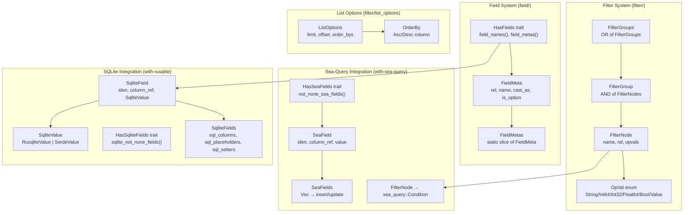

# rust-modql — Overview

**Source:** `src/` — 41 Rust files across 6 modules. Model query language with filtering, field metadata, and SQL generation.

`modql` is a model query language library that provides expressive filtering (inspired by [joql.org](https://joql.org)), field metadata extraction, and SQL generation for both sea-query and rusqlite backends. It is serialization-agnostic but provides JSON deserialization for convenient filter parsing.

## Architecture



## Filter System — FilterNode, FilterGroup, FilterGroups

```rust
// filter/nodes/node.rs:15-23
pub struct FilterNode {
    pub rel: Option<String>,       // e.g., "project" in "project.title"
    pub name: String,              // field name
    pub opvals: Vec<OpVal>,        // operator values
    pub options: FilterNodeOptions,
}

// filter/nodes/group.rs:5-6
pub struct FilterGroup(Vec<FilterNode>);   // AND between nodes
pub struct FilterGroups(Vec<FilterGroup>); // OR between groups
```

The filtering model is: **FilterGroups** = OR of **FilterGroup** = AND of **FilterNode**.

```
WHERE (name = "Alice" AND age > 30)   ← one FilterGroup (AND)
   OR (name = "Bob" AND status = "active")  ← another FilterGroup (OR)
```

### FilterNode Construction

```rust
// filter/nodes/node.rs:26-48
// Direct construction
FilterNode::new("name", vec![OpVal::String(OpValString::Eq("Alice".into()))])

// Via tuple From implementations
let node: FilterNode = ("name", "Alice").into();           // → Eq
let node: FilterNode = ("id", OpValInt64::Gt(10)).into(); // → Gt
let node: FilterNode = ("id", 42i64).into();              // → Eq (shorthand)
let node: FilterNode = ("active", true).into();           // → Eq bool
```

### FilterGroups from Filters

```rust
// filter/nodes/group.rs:100-108
impl<F> From<Vec<F>> for FilterGroups where F: IntoFilterNodes {
    fn from(filters: Vec<F>) -> Self {
        let filters: Vec<_> = filters.into_iter()
            .map(|f| f.filter_nodes(None)).collect();
        filters.into()
    }
}
```

### Sea-Query Conversion

```rust
// filter/nodes/group.rs:119-159
impl TryFrom<FilterGroup> for Condition { ... }  // AND of all nodes
impl TryFrom<FilterGroups> for Condition { ... } // OR of all groups

FilterGroups::into_sea_condition() -> Condition
```

## Field System — FieldMeta and HasFields

```rust
// field/field_meta.rs:2-23
pub struct FieldMeta {
    pub rel: Option<&'static str>,       // table/relation name
    pub is_struct_rel: bool,             // rel from struct vs field
    pub prop_name: &'static str,         // struct field name
    pub attr_name: Option<&'static str>, // #[field(name=...)] override
    pub cast_as: Option<&'static str>,   // DB cast type (e.g., "json")
    pub write_placeholder: Option<&'static str>, // custom placeholder
    pub is_option: bool,                 // whether field is Option<T>
}
```

**Aha:** `FieldMeta.name()` returns `attr_name` if set, otherwise `prop_name`. This allows `#[field(name = "user_id")]` to map a Rust field `user` to a database column `user_id`. The `sql_col_ref()` method generates properly quoted SQL: `"table"."column" AS "prop_name"` when an alias is needed.

### HasFields Trait

```rust
// field/has_fields.rs:3-21
pub trait HasFields {
    fn field_names() -> &'static [&'static str];
    fn field_metas() -> &'static FieldMetas;
    fn sql_columns() -> String { /* "\"col1\", \"col2\", ..." */ }
    fn sql_placeholders() -> String { /* "?, ?, ..." */ }
}
```

Typically derived via `#[derive(Fields)]` from `modql-macros`.

### FieldMetas — SQL Column Generation

```rust
// field/field_metas.rs:5-28
pub struct FieldMetas(&'static [&'static FieldMeta]);

FieldMetas::sql_col_refs() -> String        // all columns
FieldMetas::sql_col_refs_for(names) -> String  // filtered columns
```

## ListOptions — Pagination and Sorting

```rust
// filter/list_options/mod.rs:6-11
pub struct ListOptions {
    pub limit: Option<i64>,
    pub offset: Option<i64>,
    pub order_bys: Option<OrderBys>,
}
```

### OrderBy — `!` Prefix for Descending

```rust
// filter/list_options/order_by.rs:3-6
pub enum OrderBy {
    Asc(String),   // "name" → "name" ASC
    Desc(String),  // "!name" → "name" DESC
}
```

The `!` prefix convention:

```rust
OrderBy::from("name")        // → Asc("name")
OrderBy::from("!name")       // → Desc("name")
OrderBy::from("!project.id") // → Desc("project.id")

// Display produces quoted SQL:
format!("{}", OrderBy::Asc("name".into()));       // → "name" ASC
format!("{}", OrderBy::Desc("project.id".into())); // → "project"."id" DESC
```

**Aha:** The `Display` impl quotes identifiers with double quotes and handles `rel.column` syntax: `project.id` becomes `"project"."id" DESC`. The `quote_piece` function splits on `.` and quotes each segment independently.

### OrderBys

```rust
impl From<&str> for OrderBys { ... }          // "name" → OrderBys([Asc("name")])
impl From<String> for OrderBys { ... }
impl From<OrderBy> for OrderBys { ... }
impl<T: AsRef<str>> From<Vec<T>> for OrderBys { ... }  // vec!["name", "!age"]
```

### Sea-Query Integration

```rust
// filter/list_options/order_by.rs:156-171
OrderBys::into_sea_col_order_iter() -> impl Iterator<Item = (ColumnRef, Order)>
```

## OpVal — Type-Specific Operator Values

```rust
// filter/ops/mod.rs:10-21
pub enum OpVal {
    String(OpValString),
    Int64(OpValInt64),
    Int32(OpValInt32),
    Float64(OpValFloat64),
    Bool(OpValBool),
    Value(OpValValue),  // generic serde_json::Value
}
```

Each typed `OpVal` (e.g., `OpValString`) has a corresponding `OpVals` wrapper (e.g., `OpValsString(Vec<OpValString>)`) for holding multiple constraints on the same field.

### Conversion Chain

```
String → OpValString::Eq → OpVal::String → FilterNode
OpValString → OpVal (From impl)
OpValString → OpValsString (From impl)
Vec<OpValString> → OpValsString (From impl)
```

The `impl_from_for_opvals!` macro generates all the `From<OpVal> → OpVals` and `From<Vec<OpVal>> → OpVals` conversions.

## Module Structure

```
src/
├── lib.rs                      # Re-exports Error, Result, feature-gated modules
├── error.rs                    # Top-level Error (JSON validation errors)
├── includes.rs                 # PLACEHOLDER — IncludeValue, IncludeNode (not yet used)
├── field/
│   ├── mod.rs                  # Re-exports + modql-macros (Fields, SeaFieldValue)
│   ├── error.rs                # Field errors (sea/sqlite value conversion)
│   ├── field_meta.rs           # FieldMeta struct + sea-query helpers
│   ├── field_metas.rs          # FieldMetas collection + SQL column generation
│   ├── has_fields.rs           # HasFields trait + deprecated FieldRef
│   ├── sea/
│   │   ├── mod.rs              # Re-exports
│   │   ├── sea_field.rs        # SeaField (iden, column_ref, value)
│   │   ├── sea_fields.rs       # SeaFields collection + for_sea_insert/update
│   │   └── has_sea_fields.rs   # HasSeaFields trait
│   └── sqlite/
│       ├── mod.rs              # Re-exports
│       ├── sqlite_field.rs     # SqliteField + SqliteColumnRef
│       ├── sqlite_fields.rs    # SqliteFields + SQL generation helpers
│       ├── sqlite_value.rs     # SqliteValue (RusqliteValue | SerdeValue)
│       └── has_sqlite_fields.rs # HasSqliteFields trait
├── filter/
│   ├── mod.rs                  # Re-exports + FilterNodes macro
│   ├── nodes/
│   │   ├── mod.rs              # Re-exports group, node
│   │   ├── node.rs             # FilterNode + tuple From impls + sea-query
│   │   └── group.rs            # FilterGroup (AND), FilterGroups (OR) + sea-query
│   ├── ops/
│   │   ├── mod.rs              # OpVal enum + impl_from_for_opvals! macro
│   │   ├── op_val_string.rs    # OpValString (30 operators) + JSON + sea-query
│   │   ├── op_val_bool.rs      # OpValBool (Eq, Not, Null) + JSON + sea-query
│   │   ├── op_val_nums.rs      # OpValInt64, OpValInt32, OpValFloat64
│   │   └── op_val_value.rs     # OpValValue (generic Value) + JSON + sea-query
│   ├── json/
│   │   ├── mod.rs              # OpValueToOpValType trait
│   │   ├── ovs_json.rs         # OpValueToOpValType trait definition
│   │   ├── ovs_de_string.rs    # Deserialize for OpValsString (Visitor pattern)
│   │   ├── ovs_de_number.rs    # Deserialize for numeric OpVals
│   │   ├── ovs_de_bool.rs      # Deserialize for OpValsBool
│   │   ├── ovs_de_value.rs     # Deserialize for OpValsValue
│   │   └── order_bys_de.rs     # Deserialize for OrderBys
│   ├── into_sea/
│   │   ├── mod.rs              # ForSeaCondition, ToSeaValueFnHolder, ToSeaConditionFnHolder
│   │   └── error.rs            # IntoSeaError
│   └── list_options/
│       ├── mod.rs              # ListOptions (limit, offset, order_bys)
│       └── order_by.rs         # OrderBy (Asc/Desc with ! prefix), OrderBys
├── sea_utils/
│   ├── mod.rs                  # StringIden, SIden, into_node_value_expr
│   ├── sea_types.rs            # Iden wrappers + expression helpers
│   └── sea_rusqlite.rs         # RusqliteValue, RusqliteBinder (sea-query ↔ rusqlite bridge)
└── sqlite/
    └── mod.rs                  # SqliteFromRow, SqliteFromValue, SqliteToValue traits
```

## Feature Flags

| Feature | Enables |
|---------|---------|
| `with-sea-query` | Sea-query integration (conditions, fields, ordering) |
| `with-rusqlite` | Rusqlite integration (SqliteField, SqliteValue, row parsing) |
| `with-ilike` | PostgreSQL ILIKE operator support |
| `modql-macros` | Procedural macros (`#[derive(Fields)]`, `FilterNodes`, etc.) |

## Dependencies

| Dependency | Purpose |
|------------|---------|
| `serde` / `serde_json` | JSON deserialization for filter parsing |
| `sea-query` (optional) | SQL query building |
| `rusqlite` (optional) | SQLite database access |
| `modql-macros` (proc-macro) | Derive macros for Fields, FilterNodes, value conversions |
