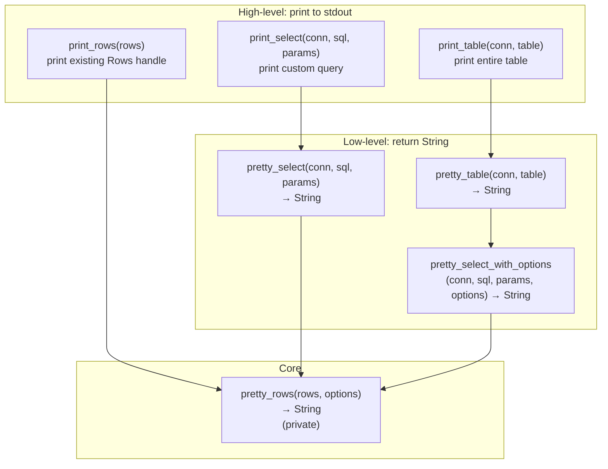

# rust-pretty-sqlite — Overview

**Source:** `src/` — 4 Rust files. Pretty-print SQLite query results as formatted tables.

`pretty_sqlite` wraps `rusqlite` and `tabled` to provide one-call pretty printing of SQLite query results. Column names are auto-extracted, NULL values are shown explicitly, text cells can be truncated, and output is limited to a configurable row count.

## Public API



### Quick Start

```rust
use pretty_sqlite::{print_table, print_select, pretty_select};

// Print an entire table
print_table(&conn, "users")?;

// Print a custom query, returning a String
let output = pretty_select(&conn, "SELECT id, name FROM users WHERE age > ?", &[&18])?;
println!("{}", output);
```

## PrettyOptions

```rust
// options.rs:1-26
pub struct PrettyOptions {
    pub rows_limit: usize,            // Default: 300
    pub cell_truncate_max: Option<u32>, // Default: None (no truncation)
}
```

| Option | Default | Effect |
|--------|---------|--------|
| `rows_limit` | `300` | Maximum rows to display |
| `cell_truncate_max` | `None` | Truncate text cells to this many characters |

Default options are cached in a `OnceLock` for reuse:

```rust
// pretties.rs:11
static DEFAULT_PRETTY_OPTIONS: OnceLock<PrettyOptions> = OnceLock::new();
// First call initializes; subsequent calls return the same instance
let opts = DEFAULT_PRETTY_OPTIONS.get_or_init(PrettyOptions::default);
```

## Output Format

Uses `tabled` with `Style::modern()` for formatted tables:

```
 TABLE: users
┌────┬──────────┬─────────────────────┬────────────┐
│ id │ name     │ email               │ created_at │
├────┼──────────┼─────────────────────┼────────────┤
│ 1  │ "Alice"  │ "alice@example.com" │ 1700000000 │
│ 2  │ "Bob"    │ NULL                │ 1700000001 │
│ 3  │ "Charlie"│ "charlie@test.com"  │ 1700000002 │
└────┴──────────┴─────────────────────┴────────────┘
```

## Row Processing

```rust
// pretties.rs:71-128
fn pretty_rows(mut rows: Rows<'_>, options: &PrettyOptions) -> Result<String> {
    // 1. Extract column names from the statement
    let stmt = rows.as_ref().ok_or(Error::CantPrintRowsHasNoStatement)?;
    let names: Vec<String> = stmt.column_names().into_iter().map(|s| s.to_string()).collect();

    // 2. Detect "time" columns (name ends with "time")
    let sub_types: Vec<SubType> = names.iter().map(|n|
        if n.ends_with("time") { SubType::Time } else { SubType::None }
    ).collect();

    // 3. Build table with tabled
    let mut table_builder = tabled::builder::Builder::new();
    table_builder.push_record(names.clone());  // Header row

    // 4. Iterate rows up to rows_limit
    while let Some(row) = rows.next()? {
        count += 1;
        if count > options.rows_limit { break; }

        // Extract each cell based on its SQLite type
        for (i, _) in names.iter().enumerate() {
            let v = row.get_ref(i)?;
            match v {
                ValueRef::Null => "NULL",
                ValueRef::Integer(num) => format!("{num}"),  // Time columns detected but not yet converted
                ValueRef::Real(num) => format!("{num}"),
                ValueRef::Text(bytes) => { /* quoted, truncated */ }
                ValueRef::Blob(blob) => format!("BLOB (length: {})", blob.len()),
            }
        }
        table_builder.push_record(cells);
    }

    // 5. Render with modern table style
    Ok(table_builder.build().with(Style::modern()).to_string())
}
```

**Aha:** The `SubType::Time` detection (column names ending with `"time"`) is a hook for future epoch-to-RFC3339 conversion. Currently both `SubType::Time` and `SubType::None` produce the same output — `format!("{num}")`. The comment `//epoch_us_to_rfc3339(num)` indicates the intended future behavior.

### Cell Value Formatting

| SQLite Type | Display |
|-------------|---------|
| `Null` | `"NULL"` |
| `Integer` | Number as-is (e.g., `1234567890`) |
| `Real` | Float as-is (e.g., `3.14`) |
| `Text` | Quoted with `"..."`, optionally truncated |
| `Blob` | `"BLOB (length: N)"` |

Text cells are wrapped in double quotes: `"hello world"`. If `cell_truncate_max` is set, long text is truncated with `...` in the middle:

```rust
// pretties.rs:130-150
fn truncate_string(s: String, options: &PrettyOptions) -> String {
    let max_cell_len = truncate_cell_max as usize;
    let char_indices: Vec<(usize, char)> = s.char_indices().collect();
    if char_indices.len() > max_cell_len {
        let first_part_len = max_cell_len / 6;     // ~17% at start
        let remaining_len = max_cell_len - first_part_len; // ~83% at end
        // → "first 16 chars...last 80 chars" (for max=96)
    }
}
```

**Aha:** The truncation ratio is heavily skewed toward the end — 1/6 of the budget goes to the prefix, 5/6 to the suffix. This preserves context (the end of a string) while showing a hint of the beginning. The TODO comment `// TODO: Need to use the Truncate data` indicates this will eventually use the planned `TruncatePosition` enum (Start, Middle, End).

## Module Structure

```
src/
├── lib.rs         # Re-exports: Error, Result, PrettyOptions, all pretties functions
├── error.rs       # Error enum: CantPrintRowsHasNoStatement, SQLiteTextCellIsNotUtf8, Rusqlite
├── options.rs     # PrettyOptions: rows_limit, cell_truncate_max
└── pretties.rs    # print_table, pretty_table, print_select, pretty_select, pretty_rows
```

## Public Functions

| Function | Purpose | Returns |
|----------|---------|---------|
| `print_table(conn, table)` | Print entire table to stdout | `Result<()>` |
| `pretty_table(conn, table)` | Pretty-print entire table | `Result<String>` |
| `print_select(conn, sql, params)` | Print custom query to stdout | `Result<()>` |
| `pretty_select(conn, sql, params)` | Pretty-print custom query | `Result<String>` |
| `pretty_select_with_options(conn, sql, params, options)` | Custom query with options | `Result<String>` |
| `print_rows(rows)` | Print existing `Rows` handle | `Result<()>` |

## Error Model

```rust
// error.rs:5-14
pub enum Error {
    CantPrintRowsHasNoStatement,     // rows.as_ref() returned None
    SQLiteTextCellIsNotUtf8,         // Text cell contains invalid UTF-8
    Rusqlite(rusqlite::Error),       // All rusqlite errors auto-converted via #[from]
}
```
