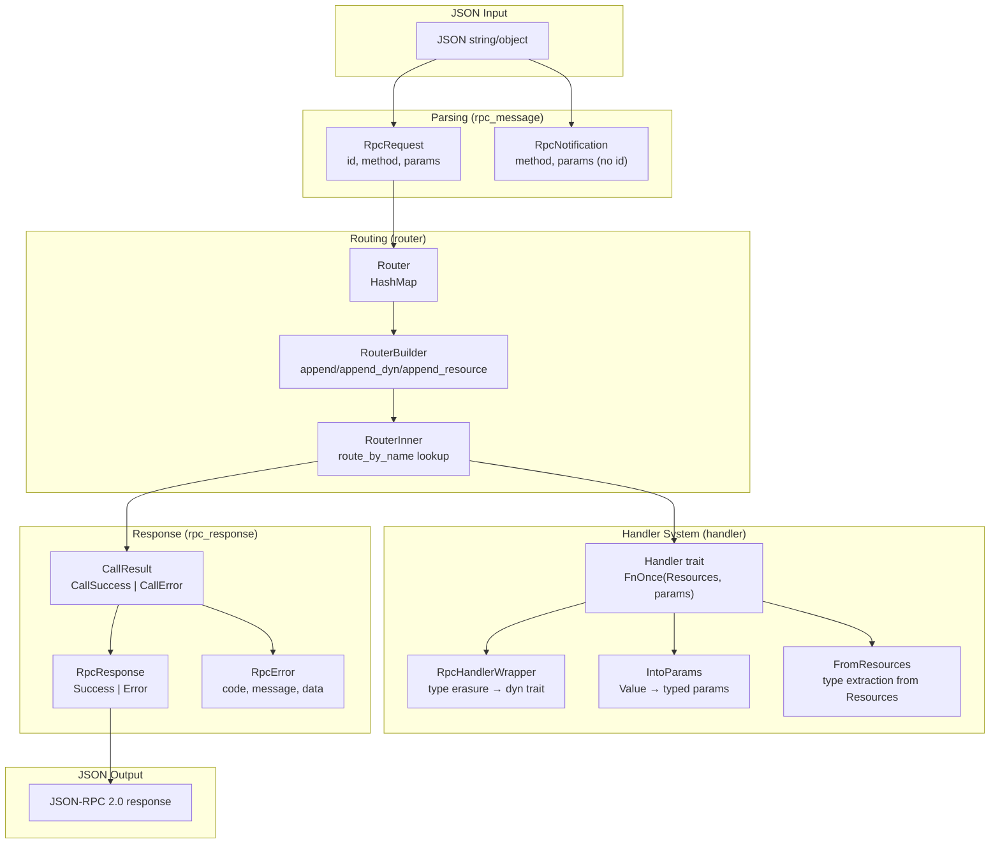
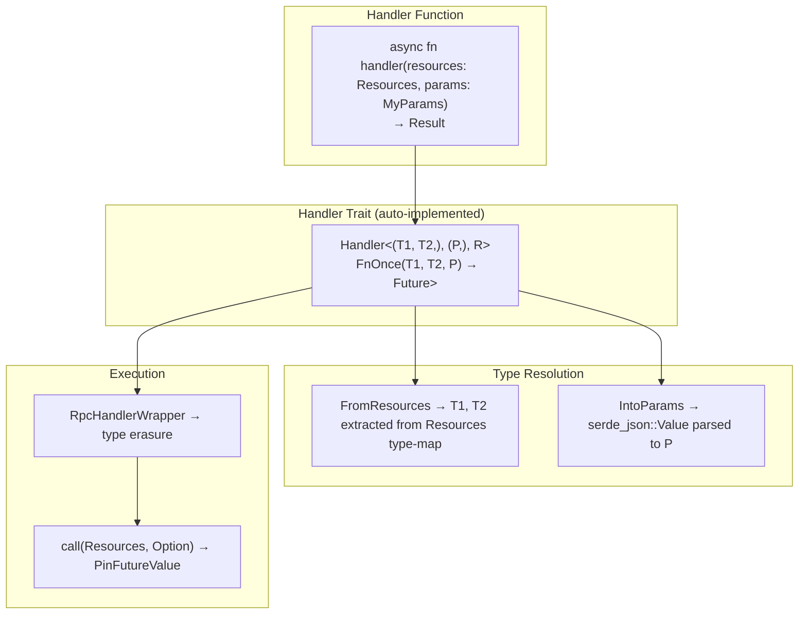

# rust-rpc-router — Overview

**Source:** `src/` — 32 Rust files across 7 modules. JSON-RPC 2.0 router with typed handlers, dependency injection, and full request/response parsing.

`rpc-router` is a JSON-RPC 2.0 compliant router that routes method calls to async handler functions. It provides a typed handler system with dependency injection via `Resources` (a type-map borrowed from `http` crate's extensions), parameter parsing via `IntoParams`, and full JSON-RPC request/response/notification parsing with validation.

## Architecture



## Quick Start

```rust
use rpc_router::{Router, RpcRequest, RpcResponse};
use rpc_router::{Handler, IntoParams, FromResources};
use serde::{Deserialize, Serialize};
use serde_json::Value;

// Define handler params
#[derive(Deserialize, Serialize)]
struct CreateUserParams {
    name: String,
    email: String,
}
impl IntoParams for CreateUserParams {}

// Define handler function
async fn create_user(params: CreateUserParams) -> Result<Value, String> {
    Ok(serde_json::json!({ "id": 1, "name": params.name }))
}

// Build router
let router = Router::builder()
    .append("createUser", create_user)
    .build();

// Call via JSON-RPC request
let request = RpcRequest::new(1, "createUser", Some(serde_json::json!({
    "name": "Alice", "email": "alice@example.com"
})));

let result = router.call(request).await;
let response = RpcResponse::from(result);
```

## RpcId — JSON-RPC Request ID

```rust
// rpc_id.rs:10-15
#[derive(Debug, Clone, PartialEq, Eq, Hash)]
pub enum RpcId {
    String(Arc<str>),
    Number(i64),
    Null,
}
```

JSON-RPC 2.0 allows IDs to be String, Number, or Null. `RpcId` uses `Arc<str>` for efficient cloning — important since IDs flow through request → handler → response → logging.

### ID Generation with Scheme + Encoding

```rust
// rpc_id.rs:21-52
pub fn from_scheme(kind: IdSchemeKind, enc: IdSchemeEncoding) -> Self

pub enum IdSchemeKind { UuidV4, UuidV7 }
pub enum IdSchemeEncoding { Standard, Base64, Base64UrlNoPad, Base58 }
```

Convenience constructors for 10 ID schemes:

| Constructor | Output Example | Length |
|-------------|---------------|--------|
| `new_uuid_v4()` | `"550e8400-e29b-41d4-a716-446655440000"` | 36 |
| `new_uuid_v4_base58()` | `"5Kd3NBPdJn..."` | ~22 |
| `new_uuid_v4_base64()` | `"VQ6EAOq5RNSmFkRmVFVA...=="` | 24 |
| `new_uuid_v4_base64url()` | `"VQ6EAOq5RNSmFkRmVFVA...=="` | 22 (no pad) |
| `new_uuid_v7()` | time-ordered UUID | 36 |
| `new_uuid_v7_base58()` | time-ordered Base58 | ~22 |

The `IdSchemeKind.generate()` produces bytes, then `IdSchemeEncoding.encode()` converts to string. This design allows adding new schemes (Ulid, Snowflake, Nanoid) later.

### Serde Integration

`RpcId` serializes to JSON as the native type: strings become `"string"`, numbers become `42`, Null becomes `null`. Deserialization validates that the value is String, Number, or Null — booleans, arrays, objects, and floats all fail with `IdInvalid`.

```rust
// Conversion from Value:
RpcId::from_value(json!(true))     // → Err(IdInvalid)
RpcId::from_value(json!(123.45))   // → Err(IdInvalid) — floats not supported
RpcId::from_value(json!([1, 2]))   // → Err(IdInvalid)
RpcId::from_value(json!("abc"))    // → Ok(RpcId::String("abc".into()))
```

## Router — Method Dispatch

```rust
// router/router.rs:7-11
pub struct Router {
    inner: Arc<RouterInner>,       // HashMap<method_name, Box<dyn RpcHandlerWrapperTrait>>
    base_resources: Resources,     // Shared dependency injection store
}
```

### Call Methods

| Method | Resources | Use Case |
|--------|-----------|----------|
| `call(request)` | Base only | Simple routing |
| `call_with_resources(request, additional)` | Base + overlay | Per-request context |
| `call_route(id, method, params)` | Base only | Without constructing RpcRequest |
| `call_route_with_resources(id, method, params, additional)` | Base + overlay | Per-request context without RpcRequest |

**Aha:** The Resources overlay system means `call_with_resources` creates a new `Resources` that checks the overlay first, then falls back to base. This enables per-request auth contexts, user sessions, or request-scoped data without cloning the entire base resource set.

### RouterBuilder

```rust
// router/router_builder.rs:6-96
RouterBuilder::default()
    .append("createUser", create_user)        // with generics (monomorphized)
    .append_dyn("deleteUser", delete_user.into_dyn())  // without monomorphization
    .append_resource(ModelManager {})          // inject dependency
    .extend(other_builder)                     // compose routers
    .build()
```

### router_builder! Macro

```rust
// router/router_builder_macro.rs:49-87
// Pattern 1 — simple handler list
router_builder!(create_project, list_projects, update_project);

// Pattern 2 — handlers + resources
router_builder!(
    handlers: [get_task, create_task],
    resources: [ModelManager {}, AiManager {}]
);

// Pattern 3 — handlers only (explicit syntax)
router_builder!(handlers: [get_task, create_task]);
```

## Handler System — Typed Async Functions



### Handler Trait

```rust
// handler/handler.rs:19-39
pub trait Handler<T, P, R>: Clone {
    type Future: Future<Output = Result<Value>> + Send + 'static;
    fn call(self, rpc_resources: Resources, params: Option<Value>) -> Self::Future;
    fn into_dyn(self) -> Box<dyn RpcHandlerWrapperTrait> {
        Box::new(RpcHandlerWrapper::new(self))
    }
}
```

Generics:
- `T` — tuple of `FromResources` types (dependencies)
- `P` — `IntoParams` type (request parameters)
- `R` — response type (must impl `Serialize`)

### impl_handler_pair! Macro

```rust
// handler/handler.rs:6-91
impl_handler_pair!(Resources,);          // fn(Resources) → ...
impl_handler_pair!(Resources, T1);       // fn(T1) → ... (no IntoParams)
impl_handler_pair!(Resources, T1, T2);   // fn(T1, T2) → ...
// ... up to T8
```

Each invocation generates **two** `Handler` impls:
1. **With IntoParams:** `FnOnce(T1, T2, ..., P) → Result<R, E>` — the last argument is parsed from JSON params
2. **Without IntoParams:** `FnOnce(T1, T2, ...) → Result<R, E>` — for handlers that don't take params

### Handler Flow

```rust
// handler/handler.rs (generated impl):
fn call(self, resources: Resources, params_value: Option<Value>) -> PinFutureValue {
    Box::pin(async move {
        // 1. Parse params from JSON
        let param = P::into_params(params_value)?;

        // 2. Extract dependencies from Resources
        let res = self(
            T1::from_resources(&resources)?,
            T2::from_resources(&resources)?,
            param,
        ).await;

        // 3. Serialize result or convert error
        match res {
            Ok(result) => Ok(serde_json::to_value(result)
                .map_err(Error::HandlerResultSerialize)?),
            Err(ex) => Err(IntoHandlerError::into_handler_error(ex).into()),
        }
    })
}
```

## Resources — Type-Based Dependency Injection

```rust
// resource/resources.rs:47-51
pub struct Resources {
    base_inner: Arc<ResourcesInner>,     // Shared across all router calls
    overlay_inner: Arc<ResourcesInner>,  // Per-request overlay
}
```

### ResourcesInner — Type Map

```rust
// resource/resources_inner.rs:42-46
pub(crate) struct ResourcesInner {
    map: Option<Box<AnyMap>>,  // HashMap<TypeId, Box<dyn AnyClone + Send + Sync>>
}
```

**Aha:** `ResourcesInner` is cherry-picked from `http::Extensions` (http crate v1.1.0). It uses a custom `IdHasher` that skips hashing entirely — `TypeId` is already a hash, so `IdHasher` just stores and returns the `u64` directly. The `AnyClone` trait enables cloning boxed `dyn Any` values, which standard Rust doesn't support.

### Resources Builder

```rust
// resource/resources.rs:6-41
Resources::builder()
    .append(ModelManager {})      // add a resource
    .extend(other_builder)        // merge another builder
    .append_mut(val)              // mutable append (avoids move)
    .build()                      // → Resources
```

### Overlay Resource Resolution

```rust
// resource/resources.rs:64-67
pub fn get<T>(&self) -> Option<T> {
    // first additional (overlay), then base
    self.overlay_inner.get::<T>()
        .or_else(|| self.base_inner.get::<T>())
        .cloned()
}
```

Per-request resources shadow base resources. This is the mechanism behind `call_with_resources` — the additional resources form an overlay layer.

### FromResources Trait

```rust
// resource/from_resources.rs:5-14
pub trait FromResources {
    fn from_resources(resources: &Resources) -> FromResourcesResult<Self>
    where Self: Sized + Clone + Send + Sync + 'static,
    {
        resources.get::<Self>()
            .ok_or_else(FromResourcesError::resource_not_found::<Self>)
    }
}
```

Blanket impl for `Option<T>` where `T: FromResources` — returns `None` if the resource isn't registered instead of erroring.

### resources_builder! Macro

```rust
// resource/resources_builder_macro.rs:23-33
resources_builder!(
    ModelManager {},
    AiManager {}
)
// Equivalent to:
// ResourcesBuilder::default().append(ModelManager {}).append(AiManager {})
```

## IntoParams — JSON Params Parsing

```rust
// params/into_params.rs:10-17
pub trait IntoParams: DeserializeOwned + Send {
    fn into_params(value: Option<Value>) -> Result<Self> {
        match value {
            Some(value) => Ok(serde_json::from_value(value)
                .map_err(Error::ParamsParsing)?),
            None => Err(Error::ParamsMissingButRequested),
        }
    }
}
```

### IntoDefaultRpcParams

```rust
// params/into_params.rs:21-33
pub trait IntoDefaultRpcParams: DeserializeOwned + Send + Default {}

impl<P> IntoParams for P where P: IntoDefaultRpcParams {
    fn into_params(value: Option<Value>) -> Result<Self> {
        match value {
            Some(value) => Ok(serde_json::from_value(value)?),
            None => Ok(Self::default()),  // use default when params missing
        }
    }
}
```

### Blanket Implementations

| Type | Behavior |
|------|----------|
| `Option<D>` where `D: IntoParams` | Returns `Some(parsed)` or `None` — never fails |
| `Value` | Passes through raw JSON Value — no parsing |

**Aha:** The blanket `Option<D>` impl means handlers can take `Option<MyParams>` to make params truly optional without implementing `IntoDefaultRpcParams`. The blanket `Value` impl allows handlers to receive raw JSON when strong typing isn't desired. Both are flagged with `IMPORTANT` comments suggesting they should be feature-gated in a future release.

## HandlerError — Type-Erased Application Errors

```rust
// handler/handler_error.rs:11-25
pub struct HandlerError {
    holder: AnyMap,         // HashMap<TypeId, Box<dyn Any + Send + Sync>>
    type_name: &'static str,
}
```

Instead of being an enum, `HandlerError` uses an `AnyMap` to store the original application error by type. This allows handlers to return their specific error type and the RPC layer to later retrieve it:

```rust
// handler/handler_error.rs:69-76
pub trait IntoHandlerError {
    fn into_handler_error(self) -> HandlerError {
        HandlerError::new(self)  // stores self in AnyMap
    }
}
```

Implementations exist for: `HandlerError` (identity), `String`, `&'static str`, `serde_json::Value`.

### Error Retrieval

```rust
let handler_err: HandlerError = ...;
let my_err = handler_err.get::<MyAppError>();     // Option<&MyAppError>
let my_err = handler_err.remove::<MyAppError>();  // Option<MyAppError> (consumes)
```

## RpcHandlerWrapper — Type Erasure

```rust
// handler/handler_wrapper.rs:20-23
pub struct RpcHandlerWrapper<H, T, P, R> {
    handler: H,
    _marker: PhantomData<(T, P, R)>,
}

pub trait RpcHandlerWrapperTrait: Send + Sync {
    fn call(&self, rpc_resources: Resources, params: Option<Value>) -> PinFutureValue;
}
```

The wrapper stores a concrete handler `H` and implements `RpcHandlerWrapperTrait` for dynamic dispatch. The router stores `Box<dyn RpcHandlerWrapperTrait>` in its `HashMap`, enabling heterogeneous handlers in a single map.

## Module Structure

```
src/
├── lib.rs                  # Re-exports all public types + proc macros
├── error.rs                # Router Error enum (params, method unknown, handler)
├── support.rs              # get_json_type(), JsonType enum
├── rpc_id.rs               # RpcId, IdSchemeKind, IdSchemeEncoding, UUID generation
├── handler/
│   ├── mod.rs              # PinFutureValue type alias
│   ├── handler.rs          # Handler trait + impl_handler_pair! macro
│   ├── handler_error.rs    # HandlerError (AnyMap), IntoHandlerError
│   ├── handler_wrapper.rs  # RpcHandlerWrapper type erasure
│   └── impl_handlers.rs    # impl_handler_pair! instantiations (0-8 args)
├── params/
│   ├── mod.rs              # Re-exports
│   └── into_params.rs      # IntoParams, IntoDefaultRpcParams, blanket impls
├── resource/
│   ├── mod.rs              # Re-exports ResourcesBuilder, Resources, FromResources
│   ├── resources.rs        # Resources (base + overlay), ResourcesBuilder
│   ├── resources_inner.rs  # ResourcesInner type map (from http::Extensions)
│   ├── from_resources.rs   # FromResources trait, FromResourcesError
│   └── resources_builder_macro.rs  # resources_builder! macro
├── router/
│   ├── mod.rs              # Re-exports
│   ├── router.rs           # Router (Arc<RouterInner> + base_resources)
│   ├── router_builder.rs   # RouterBuilder
│   ├── router_inner.rs     # RouterInner (HashMap method→handler)
│   ├── router_builder_macro.rs     # router_builder! macro
│   ├── call_success.rs     # CallSuccess { id, method, value }
│   └── call_error.rs       # CallError { id, method, error }, CallResult
├── rpc_message/
│   ├── mod.rs              # Re-exports
│   ├── request.rs          # RpcRequest, RpcRequestCheckFlags (bitflags)
│   ├── notification.rs     # RpcNotification (no id)
│   ├── rpc_request_parsing_error.rs  # RpcRequestParsingError enum
│   └── support.rs          # extract_value, validate_version, parse_method, parse_params
└── rpc_response/
    ├── mod.rs              # Re-exports
    ├── response.rs         # RpcResponse (Success | Error), ser/de
    ├── rpc_error.rs        # RpcError { code, message, data }
    └── rpc_response_parsing_error.rs  # RpcResponseParsingError
```

## Dependencies

| Dependency | Purpose |
|------------|---------|
| `serde` / `serde_json` | JSON serialization/deserialization |
| `uuid` | UUID v4/v7 for RpcId generation |
| `bs58` | Base58 encoding for RpcId |
| `base64` | Base64 encoding for RpcId (not used — uses data-encoding) |
| `data-encoding` | Base64/Base64Url encoding for RpcId |
| `bitflags` | RpcRequestCheckFlags |
| `derive_more` | Display derive for errors |
| `futures` | Future trait for async handlers |
| `serde_with` | DisplayFromStr for error serialization |
