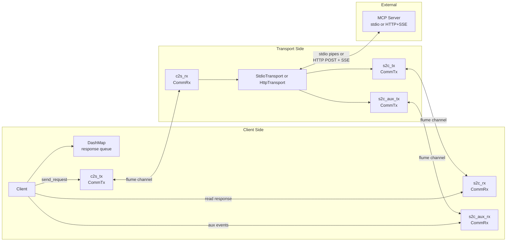

# rust-agentic — Overview

**Source:** `src/` — 54 Rust files across 12 modules. MCP (Model Context Protocol) client library implementing protocol version `2025-03-26`.

`rust-agentic` is a typed MCP client library that provides request/response/notification types for tools, resources, prompts, sampling, logging, and completion; stdio and HTTP transports; a `Client` struct with DashMap response queue and three async runner tasks; and a sampling handler abstraction for LLM proxying. It builds on `rpc-router` for JSON-RPC 2.0 compliance and `RpcId` generation.

## Architecture

```mermaid
flowchart TD
    subgraph "Client (client/)"
        CLIENT["Client\nArc<ClientInner>\nDashMap<RpcId, OneShot>\nsampling_handler"]
        CONN["connect()\nTrx pair → 3 runners"]
        SEND["send_request<T>()\nIntoMcpRequest → serialize → c2s_tx"]
    end

    subgraph "Transport Layer (client/transport/)"
        TRX["ClientTrx / TransportTrx\n3 flume channels:\nc2s, s2c, s2c_aux"]
        C2S["ClientTransport enum\nStdioTransport | HttpTransport"]
        STDIO["ClientStdioTransport\nspawn child process\nstdin/stdout/stderr pipes"]
        HTTP["ClientHttpTransport\nreqwest POST + SSE\nmcp-session-id tracking"]
    end

    subgraph "MCP Message Types (messages/)"
        MSG["McpMessage enum\nRequest | Notification\n| Response | Error"]
        REQ["McpRequest<P>\nid: RpcId, method, params"]
        RESP["McpResponse<R>\nid: RpcId, result"]
        NOTIF["McpNotification<P>\nmethod, params (no id)"]
        ERR["McpError\nid: RpcId, error: RpcError"]
    end

    subgraph "Domain Types"
        TOOLS["Tools\nlist, call, list_changed"]
        RESOURCES["Resources\nlist, read, subscribe\nlist_changed, updated"]
        PROMPTS["Prompts\nlist, get, list_changed"]
        SAMPLING["Sampling\ncreateMessage\nsampling handler"]
        CAPS["Capabilities\nClientCapabilities\nServerCapabilities"]
    end

    subgraph "Common (common/)"
        BASE["Role, Annotations\nPaginationParams\nIncludeContext"]
        LOG["LoggingLevel\nSetLevelParams\nLoggingMessageNotification"]
        PROG["ProgressToken\nProgressNotification"]
        COMP["CompletionReference\nCompleteParams"]
    end

    subgraph "Lifecycle"
        INIT["InitializeParams\nInitializeResult"]
        PING["PingParams → ()"]
    end

    CLIENT --> CONN
    CONN --> TRX
    TRX --> C2S
    C2S --> STDIO
    C2S --> HTTP
    CLIENT --> SEND
    SEND --> TRX

    MSG --> REQ
    MSG --> RESP
    MSG --> NOTIF
    MSG --> ERR

    CLIENT --> MSG
    CLIENT --> TOOLS
    CLIENT --> RESOURCES
    CLIENT --> PROMPTS
    CLIENT --> SAMPLING
    CLIENT --> CAPS
    CLIENT --> INIT
    INIT --> BASE
    LOG --> BASE
    PROG --> BASE
    COMP --> BASE
```



## MCP Protocol Version

```rust
// mcp/mod.rs:33
pub const LATEST_PROTOCOL_VERSION: &str = "2025-03-26";
```

The library targets the March 2025 version of the MCP specification. All types reference TypeScript spec definitions for alignment.

## Message Routing — McpMessage Dispatch

```rust
// mcp/messages/mcp_message.rs:145-260
pub enum McpMessage {
    Request(McpRequest<Value>),
    Notification(McpNotification<Value>),
    Response(McpResponse<Value>),
    Error(McpError),
}

impl McpMessage {
    pub fn from_value(value: Value) -> Result<Self> {
        let obj = value.as_object().ok_or(...)?;

        // 1. Has "result" → Response
        if obj.contains_key("result") {
            let resp: McpResponse = serde_json::from_value(value)?;
            return Ok(McpMessage::Response(resp));
        }

        // 2. Has "error" → Error
        if obj.contains_key("error") {
            let err: McpError = serde_json::from_value(value)?;
            return Ok(McpMessage::Error(err));
        }

        // 3. Has "method" + "id" → Request
        if obj.contains_key("method") && obj.contains_key("id") {
            let req: McpRequest = serde_json::from_value(value)?;
            return Ok(McpMessage::Request(req));
        }

        // 4. Has "method" + no "id" → Notification
        if obj.contains_key("method") && !obj.contains_key("id") {
            let notif: McpNotification = serde_json::from_value(value)?;
            return Ok(McpMessage::Notification(notif));
        }

        // 5. Unknown → McpMessageInvalidStructure
        Err(...)
    }
}
```

**Aha:** The dispatch logic is purely structural — it inspects JSON object keys without any schema knowledge. `"result"` takes precedence over `"error"`, which takes precedence over `"method"`. This is robust because JSON-RPC 2.0 guarantees these fields are mutually exclusive at the top level.

## Client Architecture



## IntoMcpRequest — Typed Request API

```rust
// mcp/messages/mcp_request.rs:41-51
pub trait IntoMcpRequest<P>: Serialize + Sized + Into<McpRequest<P>>
where
    Self::McpResult: DeserializeOwned,
{
    const METHOD: &'static str;
    type McpResult;

    fn into_mcp_request(self) -> McpRequest<P> {
        self.into()
    }
}

// Blanket impl for McpRequest itself (line 68-74)
impl<P> IntoMcpRequest<P> for McpRequest<P>
where
    P: IntoMcpRequest<P>,
{
    const METHOD: &'static str = P::METHOD;
    type McpResult = P::McpResult;
}
```

This trait enables two calling patterns:

```rust
// Pattern 1: Pass params directly
let result = client.send_request(ListToolsParams::new()).await?;

// Pattern 2: Pass a pre-built McpRequest
let req = McpRequest::new(some_rpc_id, ListToolsParams::new());
let result = client.send_request(req).await?;
```

**Aha:** The blanket impl `IntoMcpRequest<P> for McpRequest<P>` is clever — it lets `Client::send_request` accept both `P: IntoMcpRequest` and `McpRequest<P>` with a single generic parameter. The `From<P> for McpRequest<P>` impl auto-generates a UUID v7 Base58 ID when converting params directly.

## MCP Domain Request/Result Pattern

Every MCP domain follows the same pattern:

```
Params struct → IntoMcpRequest impl → Result struct
Notification params → IntoMcpNotification impl → McpNotification alias
```

Example from tools:

```rust
// ListToolsParams → ListToolsResult (request)
ListToolsParams implements IntoMcpRequest<ListToolsParams> {
    const METHOD: &'static str = "tools/list";
    type McpResult = ListToolsResult;
}

// ToolListChangedNotificationParams → ToolListChangedNotification
ToolListChangedNotificationParams implements IntoMcpNotification {
    const METHOD: &'static str = "notifications/tools/list_changed";
}
pub type ToolListChangedNotification = McpNotification<ToolListChangedNotificationParams>;
```

## Error Model

```rust
// mcp/error.rs
pub enum Error {
    Custom(String),
    McpError(rpc_router::RpcError),
    McpMessageNotAnObject { value: Value },
    McpMessageInvalidStructure { method: Option<String>, id: Option<RpcId>, value: Value },
    McpMessageDeserialization { method: Option<String>, id: Option<RpcId>, source: String },
    McpTryIntoFail { target_type: &'static str, detail: String },
    Transport(String),
}
```

Uses `derive_more` for `Display` and `From` conversions from external error types.

## Feature Flags and Dependencies

| Dependency | Purpose |
|------------|---------|
| `serde` / `serde_json` | JSON serialization/deserialization |
| `serde_with` | `skip_serializing_none`, `base64` encoding |
| `derive_more` | `Display`, `From` error conversions |
| `tokio` | Async runtime, process spawning, I/O |
| `flume` | Async channels (ClientTrx / TransportTrx) |
| `reqwest` | HTTP transport |
| `eventsource-stream` | SSE event parsing (HTTP transport) |
| `futures` | Stream utilities |
| `tracing` | Logging and debug output |
| `rpc-router` | JSON-RPC 2.0 types (RpcId, RpcRequest, RpcResponse) |
