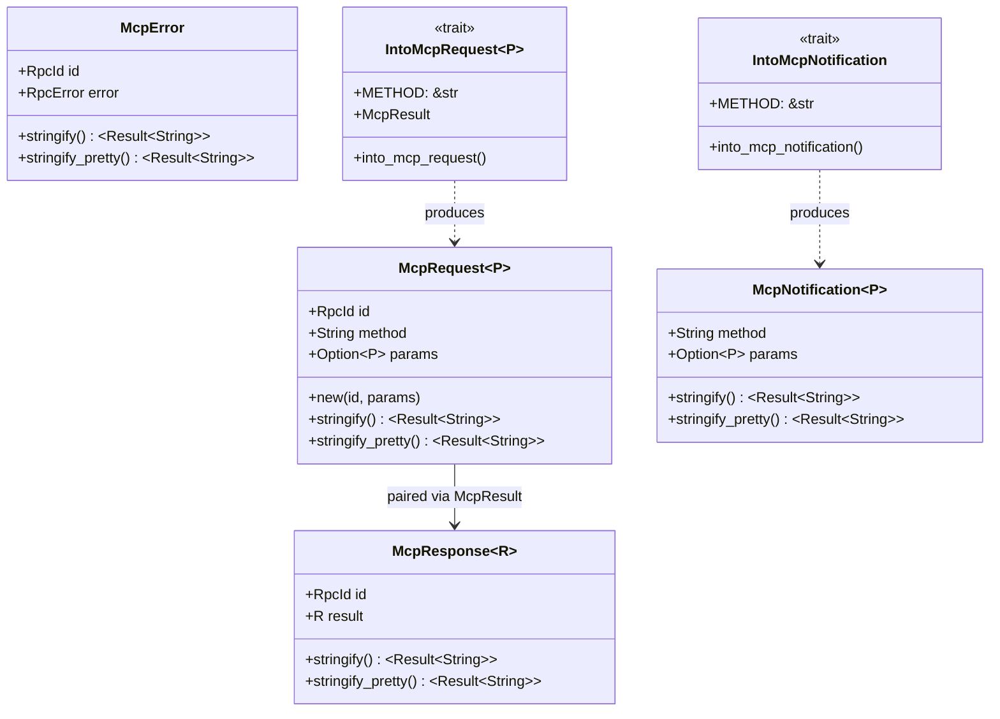

# rust-agentic — MCP Messages and Traits

**Source:** `messages/` — 5 files. McpMessage enum, McpRequest/McpResponse/McpNotification/McpError wrappers, and IntoMcpRequest/IntoMcpNotification traits.

## McpMessage — Unified Message Type

```rust
// mcp/messages/mcp_message.rs:7-16
pub enum McpMessage {
    Request(McpRequest<Value>),
    Notification(McpNotification<Value>),
    Response(McpResponse<Value>),
    Error(McpError),
}
```

All four JSON-RPC 2.0 message types are unified under a single enum with `Value` (untyped `serde_json::Value`) as the payload. Typed access requires `try_into_*` conversions.

### from_value — Structural Dispatch

```rust
// mcp/messages/mcp_message.rs:145-260
impl McpMessage {
    pub fn from_value(value: Value) -> Result<Self> {
        let obj = value.as_object().ok_or(McpMessageNotAnObject { ... })?;

        if obj.contains_key("result") {
            // Response: { "jsonrpc": "2.0", "id": ..., "result": { ... } }
            let resp: McpResponse = serde_json::from_value(value)
                .map_err(|e| McpMessageDeserialization { ... })?;
            return Ok(McpMessage::Response(resp));
        }

        if obj.contains_key("error") {
            // Error: { "jsonrpc": "2.0", "id": ..., "error": { "code": ..., "message": ... } }
            let err: McpError = serde_json::from_value(value)
                .map_err(|e| McpMessageDeserialization { ... })?;
            return Ok(McpMessage::Error(err));
        }

        if obj.contains_key("method") && obj.contains_key("id") {
            // Request: { "jsonrpc": "2.0", "id": ..., "method": "...", "params": { ... } }
            let req: McpRequest = serde_json::from_value(value)
                .map_err(|e| McpMessageDeserialization { ... })?;
            return Ok(McpMessage::Request(req));
        }

        if obj.contains_key("method") && !obj.contains_key("id") {
            // Notification: { "jsonrpc": "2.0", "method": "...", "params": { ... } }
            let notif: McpNotification = serde_json::from_value(value)
                .map_err(|e| McpMessageDeserialization { ... })?;
            return Ok(McpMessage::Notification(notif));
        }

        Err(McpMessageInvalidStructure { method: None, id: None, value })
    }
}
```

Dispatch priority: **result** → **error** → **method + id** → **method only**.

### McpMessage — JSON-RPC 2.0 Message Flow

```mermaid
flowchart TD
    JSON["Raw JSON string"]

    subgraph "McpMessage.from_value dispatch"
        OBJ["Parse as object?"]
        HAS_RESULT['Has "result" key?']
        HAS_ERROR['Has "error" key?']
        HAS_METHOD_ID['Has "method" + "id"?']
        HAS_METHOD['Has "method" only?']
        RESPONSE["McpMessage::Response\nMcpResponse<Value>"]
        ERROR["McpMessage::Error\nMcpError"]
        REQUEST["McpMessage::Request\nMcpRequest<Value>"]
        NOTIF["McpMessage::Notification\nMcpNotification<Value>"]
        INVALID["McpMessageInvalidStructure"]
    end

    subgraph "try_into_* typed conversion"
        TYPED_REQ["McpRequest<T>\ntyped params"]
        TYPED_RESP["McpResponse<T>\ntyped result"]
        TYPED_NOTIF["McpNotification<T>\ntyped params"]
    end

    JSON --> OBJ
    OBJ -->|yes| HAS_RESULT
    OBJ -->|no| INVALID

    HAS_RESULT -->|yes| RESPONSE
    HAS_RESULT -->|no| HAS_ERROR
    HAS_ERROR -->|yes| ERROR
    HAS_ERROR -->|no| HAS_METHOD_ID
    HAS_METHOD_ID -->|yes| REQUEST
    HAS_METHOD_ID -->|no| HAS_METHOD
    HAS_METHOD -->|yes| NOTIF
    HAS_METHOD -->|no| INVALID

    RESPONSE --> TYPED_RESP
    REQUEST --> TYPED_REQ
    NOTIF --> TYPED_NOTIF
```

### McpRequest / McpResponse / McpNotification — Structure Comparison



### try_into_* — Typed Conversions

```rust
impl McpMessage {
    pub fn try_into_request<T: DeserializeOwned>(self) -> Result<McpRequest<T>> { ... }
    pub fn try_into_response<T: DeserializeOwned>(self) -> Result<McpResponse<T>> { ... }
    pub fn try_into_notification<T: DeserializeOwned>(self) -> Result<McpNotification<T>> { ... }
}
```

Each method matches the enum variant and deserializes the `Value` payload into the concrete type `T`. Non-matching variants return `McpTryIntoFail { target_type, detail }`.

## McpRequest — Typed Outbound Requests

```rust
// mcp/messages/mcp_request.rs:7-17
pub struct McpRequest<P = Value> {
    pub id: RpcId,           // JSON-RPC request ID
    pub method: String,      // e.g., "tools/list"
    pub params: Option<P>,   // typed parameters
}
```

### Construction

```rust
// Direct (auto-generates UUID v7 Base58 ID)
let req: McpRequest<ListToolsParams> = ListToolsParams::new().into();

// Via IntoMcpRequest trait
McpRequest::new(some_rpc_id, CallToolParams::new("my_tool").with_arguments(args));
```

**Aha:** The `From<P> for McpRequest<P>` impl calls `RpcId::new_uuid_v7_base58()` automatically, so most code never needs to construct an `RpcId` directly.

### Serialization — Delegates to RpcRequest

```rust
// mcp/messages/mcp_request.rs:80-103
impl<P> Serialize for McpRequest<P>
where
    P: Serialize,
{
    fn serialize<S>(&self, serializer: S) -> Result<S::Ok, S::Error> {
        // 1. Convert params to Option<Value>
        let params_value = self.params.as_ref()
            .map(|p| serde_json::to_value(p).map_err(serde::ser::Error::custom)?);

        // 2. Build RpcRequest and serialize it
        let rpc_request = RpcRequest {
            id: self.id.clone(),
            method: self.method.clone(),
            params: params_value,
        };
        rpc_request.serialize(serializer)
    }
}
```

The `McpRequest` is a typed wrapper that serializes to the same JSON format as `rpc-router`'s `RpcRequest`. Deserialization reverses this: deserialize into `RpcRequest`, then convert `Value` params back to `P`.

## IntoMcpRequest — The Core Trait

```rust
// mcp/messages/mcp_request.rs:41-51
pub trait IntoMcpRequest<P>: Serialize + Sized + Into<McpRequest<P>>
where
    Self::McpResult: DeserializeOwned,
{
    const METHOD: &'static str;    // e.g., "tools/list"
    type McpResult;                // e.g., ListToolsResult
}
```

Two blanket implementations:

```rust
// 1. Params type converts to McpRequest
impl<P: Serialize + IntoMcpRequest<P>> From<P> for McpRequest<P> {
    fn from(params: P) -> Self {
        McpRequest {
            id: RpcId::new_uuid_v7_base58(),  // auto-generated
            method: P::METHOD.to_string(),
            params: Some(params),
        }
    }
}

// 2. McpRequest<P> itself implements IntoMcpRequest (identity pattern)
impl<P> IntoMcpRequest<P> for McpRequest<P>
where
    P: IntoMcpRequest<P>,
{
    const METHOD: &'static str = P::METHOD;
    type McpResult = P::McpResult;
}
```

The second impl is the key to the unified `send_request` API — it lets both `params` and `McpRequest<params>` satisfy the same trait bound.

## McpResponse — Typed Success Response

```rust
// mcp/messages/mcp_response.rs:12-15
pub struct McpResponse<R = Value> {
    pub id: RpcId,
    pub result: R,
}
```

**Aha:** `McpResponse` only represents success cases. Attempting to deserialize an `RpcErrorResponse` into `McpResponse` returns a deserialization error with the error code and message:

```rust
// mcp/messages/mcp_response.rs:70-77
RpcResponse::Error(err) => {
    Err(DeError::custom(format!(
        "Expected a success response, but got an error response: id={}, code={}, message='{}'",
        err.id, err.error.code, err.error.message
    )))
}
```

## McpNotification — Fire-and-Forget Messages

```rust
// mcp/messages/mcp_notification.rs:7-13
pub struct McpNotification<P = Value> {
    pub method: String,      // e.g., "notifications/tools/list_changed"
    pub params: Option<P>,
    // No `id` field — notifications have no response
}
```

### IntoMcpNotification Trait

```rust
// mcp/messages/mcp_notification.rs:26-31
pub trait IntoMcpNotification: Sized {
    const METHOD: &'static str;

    fn into_mcp_notification(self) -> McpNotification<Self> {
        self.into()
    }
}

impl<T: IntoMcpNotification> From<T> for McpNotification<T> {
    fn from(params: T) -> Self {
        McpNotification {
            method: T::METHOD.to_string(),
            params: Some(params),
        }
    }
}
```

No `RpcId` is generated — notifications are one-way messages with no expectation of response.

## McpError — Typed Error Response

```rust
// mcp/messages/mcp_error.rs:9-12
pub struct McpError {
    pub id: RpcId,
    pub error: RpcError,     // from rpc-router: code, message, optional data
}
```

Like `McpResponse`, this only represents error cases. Deserializing an `RpcSuccessResponse` into `McpError` returns an error.

## Extensive Test Suite

```rust
// mcp/messages/mcp_message.rs:270-540 (tests)
#[test]
fn test_from_value_valid_response() { ... }
#[test]
fn test_from_value_valid_error() { ... }
#[test]
fn test_from_value_valid_request() { ... }
#[test]
fn test_from_value_valid_notification() { ... }
#[test]
fn test_from_value_invalid_type() { ... }
#[test]
fn test_from_value_invalid_structure() { ... }
```

The test suite covers all dispatch branches including edge cases like missing `jsonrpc` field, unexpected field combinations, and non-object JSON values.
