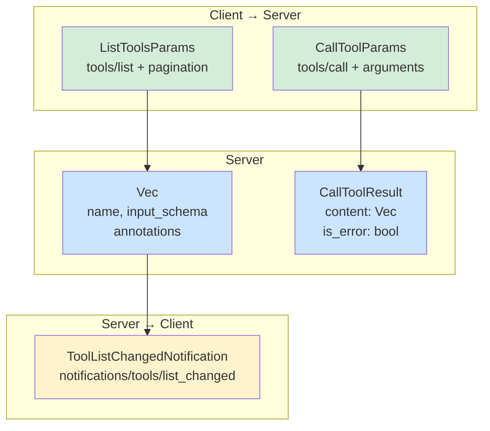
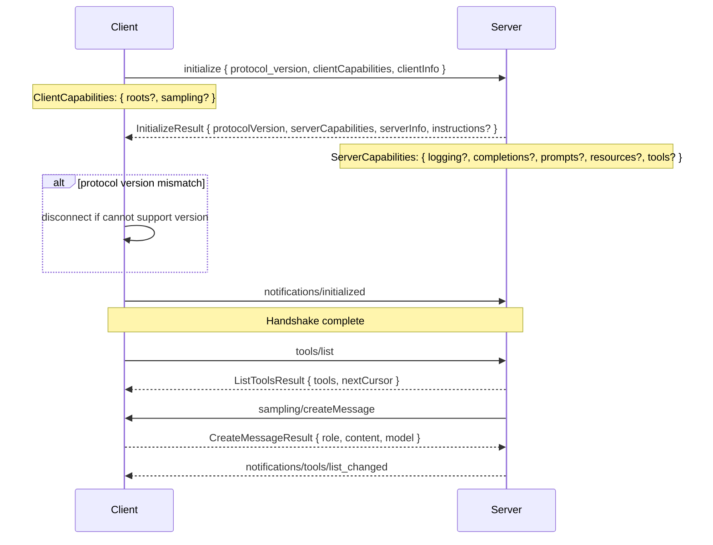

# rust-agentic — MCP Types and Domain Models

**Source:** `tools/`, `resources/`, `prompts/`, `sampling/`, `capabilities/`, `common/`, `roots.rs`, `lifecycle.rs` — 30 files. Full MCP protocol type definitions.

## Tools — Discovery and Invocation

### Tool Definition

```rust
// mcp/tools/types.rs:11-23
pub struct Tool {
    pub name: String,
    pub description: Option<String>,
    pub input_schema: ToolInputSchema,    // JSON Schema object
    pub annotations: Option<ToolAnnotations>,
}

pub struct ToolInputSchema {
    pub schema_type: String,               // always "object"
    pub properties: Option<Value>,         // JSON Schema properties
    pub required: Option<Vec<String>>,     // required field names
}
```

### ToolAnnotations — Hints for Clients

```rust
// mcp/tools/types.rs:94-120
pub struct ToolAnnotations {
    pub title: Option<String>,             // human-readable name
    pub read_only_hint: Option<bool>,      // does not modify environment
    pub destructive_hint: Option<bool>,    // may perform destructive updates
    pub idempotent_hint: Option<bool>,     // repeated calls have no additional effect
    pub open_world_hint: Option<bool>,     // interacts with external entities
}
```

**Aha:** All `ToolAnnotations` fields are **hints** — the spec explicitly states they are not guaranteed to be faithful descriptions. The `destructive_hint` is only meaningful when `read_only_hint == false`, and `idempotent_hint` only when both `read_only_hint == false` and `destructive_hint == true`.

### Tool Ecosystem — Discovery, Invocation, and Notification



### List Tools — Request and Result

```rust
// mcp/tools/requests.rs:16-23
pub struct ListToolsParams {
    pub meta: Option<RequestMeta>,
    #[serde(flatten)]
    pub pagination: PaginationParams,     // cursor-based
}

// mcp/tools/requests.rs:59-70
pub struct ListToolsResult {
    pub meta: Option<GenericMeta>,
    pub next_cursor: Option<Cursor>,      // pagination
    pub tools: Vec<Tool>,
}

impl IntoMcpRequest<ListToolsParams> for ListToolsParams {
    const METHOD: &'static str = "tools/list";
    type McpResult = ListToolsResult;
}
```

### Call Tool — Invocation

```rust
// mcp/tools/requests.rs:82-92
pub struct CallToolParams {
    pub meta: Option<RequestMeta>,
    pub name: String,
    pub arguments: Option<HashMap<String, Value>>,
}

// mcp/tools/requests.rs:148-160
pub struct CallToolResult {
    pub meta: Option<GenericMeta>,
    pub content: Vec<MessageContent>,     // Text, Image, Audio, Resource
    pub is_error: Option<bool>,           // true if tool failed
}
```

**Aha:** Tool errors are **protocol-level successes** with `is_error: true`. The server wraps tool failures inside `CallToolResult` so the LLM can see and self-correct. Only errors finding the tool itself become MCP protocol errors.

### Tool List Changed Notification

```rust
pub struct ToolListChangedNotificationParams { pub meta: Option<GenericMeta> }
impl IntoMcpNotification for ToolListChangedNotificationParams {
    const METHOD: &'static str = "notifications/tools/list_changed";
}
```

## Resources — Reading and Subscribing

### Resource Types

```rust
// mcp/resources/types.rs:12-34
pub struct Resource {
    pub uri: String,           // @format uri
    pub name: String,          // human-readable
    pub description: Option<String>,
    pub mime_type: Option<String>,
    pub annotations: Option<Annotations>,
    pub size: Option<i64>,     // bytes before base64
}

pub struct ResourceTemplate {
    pub uri_template: String,  // RFC 6570 URI template
    pub name: String,
    pub description: Option<String>,
    pub mime_type: Option<String>,
    pub annotations: Option<Annotations>,
}
```

### ResourceContents — Text or Blob

```rust
// mcp/resources/types.rs:133-163
pub enum ResourceContents {
    Text {
        uri: String,
        mime_type: Option<String>,
        text: String,
    },
    Blob {
        uri: String,
        mime_type: Option<String>,
        #[serde_as(as = "Base64")]
        blob: Vec<u8>,
    },
}
```

Tagged with `#[serde(tag = "type")]` — the `"type"` field in JSON determines variant.

### Resource Requests

| Method | Params | Result |
|--------|--------|--------|
| `resources/list` | `ListResourcesParams` (pagination) | `ListResourcesResult` (Vec<Resource>) |
| `resources/templates/list` | `ListResourceTemplatesParams` | `ListResourceTemplatesResult` |
| `resources/read` | `ReadResourceParams { uri }` | `ReadResourceResult { contents }` |
| `resources/subscribe` | `SubscribeParams { uri }` | `()` |
| `resources/unsubscribe` | `UnsubscribeParams { uri }` | `()` |

### Resource Notifications

| Method | Params | Description |
|--------|--------|-------------|
| `notifications/resources/list_changed` | `ResourceListChangedNotificationParams` | Server list changed |
| `notifications/resources/updated` | `ResourceUpdatedNotificationParams { uri }` | Specific resource changed |

The `updated` notification requires a prior `subscribe` request.

## Prompts — Templates and Retrieval

### Prompt Types

```rust
// mcp/prompts/types.rs:15-17
pub struct PromptMessage {
    pub role: Role,                    // User or Assistant
    pub content: MessageContent,       // Text, Image, Audio, Resource
}

pub struct Prompt {
    pub name: String,
    pub description: Option<String>,
    pub arguments: Option<Vec<PromptArgument>>,
}

pub struct PromptArgument {
    pub name: String,
    pub description: Option<String>,
    pub required: Option<bool>,
}
```

### MessageContent — Multi-modal Content

```rust
// mcp/prompts/types.rs:32-85
pub enum MessageContent {
    Text { text: String, annotations: Option<Annotations> },
    Image { data: Vec<u8>, mime_type: String, annotations: Option<Annotations> },
    Audio { data: Vec<u8>, mime_type: String, annotations: Option<Annotations> },
    Resource { resource: ResourceContents, annotations: Option<Annotations> },
}
```

Image and Audio use `#[serde_as(as = "Base64")]` for automatic base64 encoding/decoding.

### Prompt Requests

| Method | Params | Result |
|--------|--------|--------|
| `prompts/list` | `ListPromptsParams` (pagination) | `ListPromptsResult` (Vec<Prompt>) |
| `prompts/get` | `GetPromptParams { name, arguments }` | `GetPromptResult { messages }` |

### Prompt Notification

`notifications/prompts/list_changed` — server prompt list changed.

## Sampling — Server-to-Client LLM Requests

### Sampling Types

```rust
// mcp/sampling/types.rs:249-254
pub struct SamplingMessage {
    pub role: Role,
    pub content: SamplingContent,
}

pub enum SamplingContent {
    Text(TextContent),
    Image(ImageContent),
    Audio(AudioContent),
}
```

`SamplingContent` has `From<&str>` / `From<String>` impls for ergonomic text construction.

### Model Preferences

```rust
// mcp/sampling/types.rs:41-53
pub struct ModelPreferences {
    pub hints: Option<Vec<ModelHint>>,     // name hints
    pub cost_priority: Option<f64>,        // 0-1
    pub speed_priority: Option<f64>,       // 0-1
    pub intelligence_priority: Option<f64>,// 0-1
}
```

### Create Message — Server Requests LLM from Client

```rust
// mcp/sampling/requests.rs:17-44
pub struct CreateMessageParams {
    pub meta: Option<RequestMeta>,
    pub messages: Vec<SamplingMessage>,
    pub max_tokens: i64,
    pub model_preferences: Option<ModelPreferences>,
    pub system_prompt: Option<String>,
    pub include_context: Option<IncludeContext>,  // None/ThisServer/AllServers
    pub temperature: Option<f64>,
    pub stop_sequences: Option<Vec<String>>,
    pub metadata: Option<Value>,
}

pub struct CreateMessageResult {
    pub meta: Option<GenericMeta>,
    pub role: Role,
    pub content: SamplingContent,
    pub model: String,             // actual model used
    pub stop_reason: Option<String>,
}
```

**Aha:** `CreateMessageResult` extends `SamplingMessage` — the response includes `role` and `content` inline, plus `model` and `stop_reason`. The client may modify or omit the server's system prompt.

## Capabilities — Feature Negotiation

### ServerCapabilities

```rust
// mcp/capabilities/server_capabilities.rs:14-34
pub struct ServerCapabilities {
    pub experimental: Option<Value>,
    pub logging: bool,                  // serialized as {} if true
    pub completions: bool,              // serialized as {} if true
    pub prompts: Option<ServerPromptsCapabilities>,
    pub resources: Option<ServerResourcesCapabilities>,
    pub tools: Option<ServerToolsCapabilities>,
}
```

### Empty-Object Boolean Serialization

```rust
// mcp/capabilities/server_capabilities.rs:76-102
impl Serialize for ServerCapabilities {
    fn serialize<S>(&self, serializer: S) -> Result<S::Ok, S::Error> {
        let mut map = serializer.serialize_map(None)?;
        serialize_bool_as_empty_object::<S>(&mut map, "logging", self.logging)?;
        serialize_bool_as_empty_object::<S>(&mut map, "completions", self.completions)?;
        // ... other fields
        map.end()
    }
}
```

**Aha:** MCP uses `{}` (empty JSON object) as a feature flag — `true` serializes as `{}`, `false` is omitted entirely. The `serialize_bool_as_empty_object` helper and `is_empty_object` checker handle this convention. Both `ClientCapabilities` and `ServerCapabilities` use manual `Serialize`/`Deserialize` impls for this.

### Capabilities — Initialization Negotiation



### ClientCapabilities

```rust
// mcp/capabilities/client_capabilities.rs:14-24
pub struct ClientCapabilities {
    pub experimental: Option<Value>,
    pub roots: Option<ClientRootsCapabilities>,
    pub sampling: bool,                 // serialized as {} if true
}

pub struct ClientRootsCapabilities {
    pub list_changed: Option<bool>,     // supports roots list change notifications
}
```

## Lifecycle — Initialize and Ping

### Initialize Handshake

```rust
// mcp/lifecycle.rs:12-21
pub struct InitializeParams {
    pub meta: Option<RequestMeta>,
    pub protocol_version: String,
    pub capabilities: ClientCapabilities,
    pub client_info: Implementation,
}

// Constructor
impl InitializeParams {
    pub fn from_client_info(name: impl Into<String>, version: impl Into<String>) -> Self {
        Self {
            meta: None,
            protocol_version: crate::mcp::LATEST_PROTOCOL_VERSION.to_string(),
            capabilities: ClientCapabilities::default(),
            client_info: Implementation { name: name.into(), version: version.into() },
        }
    }
}

pub struct InitializeResult {
    pub meta: Option<GenericMeta>,
    pub protocol_version: String,     // may differ from client request
    pub capabilities: ServerCapabilities,
    pub server_info: Implementation,
    pub instructions: Option<String>,  // hint for model system prompt
}
```

**Aha:** The server may respond with a different `protocol_version` than the client requested. If the client cannot support that version, it must disconnect.

### Ping

```rust
pub struct PingParams { pub meta: Option<RequestMeta> }
impl IntoMcpRequest<PingParams> for PingParams {
    const METHOD: &'static str = "ping";
    type McpResult = ();
}
```

Ping returns `EmptyResult` — just an empty success response. Either side can send it.

## Roots — Server Access to Client Directories

```rust
// mcp/resources/types.rs:171-182
pub struct Root {
    pub uri: String,     // must start with file://
    pub name: Option<String>,
}

// mcp/roots.rs:16-26
pub struct ListRootsParams { pub meta: Option<RequestMeta> }
impl IntoMcpRequest<ListRootsParams> for ListRootsParams {
    const METHOD: &'static str = "roots/list";
    type McpResult = ListRootsResult;
}

pub struct ListRootsResult {
    pub meta: Option<GenericMeta>,
    pub roots: Vec<Root>,
}

// Notification: roots/list_changed ("notifications/roots/list_changed")
pub struct RootsListChangedNotificationParams { pub meta: Option<GenericMeta> }
```

### Lifecycle and Data Change Notifications

| Method | Params | Direction | Description |
|--------|--------|-----------|-------------|
| `notifications/cancelled` | `CancelledNotificationParams { request_id, reason }` | Either → Either | Cancel a pending request |
| `notifications/initialized` | `InitializedNotificationParams` | Client → Server | Initialization complete |
| `notifications/progress` | `ProgressNotificationParams { progress_token, progress, total }` | Either → Either | Long-running operation progress |
```

## Common Types

### Role

```rust
#[derive(Debug, Clone, Serialize, Deserialize, PartialEq, Eq)]
#[serde(rename_all = "lowercase")]
pub enum Role { User, Assistant }
```

### Annotations

```rust
// mcp/common/base.rs:67-78
pub struct Annotations {
    pub audience: Option<Vec<Role>>,    // ["user", "assistant"]
    pub priority: Option<f64>,          // 0 (least) to 1 (most)
}
```

### Pagination

```rust
pub struct PaginationParams {
    pub cursor: Option<Cursor>,         // opaque string
}
pub type Cursor = String;
```

### Progress

```rust
// Method: "notifications/progress"
#[derive(Debug, Clone, Serialize, Deserialize, PartialEq, Eq, From)]
#[serde(untagged)]
pub enum ProgressToken {
    String(String),
    Number(i64),
}

pub struct ProgressNotificationParams {
    pub meta: Option<GenericMeta>,
    pub progress_token: ProgressToken,
    pub progress: i64,
    pub total: Option<i64>,
    pub message: Option<String>,
}
```

### Logging

```rust
// mcp/common/logging.rs:10-20
pub enum LoggingLevel {
    Debug, Info, Notice, Warning, Error, Critical, Alert, Emergency,
}
// Maps to RFC-5424 syslog severity levels

// Method strings: "logging/setLevel" (SetLevelParams → ()),
// "notifications/message" (LoggingMessageNotificationParams)
```

### Include Context

```rust
pub enum IncludeContext { None, ThisServer, AllServers }
```

Controls whether MCP server context is included in sampling prompts.

### Completion

```rust
// Method: "completion/complete"
// mcp/common/completion.rs:11-16
pub enum CompletionReference {
    #[serde(rename = "ref/prompt")]
    Prompt(PromptReference),
    #[serde(rename = "ref/resource")]
    Resource(ResourceReference),
}

pub struct CompleteParams {
    pub meta: Option<RequestMeta>,
    pub reference: CompletionReference,
    pub argument: CompletionArgument { name, value },
}

pub struct CompleteResult {
    pub completion: CompletionResultData {
        values: Vec<String>,     // up to 100 items
        total: Option<u64>,
        has_more: Option<bool>,
    },
}
```

### Meta Types

```rust
// mcp/common/meta.rs:14-18
pub struct GenericMeta {
    #[serde(flatten)]
    pub inner: Option<Map<String, Value>>,
}

pub struct RequestMeta {
    pub progress_token: Option<ProgressToken>,
    #[serde(flatten)]
    pub extra: Option<Map<String, Value>>,
}
```

`RequestMeta` is attached to outgoing requests (supports progress tracking). `GenericMeta` is attached to results and notifications.
