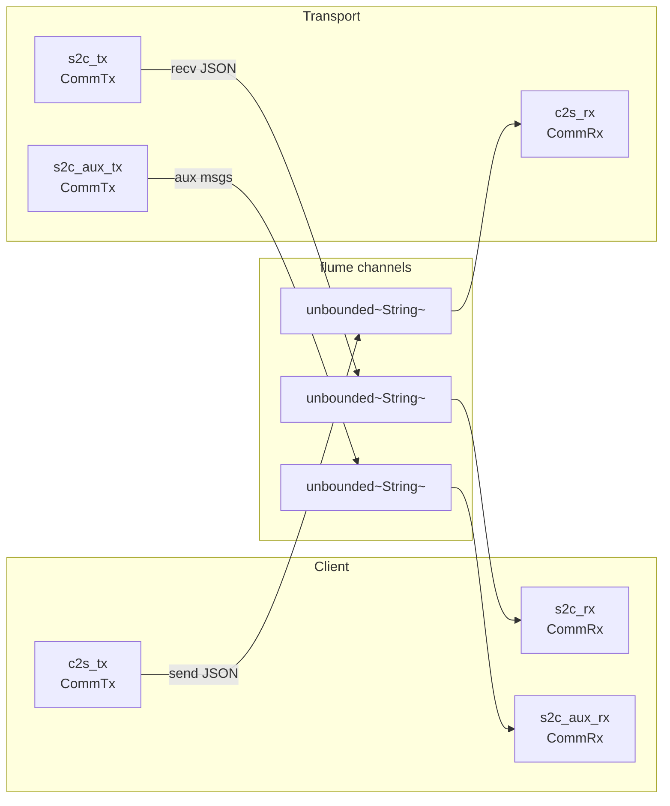
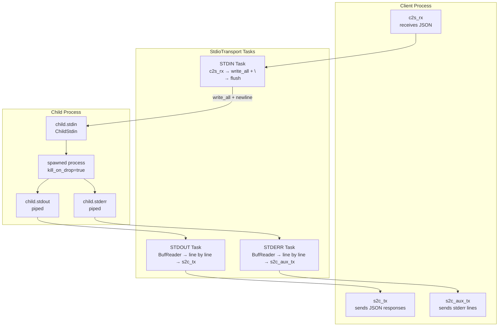

# rust-agentic — Client Architecture and Transports

**Source:** `client/`, `client/transport/` — 10 files. Client struct with DashMap response queue, stdio and HTTP transports, flume channel pairs, and sampling handler.

## Client — MCP Client Core

```rust
// mcp/client/client_impl.rs (simplified)
pub struct Client {
    inner: Arc<ClientInner>,
}

struct ClientInner {
    /// Pending request → OneShot response channel
    response_queue: DashMap<RpcId, oneshot::Sender<McpResponse<Value>>>,
    /// Sampling handler: server requests LLM from client
    sampling_handler: Arc<Box<dyn SamplingHandlerAsyncFn>>,
    /// ... transport fields
}
```

### connect() — Lifecycle

```rust
// mcp/client/client_impl.rs (connect method)
impl Client {
    pub async fn connect(
        &mut self,
        transport: impl IntoClientTransport,
    ) -> Result<ConnectResult> {
        // 1. Create communication channel pair
        let (client_trx, transport_trx) = TransportTrx::new_trx_pair();

        // 2. Start the transport (stdio or HTTP)
        let mut transport = transport.into_client_transport();
        transport.start(transport_trx).await?;

        // 3. Store client-side channel ends
        self.inner.c2s_tx = client_trx.c2s_tx;
        self.inner.s2c_rx = client_trx.s2c_rx;
        self.inner.s2c_aux_rx = client_trx.s2c_aux_rx;

        // 4. Spawn 3 runner tasks
        self.spawn_runners()?;

        // 5. Send initialize request
        let init_params = InitializeParams::from_client_info(&self.name, &self.version);
        let init_result = self.send_request(init_params).await?;

        Ok(ConnectResult { init_result })
    }
}
```

**Aha:** The client spawns **three** concurrent tasks after connecting:
1. `run_s2c_rx` — reads server responses and matches them to `DashMap` entries
2. `run_server_requests` — handles server-to-client requests (sampling)
3. `run_s2c_aux_rx` — handles auxiliary messages (stderr, SSE events)

### send_request — Typed API

```rust
// mcp/client/client_impl.rs (send_request method)
pub async fn send_request<P>(
    &self,
    params: impl IntoMcpRequest<P>,
) -> Result<P::McpResult>
where
    P::McpResult: DeserializeOwned,
{
    // 1. Convert params to McpRequest (auto-generates RpcId)
    let request: McpRequest<P> = params.into_mcp_request();
    let rpc_id = request.id.clone();

    // 2. Create OneShot channel for response
    let (tx, rx) = oneshot::channel();
    self.inner.response_queue.insert(rpc_id.clone(), tx);

    // 3. Serialize and send
    let json = request.stringify()?;
    self.inner.c2s_tx.send(json).await?;

    // 4. Wait for response
    let response = rx.await?;

    // 5. Deserialize typed result
    let result: P::McpResult = serde_json::from_value(response.result)?;
    Ok(result)
}
```

The `DashMap` allows concurrent requests without blocking each other — each `RpcId` maps to its own `OneShot` channel.

### Sampling Handler Registration

```rust
pub fn set_sampling_handler(
    &mut self,
    handler: impl IntoSamplingHandlerAsyncFn,
) {
    self.inner.sampling_handler = handler.into_sampling_handler();
}
```

When the server sends a `sampling/createMessage` request, the client invokes this handler to get an LLM response.

## Transport Channels — Trx Pair

```rust
// mcp/client/transport/comm_trx.rs:5-33
pub struct ClientTrx {
    pub c2s_tx: CommTx,       // client → transport (send requests)
    pub s2c_rx: CommRx,       // transport → client (receive responses)
    pub s2c_aux_rx: CommRx,   // transport → client (aux: stderr, events)
}

pub struct TransportTrx {
    pub c2s_rx: CommRx,       // receives from client
    pub s2c_tx: CommTx,       // sends to client
    pub s2c_aux_tx: CommTx,   // sends aux to client
}

pub fn new_trx_pair() -> (ClientTrx, TransportTrx) {
    let (c2s_tx, c2s_rx) = flume::unbounded::<String>();
    let (s2c_tx, s2c_rx) = flume::unbounded::<String>();
    let (s2c_aux_tx, s2c_aux_rx) = flume::unbounded::<String>();
    // ... wrap in CommTx/CommRx
}
```

Three independent `flume::unbounded` channels form a bidirectional communication bridge between client and transport.

### CommTx / CommRx — Channel Wrappers

```rust
#[derive(Clone)]
pub struct CommTx { tx: Sender<String> }
impl CommTx {
    pub async fn send(&self, item: impl Into<String>) -> Result<()> {
        self.tx.send_async(item.into()).await?;
        Ok(())
    }
}

pub struct CommRx { rx: Receiver<String> }
impl CommRx {
    pub async fn recv(&self) -> Result<String> {
        self.rx.recv_async().await
    }
}
```

Thin wrappers over `flume` channels that provide a `Result`-returning API.

### Trx Channel Topology



## IntoClientTransport — Sealed Trait

```rust
// mcp/client/into_client_transport.rs
pub trait Sealed {}

pub trait IntoClientTransport: Sealed {
    fn into_client_transport(self) -> ClientTransport;
}
```

**Aha:** The `Sealed` trait pattern prevents external crates from implementing `IntoClientTransport`. Only three types implement it:
- `ClientStdioTransportConfig`
- `ClientHttpTransportConfig`
- `ClientTransport` (identity impl, internal use)

## ClientTransport — Enum Dispatcher

```rust
// mcp/client/transport/client_transport.rs:10-13
#[derive(From)]
pub enum ClientTransport {
    StdioTransport(ClientStdioTransport),
    HttpTransport(ClientHttpTransport),
}

impl ClientTransport {
    pub(crate) async fn start(&mut self, transport_trx: TransportTrx) -> Result<()> {
        match self {
            Self::StdioTransport(t) => t.start(transport_trx).await?,
            Self::HttpTransport(t) => t.start(transport_trx).await?,
        }
        Ok(())
    }
}
```

`derive(From)` generates conversions from both config types. `From` impls also exist for `ClientStdioTransportConfig` and `ClientHttpTransportConfig`.

## Stdio Transport — Child Process

```rust
// mcp/client/transport/stdio/stdio_config.rs
pub struct ClientStdioTransportConfig {
    pub cmd: String,
    pub args: Vec<String>,
    pub current_dir: Option<String>,
}

impl ClientStdioTransportConfig {
    pub fn new<I, S>(cmd: S, args: I, current_dir: Option<String>) -> Self
    where
        S: Into<String>,
        I: IntoIterator<Item: Into<String>>,
    {
        Self { cmd: cmd.into(), args: args.into_iter().map(Into::into).collect(), current_dir }
    }
}
```

### StdioTransport.start() — Three Tokio Tasks



```rust
// mcp/client/transport/stdio/stdio_transport.rs:22-122
pub struct ClientStdioTransport {
    config: Arc<ClientStdioTransportConfig>,
    inner: Option<Arc<ClientStdioTransportInner>>,
}

impl ClientStdioTransport {
    pub(crate) async fn start(&mut self, transport_trx: TransportTrx) -> Result<()> {
        // 1. Spawn child process with piped stdin/stdout/stderr
        let mut child = Command::new(&self.config.cmd)
            .stdin(Stdio::piped())
            .stdout(Stdio::piped())
            .stderr(Stdio::piped())
            .kill_on_drop(true)
            .spawn()?;

        // 2. STDERR task: read lines → s2c_aux_tx
        tokio::spawn(async move {
            let reader = BufReader::new(child_stderr);
            loop {
                match reader.next_line().await {
                    Ok(Some(line)) => s2c_aux_tx.send(line).await?,
                    Ok(None) | Err(_) => break,
                }
            }
        });

        // 3. STDOUT task: read lines → s2c_tx
        tokio::spawn(async move {
            let reader = BufReader::new(child_stdout);
            loop {
                match reader.next_line().await {
                    Ok(Some(line)) => s2c_tx.send(line).await?,
                    Ok(None) | Err(_) => break,
                }
            }
        });

        // 4. STDIN task: receive from c2s_rx → write to child_stdin
        tokio::spawn(async move {
            while let Ok(txt) = c2s_rx.recv().await {
                send_to_stdin(&mut child_stdin, &txt).await?;
            }
        });
    }
}
```

### send_to_stdin — Newline Protocol

```rust
// mcp/client/transport/stdio/stdio_transport.rs:138-159
async fn send_to_stdin(child_stdin: &mut ChildStdin, payload: &str) -> Result<()> {
    child_stdin.write_all(payload.as_bytes()).await?;  // JSON message
    child_stdin.write_all(b"\n").await?;               // newline delimiter
    child_stdin.flush().await?;                        // ensure delivery
    Ok(())
}
```

Each JSON-RPC message is written as a single line followed by `\n`. The stdout reader splits on newlines — this is the standard MCP stdio line-delimited JSON protocol.

**Aha:** `kill_on_drop(true)` ensures the child process is terminated when the `Child` handle is dropped, preventing orphan processes.

## HTTP Transport — reqwest + SSE

```rust
// mcp/client/transport/http/http_config.rs
pub struct ClientHttpTransportConfig {
    pub url: String,
}

// mcp/client/transport/http/http_transport.rs
pub struct ClientHttpTransport {
    config: Arc<ClientHttpTransportConfig>,
}
```

### HTTP Request Flow

```rust
// mcp/client/transport/http/http_transport.rs:18-104
impl ClientHttpTransport {
    pub(crate) async fn start(&mut self, transport_trx: TransportTrx) -> Result<()> {
        let req_client = reqwest::ClientBuilder::new().build()?;
        let session_id_holder: Arc<Mutex<Option<String>>> = Arc::default();

        tokio::spawn(async move {
            while let Ok(txt) = in_rx.recv().await {
                // 1. Build POST request
                let req = req_client
                    .post(&config.url)
                    .header(CONTENT_TYPE, "application/json")
                    .header(ACCEPT, "text/event-stream, application/json")
                    .body(txt);

                // 2. Add mcp-session-id header if we have one
                if let Some(session_id) = session_holder_guard.as_ref() {
                    req = req.header("mcp-session-id", session_id);
                }

                // 3. Send and handle response
                let res = req.send().await;

                // 4. Extract and validate session ID
                if let Some(session_id) = res.headers().get("mcp-session-id") {
                    // First response: store it; subsequent: verify match
                }

                // 5. Route by Content-Type
                match res_content_type {
                    Some("text/event-stream") => process_sse_event(res, &out_tx).await,
                    Some("application/json") | None => {
                        let txt = res.text().await?;
                        out_tx.send(txt).await?;
                    }
                    _ => error!("non-supported content type"),
                }
            }
        });
    }
}
```

### SSE Event Processing

```rust
async fn process_sse_event(res: Response, out_tx: &CommTx) -> Result<()> {
    let mut stream = res.bytes_stream().eventsource();
    while let Some(event) = stream.next().await {
        match event {
            Ok(event) => out_tx.send(event.data).await?,
            Err(e) => error!("stream event error: {}", e),
        }
    }
    Ok(())
}
```

Uses `eventsource-stream` to parse Server-Sent Events, extracting the `data` field of each event as a JSON-RPC message.

**Aha:** The HTTP transport has a warning comment: "Not fully implemented yet. Not to be used (use StdioTransport for now)". The session ID tracking works but has TODOs for edge cases. Content-Type handling falls back to treating `None` as JSON — needed for servers that send JSON-RPC errors without a content type header.

### mcp-session-id Tracking

```rust
let res_session_id = res.headers().get("mcp-session-id").and_then(|v| v.to_str().ok());
match (holder_sid, res_session_id) {
    (None, Some(session_id)) => {
        *session_holder_guard = Some(session_id.to_string());  // first time
    }
    (Some(holder_sid), Some(session_id)) => {
        if holder_sid != session_id {
            error!("MCP Server did not send matching session id. Abort");
            continue;  // skip mismatched responses
        }
    }
    _ => (),
}
```

The first server response establishes the session ID. Subsequent requests must include it, and responses must match it.

## SamplingHandlerAsyncFn — LLM Proxy Trait

```rust
// mcp/client/sampling_handler.rs:6-17
pub trait SamplingHandlerAsyncFn: Send + Sync {
    fn exec_fn(
        &self,
        create_message_params: CreateMessageParams,
    ) -> Pin<Box<dyn Future<Output = Result<CreateMessageResult>> + Send>>;
}
```

### IntoSamplingHandlerAsyncFn — Generic Function Adaptation

```rust
// mcp/client/sampling_handler.rs:57-69
impl<F, Fut> IntoSamplingHandlerAsyncFn for F
where
    F: FnOnce(CreateMessageParams) -> Fut + Send + Sync + Clone + 'static,
    Fut: Future<Output = Result<CreateMessageResult>> + Send + 'static,
{
    fn into_sampling_handler(self) -> Arc<Box<dyn SamplingHandlerAsyncFn>> {
        let adapter = GenericFnAdapter { f: self, _phantom: PhantomData };
        Arc::new(Box::new(adapter))
    }
}
```

**Aha:** The `GenericFnAdapter` wraps any async function `fn(CreateMessageParams) -> impl Future<...>` into a trait object. The `Clone + 'static` bounds allow the adapter to clone the closure for each invocation. This lets users register sampling handlers as plain async functions rather than implementing a trait.

## Transport Error Model

```rust
// mcp/client/transport/error.rs:8-18
pub enum Error {
    Custom(String),
    CommSend(String),          // flume send failure
    CommRecv(RecvError),       // flume recv failure
    Reqwest(reqwest::Error),   // HTTP failure
}

impl From<Error> for crate::mcp::Error {
    fn from(value: Error) -> Self {
        crate::mcp::Error::Transport(value.to_string())
    }
}
```

Transport errors convert into the top-level `mcp::Error::Transport` variant, preserving the error string.

## StdioHandles — Process Lifecycle

```rust
// mcp/client/transport/support.rs:7-24
pub(super) struct StdioHandles {
    child: Child,              // the spawned process
    stdin: JoinHandle<()>,     // stdin writing task
    stdout: JoinHandle<()>,    // stdout reading task
    stderr: JoinHandle<()>,    // stderr reading task
}
```

Wraps the child process and all three I/O tasks together. The inner handle holder ensures the child stays alive as long as the transport exists.

## Support Utilities

```rust
// mcp/support.rs
pub fn serialize_bool_as_empty_object<S>(map: &mut S::SerializeMap, key: &str, value: bool) {
    if value { map.serialize_entry(key, &serde_json::json!({}))?; }
    Ok(())
}

pub fn is_empty_object(value: &Value) -> bool {
    value.is_object() && value.as_object().is_some_and(|m| m.is_empty())
}

pub fn truncate(s: &str, max: usize) -> String {
    if s.chars().count() <= max { s.to_string() }
    else { /* truncate with "..." */ }
}
```

`truncate` is character-aware (not byte-aware), iterating through Unicode code points to avoid splitting multi-byte characters.
