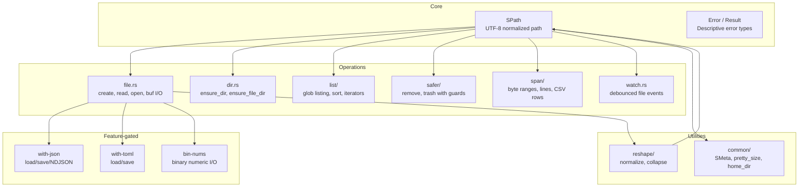

# simple-fs — Overview

**Source:** `src/` — 39 Rust files. Version 0.12.0-WIP. MIT OR Apache-2.0.

simple-fs is a Rust crate providing a simple and convenient API for file system access. It centers around `SPath` — a UTF-8 guaranteed, POSIX-normalized path wrapper — and provides: glob-filtered file listing, safe delete/trash, byte-range span reading, debounced file watching, and feature-gated JSON/TOML/binary serialization.

**Aha:** The core design principle is **SPath as the universal currency**. Every API accepts, transforms, or returns `SPath`. The type guarantees UTF-8 validity and POSIX-style normalization (forward slashes, collapsed `//`, resolved `/./`) on construction, so downstream code never needs to handle encoding errors or cross-platform path separators.

## Architecture at a Glance



## Public API

### One-liners

```rust
// Read a file
let content = simple_fs::read_to_string("path/to/file.txt")?;

// List files with glob
let files = simple_fs::list_files("./", Some(&["**/*.rs"]), None)?;

// Safe directory removal
simple_fs::safer_remove_dir(&SPath::new("build"), ())?;

// Get file metadata
let meta = SPath::new("data.csv").meta()?;
```

### SPath — The Universal Path Type

```rust
// spath.rs:25-29
pub fn new(path: impl Into<Utf8PathBuf>) -> Self {
    let path_buf = path.into();
    let path_buf = reshape::into_normalized(path_buf);
    Self { path_buf }
}
```

SPath guarantees:
- UTF-8 validity (construction from `PathBuf` returns `Result`)
- POSIX normalization: `\\` → `/`, `//` → `/`, `/./` → `/`
- `..` segments preserved unless explicitly collapsed

```rust
// Construction
let path = SPath::new("/some/path/file.txt");    // From &str
let path = SPath::from_std_path(path_ref)?;       // From std::path::Path
let path = SPath::from_walkdir_entry(entry)?;     // From walkdir::DirEntry

// Access
path.as_str()          // → &str
path.name()            // → "file.txt"
path.stem()            // → "file"
path.ext()             // → "txt"
path.parent_name()     // → "path"

// Transform
let parent = path.parent()?;
let joined = path.join("subdir");
let collapsed = path.collapse();       // Resolves .. without I/O
let diffed = path.diff(&base)?;        // Relative path from base

// Metadata
let meta = path.meta()?;               // SMeta: size, timestamps, is_file, is_dir
let is_text = path.is_likely_text();   // MIME + extension-based detection
```

### File Listing

```rust
// List all Rust files, excluding .git and .DS_Store (default)
let files = simple_fs::list_files("./", Some(&["**/*.rs"]), None)?;

// With exclude patterns and relative globs
let opts = ListOptions::new(Some(&["**/target/**", "**/.git/**"]))
    .with_relative_glob();
let files = simple_fs::list_files("./src", Some(&["**/*.rs"]), Some(opts))?;

// Sort by glob priority
let globs = ["src/main.rs", "src/lib/**/*.*", "src/**/*.*"];
let sorted = simple_fs::sort_by_globs(files, &globs, false)?;
```

### JSON/TOML (feature-gated)

```rust
// Requires: features = ["with-json"]
let data: MyConfig = simple_fs::load_json("config.json")?;
simple_fs::save_json_pretty("config.json", &data)?;

// NDJSON streaming
let values = simple_fs::load_ndjson("data.ndjson")?;
for value in simple_fs::stream_ndjson("data.ndjson")? {
    let v = value?;
}
```

### Safer Remove/Trash

```rust
// Safe delete: must be below cwd and contain "build" or "target"
simple_fs::safer_remove_dir(
    &SPath::new("target/debug"),
    &["build", "target"]  // must_contain_any
)?;

// Safe trash: same safety checks, sends to system trash
simple_fs::safer_trash_file(
    &SPath::new("temp/output.txt"),
    ()
)?;
```

## Key Types

| Type | Source | Purpose |
|------|--------|---------|
| `SPath` | `spath.rs` | UTF-8 guaranteed, POSIX-normalized path wrapper |
| `SMeta` | `smeta.rs` | Simplified metadata: size, timestamps, is_file, is_dir |
| `Error` | `error.rs` | Comprehensive error enum with path + cause |
| `Result<T>` | `error.rs` | `core::result::Result<T, Error>` |
| `ListOptions` | `list/list_options.rs` | Glob listing configuration: excludes, relative, depth |
| `SEvent` | `watch.rs` | Simplified file event: path + kind (Create/Modify/Remove/Other) |
| `SEventKind` | `watch.rs` | Create, Modify, Remove, Other |
| `SWatcher` | `watch.rs` | Debounced file watcher with flume receiver |
| `SaferRemoveOptions` | `safer/safer_remove_options.rs` | Safety guards for delete operations |
| `SaferTrashOptions` | `safer/safer_trash_options.rs` | Safety guards for trash operations |
| `PrettySizeOptions` | `common/pretty.rs` | Human-readable file size formatting |
| `SortByGlobsOptions` | `list/sort.rs` | Glob-based sort configuration |

## Feature Flags

| Feature | Enables | Dependencies |
|---------|---------|--------------|
| `with-json` | `load_json`, `save_json`, NDJSON | serde, serde_json |
| `with-toml` | `load_toml`, `save_toml` | serde, toml |
| `bin-nums` | Binary numeric load/save (f64, u32, etc.) | byteorder |
| `full` | All of the above | — |

Default: no features enabled. Core functionality (SPath, listing, spans, safer, watch) works without any features.

## What to Read Next

- [Architecture](01-architecture.md) for module structure, error model, feature flags
- [SPath](02-spath.md) for the path type in depth
- [Listing](03-listing.md) for glob-based file listing and sorting
- [Spans, Safer, Watch](04-spans-safer-watch.md) for span reading, safe deletion, file watching
- [Features](05-features.md) for JSON, TOML, binary numbers, pretty size
