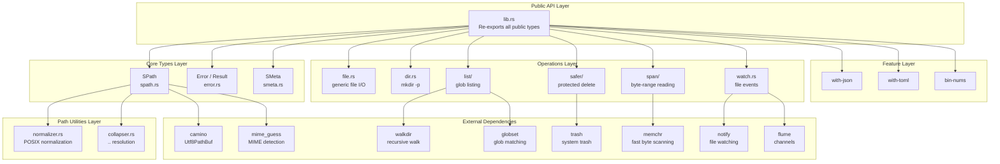
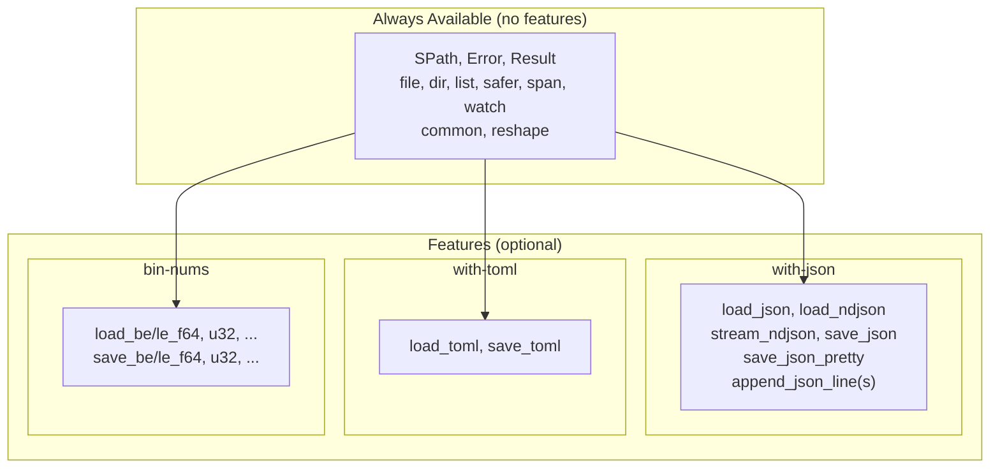

# simple-fs — Architecture

**Source:** 39 Rust files across 10 top-level modules. Version 0.12.0-WIP.

simple-fs is organized around `SPath` as the universal path type, with operations grouped into dedicated modules: file I/O, directory management, listing, safer operations, spans, watching, and feature-gated serialization.

## Module Structure

```
src/
├── lib.rs                          # Re-exports everything from submodules
├── error.rs                        # Error enum + Cause + PathAndCause
├── spath.rs                        # SPath: UTF-8 normalized path wrapper
├── file.rs                         # File I/O helpers
├── dir.rs                          # Directory creation helpers
│
├── common/
│   ├── mod.rs
│   ├── smeta.rs                    # SMeta: simplified metadata
│   ├── pretty.rs                   # pretty_size formatting
│   └── system.rs                   # home_dir, current_dir
│
├── reshape/
│   ├── mod.rs
│   ├── normalizer.rs               # POSIX normalization
│   └── collapser.rs                # .. resolution without I/O
│
├── list/
│   ├── mod.rs
│   ├── glob.rs                     # GlobSet building, depth computation
│   ├── globs_file_iter.rs          # WalkDir-based file listing (~600 LOC)
│   ├── globs_dir_iter.rs           # WalkDir-based directory listing
│   ├── iter_files.rs               # iter_files / list_files API
│   ├── iter_dirs.rs                # iter_dirs / list_dirs API
│   ├── list_options.rs             # ListOptions configuration
│   └── sort.rs                     # sort_by_globs
│
├── span/
│   ├── mod.rs
│   ├── read_span.rs                # Byte-range reading via platform I/O
│   ├── line_spans.rs               # Streaming line span detection
│   └── csv_spans.rs                # CSV-aware row span detection
│
├── safer/
│   ├── mod.rs
│   ├── safer_remove_impl.rs        # safer_remove_dir, safer_remove_file
│   ├── safer_remove_options.rs     # SaferRemoveOptions
│   ├── safer_trash_impl.rs         # safer_trash_dir, safer_trash_file
│   ├── safer_trash_options.rs      # SaferTrashOptions
│   └── support.rs                  # check_path_safety_causes
│
├── featured/
│   ├── mod.rs                      # Feature-gated re-exports
│   ├── with_json/
│   │   ├── mod.rs
│   │   ├── load.rs                 # load_json, load_ndjson, stream_ndjson
│   │   ├── save.rs                 # save_json, append_json_lines
│   │   └── ndjson.rs               # NDJSON parsing
│   ├── with_toml.rs                # load_toml, save_toml
│   └── bin_nums.rs                 # Binary numeric load/save (macro-generated)
│
├── watch.rs                        # SWatcher, SEvent, debounced watching
└── _tests/tests_spath.rs           # SPath tests
```

## Layer Architecture



## Error Model

```rust
// error.rs:9-129
pub enum Error {
    // -- Path errors
    PathNotUtf8(String),
    HomeDirNotFound,
    PathHasNoFileName(String),
    StripPrefix { prefix: String, path: String },

    // -- File errors
    FileNotFound(String),
    FileCantOpen(PathAndCause),
    FileCantRead(PathAndCause),
    FileCantWrite(PathAndCause),
    FileCantCreate(PathAndCause),
    FileHasNoParent(String),

    // -- Remove/Trash errors (safety-guarded)
    FileNotSafeToRemove(PathAndCause),
    DirNotSafeToRemove(PathAndCause),
    FileNotSafeToTrash(PathAndCause),
    DirNotSafeToTrash(PathAndCause),
    CantTrash(PathAndCause),

    // -- Metadata/sort/glob/watch/span errors
    SortByGlobs { cause: String },
    CantGetMetadata(PathAndCause),
    CantGetMetadataModified(PathAndCause),
    CantGetDurationSystemTimeError(SystemTimeError),
    DirCantCreateAll(PathAndCause),
    PathNotValidForPath(PathAndCause),
    GlobCantNew { glob: String, cause: globset::Error },
    GlobSetCantBuild { globs: Vec<String>, cause: globset::Error },
    FailToWatch { path: String, cause: String },
    CantWatchPathNotFound(String),
    SpanInvalidStartAfterEnd,
    SpanOutOfBounds,
    SpanInvalidUtf8,
    CannotDiff { path: String, base: String },
    CannotCanonicalize(PathAndCause),

    // -- Feature-gated errors
    JsonCantRead(PathAndCause),
    JsonCantWrite(PathAndCause),
    NdJson(String),
    TomlCantRead(PathAndCause),
    TomlCantWrite(PathAndCause),
}
```

The error hierarchy follows a consistent pattern:

| Error category | Data carried | Display format |
|---------------|--------------|----------------|
| Simple | `String` | `"Message: '{value}'"` |
| Path + cause | `PathAndCause` | `"Cannot X at '{path}'\nCause: {cause}"` |
| Structured | Named fields | `"Message: '{field}'"` |

### PathAndCause

```rust
// error.rs:159-163
pub struct PathAndCause {
    pub path: String,
    pub cause: Cause,
}
```

### Cause Enum

```rust
// error.rs:141-157
pub enum Cause {
    Custom(String),
    Io(Box<io::Error>),
    SerdeJson(Box<serde_json::Error>),      // with-json
    TomlDe(Box<toml::de::Error>),           // with-toml
    TomlSer(Box<toml::ser::Error>),         // with-toml
}
```

The `Cause` enum wraps underlying errors with `Box` to keep `Error` size small. Feature-gated variants are only compiled when the corresponding feature is enabled.

**Aha:** The `derive_more` crate provides `#[derive(Display, From)]` on `Cause`, which auto-generates `From<io::Error>` and display formatting. This eliminates boilerplate and ensures the `?` operator automatically wraps `io::Error` into `Cause::Io`.

## Feature-Gated Architecture



Each feature module is guarded by `#[cfg(feature = "feature-name")]`:

```rust
// featured/mod.rs:3-17
#[cfg(feature = "bin-nums")]
mod bin_nums;
#[cfg(feature = "with-json")]
mod with_json;
#[cfg(feature = "with-toml")]
mod with_toml;

#[cfg(feature = "with-json")]
pub use with_json::*;
```

And error variants are similarly guarded:

```rust
// error.rs:112-128
#[cfg(feature = "with-json")]
#[display("Cannot read json path '{}'\nCause: {}", _0.path, _0.cause)]
JsonCantRead(PathAndCause),
```

This means the `Error` enum shrinks when features are disabled — no unused variants are compiled.

## SPath Contract (High Level)

SPath's construction guarantees are central to the crate:

```rust
// spath.rs:9-18
/// An SPath is a posix normalized Path using camino Utf8PathBuf as storage.
/// - It's Posix normalized `/`, all redundant `//` and `/./` are removed
/// - It does not collapse `..` segments by default, use collapse APIs for that
/// - Guaranteed to be UTF8
pub struct SPath {
    pub(crate) path_buf: Utf8PathBuf,
}
```

Every public API either accepts `impl Into<SPath>` or returns `SPath`. The `AsRef` implementations allow ergonomic interop with standard library types:

```rust
// spath.rs:625-647
impl AsRef<SPath> for SPath { ... }
impl AsRef<Path> for SPath { ... }
impl AsRef<Utf8Path> for SPath { ... }
impl AsRef<str> for SPath { ... }
```

This means any function accepting `impl AsRef<SPath>` also works with `&SPath`, and can be passed anywhere expecting `AsRef<Path>` or `&str`.

## What to Read Next

- [SPath](02-spath.md) for the path type in depth: normalization, collapse, transformers, MIME
- [Listing](03-listing.md) for glob-based file listing and sort_by_globs
- [Spans, Safer, Watch](04-spans-safer-watch.md) for span reading, safe deletion, file watching
- [Features](05-features.md) for JSON, TOML, binary numbers, pretty size
