# simple-fs — SPath

**Source:** `spath.rs` — 773 lines.

SPath is the central type of simple-fs: a UTF-8 guaranteed, POSIX-normalized path wrapper backed by `camino::Utf8PathBuf`.

## SPath Contract

```rust
// spath.rs:9-18
pub struct SPath {
    pub(crate) path_buf: Utf8PathBuf,
}
```

Three guarantees on construction:

| Guarantee | How |
|-----------|-----|
| UTF-8 | `Utf8PathBuf::from_path_buf` returns `Err` if non-UTF-8 |
| POSIX `/` separators | `reshape::into_normalized` converts `\` to `/` |
| No redundant `//` or `/./` | `into_normalized` collapses these |

Not guaranteed on construction: `..` segments are **not** resolved. Use `collapse()` for that.

## Constructor Hierarchy

```mermaid
flowchart TD
    subgraph "Infallible (SPath::new)"
        NEW["new(path: impl Into&lt;Utf8PathBuf&gt;)\nNormalizes, always succeeds"]
    end

    subgraph "Fallible (Result)"
        FROM_STD["from_std_path(path: impl AsRef&lt;Path&gt;)\nValidates UTF-8 first"]
        FROM_STD_BUF["from_std_path_buf(PathBuf)\nValidates UTF-8 first"]
        FROM_WD["from_walkdir_entry(DirEntry)\nValidates UTF-8 first"]
        FROM_FS["from_fs_entry(DirEntry)\nValidates UTF-8 first"]
    end

    subgraph "Option (filter_map friendly)"
        FROM_OK["from_std_path_ok(path)\nReturns None on non-UTF-8"]
        FROM_BUF_OK["from_std_path_buf_ok(PathBuf)"]
        FROM_FS_OK["from_fs_entry_ok(DirEntry)"]
        FROM_WD_OK["from_walkdir_entry_ok(DirEntry)"]
    end

    subgraph "From trait impls"
        FROM_STR["From&lt;&str&gt;, From&lt;String&gt;"]
        FROM_U8["From&lt;Utf8PathBuf&gt;, From&lt;&Utf8Path&gt;"]
        TRY["TryFrom&lt;PathBuf&gt;, TryFrom&lt;walkdir::DirEntry&gt;"]
    end

    NEW --> SPATH["SPath instance"]
    FROM_STD --> SPATH
    FROM_STD_BUF --> SPATH
    FROM_WD --> SPATH
    FROM_FS --> SPATH
    FROM_OK --> SPATH
    FROM_STR --> SPATH
    FROM_U8 --> SPATH
    TRY --> SPATH
```



### The Normalizing Constructor

```rust
// spath.rs:25-29
pub fn new(path: impl Into<Utf8PathBuf>) -> Self {
    let path_buf = path.into();
    let path_buf = reshape::into_normalized(path_buf);
    Self { path_buf }
}
```

Every constructor eventually calls `SPath::new`, which runs the path through `into_normalized`:

```rust
// reshape/normalizer.rs:51-124
pub fn into_normalized(path: Utf8PathBuf) -> Utf8PathBuf {
    // Quick check — returns unchanged if already normalized
    if !needs_normalize(&path) { return path; }

    // Transforms: \\ → /, // → /, /./ → /, \\?\ prefix removed
    let mut result = String::with_capacity(path_str.len());
    // ... character-by-character normalization ...
}
```

The `needs_normalize` check avoids allocation for already-normalized paths:

```rust
// reshape/normalizer.rs:13-42
pub fn needs_normalize(path: &Utf8Path) -> bool {
    // Returns early on first sign of non-normalization:
    // - Contains \
    // - Has // (consecutive slashes)
    // - Has /./ (current directory reference)
    // - Starts with \\?\ (Windows UNC prefix)
}
```

## Accessors

```rust
// spath.rs:109-184
let path = SPath::new("/home/user/docs/report.pdf");

path.as_str()        // → "/home/user/docs/report.pdf"
path.path()          // → &Utf8Path
path.std_path()      // → &std::path::Path
path.file_name()     // → Some("report.pdf")
path.name()          // → "report.pdf"  (empty string if none)
path.parent_name()   // → "docs"
path.file_stem()     // → Some("report")
path.stem()          // → "report"      (empty string if none)
path.extension()     // → Some("pdf")
path.ext()           // → "pdf"         (empty string if none)
path.is_dir()        // → false
path.is_file()       // → true
path.exists()        // → true
path.is_absolute()   // → true
path.is_relative()   // → false
```

The `name()`, `stem()`, and `ext()` variants never return `Option` — they return `&str` with empty string as fallback.

**Aha:** All accessors operate on the internal `Utf8PathBuf` without filesystem I/O (except `exists()`, `is_dir()`, `is_file()` which query the OS). This makes SPath cheap to inspect — no system calls needed for `name()`, `ext()`, etc.

## MIME and Text Detection

```rust
// spath.rs:187-273
let path = SPath::new("src/main.rs");
path.mime_type()     // → Some("text/x-rust")
path.is_likely_text() // → true
```

The `is_likely_text()` method uses a two-tier strategy:

### Tier 1: Extension Lookup

```rust
// spath.rs:201-229
let known_text_ext = matches!(ext,
    "txt" | "md" | "markdown" | "csv" | "toml" | "yaml" | "yml"
    | "json" | "jsonc" | "json5" | "jsonl" | "ndjson"
    | "xml" | "html" | "htm" | "css" | "scss" | "sass"
    | "less" | "js" | "mjs" | "cjs" | "ts" | "tsx" | "jsx"
    | "rs" | "dart" | "py" | "rb" | "go" | "java" | "c"
    | "cpp" | "h" | "hpp" | "sh" | "bash" | "zsh" | "fish"
    | "php" | "lua" | "ini" | "cfg" | "conf" | "sql"
    | "graphql" | "gql" | "svg" | "log" | "env" | "tex"
);
```

### Tier 2: MIME Type Detection

If the extension isn't in the known list, `mime_guess` inspects the file:

```rust
// spath.rs:245-271
mimes.into_iter().any(|mime| {
    let mime = mime.essence_str();
    mime.starts_with("text/")
        || mime == "application/json"
        || mime == "application/javascript"
        // ... 20+ MIME patterns ...
        || mime.ends_with("+json")
        || mime.ends_with("+xml")
        || mime.ends_with("+yaml")
})
```

## Metadata (SMeta)

```rust
// spath.rs:276-318
pub fn meta(&self) -> Result<SMeta> {
    let metadata = self.metadata()?;
    let modified = metadata.modified()?;
    let modified_epoch_us = modified.duration_since(UNIX_EPOCH)?;
    // Created falls back to modified if unavailable
    let created_epoch_us = created_epoch_us.unwrap_or(modified_epoch_us);
    let size = if metadata.is_file() { metadata.len() } else { 0 };
    Ok(SMeta { created_epoch_us, modified_epoch_us, size, is_file, is_dir })
}
```

The `SMeta` struct provides normalized timestamps (always microseconds since epoch) and handles platform differences — `created` is unavailable on some Unix systems, so it falls back to `modified`.

## Transformers

### Collapse (No I/O)

```rust
// spath.rs:338-346
pub fn collapse(&self) -> SPath {
    let path_buf = crate::into_collapsed(self.path_buf.clone());
    SPath::new(path_buf)
}

pub fn into_collapsed(self) -> SPath {
    if self.is_collapsed() { self } else { self.collapse() }
}

pub fn is_collapsed(&self) -> bool {
    crate::is_collapsed(self)
}
```

Collapsing resolves `..` and `.` segments without touching the filesystem:

```
"a/b/../c"     → "a/c"
"a/../../c"    → "../c"
"./some"       → "./some"  (leading ./ preserved)
"/a/../c"      → "/c"
"./some/./path" → "./some/path"
```

The algorithm (adapted from cargo-binstall) processes path components:

```rust
// reshape/collapser.rs:41-83
for component in path_buf.components() {
    match component {
        Utf8Component::CurDir => {
            // Only keep ./ at the beginning of relative paths
            if components.is_empty() { components.push(component); }
        }
        Utf8Component::ParentDir => {
            // If we've seen a normal component, pop it instead of adding ..
            if normal_seen && components.last() == Some(Normal(_)) {
                components.pop();
                continue;
            }
            components.push(component);  // Leading .. is preserved
        }
        Utf8Component::Normal(name) => {
            components.push(component);
            normal_seen = true;
        }
        // Prefix and RootDir pass through
    }
}
```

### Canonicalize (With I/O)

```rust
// spath.rs:323-329
pub fn canonicalize(&self) -> Result<SPath> {
    let path = self.path_buf.canonicalize_utf8()
        .map_err(|err| Error::CannotCanonicalize(...))?;
    Ok(SPath::new(path))
}
```

This resolves symlinks and `..` segments via the OS. Required for absolute path resolution.

### Parent and Join

```rust
// spath.rs:362-408
pub fn parent(&self) -> Option<SPath>
pub fn join(&self, leaf_path: impl Into<Utf8PathBuf>) -> SPath
pub fn join_std_path(&self, leaf_path: impl AsRef<Path>) -> Result<SPath>
pub fn new_sibling(&self, leaf_path: impl AsRef<str>) -> SPath
pub fn append_suffix(&self, suffix: &str) -> SPath  // "foo.rs" + "_backup" → "foo.rs_backup"
```

### Diff (Relative Path)

```rust
// spath.rs:431-437
pub fn diff(&self, base: impl AsRef<Utf8Path>) -> Option<SPath> {
    let diff_path = diff_utf8_paths(self, base);
    diff_path.map(SPath::from)
}

pub fn try_diff(&self, base: impl AsRef<Utf8Path>) -> Result<SPath> {
    self.diff(&base).ok_or_else(|| Error::CannotDiff { ... })
}
```

Delegates to `pathdiff::diff_utf8_paths` — no filesystem access, purely string-based:

```rust
let base = SPath::new("/workspace/project");
let file = SPath::new("/workspace/project/src/main.rs");
file.diff(&base)  // → Some("src/main.rs")
```

### Prefix Replace

```rust
// spath.rs:462-493
pub fn replace_prefix(&self, base: impl AsRef<str>, with: impl AsRef<str>) -> SPath
```

Useful for path remapping — e.g., swapping a source directory prefix for a destination:

```rust
let src = SPath::new("/old/path/src/main.rs");
let remapped = src.replace_prefix("/old/path", "/new/path");
// → "/new/path/src/main.rs"
```

Avoids introducing double slashes when the replacement is empty:

```rust
// spath.rs:467-472
let joined = if with.is_empty() || with.ends_with('/') || stripped.starts_with('/') {
    format!("{with}{stripped}")
} else {
    format!("{with}/{stripped}")
};
```

### Extension Management

```rust
// spath.rs:551-585
pub fn into_ensure_extension(mut self, ext: &str) -> Self
pub fn ensure_extension(&self, ext: &str) -> Self
pub fn append_extension(&self, ext: &str) -> Self
```

| Method | Behavior |
|--------|----------|
| `ensure_extension("html")` | `"file"` → `"file.html"`, `"file.html"` → `"file.html"` |
| `append_extension("html")` | `"file"` → `"file.html"`, `"file.html"` → `"file.html.html"` |

### Dir Before Glob

```rust
// spath.rs:597-610
pub fn dir_before_glob(&self) -> Option<SPath>
```

Extracts the directory portion before any glob wildcards:

```
"/some/path/**/src/*.rs" → Some("/some/path")
"**/src/*.rs"            → Some("")
"/some/{src,doc}/**/*"   → Some("/some")
"/some/file.txt"         → None (no globs)
```

Scans character by character, stopping at `*`, `?`, `[`, or `{`:

```rust
// spath.rs:601-606
for (i, c) in path_str.char_indices() {
    if c == '/' { last_slash_idx = Some(i); }
    else if matches!(c, '*' | '?' | '[' | '{') {
        return Some(SPath::from(&path_str[..last_slash_idx.unwrap_or(0)]));
    }
}
```

## Trait Implementations

SPath implements a comprehensive trait suite for ergonomic use:

| Trait | Purpose |
|-------|---------|
| `Display` | `format!("{}", path)` → string |
| `Clone`, `Debug` | Standard derive |
| `Eq`, `PartialEq`, `Hash` | HashMap key, dedup |
| `AsRef<SPath>`, `AsRef<Path>`, `AsRef<Utf8Path>`, `AsRef<str>` | Pass to any API |
| `From<&str>`, `From<String>`, `From<Utf8PathBuf>`, `From<&Utf8Path>` | Construct from anything |
| `Into<String>`, `Into<PathBuf>`, `Into<Utf8PathBuf>` | Convert to standard types |
| `TryFrom<PathBuf>`, `TryFrom<fs::DirEntry>`, `TryFrom<walkdir::DirEntry>` | Fallible construction |

## What to Read Next

- [Listing](03-listing.md) for glob-based file listing and sort_by_globs
- [Spans, Safer, Watch](04-spans-safer-watch.md) for span reading, safe deletion, file watching
- [Architecture](01-architecture.md) for module structure and error model
