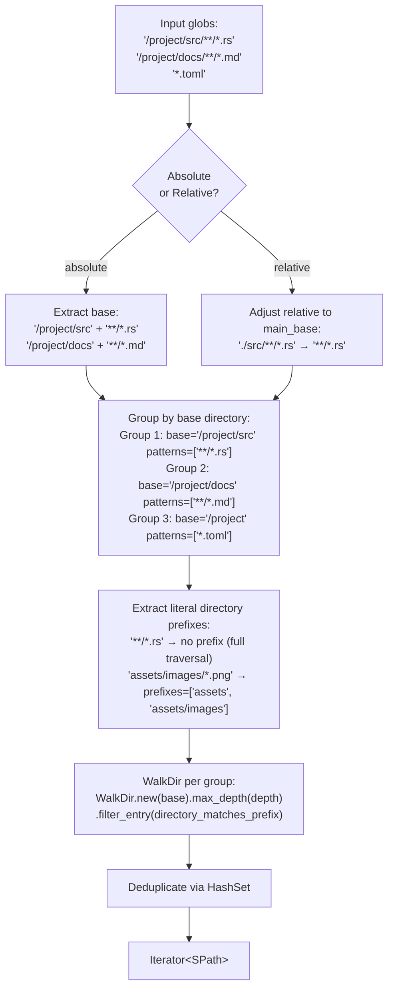
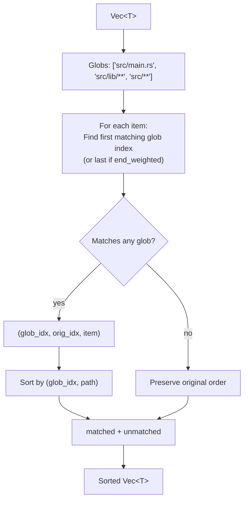

# simple-fs — File and Directory Listing

**Source:** `list/` — 7 files, ~900 LOC.

simple-fs provides glob-filtered file and directory listing built on `walkdir` and `globset`. The core innovation is the **glob grouping algorithm** that decomposes multiple glob patterns into efficient `WalkDir` traversals with directory prefix pruning.

## Public API

```rust
// list/iter_files.rs:4-19
pub fn iter_files(dir, include_globs, list_options) -> Result<GlobsFileIter>
pub fn list_files(dir, include_globs, list_options) -> Result<Vec<SPath>>

// list/iter_dirs.rs:7-24
pub fn iter_dirs(dir, include_globs, list_options) -> Result<impl Iterator<Item = SPath>>
pub fn list_dirs(dir, include_globs, list_options) -> Result<Vec<SPath>>
```

```rust
// Basic listing
let files = simple_fs::list_files("./", Some(&["**/*.rs"]), None)?;

// With exclude patterns
let opts = ListOptions::new(Some(&["**/target/**", "**/.git/**"]));
let files = simple_fs::list_files("./", Some(&["**/*.rs"]), Some(opts))?;

// Relative globs (patterns are relative to the directory, not absolute paths)
let opts = ListOptions::from_relative_glob(true);
let files = simple_fs::list_files("./src", Some(&["**/*.rs"]), Some(opts))?;
```

## ListOptions

```rust
// list/list_options.rs:2-14
pub struct ListOptions<'a> {
    pub exclude_globs: Option<Vec<&'a str>>,
    pub relative_glob: bool,       // Patterns relative to directory (default: false)
    pub depth: Option<usize>,      // Max depth (used for dir listing)
}
```

| Option | Default | Effect |
|--------|---------|--------|
| `exclude_globs` | `Some(["**/.git", "**/.DS_Store"])` | Patterns to exclude |
| `relative_glob` | `false` | When true, glob patterns are relative to the listing directory |
| `depth` | `None` | Max directory depth (auto-computed from glob if None) |

### Negated Glob Patterns

Include globs support negation via `!` prefix:

```rust
let files = simple_fs::list_files("./", Some(&["**/*", "!**/*.log", "!**/target/**"]), None)?;
```

Negated patterns are extracted and merged into the exclude list:

```rust
// list/globs_file_iter.rs:22-42
for &pattern in globs {
    if let Some(negative_pattern) = pattern.strip_prefix("!") {
        excludes.push(negative_pattern);
    } else {
        includes.push(pattern);
    }
}
// If all patterns were negated, use "**" as default include
if includes.is_empty() && !excludes.is_empty() {
    (vec!["**"], excludes)
} else {
    (includes, excludes)
}
```

## GlobGroup — The Grouping Algorithm

When multiple glob patterns are provided, simple-fs doesn't just run one `WalkDir` with all patterns. Instead, it **groups patterns by their longest shared base directory** to enable directory-level pruning during traversal:



### GlobGroup Structure

```rust
// list/globs_file_iter.rs:219-223
struct GlobGroup {
    base: SPath,           // Directory to walk from
    patterns: Vec<String>, // Glob patterns relative to base
    prefixes: Vec<String>, // Literal directory prefixes for pruning
}
```

The `process_globs` function decomposes patterns:

```rust
// list/globs_file_iter.rs:237-393
fn process_globs(main_base: &SPath, globs: &[&str]) -> Result<Vec<GlobGroup>> {
    // 1. Separate absolute from relative globs
    // 2. For absolute: extract longest base without wildcards
    // 3. For relative: adjust to main_base
    // 4. Group by base directory (merge overlapping groups)
    // 5. Extract literal directory prefixes from each pattern
    // 6. Normalize prefixes (dedup, sort, empty if full traversal needed)
}
```

### Prefix Extraction

From a glob pattern like `assets/images/*.png`, the algorithm extracts literal directory prefixes:

```rust
// list/globs_file_iter.rs:462-521
fn glob_literal_prefixes(pattern: &str) -> Vec<String> {
    // Extract all literal directory prefixes before the first wildcard
    // "assets/images/*.png" → ["assets", "assets/images"]
    // "src/{common,list}/**" → ["src/common", "src/list"]  (brace expansion)
    // "**/*.rs" → [] (starts with wildcard, no prefix)
}
```

This enables `WalkDir` to skip entire directory trees during traversal:

```rust
// list/globs_file_iter.rs:141-149
if !allowed_prefixes.is_empty()
    && !directory_matches_allowed_prefixes(&path, &base, allowed_prefixes)
{
    return false;  // Skip this entire subtree
}
```

**Aha:** The prefix optimization is significant for large directories. Walking `src/**/*.rs` normally traverses every directory under `src/`. But if the pattern is `src/common/**/*.rs`, the prefix `["src", "src/common"]` tells `WalkDir` to skip `src/bin/`, `src/tests/`, etc. entirely — the `filter_entry` closure returns `false` before descending.

## GlobsFileIter Implementation

```rust
// list/globs_file_iter.rs:8-210
pub struct GlobsFileIter {
    inner: Box<dyn Iterator<Item = SPath>>,
}
```

The iterator chains multiple `WalkDir` traversals (one per group) with deduplication:

```rust
// list/globs_file_iter.rs:97-208
for GlobGroup { base, patterns, prefixes } in groups {
    let depth = get_depth(&patterns, max_depth);
    let globset = get_glob_set(&patterns)?;

    let iter = WalkDir::new(base.path())
        .max_depth(depth)
        .into_iter()
        .filter_entry(move |e| { /* prefix pruning + exclude check */ })
        .filter_map(|entry| entry.ok())
        .filter(|entry| entry.file_type().is_file())
        .filter_map(SPath::from_walkdir_entry_ok)
        .filter(move |sfile| { /* globset match */ });

    group_iterators.push(Box::new(iter));
}

// Chain all group iterators, deduplicate via HashSet
let combined_iter = group_iterators.into_iter()
    .fold(Box::new(std::iter::empty()), |acc, iter| Box::new(acc.chain(iter)));

let dedup_iter = combined_iter.scan(HashSet::new(), |seen, file| {
    if seen.insert(file.clone()) { Some(Some(file)) } else { Some(None) }
}).flatten();
```

## sort_by_globs — Priority-Based Sorting

```rust
// list/sort.rs:45-101
pub fn sort_by_globs<T>(items: Vec<T>, globs: &[&str], options: impl Into<SortByGlobsOptions>) -> Result<Vec<T>>
where T: AsRef<SPath>
```

Sorts items by glob match priority, with a secondary sort by full path:



```rust
// Usage: sort with glob priority
let globs = ["src/main.rs", "src/common/**/*.*", "src/**/*.*"];
let sorted = simple_fs::sort_by_globs(files, &globs, false)?;
// Files matching "src/main.rs" come first, then "src/common/**", then everything else
```

### SortByGlobsOptions

```rust
// list/sort.rs:7-18
pub struct SortByGlobsOptions {
    pub end_weighted: bool,            // Use last matching glob index (from end)
    pub no_match_position: NoMatchPosition,  // Start or End
}
```

| Option | Effect |
|--------|--------|
| `end_weighted: false` (default) | First matching glob index determines position |
| `end_weighted: true` | Last matching glob index — more specific patterns win |
| `no_match_position: Start` | Non-matching items come first |
| `no_match_position: End` (default) | Non-matching items come last |

## Depth Computation

```rust
// list/glob.rs:54-71
pub fn get_depth(patterns: &[&str], depth: Option<usize>) -> usize {
    if let Some(user_depth) = depth { return user_depth; }
    // If any pattern contains "**", return TOP_MAX_DEPTH (100)
    for &g in patterns {
        if g.contains("**") { return TOP_MAX_DEPTH; }
    }
    // Otherwise, calculate max directory levels
    let mut max_depth = 0;
    for &g in patterns {
        let depth_count = g.matches(['\\', '/']).count() + 1;
        if depth_count > max_depth { max_depth = depth_count; }
    }
    max_depth.max(1)
}
```

This auto-computes the maximum walk depth from the glob patterns, avoiding unnecessary traversal of deep directory trees.

## Default Excludes

```rust
// list/glob.rs:5
pub const DEFAULT_EXCLUDE_GLOBS: &[&str] = &["**/.git", "**/.DS_Store"];
```

These are always applied unless explicitly overridden.

## What to Read Next

- [Spans, Safer, Watch](04-spans-safer-watch.md) for span reading, safe deletion, file watching
- [Features](05-features.md) for JSON, TOML, binary numbers, pretty size
- [SPath](02-spath.md) for the path type in depth
