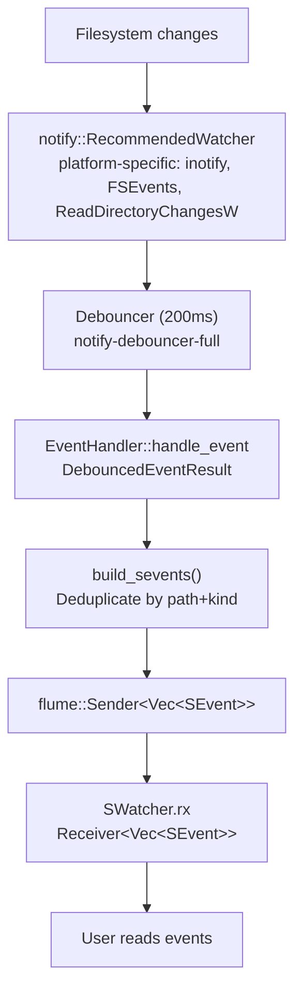

# simple-fs — Spans, Safer Operations, Watch

**Source:** `span/` (3 files), `safer/` (6 files), `watch.rs`.

Three distinct modules covering: byte-range file reading, safety-guarded deletion/trash, and debounced file system watching.

## Span APIs

The span module reads portions of files without loading the entire file into memory. Three flavors: byte-range reading, line span detection, and CSV-aware row span detection.

### read_span — Byte Range Reading

```rust
// span/read_span.rs:11-22
pub fn read_span(path: impl AsRef<SPath>, start: usize, end: usize) -> Result<String>
```

Reads a half-open byte range `[start, end)` from a file using platform-specific positional I/O:

```rust
// span/read_span.rs:27-46
fn read_exact_at(file: &File, offset: u64, len: usize) -> io::Result<Vec<u8>> {
    // Unix: file.read_at() — seek-free random read
    // Windows: file.seek_read() — same semantics
}
```

**Aha:** The span reading uses `pread`/`seek_read` — platform-specific APIs that read at an absolute file offset without modifying the file cursor. This means the operation is thread-safe (no shared seek position) and doesn't require seeking before reading.

```rust
// Usage: read bytes 100-200 from a file
let snippet = simple_fs::read_span(&SPath::new("log.txt"), 100, 200)?;
```

### line_spans — Streaming Line Detection

```rust
// span/line_spans.rs:9-14
pub fn line_spans(path: impl AsRef<SPath>) -> Result<Vec<(usize, usize)>>
```

Returns byte ranges `[(start, end), ...]` for each line, handling CRLF correctly even across chunk boundaries:

```rust
// span/line_spans.rs:19-64
fn line_spans_from_reader<R: Read>(r: &mut R) -> io::Result<Vec<(usize, usize)>> {
    let mut buf = [0u8; 64 * 1024];  // 64 KiB chunks
    let mut file_pos: usize = 0;
    let mut line_start: usize = 0;
    let mut prev_byte_is_cr = false;

    loop {
        let n = r.read(&mut buf)?;
        if n == 0 { break; }

        for nl_idx in memchr_iter(b'\n', &buf[..n]) {
            // If byte before \n is \r, exclude it from the range
            let end = if nl_idx > 0 && buf[nl_idx-1] == b'\r' { abs_nl - 1 } else { abs_nl };
            spans.push((line_start, end));
            line_start = abs_nl + 1;
        }
        // Track CR at chunk boundary
        prev_byte_is_cr = buf[n-1] == b'\r';
        file_pos += n;
    }
}
```

The algorithm streams in 64 KiB chunks and uses `memchr` for fast newline detection. CRLF handling works across chunk boundaries via `prev_byte_is_cr`.

```rust
// Usage: get line byte ranges, then read individual lines
let spans = simple_fs::line_spans(&SPath::new("log.txt"))?;
for (start, end) in &spans {
    let line = simple_fs::read_span(&path, *start, *end)?;
    println!("{line}");
}
```

### csv_row_spans — CSV-Aware Row Detection

```rust
// span/csv_spans.rs:10-14
pub fn csv_row_spans(path: impl AsRef<SPath>) -> Result<Vec<(usize, usize)>>
```

Like `line_spans`, but treats newlines inside quoted fields as part of the row, not as separators:

```rust
// span/csv_spans.rs:18-121
fn csv_row_spans_from_reader<R: Read>(r: &mut R) -> io::Result<Vec<(usize, usize)>> {
    let mut in_quotes: bool = false;
    let mut quote_pending: bool = false;  // For "" escape handling across chunks
    let mut prev_byte_is_cr: bool = false;

    while i < n {
        match b {
            b'"' if in_quotes => quote_pending = true,  // Might be closing quote
            b'"' => in_quotes = true,
            b'\n' if !in_quotes && !quote_pending => { /* record separator */ }
            _ => {}
        }
        // At chunk boundary, resolve quote_pending
    }
}
```

Key CSV semantics handled:
- Newlines inside `"..."` are NOT record separators
- `""` inside quoted fields is an escaped quote (literal `"`)
- `"` at end of chunk defers decision to next chunk via `quote_pending`
- CRLF: `\r` before `\n` is excluded from the span

```rust
// Usage: parse CSV rows without loading the whole file
let spans = simple_fs::csv_row_spans(&SPath::new("data.csv"))?;
for (start, end) in &spans {
    let row = simple_fs::read_span(&path, *start, *end)?;
    // row = "Alice,30,\"hello, world\""  — commas inside quotes preserved
}
```

## Safer Remove/Trash

The `safer` module provides delete and trash operations with safety guards to prevent accidental data loss.

### Safety Checks

```rust
// safer/support.rs:6-61
pub(crate) fn check_path_safety_causes(
    path: &SPath,
    restrict_to_current_dir: bool,
    must_contain_any: Option<&[&str]>,
    must_contain_all: Option<&[&str]>,
) -> Result<Vec<String>>
```

Three safety layers:

| Check | Default | Purpose |
|-------|---------|---------|
| `restrict_to_current_dir` | `true` | Path must be below current working directory |
| `must_contain_any` | `None` | Path must contain at least one of these substrings |
| `must_contain_all` | `None` | Path must contain all of these substrings |

```rust
// safer/safer_remove_impl.rs:16-47
pub fn safer_remove_dir(dir_path: &SPath, options: impl Into<SaferRemoveOptions>) -> Result<bool> {
    // 1. Check existence (return false if not found)
    // 2. Run safety checks (must be below cwd, must contain patterns)
    // 3. If checks fail → Error::DirNotSafeToRemove
    // 4. Perform fs::remove_dir_all()
}
```

### SaferRemoveOptions

```rust
// safer/safer_remove_options.rs:1-37
pub struct SaferRemoveOptions<'a> {
    pub must_contain_any: Option<&'a [&'a str]>,
    pub must_contain_all: Option<&'a [&'a str]>,
    pub restrict_to_current_dir: bool,  // Default: true
}
```

Convenient `From` implementations:

```rust
// Unit () → default options (restrict to cwd only)
simple_fs::safer_remove_dir(&SPath::new("build"), ())?;

// &[&str] → must_contain_any
simple_fs::safer_remove_dir(&SPath::new("target/debug"), &["target"])?;
```

Fluent API:

```rust
safer_remove_dir(
    &SPath::new("build/output"),
    SaferRemoveOptions::default()
        .with_must_contain_any(&["build", "target"])
        .with_restrict_to_current_dir(true)
)?;
```

### Safer Trash

The trash module mirrors the remove module but sends files to the system trash instead of permanently deleting:

```rust
// safer/safer_trash_impl.rs:15-46
pub fn safer_trash_dir(dir_path: &SPath, options: impl Into<SaferTrashOptions>) -> Result<bool> {
    // Same safety checks, then:
    trash::delete(dir_path.as_std_path())?;
}
```

Uses the `trash` crate which handles platform differences (macOS `.Trash`, Windows Recycle Bin, Linux FreeDesktop trash).

### Safety Check Implementation

```rust
// safer/support.rs:20-34
if restrict_to_current_dir {
    let current_dir = std::env::current_dir()?;
    let current_resolved = current_dir_path.canonicalize()?;
    if !resolved_str.starts_with(current_str) {
        error_causes.push(format!("is not below current directory '{current_resolved}'"));
    }
}
```

Both the target path and current directory are canonicalized (symlinks resolved) before comparison, preventing symlink-based escape attacks.

## File Watching

```rust
// watch.rs:1-147
pub fn watch(path: impl AsRef<Path>) -> Result<SWatcher>
```

Wraps `notify-debouncer-full` to provide a simplified event interface:



### SEvent — Simplified Events

```rust
// watch.rs:19-44
pub struct SEvent {
    pub spath: SPath,
    pub skind: SEventKind,
}

pub enum SEventKind {
    Create,
    Modify,
    Remove,
    Other,
}
```

The raw `notify::EventKind` has dozens of variants (Access, Read, Write, DataChanged, AttributeChanged, etc.). SEventKind collapses these to four:

```rust
// watch.rs:34-45
impl From<notify::EventKind> for SEventKind {
    fn from(val: notify::EventKind) -> Self {
        match val {
            notify::EventKind::Create(_) => SEventKind::Create,
            notify::EventKind::Modify(_) => SEventKind::Modify,
            notify::EventKind::Remove(_) => SEventKind::Remove,
            _ => SEventKind::Other,
        }
    }
}
```

### Event Deduplication

The debouncer already coalesces rapid events, but `build_sevents` adds an additional deduplication layer:

```rust
// watch.rs:116-146
fn build_sevents(events: Vec<DebouncedEvent>) -> Vec<SEvent> {
    let mut sevents_set: HashSet<SEventKey> = HashSet::new();
    for devent in events {
        let skind = SEventKind::from(event.kind);
        for path in event.paths {
            if let Some(spath) = SPath::from_std_path_buf_ok(path) {
                let key = SEventKey { spath_string: spath.to_string(), skind };
                if !sevents_set.contains(&key) {
                    sevents.push(SEvent { spath, skind });
                    sevents_set.insert(key);
                }
            }
        }
    }
}
```

This ensures each (path, kind) pair appears at most once per debounced batch. Non-UTF-8 paths are silently dropped.

### SWatcher Usage

```rust
// watch.rs:48-54
pub struct SWatcher {
    pub rx: Receiver<Vec<SEvent>>,
    notify_full_debouncer: Debouncer<RecommendedWatcher, RecommendedCache>,
}

// Start watching
let watcher = simple_fs::watch("./src")?;

// Receive events (blocks until available)
while let Ok(events) = watcher.rx.recv() {
    for event in events {
        println!("{:?}: {}", event.skind, event.spath);
    }
}
```

The debouncer is kept alive by the `SWatcher` struct — dropping it stops watching.

**Aha:** The watch function uses `flume` channels instead of `std::sync::mpsc`. Flume provides both synchronous and async receivers, making the watcher usable in both blocking and async contexts.

## What to Read Next

- [Features](05-features.md) for JSON, TOML, binary numbers, pretty size
- [SPath](02-spath.md) for the path type in depth
- [Listing](03-listing.md) for glob-based file listing
