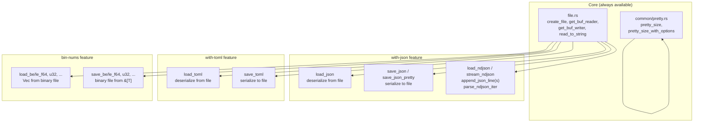
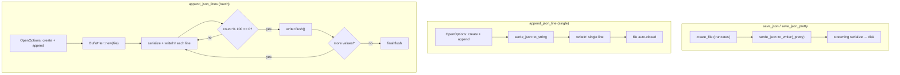
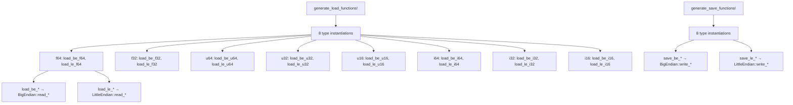

# simple-fs — Feature-Gated Modules

**Source:** `featured/` — 7 files. `common/pretty.rs` — 225 lines.

Four feature-gated modules: JSON I/O (with-json), TOML I/O (with-toml), binary numeric serialization (bin-nums), and human-readable size formatting (always available via `common`).



## JSON Module (with-json)

**Dependencies:** `serde`, `serde_json`

### Loading JSON

```rust
// with_json/load.rs:5-15
pub fn load_json<T>(file: impl AsRef<Path>) -> Result<T>
where
    T: serde::de::DeserializeOwned,
{
    let buf_reader = get_buf_reader(file)?;
    let val = serde_json::from_reader(buf_reader)
        .map_err(|ex| Error::JsonCantRead((file, ex).into()))?;
    Ok(val)
}
```

Uses `serde_json::from_reader` directly on a `BufReader` — zero-copy streaming from disk to deserializer without loading the entire file into a `String` first.

```rust
// Usage
let config: MyConfig = simple_fs::load_json("config.json")?;
```

### Saving JSON

```rust
// with_json/save.rs:10-39
pub fn save_json<T>(file: impl AsRef<Path>, data: &T) -> Result<()>
where
    T: serde::Serialize,
{
    save_json_impl(file.as_ref(), data, false)
}

pub fn save_json_pretty<T>(file: impl AsRef<Path>, data: &T) -> Result<()>
where
    T: serde::Serialize,
{
    save_json_impl(file.as_ref(), data, true)
}

fn save_json_impl<T>(file_path: &Path, data: &T, pretty: bool) -> Result<()> {
    let file = create_file(file_path)?;
    let res = if pretty {
        serde_json::to_writer_pretty(file, data)
    } else {
        serde_json::to_writer(file, data)
    };
    res.map_err(|e| Error::JsonCantWrite((file_path, e).into()))?;
    Ok(())
}
```

Both functions delegate to `save_json_impl` with a `pretty` boolean. The `create_file` call truncates the file before writing.

```rust
// Usage
simple_fs::save_json("data.json", &my_data)?;
simple_fs::save_json_pretty("config.json", &my_config)?;
```

### Appending JSON Lines

```rust
// with_json/save.rs:43-60
pub fn append_json_line<T: Serialize>(file: impl AsRef<Path>, value: &T) -> Result<()> {
    let file_path = file.as_ref();
    let json_string = serde_json::to_string(value)
        .map_err(|e| Error::JsonCantWrite((file_path, e).into()))?;

    let mut file = OpenOptions::new()
        .create(true)
        .append(true)
        .open(file_path)
        .map_err(|e| Error::FileCantOpen((file_path, e).into()))?;

    writeln!(file, "{}", json_string)
        .map_err(|e| Error::FileCantWrite((file_path, e).into()))?;
    Ok(())
}
```

Opens the file in append mode (creating if needed), serializes to a `String`, then writes with `writeln!`. Each call opens/closes the file.

**Aha:** The single-line version serializes to a `String` first, then writes with `writeln!`. This differs from `save_json` which streams directly to the file writer. The reason: `writeln!` needs the complete line to atomically append "data\n", and `serde_json::to_writer` can't be combined with `writeln!` in a single call without a buffer intermediate.

### Batched Appending

```rust
// with_json/save.rs:64-100
pub fn append_json_lines<'a, T, I>(file: impl AsRef<Path>, values: I) -> Result<()>
where
    T: Serialize + 'a,
    I: IntoIterator<Item = &'a T>,
{
    let file = OpenOptions::new()
        .create(true).append(true)
        .open(file_path)
        .map_err(|e| Error::FileCantOpen((file_path, e).into()))?;

    let mut writer = BufWriter::new(file);
    let mut count = 0;

    for value in values {
        let json_string = serde_json::to_string(value)
            .map_err(|e| Error::JsonCantWrite((file_path, e).into()))?;
        writeln!(writer, "{}", json_string)
            .map_err(|e| Error::FileCantWrite((file_path, e).into()))?;
        count += 1;
        if count % JSON_LINES_BUFFER_SIZE == 0 {
            writer.flush().map_err(|e| Error::FileCantWrite((file_path, e).into()))?;
        }
    }
    writer.flush()?;  // Final flush
    Ok(())
}
```

Uses a `BufWriter` with periodic flushing every 100 lines (`JSON_LINES_BUFFER_SIZE = 100`). This avoids holding all serialized data in memory while still providing I/O batching.



### NDJSON Loading

```rust
// with_json/load.rs:19-31
pub fn load_ndjson(file: impl AsRef<Path>) -> Result<Vec<Value>> {
    let buf_reader = get_buf_reader(file)?;
    super::parse_ndjson_from_reader(buf_reader)
}

pub fn stream_ndjson(file: impl AsRef<Path>) -> Result<impl Iterator<Item = Result<Value>>> {
    let buf_reader = get_buf_reader(file)?;
    Ok(super::parse_ndjson_iter_from_reader(buf_reader))
}
```

Two approaches: `load_ndjson` collects all values into a `Vec`, while `stream_ndjson` returns a lazy iterator for memory-efficient processing of large files.

### NDJSON Parsing Engine

```rust
// with_json/ndjson.rs:22-40
pub fn parse_ndjson_iter_from_reader<R: BufRead>(reader: R) -> impl Iterator<Item = Result<Value>> {
    reader.lines().enumerate().filter_map(|(index, line_result)| {
        match line_result {
            Ok(line) if line.trim().is_empty() => None,  // skip empty lines
            Ok(line) => Some(serde_json::from_str::<Value>(&line).map_err(|e| {
                Error::NdJson(format!(
                    "aip.file.load_ndjson - Failed to parse JSON on line {}. Cause: {}",
                    index + 1, e
                ))
            })),
            Err(e) => Some(Err(Error::NdJson(format!(
                "aip.file.load_ndjson - Failed to read line {}. Cause: {}",
                index + 1, e
            )))),
        }
    })
}
```

**Aha:** The error message says `"aip.file.load_ndjson"` — this is a legacy string from the `aip` crate that simple-fs was extracted from. The actual function is `simple_fs::load_ndjson`, but the error prefix wasn't updated during extraction.

The parser:
1. Reads line-by-line via `BufRead::lines()` (handles `\n` and `\r\n`)
2. Skips empty lines (including whitespace-only)
3. Parses each non-empty line as a standalone JSON value
4. Returns `filter_map` that yields `Some(Ok(value))` on success, `Some(Err(...))` on parse failure, `None` for empty lines

String-based NDJSON parsing is also available:

```rust
// with_json/ndjson.rs:6-14
pub fn parse_ndjson_iter(input: &str) -> impl Iterator<Item = Result<Value>> {
    parse_ndjson_iter_from_reader(Cursor::new(input))
}

pub fn parse_ndjson(input: &str) -> Result<Vec<Value>> {
    parse_ndjson_from_reader(Cursor::new(input))
}
```

Wraps the string in a `Cursor` to reuse the `BufRead`-based parser.

## TOML Module (with-toml)

**Dependencies:** `serde`, `toml`

### Loading TOML

```rust
// with_toml.rs:6-16
pub fn load_toml<T>(file_path: impl AsRef<Path>) -> Result<T>
where
    T: serde::de::DeserializeOwned,
{
    let content = read_to_string(file_path)?;
    let res = toml::from_str(&content)
        .map_err(|e| Error::TomlCantRead((file_path, e).into()))?;
    Ok(res)
}
```

Unlike JSON (which streams directly), TOML requires loading the entire file into a `String` first because `toml::from_str` operates on a complete string — the TOML parser needs the full document for cross-reference resolution.

### Saving TOML

```rust
// with_toml.rs:18-29
pub fn save_toml<T>(file_path: impl AsRef<Path>, data: &T) -> Result<()>
where
    T: serde::Serialize,
{
    create_file(file_path)?;
    let toml_string = toml::to_string(data)
        .map_err(|e| Error::TomlCantWrite((file_path, e).into()))?;
    fs::write(file_path, toml_string)
        .map_err(|e| Error::TomlCantWrite((file_path, e).into()))?;
    Ok(())
}
```

Serializes to a `String` in memory, then writes with `fs::write`. This is a two-step process: serialize (which may fail) → write (which may fail). If serialization fails after `create_file` truncates, the file is left empty.

```rust
// Usage
let config: MyConfig = simple_fs::load_toml("config.toml")?;
simple_fs::save_toml("config.toml", &config)?;
```

## Binary Numbers (bin-nums)

**Dependencies:** `byteorder`

Macro-generated load and save functions for 8 numeric types × 2 byte orders = 16 load + 16 save functions.

### Generated Functions

```rust
// bin_nums.rs:36-45
generate_load_functions!(
    f64, 8, load_be_f64, load_le_f64, load_f64, read_f64;
    f32, 4, load_be_f32, load_le_f32, load_f32, read_f32;
    u64, 8, load_be_u64, load_le_u64, load_u64, read_u64;
    u32, 4, load_be_u32, load_le_u32, load_u32, read_u32;
    u16, 2, load_be_u16, load_le_u16, load_u16, read_u16;
    i64, 8, load_be_i64, load_le_i64, load_i64, read_i64;
    i32, 4, load_be_i32, load_le_i32, load_i32, read_i32;
    i16, 2, load_be_i16, load_le_i16, load_i16, read_i16;
);
```

Each type expands to three functions:

```rust
// Expanded from macro for f64:
pub fn load_be_f64(file_path: impl AsRef<Path>) -> Result<Vec<f64>>
pub fn load_le_f64(file_path: impl AsRef<Path>) -> Result<Vec<f64>>
fn  load_f64(file_path: &Path, read_fn: fn(buf: &[u8]) -> f64) -> Result<Vec<f64>>
```

### Load Implementation

```rust
// bin_nums.rs:20-31
fn $load_fn(file_path: &Path, read_fn: fn(buf: &[u8]) -> $type) -> Result<Vec<$type>> {
    let mut reader = get_buf_reader(file_path)?;
    let mut data = Vec::new();
    let mut buf = [0u8; $size];

    while let Ok(()) = reader.read_exact(&mut buf) {
        let val = read_fn(&buf);
        data.push(val);
    }
    Ok(data)
}
```

Reads fixed-size chunks from the file using `read_exact`. Each chunk is decoded via the byteorder function (`BigEndian::read_f64` or `LittleEndian::read_f64`). The file size must be a multiple of the type size — partial trailing elements are silently dropped.

### Save Implementation

```rust
// bin_nums.rs:62-75
fn $save_fn(file_path: &Path, data: &[$type], write_fn: fn(buf: &mut [u8], n: $type)) -> Result<()> {
    let mut writer = get_buf_writer(file_path)?;
    let mut buf = [0; $size];

    for value in data {
        write_fn(&mut buf, *value);
        writer.write_all(&buf)
            .map_err(|e| Error::FileCantWrite((file_path, e).into()))?;
    }
    writer.flush()?;
    Ok(())
}
```

Each value is encoded into a fixed-size buffer, then written individually. A reusable `buf` array avoids per-element allocation.

```rust
// Usage
let values: Vec<f64> = simple_fs::load_be_f64("data.bin")?;
simple_fs::save_le_f64("data_le.bin", &values)?;

let indices: Vec<u32> = simple_fs::load_be_u32("indices.bin")?;
simple_fs::save_le_u32("indices_le.bin", &indices)?;
```

**Aha:** The macro approach avoids 32 near-identical functions. The key insight is that `byteorder` provides a uniform API: `BigEndian::read_TYPE` and `LittleEndian::write_TYPE` for each numeric type, making the macro expansion straightforward. The size parameter in the macro drives the buffer size (`[0u8; $size]`), which is critical for correct reading.

### Macro Architecture



## Pretty Size Formatting (always available)

No feature flag required — part of `common/pretty.rs`.

### Output Format

Fixed 9-character output designed for monospace table alignment:

```
  NNNNNN UU
  │      │
  │      └─ Unit: always 2 chars, left-aligned ("B ", "KB", "MB", "GB", "TB", "PB")
  └─ Number: always 6 chars, right-aligned
```

| Size | Output | Notes |
|------|--------|-------|
| `777` | `"   777 B "` | Below 1K: integer bytes |
| `8777` | `"  8.78 KB"` | KB+: 2 decimal places |
| `88777` | `" 88.78 KB"` | |
| `888777` | `"888.78 KB"` | |
| `2_345_678_900` | `"  2.35 GB"` | |
| `0` | `"     0 B "` | Zero handled |

### Implementation

```rust
// common/pretty.rs:101-164
pub fn pretty_size(size_in_bytes: u64) -> String {
    pretty_size_with_options(size_in_bytes, PrettySizeOptions::default())
}

pub fn pretty_size_with_options(size_in_bytes: u64, options: impl Into<PrettySizeOptions>) -> String {
    let options = options.into();
    const UNITS: [&str; 6] = ["B", "KB", "MB", "GB", "TB", "PB"];

    // Step 1: Shift to minimum unit requested
    let min_unit_idx = options.lowest_unit.idx();
    let mut size = size_in_bytes as f64;
    for _ in 0..min_unit_idx {
        size /= 1000.0;
    }
    let mut unit_idx = min_unit_idx;

    // Step 2: Bubble up if >= 1000
    while size >= 1000.0 && unit_idx < UNITS.len() - 1 {
        size /= 1000.0;
        unit_idx += 1;
    }

    // Step 3: Format
    if unit_idx == 0 {
        let number_str = format!("{size_in_bytes:>6}");
        format!("{number_str} {unit_str} ")
    } else {
        let number_str = format!("{size:>6.2}");
        format!("{number_str} {unit_str}")
    }
}
```

**Key design choices:**

- Uses **1000-based** units (KB = 1000 bytes), not 1024-based (KiB). This matches SI units and disk manufacturer conventions.
- Below 1K: integer with no decimals. At 1K+: always 2 decimal places.
- The number portion is **6 characters**: 3 digits + decimal point + 2 decimals for scaled units, or up to 6 digits for raw bytes.
- `lowest_unit` option forces a minimum unit — e.g., `lowest_unit: MB` means 500 bytes shows as `"  0.00 MB"`, not `"  500 B "`.

### SizeUnit and PrettySizeOptions

```rust
// common/pretty.rs:29-63
pub enum SizeUnit {
    B, KB, MB, GB, TB,
}

pub struct PrettySizeOptions {
    pub lowest_unit: SizeUnit,  // Default: B
}
```

Convenient `From` implementations for string construction:

```rust
// Usage
let options = PrettySizeOptions::from("MB");
// → PrettySizeOptions { lowest_unit: SizeUnit::MB }

let size = simple_fs::pretty_size(888777);
// → "888.78 KB"

let size = simple_fs::pretty_size_with_options(888777, PrettySizeOptions::from("MB"));
// → "  0.89 MB"
```

### Formatting Rules Table

| Condition | Format | Example |
|-----------|--------|---------|
| `< 1000 bytes` | `{:>6} B ` | `"   777 B "` |
| `>= 1000` | `{:>6.2} UNIT` | `"  8.78 KB"` |
| `lowest_unit` set | Force that unit | `"  0.09 MB"` for 88777 with MB |

## What to Read Next

- [Architecture](01-architecture.md) for module structure and error model
- [SPath](02-spath.md) for the path type in depth
- [Listing](03-listing.md) for glob-based file listing and sorting
