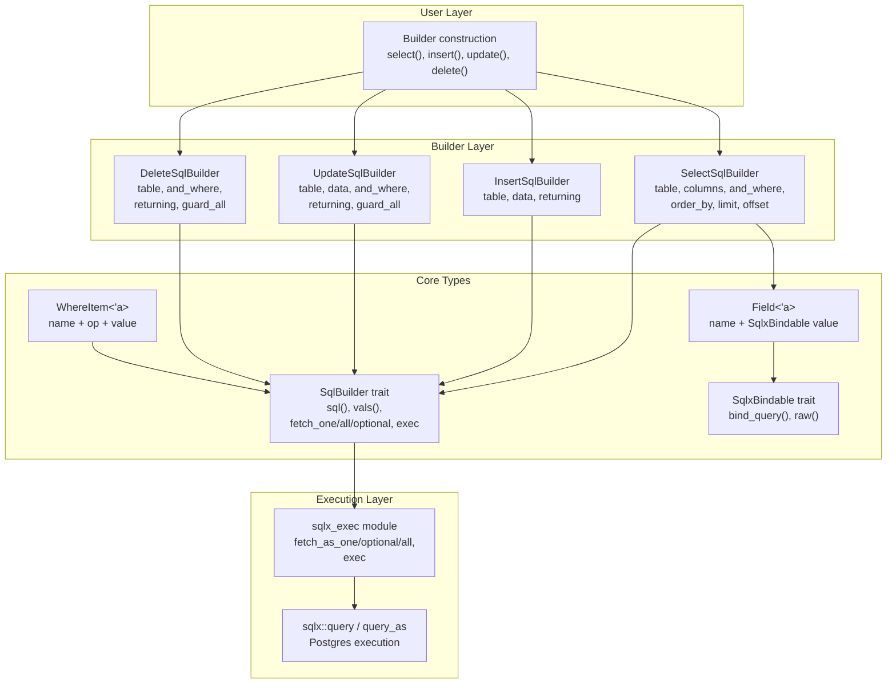

# rust-sqlb — Overview

**Source:** `src/` — 9 Rust files. Postgres-only SQL query builder on `sqlx`.

rust-sqlb is a lightweight SQL query builder for Postgres, built on `sqlx`. It provides a fluent, builder-pattern API for SELECT, INSERT, UPDATE, and DELETE queries with parameterized binding, RETURNING support, automatic identifier escaping, and safety guards against unqualified UPDATE/DELETE operations.

## Architecture at a Glance



## Quick Start

```rust
use sqlb::{select, insert, update, delete, Field, Fields};

// SELECT: find a user by id
let user = select()
    .table("user")
    .and_where_eq("id", 42)
    .fetch_one::<_, User>(&db_pool)
    .await?;

// INSERT: create a new row
let rows = insert()
    .table("user")
    .data(vec![
        Field::from(("user_name", "alice")),
        Field::from(("email", "alice@example.com")),
    ])
    .exec(&db_pool)
    .await?;

// UPDATE: safe by default (panics without WHERE)
let rows = update()
    .table("user")
    .data(vec![Field::from(("user_name", "alice_updated"))])
    .and_where_eq("id", 42)
    .exec(&db_pool)
    .await?;

// DELETE: safe by default
let rows = delete()
    .table("user")
    .and_where_eq("id", 42)
    .exec(&db_pool)
    .await?;
```

## Key Design Decisions

| Decision | Rationale |
|----------|-----------|
| Postgres-only | All builders hardcode `Database = Postgres`. No MySQL/SQLite support. |
| `sqlx` integration | Uses `sqlx::Executor` for execution, `FromRow` for result mapping. |
| Builder pattern | Fluent API with `self` returns, each builder is immutable per call. |
| Safety guards | `update()` and `delete()` panic without WHERE clauses — use `update_all()`/`delete_all()` for intentional unqualified operations. |
| Identifier escaping | All table and column names are double-quoted to prevent SQL injection via identifiers. |
| `Raw` values | `Raw("NOW()")` bypasses parameter binding for SQL expressions like `NOW()`, `DEFAULT`, or function calls. |

## Public API

| Function | Returns | Purpose |
|----------|---------|---------|
| `select()` | `SelectSqlBuilder` | Build SELECT queries |
| `insert()` | `InsertSqlBuilder` | Build INSERT queries |
| `update()` | `UpdateSqlBuilder` | Build UPDATE queries (guarded) |
| `update_all()` | `UpdateSqlBuilder` | Build UPDATE queries (unguarded) |
| `delete()` | `DeleteSqlBuilder` | Build DELETE queries (guarded) |
| `delete_all()` | `DeleteSqlBuilder` | Build DELETE queries (unguarded) |

## Core Types

| Type | Purpose |
|------|---------|
| `Field<'a>` | Name-value pair for data/parameters |
| `HasFields` | Trait for struct→field conversion (via `#[derive(Fields)]`) |
| `SqlBuilder<'a>` | Trait all builders implement: `sql()`, `vals()`, `exec()`, `fetch_*()` |
| `Whereable<'a>` | Trait for fluent WHERE chaining |
| `SqlxBindable` | Trait for types that can be bound to sqlx parameters |
| `Raw` | Wrapper for literal SQL values (no binding) |

## Feature Flags

| Feature | Enables |
|---------|---------|
| `chrono-support` | `chrono::NaiveDateTime`, `NaiveDate`, `NaiveTime`, `DateTime<Utc>` binding |
| `json` | `serde_json::Value` binding |
| `decimal` | `rust_decimal::Decimal` binding |

Default: no features enabled. Core types (time::OffsetDateTime, uuid::Uuid) are always available.

## What to Read Next

- [Core Types](01-core-types.md) — Field, HasFields, SqlBuilder, Whereable, SqlxBindable, Raw
- [Builders](02-builders.md) — Select, Insert, Update, Delete, sqlx_exec
