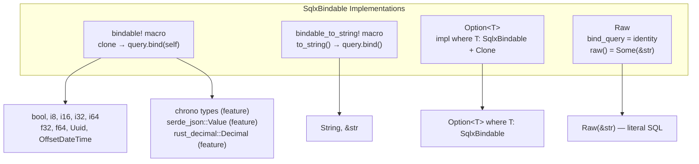

# rust-sqlb — Core Types

**Source:** `core.rs` (214 lines), `val.rs` (159 lines), `utils.rs` (35 lines).

The core types of rust-sqlb form the foundation all builders use: `Field` for name-value pairs, `SqlBuilder` as the shared trait, `Whereable` for fluent WHERE chaining, `SqlxBindable` for parameter binding, and `Raw` for literal SQL injection.

## Field — Name-Value Pair

```rust
// core.rs:21-33
pub struct Field<'a> {
    pub name: String,
    pub value: Box<dyn SqlxBindable + 'a + Send + Sync>,
}
```

`Field` is the basic unit of data in rust-sqlb — every INSERT data row, UPDATE set clause, and WHERE condition is expressed as a field. The value is boxed to erase the concrete type behind `dyn SqlxBindable`.

```rust
// Construction via From trait
let field: Field = ("user_name", "alice").into();
let field: Field = (String::from("email"), "alice@example.com").into();

// Direct construction
let field = Field {
    name: "id".to_owned(),
    value: Box::new(42i32),
};
```

**Aha:** `Field` uses `Box<dyn SqlxBindable>` to store heterogeneous value types in a `Vec<Field>`. This is why the builder can accept a mixed bag of `String`, `i32`, `bool`, `Uuid`, etc. in a single `data()` call — they all implement `SqlxBindable` with different `bind_query` implementations.

## HasFields Trait

```rust
// core.rs:47-56
pub trait HasFields {
    /// Consume and return fields where value is NOT None.
    fn not_none_fields<'a>(self) -> Vec<Field<'a>>;

    /// Consume and return ALL fields (including None values).
    fn all_fields<'a>(self) -> Vec<Field<'a>>;

    /// Return static array of all field names.
    fn field_names() -> &'static [&'static str];
}
```

This trait is typically derived via `#[derive(Fields)]` from the `sqlb-macros` crate. It converts a struct into a `Vec<Field>`, filtering out `Option::None` values when using `not_none_fields`:

```rust
#[derive(Fields)]
struct UserFormData {
    user_name: String,
    email: Option<String>,  // Excluded from not_none_fields if None
    pwd: String,
}

let data = UserFormData {
    user_name: "alice".into(),
    email: None,
    pwd: "secret".into(),
};

// not_none_fields excludes the None email
let fields = data.not_none_fields();
// → [("user_name", "alice"), ("pwd", "secret")]
```

## SqlBuilder Trait

```rust
// core.rs:112-135
#[async_trait]
pub trait SqlBuilder<'a> {
    /// Returns the SQL string with placeholders ($1, $2, ...).
    fn sql(&self) -> String;

    /// Returns an iterator over bindable values.
    fn vals(&'a self) -> Box<dyn Iterator<Item = &Box<dyn SqlxBindable + 'a + Send + Sync>> + 'a + Send>;

    /// Execute and return a single row.
    async fn fetch_one<'e, DB, D>(&'a self, db_pool: DB) -> Result<D, sqlx::Error>
    where DB: Executor<'e, Database = Postgres>, D: FromRow<'r, PgRow> + Send;

    /// Execute and return optional single row.
    async fn fetch_optional<'e, DB, D>(&'a self, db_pool: DB) -> Result<Option<D>, sqlx::Error>
    where DB: Executor<'e, Database = Postgres>, D: FromRow<'r, PgRow> + Send;

    /// Execute and return all rows.
    async fn fetch_all<'e, DB, D>(&'a self, db_pool: DB) -> Result<Vec<D>, sqlx::Error>
    where DB: Executor<'e, Database = Postgres>, D: FromRow<'r, PgRow> + Send;

    /// Execute and return rows affected count.
    async fn exec<'q, DB>(&'a self, db_pool: DB) -> Result<u64, sqlx::Error>
    where DB: Executor<'q, Database = Postgres>;
}
```

**Aha:** The `SqlBuilder` trait is the bridge between the builder layer and `sqlx`. Each builder implements `sql()` (returns the query string) and `vals()` (returns bindable values). The `sqlx_exec` module then uses these two methods to construct and execute the sqlx query — no builder knows about `sqlx::query` directly.

The trait methods have default async implementations that delegate to `sqlx_exec`, and each builder type also provides the same methods directly (via `sqlx_exec::fetch_as_*`) for ergonomic use without needing the trait in scope.

## Whereable Trait

```rust
// core.rs:137-140
pub trait Whereable<'a> {
    fn and_where_eq<T: 'a + SqlxBindable + Send + Sync>(self, name: &str, val: T) -> Self;
    fn and_where<T: 'a + SqlxBindable + Send + Sync>(self, name: &str, op: &'static str, val: T) -> Self;
}
```

Implemented by `SelectSqlBuilder`, `UpdateSqlBuilder`, and `DeleteSqlBuilder`. Provides trait-level WHERE methods that work when the concrete type isn't known (e.g., in generic functions). Each builder also implements `and_where`/`and_where_eq` directly, so `Whereable` is mainly for generic code.

```rust
// Direct usage (no Whereable needed)
select().table("user").and_where_eq("id", 42);

// Via Whereable trait (for generic code)
fn add_where<'a, W: Whereable<'a>>(builder: W) -> W {
    builder.and_where("status", "=", "active")
}
```

## WhereItem and OrderItem (Internal)

```rust
// core.rs:59-73
pub(crate) struct WhereItem<'a> {
    pub name: String,
    pub op: &'static str,      // "=", "!=", ">", "<", ">=", "<=", "LIKE", ...
    pub val: Box<dyn SqlxBindable + 'a + Send + Sync>,
}
```

The internal representation of a WHERE condition. Unlike `Field` which stores `(name, value)` for data, `WhereItem` stores `(name, operator, value)` for conditions.

```rust
// Construction
let item: WhereItem = ("id", "=", 42).into();
let item: WhereItem = ("age", ">", 18).into();
let item: WhereItem = ("name", "LIKE", "%alice%").into();
```

### OrderItem

```rust
// core.rs:75-110
pub(crate) struct OrderItem {
    pub dir: OrderDir,  // Asc or Desc
    pub name: String,
}

impl From<&str> for OrderItem {
    fn from(v: &str) -> Self {
        if let Some(s) = v.strip_prefix('!') {
            OrderItem { dir: OrderDir::Desc, name: x_column_name(s) }
        } else {
            OrderItem { dir: OrderDir::Asc, name: x_column_name(v) }
        }
    }
}
```

**Aha:** The `!` prefix for descending sort is a convention — `"!created_at"` means `ORDER BY "created_at" DESC`. This avoids needing a separate method or enum in the API.

## SqlxBindable Trait

```rust
// val.rs:10-18
pub trait SqlxBindable: std::fmt::Debug {
    fn bind_query<'q>(
        &'q self,
        query: sqlx::query::Query<'q, sqlx::Postgres, sqlx::postgres::PgArguments>,
    ) -> sqlx::query::Query<'q, sqlx::Postgres, sqlx::postgres::PgArguments>;

    fn raw(&self) -> Option<&str> { None }
}
```

The core binding trait. `bind_query` takes an sqlx query and returns it with a value bound. `raw()` returns `Some(&str)` for types that should bypass parameter binding (only `Raw` does this).

### Macro-Generated Implementations

Two macros generate `SqlxBindable` implementations for common types:

```rust
// val.rs:22-40 — bindable! macro
// For types that can be cloned and bound directly
bindable!(bool, i8, i16, i32, i64, f32, f64, Uuid, OffsetDateTime);

// val.rs:43-61 — bindable_to_string! macro
// For types that need to_string() before binding
bindable_to_string!(String, str);
```



### Option Handling

```rust
// val.rs:66-79
impl<T> SqlxBindable for Option<T>
where
    T: SqlxBindable + Clone + Send,
    T: for<'r> sqlx::Encode<'r, sqlx::Postgres>,
    T: sqlx::Type<sqlx::Postgres>,
{
    fn bind_query<'q>(&'q self, query: ...) -> ... {
        query.bind(self.clone())
    }
}
```

`Option<T>` binds as `None` (SQL NULL) or `Some(value)` automatically. sqlx handles the NULL encoding.

### Raw — Literal SQL Injection

```rust
// val.rs:118-134
pub struct Raw(pub &'static str);

impl SqlxBindable for Raw {
    fn bind_query<'q>(&self, query: ...) -> ... {
        query  // returns unchanged — no binding
    }

    fn raw(&self) -> Option<&str> {
        Some(self.0)
    }
}
```

**Aha:** `Raw` is the only type where `bind_query` returns the input unchanged and `raw()` returns `Some(...)`. When building SQL, the builder checks `value.raw()` — if `Some`, it interpolates the raw string directly into the SQL (no `$N` placeholder). This enables SQL expressions:

```rust
// Usage: set a column to NOW() instead of a parameter
insert()
    .table("user")
    .data(vec![
        Field::from(("user_name", "alice")),
        Field::from(("created_at", Raw("NOW()"))),
    ])
    .exec(&db_pool)
    .await?;
// → INSERT INTO "user" ("user_name", "created_at") VALUES ($1, NOW())
```

**Warning:** `Raw` inserts literal SQL — the `&'static str` constraint prevents runtime string construction, limiting injection risk. But the content is still unsanitized, so only use with trusted values.

## Identifier Escaping

```rust
// utils.rs:6-15
pub(crate) fn x_table_name(name: &str) -> String {
    if name.contains('.') {
        name.split('.')
            .map(|part| format!("\"{}\"", part))
            .collect::<Vec<String>>()
            .join(".")
    } else {
        format!("\"{}\"", name)
    }
}
```

All table and column names are double-quoted:

| Input | Output |
|-------|--------|
| `"user"` | `"user"` |
| `"public.user"` | `"public"."user"` |
| `"count(*)"` | `count(*)` (column name, contains `(`) |

The `x_column_name` function additionally skips quoting if the name contains `(`, allowing SQL functions like `count(*)` or `max(id)` to pass through unmodified.

**Aha:** This escaping prevents SQL injection via identifiers — a user-controlled table name like `"user; DROP TABLE"` becomes `"\"user; DROP TABLE\""` which Postgres treats as a literal identifier name (and will fail with "relation not found" rather than executing the DROP). However, the `.split('.')` handling for schema-qualified names quotes each segment independently, so `"public.user"` → `"public"."user"`.

## Binding Index Helpers

```rust
// core.rs:179-207
pub(crate) fn sql_comma_params(fields: &[Field]) -> (i32, String) {
    let mut binding_idx = 1;
    for (idx, Field { value, .. }) in fields.iter().enumerate() {
        if idx > 0 { vals.push_str(", "); };
        match value.raw() {
            None => {
                vals.push_str(&format!("${}", binding_idx));
                binding_idx += 1;
            }
            Some(raw) => vals.push_str(raw),  // No binding for Raw
        };
    }
    (binding_idx, vals)
}
```

This function builds the `$1, $2, $3` parameter placeholders, tracking the current binding index. `Raw` values don't consume a binding index. The returned `(binding_idx, string)` tuple is used to continue parameter numbering in WHERE clauses after SET clauses (in UPDATE).

```rust
// core.rs:200-207
pub(crate) fn sql_where_items(where_items: &[WhereItem], idx_start: usize) -> String {
    where_items.iter().enumerate().map(|(idx, WhereItem { name, op, .. })|
        format!("{} {} ${}", x_column_name(name), op, idx + idx_start)
    ).collect::<Vec<String>>().join(" AND ")
}
```

WHERE items are joined with `AND`, each with a `$N` placeholder starting from the provided index.

## What to Read Next

- [Builders](02-builders.md) — Select, Insert, Update, Delete, sqlx_exec
- [Overview](00-overview.md) — Architecture and quick start
