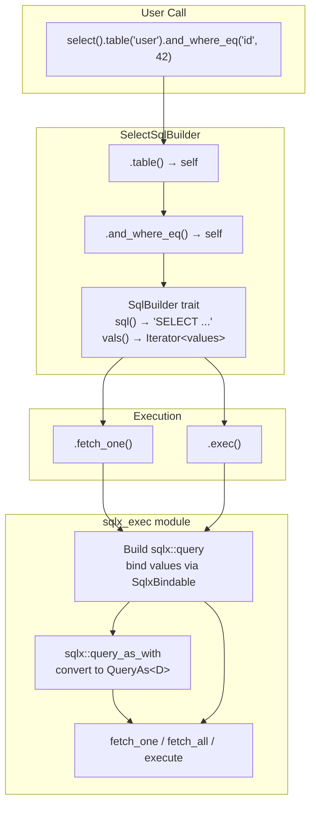

# rust-sqlb — SQL Builders

**Source:** `select.rs` (201 lines), `insert.rs` (134 lines), `update.rs` (197 lines), `delete.rs` (160 lines), `sqlx_exec.rs` (96 lines).

Four SQL builders implement the `SqlBuilder` trait: SELECT, INSERT, UPDATE, and DELETE. Each provides a fluent API for constructing parameterized Postgres queries, then delegates execution to the `sqlx_exec` module.

## SelectSqlBuilder

```rust
// select.rs:9-18
pub fn select<'a>() -> SelectSqlBuilder<'a> {
    SelectSqlBuilder {
        table: None,
        columns: None,
        and_wheres: Vec::new(),
        order_bys: None,
        limit: None,
        offset: None,
    }
}
```

### Builder Methods

| Method | Purpose |
|--------|---------|
| `table(&str)` | Set the FROM table |
| `columns(&[&str])` | Select specific columns (defaults to `*`) |
| `and_where(name, op, val)` | Add a WHERE condition with custom operator |
| `and_where_eq(name, val)` | Shorthand for `and_where(name, "=", val)` |
| `order_by(&str)` | Single ORDER BY; `!` prefix for DESC |
| `order_bys(&[&str])` | Multiple ORDER BY clauses |
| `limit(i64)` | Add LIMIT |
| `offset(i64)` | Add OFFSET |

### Generated SQL

```rust
// select.rs:114-163
fn sql(&self) -> String {
    // SELECT columns FROM table WHERE conditions ORDER BY cols LIMIT n OFFSET n
}
```

```rust
// Full query example
let sql = select()
    .table("user")
    .columns(&["id", "user_name", "email"])
    .and_where_eq("status", "active")
    .and_where("age", ">=", 18)
    .order_by("!created_at")   // ! prefix → DESC
    .limit(10)
    .offset(20)
    .sql();

// → SELECT "id", "user_name", "email" FROM "user"
//   WHERE "status" = $1 AND "age" >= $2
//   ORDER BY "created_at" DESC LIMIT 10 OFFSET 20
```

### Execution Methods

```rust
// select.rs:70-99
let count: u64 = builder.exec(&db_pool).await?;           // rows affected
let user: User = builder.fetch_one(&db_pool).await?;      // panics if empty
let maybe: Option<User> = builder.fetch_optional(&db_pool).await?;  // None if empty
let users: Vec<User> = builder.fetch_all(&db_pool).await?;         // empty vec if none
```

## InsertSqlBuilder

```rust
// insert.rs:7-13
pub fn insert<'a>() -> InsertSqlBuilder<'a> {
    InsertSqlBuilder {
        table: None,
        data: Vec::new(),
        returnings: None,
    }
}
```

### Builder Methods

| Method | Purpose |
|--------|---------|
| `table(&str)` | Set the INSERT INTO table |
| `data(Vec<Field<'a>>)` | Set the column values |
| `returning(&[&str])` | Add RETURNING clause |

### Generated SQL

```rust
// insert.rs:72-96
fn sql(&self) -> String {
    // INSERT INTO table (col1, col2) VALUES ($1, $2) RETURNING r1, r2
}
```

```rust
let user: CreatedUser = insert()
    .table("user")
    .data(vec![
        Field::from(("user_name", "alice")),
        Field::from(("email", "alice@example.com")),
    ])
    .returning(&["id", "created_at"])
    .fetch_one::<_, CreatedUser>(&db_pool)
    .await?;
// → INSERT INTO "user" ("user_name", "email")
//   VALUES ($1, $2) RETURNING "id", "created_at"
```

**Aha:** The comment on line 82 says "empty data is a valid usecase, if the row has all required fields with default or auto gen." An INSERT with no columns generates `INSERT INTO "table"() VALUES ()` — valid Postgres for rows where all columns have defaults.

## UpdateSqlBuilder

```rust
// update.rs:8-16
pub fn update<'a>() -> UpdateSqlBuilder<'a> {
    UpdateSqlBuilder {
        guard_all: true,   // Safety: panic without WHERE
        table: None,
        data: Vec::new(),
        returnings: None,
        and_wheres: Vec::new(),
    }
}

pub fn update_all<'a>() -> UpdateSqlBuilder<'a> {
    UpdateSqlBuilder {
        guard_all: false,  // No safety guard
        // ...
    }
}
```

### Builder Methods

| Method | Purpose |
|--------|---------|
| `table(&str)` | Set the UPDATE table |
| `data(Vec<Field<'a>>)` | Set the SET columns |
| `and_where(name, op, val)` | Add WHERE condition |
| `and_where_eq(name, val)` | Shorthand for `=` |
| `returning(&[&str])` | Add RETURNING clause |

### Generated SQL

```rust
// update.rs:106-158
fn sql(&self) -> String {
    // UPDATE table SET col1 = $1, col2 = $2 WHERE w1 = $3 AND w2 = $4 RETURNING r1, r2
}
```

```rust
let rows = update()
    .table("user")
    .data(vec![
        Field::from(("user_name", "alice_updated")),
        Field::from(("updated_at", Raw("NOW()"))),
    ])
    .and_where_eq("id", 42)
    .returning(&["id", "updated_at"])
    .exec(&db_pool)
    .await?;
// → UPDATE "user" SET "user_name" = $1, "updated_at" = NOW()
//   WHERE "id" = $2 RETURNING "id", "updated_at"
```

### Safety Guard

```rust
// update.rs:147-150
if !self.and_wheres.is_empty() {
    let sql_where = sql_where_items(&self.and_wheres, binding_idx);
    sql.push_str(&format!("WHERE {} ", &sql_where));
} else if self.guard_all {
    panic!("FATAL - Trying to call a update without any where clause. If needed, use sqlb::update_all(table_name). ")
}
```

The `guard_all: true` default causes a panic if no WHERE clause is provided. This prevents accidental full-table updates. To intentionally update all rows, use `update_all()` which sets `guard_all: false`.

### Parameter Index Continuation

```rust
// update.rs:118-146
let mut binding_idx = 1;
// ... SET clause consumes $1, $2, etc. ...
let sql_where = sql_where_items(&self.and_wheres, binding_idx);
// WHERE starts from $3 (after SET used $1, $2)
```

**Aha:** UPDATE's `vals()` method chains data values with WHERE values:

```rust
// update.rs:160-165
fn vals(&'a self) -> Box<dyn Iterator<Item = &Box<dyn SqlxBindable + 'a + Send + Sync>> + 'a + Send> {
    let iter = self.data.iter().map(|field| &field.value);
    let iter = iter.chain(self.and_wheres.iter().map(|wi| &wi.val));
    Box::new(iter)
}
```

The SET values come first, then WHERE values — matching the `$N` ordering in the generated SQL.

## DeleteSqlBuilder

```rust
// delete.rs:8-15
pub fn delete<'a>() -> DeleteSqlBuilder<'a> {
    DeleteSqlBuilder {
        guard_all: true,   // Safety: panic without WHERE
        table: None,
        returnings: None,
        and_wheres: Vec::new(),
    }
}

pub fn delete_all<'a>() -> DeleteSqlBuilder<'a> {
    DeleteSqlBuilder {
        guard_all: false,
        // ...
    }
}
```

### Builder Methods

| Method | Purpose |
|--------|---------|
| `table(&str)` | Set the DELETE FROM table |
| `and_where(name, op, val)` | Add WHERE condition |
| `and_where_eq(name, val)` | Shorthand for `=` |
| `returning(&[&str])` | Add RETURNING clause |

### Generated SQL

```rust
// delete.rs:97-122
fn sql(&self) -> String {
    // DELETE FROM table WHERE w1 = $1 AND w2 = $2 RETURNING r1, r2
}
```

```rust
let rows = delete()
    .table("user")
    .and_where_eq("id", 42)
    .returning(&["id"])
    .exec(&db_pool)
    .await?;
// → DELETE FROM "user" WHERE "id" = $1 RETURNING "id"
```

## Builder Architecture



## sqlx_exec — Execution Engine

```rust
// sqlx_exec.rs:5-30
pub async fn fetch_as_one<'e, 'q, DB, D, Q>(db_pool: DB, sb: &'q Q) -> Result<D, sqlx::Error>
where
    DB: Executor<'e, Database = Postgres>,
    D: for<'r> FromRow<'r, sqlx::postgres::PgRow> + Unpin + Send,
    Q: SqlBuilder<'q>,
{
    let sql = sb.sql();
    let vals = sb.vals();

    // Build temp query for binding
    let mut query = sqlx::query::<sqlx::Postgres>(&sql);
    for val in vals.into_iter() {
        query = val.bind_query(query);
    }

    // Convert to QueryAs for typed result
    let query = sqlx::query_as_with::<sqlx::Postgres, D, PgArguments>(
        &sql, query.take_arguments().unwrap()
    );

    // Execute and return
    let r = query.fetch_one(db_pool).await?;
    Ok(r)
}
```

The execution pattern is uniform across all four `fetch_as_*`/`exec` functions:

1. Call `sb.sql()` to get the query string with `$N` placeholders
2. Call `sb.vals()` to get an iterator of bindable values
3. Build a `sqlx::query` and bind each value via `val.bind_query(query)`
4. Extract the bound arguments with `query.take_arguments()`
5. Wrap in `sqlx::query_as_with` for typed deserialization into `D: FromRow`
6. Execute via `fetch_one`, `fetch_optional`, `fetch_all`, or `execute`

```rust
// sqlx_exec.rs:80-95
pub async fn exec<'e, 'q, DB, Q>(db_pool: DB, sb: &'q Q) -> Result<u64, sqlx::Error>
where DB: Executor<'e, Database = Postgres>, Q: SqlBuilder<'q>,
{
    let sql = sb.sql();
    let vals = sb.vals();
    let mut query = sqlx::query::<sqlx::Postgres>(&sql);
    for val in vals.into_iter() {
        query = val.bind_query(query);
    }
    let r = query.execute(db_pool).await?.rows_affected();
    Ok(r)
}
```

**Aha:** The `exec` function returns `rows_affected()` (a `u64`), while the `fetch_as_*` functions deserialize rows into `D`. Both use the same binding pattern — the difference is only in the final execution method (`execute` vs `query_as_with`).

### Two-Phase Query Construction

```mermaid
flowchart TD
    SQL["sb.sql()\n'SELECT * FROM \"user\" WHERE \"id\" = $1'"] --> QUERY["sqlx::query(&sql)\nEmpty query builder"]

    VALS["sb.vals()\nIterator of SqlxBindable"] --> BIND["Loop: val.bind_query(query)\nquery = query.bind(value)"]

    QUERY --> BIND
    BIND --> ARGS["query.take_arguments()\nExtract PgArguments"]

    ARGS --> QA["sqlx::query_as_with&lt;Postgres, D&gt;\n(sql, arguments)"]

    QA --> F1["fetch_one → D"]
    QA --> FO["fetch_optional → Option&lt;D&gt;"]
    QA --> FA["fetch_all → Vec&lt;D&gt;"]
```

The two-phase approach (bind first, then extract arguments, then wrap in `query_as_with`) exists because `sqlx::query_as!` macros require compile-time SQL, while this builder constructs SQL at runtime. The `query_as_with` function accepts a pre-built argument bundle.

## Usage Patterns

### CRUD with HasFields

```rust
#[derive(Fields)]
struct UserForCreate {
    user_name: String,
    email: String,
    pwd: String,
}

#[derive(Fields)]
struct UserForUpdate {
    user_name: Option<String>,
    email: Option<String>,
    // id excluded — used in WHERE, not in SET
}

#[derive(FromRow)]
struct User {
    id: i32,
    user_name: String,
    email: String,
}

// Create
let user_data = UserForCreate {
    user_name: "alice".into(),
    email: "alice@example.com".into(),
    pwd: "secret".into(),
};

insert()
    .table("user")
    .data(user_data.not_none_fields())
    .returning(&["id", "user_name", "email"])
    .fetch_one::<_, User>(&db_pool)
    .await?;

// Update (only non-None fields)
let update_data = UserForUpdate {
    user_name: Some("alice_v2".into()),
    email: None,  // Won't be in SET clause
};

update()
    .table("user")
    .data(update_data.not_none_fields())
    .and_where_eq("id", 42)
    .exec(&db_pool)
    .await?;
```

## What to Read Next

- [Core Types](01-core-types.md) — Field, HasFields, SqlBuilder, SqlxBindable, Raw
- [Overview](00-overview.md) — Architecture and quick start
