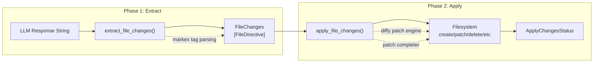
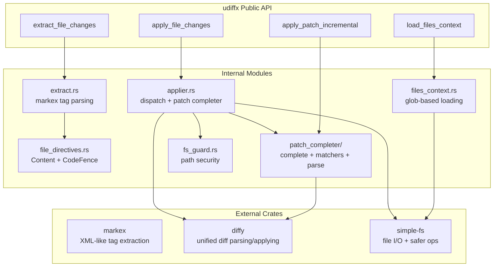

# udiffx — Overview

**Source:** `rust-udiffx/` — 23 Rust files, ~5,523 lines. Version 0.1.42-WIP. MIT OR Apache-2.0.

udiffx is a Rust crate that parses and applies LLM-optimized unified diff patches and XML-like file change directives. It provides a structured envelope (`<FILE_CHANGES>`) for AI agents to express multiple file operations — create, patch, append, copy, rename, delete — in a single response, then extracts and applies those changes to a filesystem.

**Aha:** udiffx is NOT a traditional diff tool. It doesn't generate diffs — it *consumes* simplified, numberless diffs produced by LLMs and reconstructs valid unified diff patches through a tiered fuzzy-matching algorithm. The core innovation is the patch completer: given an LLM's approximate `@@` hunk (with no line numbers), it locates the matching position in the original file using Strict → Resilient → Fuzzy matching tiers, then reconstructs a valid `diffy`-compatible unified diff patch.

## Two-Phase Architecture

udiffx operates in two independent phases:



### Phase 1: Extraction (`extract.rs`)

Parses the `<FILE_CHANGES>` XML-like envelope from an LLM response string. Uses the `markex` crate for tag extraction. Supports self-closing tags (`<FILE_DELETE />`). Each directive becomes a `FileDirective` enum variant:

| Directive | Attributes | Purpose |
|-----------|-----------|---------|
| `FILE_NEW` | `file_path` | Create a new file with full content |
| `FILE_PATCH` | `file_path` | Modify existing file via simplified unified diff |
| `FILE_APPEND` | `file_path` | Append content to end of file |
| `FILE_COPY` | `from_path`, `to_path` | Copy file |
| `FILE_RENAME` | `from_path`, `to_path` | Rename/move file |
| `FILE_DELETE` | `file_path` | Delete file or directory |

Parse errors don't abort the entire extraction — they become `FileDirective::Fail` entries so the applier can report them per-directive.

### Phase 2: Application (`applier.rs`)

Executes each directive relative to a `base_dir`. The patch completer (`patch_completer/`) is the core engine — it takes simplified `@@` hunks (no line numbers) and reconstructs valid unified diff patches by finding context/removal lines in the original file.

## Public API Surface

```rust
// Extraction
pub fn extract_file_changes(input: &str, extrude_other_content: bool) -> Result<(FileChanges, Option<String>)>

// Application
pub fn apply_file_changes(base_dir: impl Into<SPath>, file_changes: FileChanges) -> Result<ApplyChangesStatus>

// Incremental patch application
pub fn apply_patch_incremental(original: &str, patch_raw: &str) -> Result<ApplyPatchIncrementalData>

// Context loading
pub fn load_files_context(base_dir: impl Into<SPath>, globs: &[&str]) -> Result<Option<String>>

// Patch analysis (for_test)
pub use patch_completer::{has_actionable_hunks, has_tilde_ranges, split_raw_hunks};

// LLM prompt (feature: "prompt")
pub fn prompt_file_changes() -> &'static str
```

## Key Types

| Type | Source | Purpose |
|------|--------|---------|
| `FileChanges` | `file_changes.rs` | Iterable collection of `FileDirective` |
| `FileDirective` | `file_directives.rs` | Enum: New, Patch, Append, Copy, Rename, Delete, Fail |
| `Content` | `file_directives.rs` | Content wrapper with code fence detection |
| `ApplyChangesStatus` | `apply_changes_status.rs` | Per-directive success/error results |
| `DirectiveStatus` | `apply_changes_status.rs` | Single directive result with match tier info |
| `ApplyPatchIncrementalData` | `applier.rs` | Incremental patch result with hunk errors |
| `MatchTier` | `patch_completer/types.rs` | Strict, Resilient, Fuzzy match levels |
| `Error` | `error.rs` | Crate error type with path/context tracking |

## Dependency Graph



## What to Read Next

- [Architecture](01-architecture.md) for the full module map and data flow
- [Extraction](02-extract.md) for markex-based tag parsing and directive extraction
- [Patch Completer](03-patch-completer.md) for the tiered matching algorithm — the core complexity
- [Applier](04-applier.md) for filesystem execution and error handling
