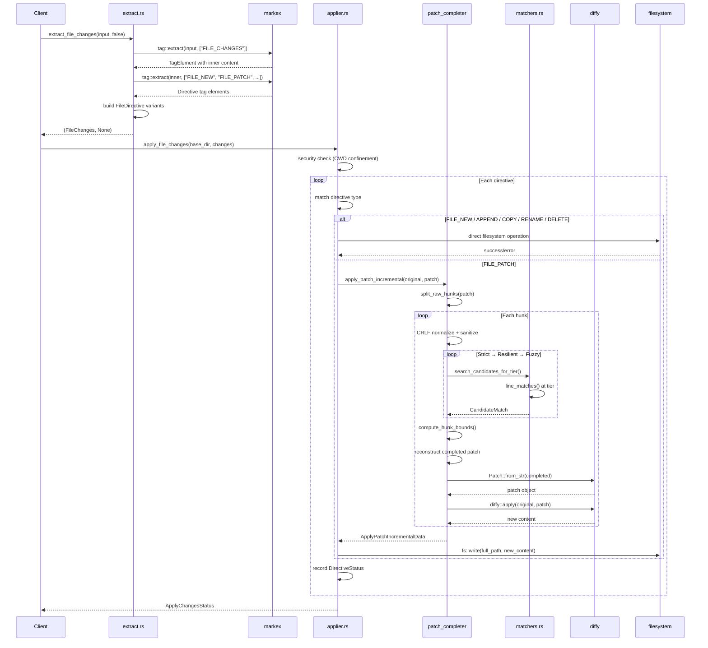

# udiffx — Architecture

**Source:** `rust-udiffx/src/` — 23 Rust files, ~5,523 lines. Version 0.1.42-WIP.

udiffx is structured as a two-layer system: extraction (parsing LLM output into structured directives) and application (executing those directives against the filesystem). The patch completer sits between them, bridging simplified LLM patches to valid unified diff format.

## Module Structure

```
rust-udiffx/src/
├── lib.rs                          # Public API re-exports, feature gates
├── error.rs                        # Error enum + Result alias (207 lines)
│
├── extract.rs                      # FILE_CHANGES extraction (166 lines)
├── file_directives.rs              # FileDirective enum, Content, CodeFence (143 lines)
├── file_changes.rs                 # FileChanges wrapper + iterators (45 lines)
├── apply_changes_status.rs         # ApplyChangesStatus, DirectiveStatus, HunkError (137 lines)
│
├── applier.rs                      # Main dispatcher + incremental patch (291 lines)
│   └── applier_tests.rs            # Integration tests
├── fs_guard.rs                     # Path security guard (28 lines)
├── files_context.rs                # Glob-based file context loading (71 lines)
│
├── patch_completer/                # Core patch completion engine
│   ├── mod.rs                      # Module exports + constants (35 lines)
│   ├── types.rs                    # MatchTier, CandidateMatch, TildeRange (62 lines)
│   ├── parse.rs                    # Raw hunk parsing, sanitization (264 lines)
│   ├── complete.rs                 # Hunk matching + patch reconstruction (910 lines)
│   ├── matchers.rs                 # Tiered line matching, scoring (269 lines)
│   └── tests.rs                    # Unit tests
│
└── prompt/                         # LLM system prompt (feature: "prompt")
    └── mod.rs                      # include_str! wrapper (4 lines)
```

## Layer Architecture

```mermaid
flowchart TB
    subgraph "Public API Layer"
        EXT["extract_file_changes()"]
        APP["apply_file_changes()"]
        INC["apply_patch_incremental()"]
        LFC["load_files_context()"]
        PROMPT["prompt_file_changes()"]
    end

    subgraph "Extraction Layer"
        EXTRACT["extract.rs\nmarkex tag extraction"]
        DIRECTIVES["file_directives.rs\nFileDirective enum\nContent / CodeFence"]
        FILECHANGES["file_changes.rs\nFileChanges iterable"]
    end

    subgraph "Status Layer"
        STATUS["apply_changes_status.rs\nApplyChangesStatus\nDirectiveStatus\nHunkError"]
    end

    subgraph "Application Layer"
        APPLIER["applier.rs\ndispatch per directive\nsecurity guard\nincremental patch"]
        FSGUARD["fs_guard.rs\npath confinement check"]
        FCONTEXT["files_context.rs\nglob-based loading"]
    end

    subgraph "Patch Completion Engine"
        PARSE["parse.rs\nraw hunk splitting\nCRLF normalization\nwrapper sanitization"]
        COMP["complete.rs\ntiered search\ncontext matching\npatch reconstruction"]
        MATCH["matchers.rs\nStrict/Resilient/Fuzzy\nsuffix matching\nindent delta"]
        PTYPES["types.rs\nMatchTier enum\nCandidateMatch struct"]
    end

    EXT --> EXTRACT
    EXTRACT --> DIRECTIVES
    DIRECTIVES --> FILECHANGES

    APP --> APPLIER
    APPLIER --> FSGUARD
    APPLIER --> STATUS
    APPLIER --> COMP

    INC --> COMP
    COMP --> PARSE
    COMP --> MATCH
    PARSE --> PTYPES
    MATCH --> PTYPES

    LFC --> FCONTEXT
    PROMPT -.feature "prompt"-> PROMPT
```

## Data Flow: Extract → Apply



## Type Relationships

```mermaid
classDiagram
    class FileChanges {
        -directives: Vec~FileDirective~
        +new()
        +is_empty()
        +iter()
    }

    class FileDirective {
        <<enumeration>>
        New{file_path, content}
        Patch{file_path, content}
        Append{file_path, content}
        Copy{from_path, to_path}
        Rename{from_path, to_path}
        Delete{file_path}
        Fail{kind, file_path, error_msg}
    }

    class Content {
        +content: String
        +code_fence: Option~CodeFence~
        +from_raw()
    }

    class CodeFence {
        +start: String
        +end: String
    }

    class ApplyChangesStatus {
        +items: Vec~DirectiveStatus~
    }

    class DirectiveStatus {
        +kind: DirectiveKind
        +success: bool
        +match_tier: Option~MatchTier~
        +error_msg: Option~String~
        +error_hunks: Vec~HunkError~
    }

    class HunkError {
        +hunk_body: String
        +cause: String
    }

    class MatchTier {
        <<enumeration>>
        Strict
        Resilient
        Fuzzy
    }

    FileChanges o-- FileDirective
    FileDirective o-- Content
    Content o-- CodeFence
    ApplyChangesStatus o-- DirectiveStatus
    DirectiveStatus o-- HunkError
    DirectiveStatus o-- MatchTier
```

## Security Model

The `fs_guard` module enforces path confinement:

```rust
// fs_guard.rs:16-25
fn check_in_base(target: &SPath, base_dir: &SPath) -> Result<()> {
    let base_dir = base_dir.clone().into_collapsed();
    let target = target.clone().into_collapsed();
    if !target.as_str().starts_with(base_dir.as_str()) {
        return Err(Error::security_violation(target.to_string(), base_dir.to_string()));
    }
    Ok(())
}
```

**Aha:** Path confinement uses collapsed `SPath` strings, not path component comparison. This prevents directory traversal attacks like `../../../etc/passwd` — after collapsing, any path starting with `../` would resolve outside the base directory and fail the `starts_with` check. The check runs at `apply_file_changes` entry (line 32) and for each individual operation.

## Feature Flags

| Feature | Enables | Dependencies |
|---------|---------|-------------|
| `test-support` | `for_test` module exports | None |
| `prompt` | `prompt_file_changes()` function | `include_str!` of prompt markdown |

## What to Read Next

- [Extraction](02-extract.md) for markex-based tag parsing
- [Patch Completer](03-patch-completer.md) for the tiered matching algorithm
- [Applier](04-applier.md) for filesystem execution
