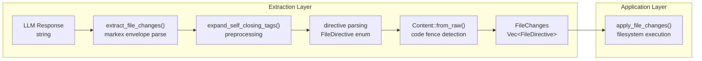

# udiffx — Extraction Layer

**Source:** `rust-udiffx/src/extract.rs` (166 lines), `file_directives.rs` (143 lines), `file_changes.rs` (45 lines).

The extraction layer parses an LLM response string into structured `FileChanges` containing `FileDirective` enums. It wraps the `markex` crate for XML-like tag extraction, adding self-closing tag support, code fence detection, and graceful error handling that converts parse failures into `FileDirective::Fail` entries rather than aborting.

## Extraction Flow

```mermaid
flowchart TD
    INPUT["LLM Response String"] --> STEP0["expand_self_closing_tags()"]
    STEP0 --> STEP1["markex::extract(input, [\"FILE_CHANGES\"])"]
    STEP1 --> NO_CHANGES{changes_tag found?}
    
    NO_CHANGES -->|no| EMPTY["return (FileChanges::empty(), extruded)"]
    NO_CHANGES -->|yes| STEP2["extract inner_content"]
    
    STEP2 --> STEP3["expand_self_closing_tags(inner)"]
    STEP3 --> STEP4["markex::extract(inner, [FILE_NEW, FILE_PATCH, FILE_APPEND, FILE_COPY, FILE_RENAME, FILE_DELETE])"]
    
    STEP4 --> LOOP["for each tag element"]
    LOOP --> MATCH{tag name}
    
    MATCH -->|FILE_NEW| NEW["attrs.file_path + content → New"]
    MATCH -->|FILE_PATCH| PATCH["attrs.file_path + content → Patch"]
    MATCH -->|FILE_APPEND| APPEND["attrs.file_path + content → Append"]
    MATCH -->|FILE_COPY| COPY["attrs.from_path + to_path → Copy"]
    MATCH -->|FILE_RENAME| RENAME["attrs.from_path + to_path → Rename"]
    MATCH -->|FILE_DELETE| DELETE["attrs.file_path → Delete"]
    MATCH -->|unknown| FAIL_TAG["Fail{kind: tag_name, error_msg}"]
    
    NEW --> ERR{parse ok?}
    PATCH --> ERR
    APPEND --> ERR
    COPY --> ERR
    RENAME --> ERR
    DELETE --> ERR
    
    ERR -->|ok| DIRECTIVE[FileDirective variant]
    ERR -->|error| FAIL["Fail{kind, file_path, error_msg}"]
    
    DIRECTIVE --> COLLECT["push to directives vec"]
    FAIL --> COLLECT
    FAIL_TAG --> COLLECT
    
    COLLECT --> DONE["FileChanges::new(directives)"]
```

## Step 1: FILE_CHANGES Envelope Extraction

```rust
// extract.rs:5-13
pub fn extract_file_changes(input: &str, extrude_other_content: bool) -> Result<(FileChanges, Option<String>)> {
    let parts = tag::extract(input, &["FILE_CHANGES"], extrude_other_content);
    
    let (tag_elems, extruded) = if extrude_other_content {
        let (elems, s) = parts.into_with_extrude_content();
        (elems, Some(s))
    } else {
        (parts.into_tag_elems(), None)
    };
```

The `extrude_other_content` flag controls whether text outside the `<FILE_CHANGES>` tags is preserved. When `true`, the return includes all non-tag content as `Option<String>`. When `false`, only the tag elements are extracted and the extruded content is `None`.

**Aha:** The function returns `(FileChanges, Option<String>)` — not `Result<FileChanges>`. This means extraction never fails at the envelope level. If no `<FILE_CHANGES>` tag is found, it returns an empty `FileChanges` rather than an error. Parse errors happen at the directive level and become `Fail` entries.

## Step 2: Self-Closing Tag Expansion

LLMs frequently emit self-closing XML tags like `<FILE_DELETE />` with no content. The `markex` crate may skip these, so udiffx preprocesses the inner content to expand them:

```rust
// extract.rs:131-163
fn expand_self_closing_tags(mut content: String) -> String {
    let tags = ["FILE_NEW", "FILE_PATCH", "FILE_APPEND", "FILE_COPY", "FILE_RENAME", "FILE_DELETE"];
    for tag in tags {
        let mut search_pos = 0;
        let tag_pattern = format!("<{tag}");
        while let Some(start_idx) = content[search_pos..].find(&tag_pattern) {
            let start_idx = search_pos + start_idx;
            if let Some(end_idx) = content[start_idx..].find('>') {
                let end_idx = start_idx + end_idx;
                let trimmed_part = content[..end_idx].trim_end();
                if trimmed_part.ends_with('/') {
                    // Self-closing: <FILE_DELETE /> → <FILE_DELETE></FILE_DELETE>
                    let slash_idx = trimmed_part.len() - 1;
                    let expansion = format!("></{tag}>");
                    content.replace_range(slash_idx..end_idx + 1, &expansion);
                    search_pos = slash_idx + expansion.len();
                } else {
                    search_pos = end_idx + 1;
                }
            } else {
                break;
            }
        }
    }
    content
}
```

This runs twice per extraction call: once on the full input before finding `<FILE_CHANGES>`, and again on the inner content before parsing directive tags. The string search is position-tracked to handle multiple occurrences of the same tag.

## Step 3: Directive Tag Parsing

Each directive tag is matched by name and its attributes are consumed:

```rust
// extract.rs:51-61
"FILE_NEW" => {
    let file_path = attrs
        .remove("file_path")
        .ok_or_else(|| Error::parse_missing_attribute("FILE_NEW", "file_path"))?;
    Ok(FileDirective::New {
        file_path,
        content: Content::from_raw(elem.content),
    })
}
```

Path attributes are extracted before the match for error reporting:

```rust
// extract.rs:44-48
let file_path_attr = attrs
    .get("file_path")
    .or_else(|| attrs.get("to_path"))
    .or_else(|| attrs.get("from_path"))
    .cloned();
```

**Aha:** The `file_path_attr` lookup tries three attribute names (`file_path`, `to_path`, `from_path`) so that even a malformed `FILE_COPY` or `FILE_RENAME` directive gets attached to a path in the `Fail` entry. This makes debugging easier — you can see which file the LLM was trying to operate on even if the directive was malformed.

## Content Processing

`Content::from_raw()` handles the raw string content extracted from each directive tag:

```rust
// file_directives.rs:47-98
impl Content {
    pub fn from_raw(raw: String) -> Self {
        let mut raw = raw;
        // Strip leading newline (markex artifact)
        if let Some(stripped) = raw.strip_prefix('\n') {
            raw = stripped.to_string();
        }
        
        // Detect code fence: ```lang\n...\n```
        let trimmed_start = raw.trim_start();
        if trimmed_start.starts_with("```") && let Some(f_idx) = trimmed_start.find('\n') {
            let start_fence = trimmed_start[..f_idx].to_string();
            let remaining = &trimmed_start[f_idx + 1..];
            let trimmed_end = remaining.trim_end();
            
            if trimmed_end.ends_with("```") {
                // ... extract fence markers and content between them
            }
        }
        
        Self { content: raw, code_fence: None }
    }
}
```

Two cases are handled:

1. **Empty fence** — ```` ```\n``` ```` → empty content with `code_fence: Some(CodeFence { start: "```", end: "```" })`
2. **Fenced content** — ```` ```rust\nlet x = 1;\n``` ```` → `content: "let x = 1;\n"`, `code_fence: Some(...)`
3. **No fence** — raw content passed through as-is

The leading newline strip at line 49 compensates for a markex artifact where the first character after the opening tag is a newline.

## Error Handling: Fail Directives

Parse errors are caught per-directive and converted to `Fail` entries:

```rust
// extract.rs:113-120
let directive = match directive_res {
    Ok(d) => d,
    Err(err) => FileDirective::Fail {
        kind: tag_name,
        file_path: file_path_attr,
        error_msg: err.to_string(),
    },
};
```

This means a single malformed directive doesn't invalidate the entire response. The applier can still process the valid directives and report the failure separately.

## FileChanges Iterator

`FileChanges` is a thin wrapper over `Vec<FileDirective>` with iteration support:

```rust
// file_changes.rs:20-42
impl FileChanges {
    pub fn iter(&self) -> std::slice::Iter<'_, FileDirective> { ... }
}

impl IntoIterator for FileChanges { ... }          // owned iteration
impl<'a> IntoIterator for &'a FileChanges { ... }  // borrowed iteration
```

The `is_empty()` method allows quick validation before invoking the applier.

## FileDirective Enum

The complete enum with all variants:

```rust
// file_directives.rs:2-32
pub enum FileDirective {
    New      { file_path: String, content: Content },
    Patch    { file_path: String, content: Content },
    Append   { file_path: String, content: Content },
    Copy     { from_path: String, to_path: String },
    Rename   { from_path: String, to_path: String },
    Delete   { file_path: String },
    Fail     { kind: String, file_path: Option<String>, error_msg: String },
}
```

## XML Envelope Example

A complete `<FILE_CHANGES>` block from an LLM response:

```xml
<FILE_CHANGES>
<FILE_NEW file_path="src/main.rs">
```rust
fn main() {
    println!("Hello, world!");
}
```
</FILE_NEW>

<FILE_PATCH file_path="src/lib.rs">
```diff
@@ fn compute @@
-    let old = deprecated_logic();
+    let new = improved_logic();
```
</FILE_PATCH>

<FILE_DELETE file_path="src/old.rs" />

<FILE_COPY from_path="config/dev.toml" to_path="config/prod.toml" />
</FILE_CHANGES>
```

## Extraction → Application Boundary



## What to Read Next

- [Patch Completer](03-patch-completer.md) for the tiered matching algorithm — the core complexity
- [Applier](04-applier.md) for filesystem execution and error handling
- [Architecture](01-architecture.md) for the full module map
