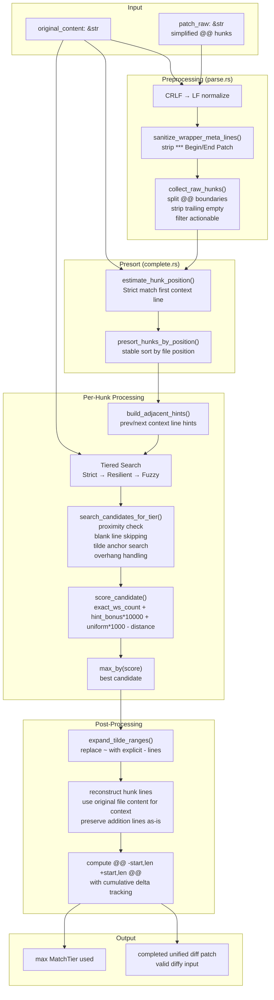
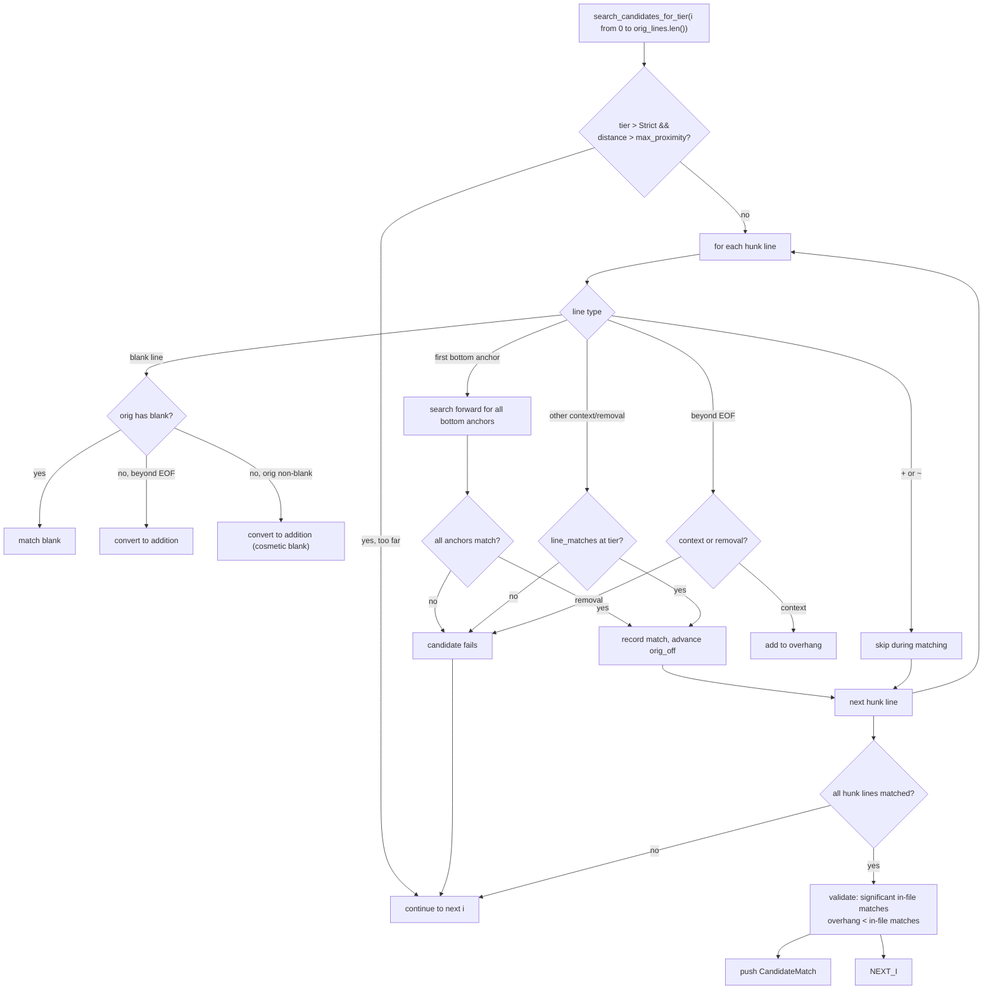

# udiffx — Patch Completer Engine

**Source:** `rust-udiffx/src/patch_completer/` — 4 files, ~1,271 lines.

The patch completer is the core innovation of udiffx. It takes simplified `@@` hunks from an LLM — with no line numbers, potentially wrong whitespace, and Markdown formatting artifacts — and reconstructs valid unified diff patches that `diffy` can apply. The engine uses a three-tier fuzzy matching algorithm (Strict → Resilient → Fuzzy) with adjacent-hint disambiguation and tilde range expansion.

## Architecture



## Public API

```rust
// patch_completer/complete.rs:26
pub fn complete(original_content: &str, patch_raw: &str) -> Result<(String, Option<MatchTier>)>
```

Returns the completed unified diff patch string and the highest `MatchTier` that was needed across all hunks. `None` means all hunks were append-only (no matching needed).

```rust
// patch_completer/parse.rs:10
pub fn has_actionable_hunks(patch_raw: &str) -> bool
```

Quick check: does the patch contain any `+`, `-`, or `~` lines? Used to skip empty patches.

```rust
// patch_completer/parse.rs:34
pub fn split_raw_hunks(patch_raw: &str) -> Vec<String>
```

Splits the raw patch into individual hunk strings, each with its own `@@\n` header. Used by the applier for incremental per-hunk application.

```rust
// patch_completer/parse.rs:77
pub fn has_tilde_ranges(hunk_raw: &str) -> bool
```

Checks if a hunk contains `~` markers (range-remove shorthand).

## Hunk Parsing (parse.rs)

### CRLF Normalization

All input is normalized to LF before processing:

```rust
// parse.rs:11-15 (also complete.rs:28-37)
let patch_raw: Cow<'_, str> = if patch_raw.contains("\r\n") {
    Cow::Owned(patch_raw.replace("\r\n", "\n"))
} else {
    Cow::Borrowed(patch_raw)
};
```

Uses `Cow` to avoid allocation when no CRLF is present.

### Wrapper Meta Line Sanitization

LLMs often wrap patches in meta markers like `*** Begin Patch` / `*** End Patch`:

```rust
// parse.rs:249-263
pub(super) fn is_wrapper_meta_line(trimmed: &str) -> bool {
    trimmed == "*** Begin Patch" || trimmed == "*** End Patch" || trimmed.starts_with("*** Update File:")
}

pub(super) fn sanitize_wrapper_meta_lines(patch_raw: &str) -> String {
    let mut out = String::new();
    for line in patch_raw.lines() {
        if is_wrapper_meta_line(line.trim()) { continue; }
        out.push_str(line);
        out.push('\n');
    }
    out
}
```

These are stripped so they don't appear inside hunk bodies and break matching.

### Hunk Splitting

```rust
// parse.rs:88-124
pub(super) fn collect_raw_hunks(patch_text: &str) -> Vec<Vec<&str>> {
    // Scan for @@ markers
    // Collect lines until next @@
    // Strip trailing empty lines (artifacts)
    // Filter: only keep hunks with +, -, or ~ lines (actionable)
}
```

A hunk is "actionable" if it contains at least one `+`, `-`, or `~` line. Pure context hunks (no changes) are discarded since they don't modify the file.

### Tilde Range Validation

The `~` shorthand lets LLMs indicate "remove all lines between these anchors" without listing each line:

```rust
// parse.rs:179-245
pub(super) fn validate_and_parse_tilde_ranges(hunk_lines: &[&str]) -> Result<Vec<TildeRange>> {
    // Find all ~ markers
    // For each ~: collect consecutive - lines above (top anchors)
    //              collect consecutive - lines below (bottom anchors)
    // Validate: at least TILDE_MIN_ANCHOR_LINES (2) on each side
    // Return TildeRange { top_anchor_hl_indices, tilde_hl_index, bottom_anchor_hl_indices }
}
```

Example hunk with tilde range:

```diff
@@
 fn foo() {
-    let x = 1;
-    let y = 2;
~
-    let z = 4;
-    let w = 5;
+    let new = 42;
 }
```

The `~` tells the completer to remove all original lines between `let y = 2;` and `let z = 4;`, whatever they are. The top anchors (`let x = 1;`, `let y = 2;`) and bottom anchors (`let z = 4;`, `let w = 5;`) locate the range in the original file.

**Aha:** The minimum of 2 anchor lines on each side (`TILDE_MIN_ANCHOR_LINES = 2`) prevents false positives — a single anchor line could match many places in a file, making the range ambiguous.

## Tiered Matching (matchers.rs)

The `line_matches()` function is the heart of the matching algorithm, with three tiers of increasing leniency:

### Tier 1: Strict

```rust
MatchTier::Strict => orig_line == p_line
```

Character-for-character exact match. No trimming, no normalization. This catches the majority of hunks when the LLM produces accurate context.

### Tier 2: Resilient

```rust
MatchTier::Resilient => {
    // 1. Trimmed comparison
    orig_trimmed == p_trimmed
    
    // 2. Normalized whitespace
    || normalize_ws(orig_trimmed) == normalize_ws(p_trimmed)
    
    // 3. Markdown heading tolerance (strip # markers)
    || (is_markdown_heading && strip_markdown_heading comparison)
    
    // 4. Suffix match (min 10 chars, case-sensitive)
    || suffix_match(orig_trimmed, p_trimmed, false)
    
    // 5. Trailing semicolon/comma tolerance
    || trim_end_matches([',', ';']) comparison
    
    // 6. Comment-only line tolerance (strip // # <!-- markers)
    || strip_comment_marker comparison
}
```

Resilient handles the most common LLM variances: whitespace differences, trailing punctuation in code, and minor comment wording changes.

### Tier 3: Fuzzy

```rust
MatchTier::Fuzzy => {
    // 1. Case-insensitive exact
    || o_l == p_l
    
    // 2. Case-insensitive whitespace-normalized
    || normalize_ws(&o_l) == normalize_ws(&p_l)
    
    // 3. Markdown heading + case-insensitive
    || heading comparison lowercase
    
    // 4. Suffix match (case-insensitive)
    || suffix_match(o_t, p_t, true)
    
    // 5. Backtick strip
    || o_l.replace('`', "") == p_l.replace('`', "")
    
    // 6. Full inline normalization (backticks + quote canonicalization)
    || normalize_inline_fuzzy comparison
    
    // 7. Punctuation strip (trailing)
    || trim_end_matches(ascii_punctuation)
    
    // 8. Numeric underscore strip (1_000 → 1000)
    || strip_numeric_underscores comparison
    
    // 9. Full whitespace strip (last resort, min 4 chars)
    || strip_all_ws comparison, len >= 4
}
```

Fuzzy is the last resort — it handles severe formatting differences, case changes, and multi-line string reformatting.

**Aha:** Each tier adds roughly 5-7 additional comparison strategies. The progression is deliberate: Strict catches the common case fast, Resilient handles typical LLM quirks, and Fuzzy is a safety net for extreme cases. The code short-circuits at the first match within each tier.

### Suffix Matching

Suffix matching handles cases where the LLM truncates a long line but preserves the unique ending:

```rust
// matchers.rs:88-116
fn suffix_match(orig_trimmed: &str, patch_trimmed: &str, case_insensitive: bool) -> bool {
    // Normalize both lines
    // If patch is suffix of orig (min SUFFIX_MATCH_MIN_LEN = 10 chars):
    //   Reject if non-matching prefix is a comment marker (prevents false positives)
    // If orig is suffix of patch (same check)
}
```

The comment marker check prevents `"do something"` from suffix-matching `"// do something"` — the `//` prefix is recognized as a comment marker and rejected.

### Scoring

When multiple candidates match at the same tier, the best one is selected by score:

```rust
// matchers.rs:122-137
pub(super) fn score_candidate(candidate: &CandidateMatch, search_from: usize) -> (usize, isize) {
    let uniform_bonus: usize = if candidate.uniform_indent { 1 } else { 0 };
    let hint_bonus: usize = candidate.adjacent_hint_matches;
    (
        candidate.exact_ws_count,                                    // primary: more exact matches
        (hint_bonus as isize * 10_000) + (uniform_bonus as isize * 1000) - distance as isize,
    )                                                                // secondary: hints + indent - distance
}
```

The score is a tuple `(exact_ws_count, secondary)`:
1. **Primary**: `exact_ws_count` — more lines that matched without whitespace normalization is better
2. **Secondary**: `hint_bonus * 10,000` (0-20,000) + `uniform_indent * 1,000` (0-1,000) - `distance` from expected position

The `hint_bonus * 10,000` weighting ensures that matching adjacent context lines (proving the hunk is in the right neighborhood) dominates over indent uniformity and distance.

## Candidate Search (complete.rs)



### Proximity Check

For Resilient and Fuzzy tiers, candidates beyond `MAX_PROXIMITY_FOR_LENIENT = 1000` lines from `search_from` are skipped:

```rust
// complete.rs:404-413
let distance = i.abs_diff(search_from);
let max_proximity = if search_from == 0 { 5000 } else { MAX_PROXIMITY_FOR_LENIENT };
if tier > MatchTier::Strict && distance > max_proximity { continue; }
```

The larger 5,000-line window when `search_from == 0` allows matching at the start of a file. The 1,000-line limit for subsequent hunks prevents drift that would break later hunks.

### Blank Line Handling

At Resilient/Fuzzy tiers, blank lines in the original are skipped over:

```rust
// complete.rs:437-443
if tier >= MatchTier::Resilient && !p_line.trim().is_empty() {
    while target_idx < orig_lines.len() && orig_lines[target_idx].trim().is_empty() {
        current_skipped_blanks_all.push(target_idx);
        target_idx += 1;
        orig_off += 1;
    }
}
```

This handles cases where the original file has extra blank lines between code blocks that the LLM didn't include in its context.

### Overhang Handling

When a hunk's context extends past EOF:

```rust
// complete.rs:543-551
if target_idx >= orig_lines.len() {
    if hl_line.starts_with('-') {
        matches = false; break;  // removal line beyond EOF = fail
    }
    current_overhang.push(hl_idx);  // context line beyond EOF = overhang
}
```

Overhang context lines are tracked but dropped from the final patch. Removal lines beyond EOF cause the candidate to fail.

Validation ensures overhang doesn't dominate:

```rust
// complete.rs:568-573
if !current_overhang.is_empty() {
    if significant_in_file_match_count < 2 || current_overhang.len() >= significant_in_file_match_count {
        continue;  // reject: too much overhang, not enough in-file matches
    }
}
```

### Adjacent Hints

Before processing each hunk, hints are extracted from adjacent hunks:

```rust
// complete.rs:252-266
fn build_adjacent_hints<'a>(raw_hunks: &[Vec<&'a str>], hunk_idx: usize) -> AdjacentHints<'a> {
    let prev_hint = last_context_or_removal_content(&raw_hunks[hunk_idx - 1]);
    let next_hint = first_context_or_removal_content(&raw_hunks[hunk_idx + 1]);
    AdjacentHints { prev_hint, next_hint }
}
```

These are checked during scoring:

```rust
// complete.rs:350-378
fn compute_adjacent_hint_matches(...) -> usize {
    // Check if orig_lines[candidate_start - 1] matches prev_hint (Resilient)
    // Check if orig_lines[candidate_start + old_count] matches next_hint (Resilient)
    // Returns 0, 1, or 2
}
```

**Aha:** Adjacent hints are the disambiguation mechanism. When the same code pattern appears multiple times in a file (e.g., two identical `fn handler()` blocks), the context lines from neighboring hunks act as "you're in the right neighborhood" signals. A candidate that matches both the previous hunk's last line and the next hunk's first line gets a `hint_bonus * 10,000` scoring boost — effectively guaranteeing selection over a candidate without hints.

### Hunk Presort

LLMs don't always emit hunks in file order. The presort step reorders them:

```rust
// complete.rs:193-234
fn presort_hunks_by_position<'a>(orig_lines: &[&str], raw_hunks: Vec<Vec<&'a str>>) -> Vec<Vec<&'a str>> {
    // estimate_hunk_position for each hunk (Strict match first context line)
    // If already ordered: return as-is
    // Stable sort by position; hunks without confident position keep original order
}
```

The presort uses only Strict matching for position estimation — if the first context line has multiple exact matches, the position is ambiguous and the hunk stays in its original relative order. This prevents false anchoring from reordering.

## Hunk Bounds Computation

`compute_hunk_bounds()` is the orchestrator that ties everything together:

### Empty File Bootstrapping

When the original file is empty or all-blank:

```rust
// complete.rs:657-686
if orig_is_empty && has_context_or_removal {
    // Convert all context/removal lines to additions
    // old_start: 1, old_count: 0, new_count: all lines
}
```

This allows `FILE_PATCH` to work on empty files — all context lines become additions since there's nothing to match against.

### Append Detection

When a hunk has no context/removal lines (only `+` additions):

```rust
// complete.rs:692-763
if context_lines_count == 0 {
    // Detect trailing blank overlap: convert leading blank additions to context
    // This prevents duplicating existing trailing blank lines
    // old_start: orig_lines.len() + 1 (append position)
}
```

The overlap detection handles a subtle case: if the original file ends with 2 blank lines and the LLM's hunk starts with 3 blank additions, the first 2 are converted to context lines (matching existing blanks), and only the 3rd is a real addition.

### Tiered Search Loop

```rust
// complete.rs:766-774
let tiers = [MatchTier::Strict, MatchTier::Resilient, MatchTier::Fuzzy];
for tier in tiers {
    candidates = search_candidates_for_tier(orig_lines, hunk_lines, search_from, tier, hints);
    if !candidates.is_empty() { break; }
}
```

The loop stops at the first tier that produces candidates. The highest tier used across all hunks is tracked as `max_tier`.

## Tilde Range Expansion

After the hunk position is found, `~` markers are expanded into explicit removal lines:

```rust
// complete.rs:274-336
fn expand_tilde_ranges(...) -> Result<Vec<String>> {
    // For each ~ in hunk_lines:
    //   1. Find the last top anchor's matched original index
    //   2. Find the first bottom anchor's matched original index
    //   3. Emit removal lines for all originals between them (exclusive)
    // The ~ marker itself is skipped
}
```

The expanded lines are then processed through the final hunk reconstruction, which uses the original file content for all context/removal lines.

## Final Patch Reconstruction

```rust
// complete.rs:851-906
for (hl_idx, line) in hunk_lines.iter().enumerate() {
    if overhang || skipped { continue; }
    if converted_to_add { final.push("+"); new_count++; continue; }
    
    if matched {
        // Use original file content for exact match
        let orig_content = orig_lines[orig_idx];
        let prefix = if line.starts_with('-') { '-' } else { ' ' };
        final.push(format!("{prefix}{orig_content}"));
    } else if addition {
        final.push(line.to_string());
        new_count++;
    }
}
```

**Aha:** Context and removal lines in the final patch use the **original file content**, not the LLM's version. This ensures the reconstructed patch exactly matches the file, which is required for `diffy` to apply it successfully. Only addition lines come directly from the LLM.

## Constants

```rust
// patch_completer/mod.rs:16-25
const MAX_PROXIMITY_FOR_LENIENT: usize = 1000;   // max search distance for Resilient/Fuzzy
const SUFFIX_MATCH_MIN_LEN: usize = 10;          // min suffix length to avoid false positives
const TILDE_MIN_ANCHOR_LINES: usize = 2;         // min anchors each side of ~
```

## Type Summary

| Type | File | Purpose |
|------|------|---------|
| `MatchTier` | `types.rs` | Strict, Resilient, Fuzzy — matching strictness levels |
| `HunkBounds` | `types.rs` | Computed hunk metadata: old_start, old_count, new_count, final lines, tier |
| `CandidateMatch` | `types.rs` | Match candidate with scoring fields: idx, tier, exact_ws_count, uniform_indent, adjacent_hint_matches |
| `TildeRange` | `types.rs` | Parsed `~` marker with top/bottom anchor indices |
| `AdjacentHints` | `types.rs` | Prev/next context line hints from neighboring hunks |

## What to Read Next

- [Applier](04-applier.md) for filesystem execution and error handling
- [Extraction](02-extract.md) for the markex-based tag parsing
- [Architecture](01-architecture.md) for the full module map
