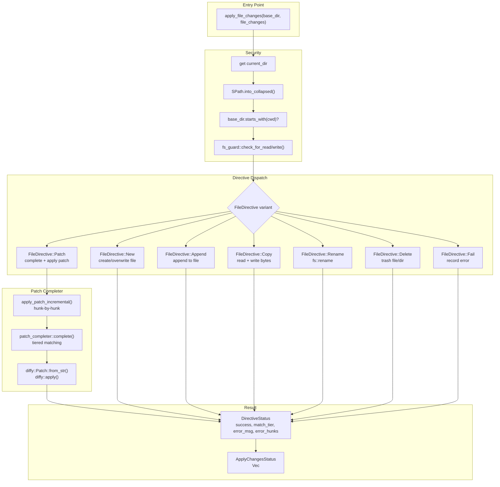
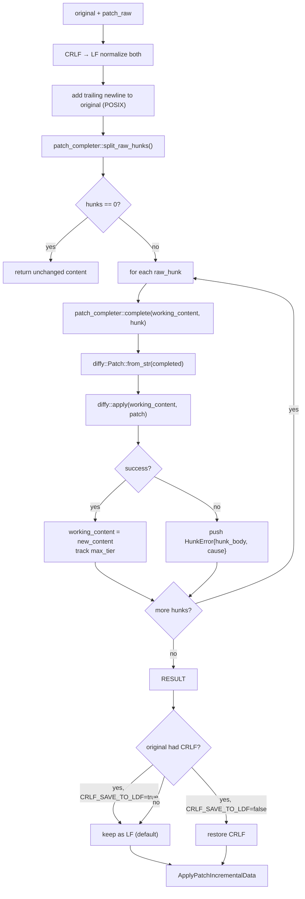

# udiffx — Applier Layer

**Source:** `rust-udiffx/src/applier.rs` (291 lines), `fs_guard.rs` (28 lines), `files_context.rs` (71 lines), `apply_changes_status.rs` (137 lines).

The applier layer executes `FileChanges` directives against the filesystem. It dispatches each directive to the appropriate operation (create, patch, append, copy, rename, delete), enforces path security via `fs_guard`, and returns a per-directive `ApplyChangesStatus` with match tier information for patches.

## Architecture



## apply_file_changes — Main Dispatcher

```rust
// applier.rs:20-193
pub fn apply_file_changes(base_dir: impl Into<SPath>, file_changes: FileChanges) -> Result<ApplyChangesStatus>
```

### Security Gate

Before any directive is processed, the base directory is validated against the current working directory:

```rust
// applier.rs:22-34
let cwd = std::env::current_dir().map_err(|err| Error::io_read_file(".", err))?;
let cwd_spath = SPath::from_std_path(cwd)?.into_collapsed();

let base_dir = if base_dir.is_absolute() {
    base_dir.clone().into_collapsed()
} else {
    cwd_spath.join(base_dir).into_collapsed()
};

if !base_dir.as_str().starts_with(cwd_spath.as_str()) {
    return Err(Error::security_violation(base_dir.to_string(), cwd_spath.to_string()));
}
```

**Aha:** The security check uses collapsed `SPath` strings, not path component comparison. After collapsing, `../../../etc/passwd` becomes an absolute path outside the base directory and fails the `starts_with` check. This prevents directory traversal attacks. Relative base directories are resolved against CWD first, so `base_dir = "project"` becomes `/home/user/project` before the check.

### Per-Directive Processing

Each directive is processed in a closure that returns `Result<()>`, with the result mapped to `DirectiveStatus`:

```rust
// applier.rs:38-190
for directive in file_changes {
    let mut info = DirectiveStatus::from(&directive);  // pre-populated with kind + file_path
    
    let res: Result<()> = (|| {
        match directive {
            // ... each directive type
        }
    })();
    
    match res {
        Ok(_) => info.success = true,
        Err(err) => info.error_msg = Some(err.to_string()),
    }
    
    items.push(info);
}
```

The `DirectiveStatus` is created from the directive before execution via `From<&FileDirective>`, so even failed directives have their kind and file_path populated.

## Directive Operations

### FILE_NEW

```rust
// applier.rs:43-59
FileDirective::New { file_path, content } => {
    let full_path = base_dir.join(&file_path);
    fs_guard::check_for_write(&full_path, &base_dir)?;
    ensure_file_dir(&full_path).map_err(Error::simple_fs)?;
    
    if full_path.exists() {
        let existing = read_to_string(&full_path).map_err(Error::simple_fs)?;
        if existing == content.content {
            return Err(Error::apply_no_changes(file_path));  // no-op
        }
        fs::write(&full_path, &content.content)?;
    } else {
        fs::write(&full_path, &content.content)?;
    }
}
```

Checks if the file already exists with the same content — if so, returns `apply_no_changes` error rather than silently succeeding. Parent directories are created automatically via `ensure_file_dir`.

### FILE_PATCH

```rust
// applier.rs:62-99
FileDirective::Patch { file_path, content: patch_content } => {
    let full_path = base_dir.join(&file_path);
    fs_guard::check_for_read(&full_path, &base_dir)?;
    fs_guard::check_for_write(&full_path, &base_dir)?;
    
    let original = if full_path.exists() {
        read_to_string(&full_path)?
    } else {
        String::new()  // patching non-existent file = treat as empty
    };
    
    let apply_data = apply_patch_incremental(&original, &patch_content.content)?;
    info.match_tier = apply_data.max_tier;
    info.error_hunks = apply_data.hunk_errors;
    
    if apply_data.new_content == original && full_path.exists() {
        return Err(Error::apply_no_changes(file_path));
    }
    
    fs::write(&full_path, apply_data.new_content)?;
    
    if !info.error_hunks.is_empty() {
        return Err(Error::custom(format!(
            "{} of {} hunks failed to apply for '{}'",
            apply_data.hunk_errors.len(), apply_data.total_hunks, file_path
        )));
    }
}
```

The patch directive is the most complex operation. It reads the original file, calls `apply_patch_incremental` (which uses the patch completer), writes the result, and records per-hunk errors.

**Aha:** Patching a non-existent file treats it as empty content, which the patch completer handles by converting all context/removal lines to additions. This means `FILE_PATCH` can create a file if all hunks are append-only, but it will fail if any hunks require matching context against nothing.

### FILE_APPEND

```rust
// applier.rs:101-120
FileDirective::Append { file_path, content } => {
    if content.content.is_empty() {
        return Err(Error::apply_no_changes(file_path));
    }
    
    let new_content = if full_path.exists() {
        format!("{existing_content}{}", content.content)
    } else {
        content.content  // append to non-existent = create
    };
    
    fs::write(&full_path, new_content)?;
}
```

Simple concatenation — no newline is automatically inserted between existing and appended content. The LLM must include any needed newlines in the content itself.

### FILE_COPY

```rust
// applier.rs:122-143
FileDirective::Copy { from_path, to_path } => {
    let full_from = base_dir.join(&from_path);
    let full_to = base_dir.join(&to_path);
    
    fs_guard::check_for_read(&full_from, &base_dir)?;
    fs_guard::check_for_write(&full_to, &base_dir)?;
    
    // Source must exist and be a file (not a directory)
    // Copies bytes (not text) so it works for binary files
    let source_bytes = fs::read(&full_from)?;
    fs::write(&full_to, source_bytes)?;
}
```

Uses `fs::read`/`fs::write` with bytes, not strings — so COPY works for binary files too.

### FILE_RENAME

```rust
// applier.rs:145-159
FileDirective::Rename { from_path, to_path } => {
    fs::rename(&full_from, &full_to)?;
}
```

Uses `fs::rename` — atomic on the same filesystem, fails across filesystems.

### FILE_DELETE

```rust
// applier.rs:161-175
FileDirective::Delete { file_path } => {
    if full_path.is_dir() {
        safer_trash_dir(&full_path, ())?;  // recursive trash
    } else {
        safer_trash_file(&full_path, ())?; // move to trash
    }
}
```

Uses `simple_fs`'s `safer_trash_*` functions instead of `fs::remove_*`. Files are moved to the OS trash rather than permanently deleted, providing a safety net for accidental deletions.

### FILE_FAIL

```rust
// applier.rs:177-179
FileDirective::Fail { error_msg, .. } => {
    return Err(error_msg.into());
}
```

Directives that failed during extraction become `Fail` entries. The applier simply records the extraction error as the directive's failure reason.

## apply_patch_incremental — Hunk-by-Hunk Application

```rust
// applier.rs:201-282
pub fn apply_patch_incremental(original: &str, patch_raw: &str) -> Result<ApplyPatchIncrementalData>
```

This function applies each hunk independently, allowing partial success:



### Key Design Decisions

1. **Working content accumulates**: Each successful hunk updates `working_content`, so subsequent hunks see the modified file. This means hunks that add lines shift positions for later hunks.

2. **Partial success is allowed**: If 3 of 5 hunks succeed, the result contains the content with all 3 successful changes applied, plus `hunk_errors` for the 2 failures.

3. **Per-hunk error reporting**: Each `HunkError` includes the raw hunk body and the cause (completion error, diffy parse error, or diffy apply error):

```rust
// apply_changes_status.rs:4-7
pub struct HunkError {
    pub hunk_body: String,
    pub cause: String,
}
```

4. **CRLF preservation**: By default (`CRLF_SAVE_TO_LDF = true`), files that originally had CRLF line endings are saved as LF. The flag exists to optionally restore CRLF but is currently set to keep LF.

```rust
// applier.rs:9, 272-274
const CRLF_SAVE_TO_LDF: bool = true;
if !CRLF_SAVE_TO_LDF && original_had_crlf {
    working_content = working_content.replace('\n', "\r\n");
}
```

5. **POSIX trailing newline**: A trailing newline is added to the working content if the original didn't have one:

```rust
// applier.rs:216-219
if !working_content.is_empty() && !working_content.ends_with('\n') {
    working_content.push('\n');
}
```

This ensures POSIX-compliant text files and prevents diffy from failing on files without a final newline.

## Path Security (fs_guard.rs)

```rust
// fs_guard.rs:4-25
pub fn check_for_write(target: &SPath, base_dir: &SPath) -> Result<()> { check_in_base(target, base_dir) }
pub fn check_for_read(target: &SPath, base_dir: &SPath) -> Result<()> { check_in_base(target, base_dir) }

fn check_in_base(target: &SPath, base_dir: &SPath) -> Result<()> {
    let base_dir = base_dir.clone().into_collapsed();
    let target = target.clone().into_collapsed();
    if !target.as_str().starts_with(base_dir.as_str()) {
        return Err(Error::security_violation(target.to_string(), base_dir.to_string()));
    }
    Ok(())
}
```

The guard is called at two levels:
1. **Entry gate**: `base_dir` must be within CWD (applier.rs:32)
2. **Per-operation**: Each file path must be within `base_dir` (each directive handler)

Both `read` and `write` checks use the same `check_in_base` function — the distinction is semantic (documentation-level) rather than functional.

## Files Context Loading (files_context.rs)

```rust
// files_context.rs:6-32
pub fn load_files_context(base_dir: impl Into<SPath>, globs: &[&str]) -> Result<Option<String>>
```

Loads files matching glob patterns and formats them as `<FILE_CONTENT>` blocks:

```xml
<FILE_CONTENT path="src/main.rs">
fn main() {}
</FILE_CONTENT>

<FILE_CONTENT path="src/lib.rs">
pub mod a;
</FILE_CONTENT>
```

This output is designed to be fed into the LLM as context so it knows what files exist and their content before generating `FILE_CHANGES` directives. Returns `None` if no files match the globs.

Uses `simple_fs::list_files` for glob matching, which handles `**` recursive patterns like `src/**/*.rs`.

## Status Types (apply_changes_status.rs)

```mermaid
classDiagram
    class ApplyChangesStatus {
        +items: Vec~DirectiveStatus~
    }
    
    class DirectiveStatus {
        +kind: DirectiveKind
        +success: bool
        +match_tier: Option~MatchTier~
        +error_msg: Option~String~
        +error_hunks: Vec~HunkError~
        +file_path() str
        +success() bool
        +error_msg() Option~str~
        +kind() str
    }
    
    class DirectiveKind {
        <<enumeration>>
        New{file_path}
        Patch{file_path}
        Append{file_path}
        Copy{from_path, file_path}
        Rename{from_path, file_path}
        Delete{file_path}
        Fail{kind_str, file_path}
    }
    
    class HunkError {
        +hunk_body: String
        +cause: String
    }
    
    ApplyChangesStatus *-- DirectiveStatus
    DirectiveStatus *-- DirectiveKind
    DirectiveStatus *-- HunkError
```

`DirectiveStatus` implements `From<&FileDirective>` for pre-population:

```rust
// apply_changes_status.rs:88-133
impl From<&FileDirective> for DirectiveStatus {
    fn from(directive: &FileDirective) -> Self {
        // Maps FileDirective variant → DirectiveKind variant
        // Sets success: false, match_tier: None, error_hunks: empty
        // For Fail directives: pre-populates error_msg from extraction error
    }
}
```

The `match_tier` field is only set for `FILE_PATCH` directives during `apply_patch_incremental`. For other directives, it remains `None`.

## ApplyPatchIncrementalData

```rust
// applier.rs:12-17
pub struct ApplyPatchIncrementalData {
    pub new_content: String,       // resulting content (may be partial)
    pub max_tier: Option<MatchTier>, // highest tier needed across all hunks
    pub hunk_errors: Vec<HunkError>, // per-hunk failure details
    pub total_hunks: usize,         // total number of hunks attempted
}
```

This is returned by both `apply_patch_incremental` (public API) and used internally by the `FILE_PATCH` directive handler. The `max_tier` field is useful for reporting — if all hunks matched at `Strict`, the LLM produced an accurate patch. If `Fuzzy` was needed, the patch was approximate.

## What to Read Next

- [Extraction](02-extract.md) for the markex-based tag parsing
- [Patch Completer](03-patch-completer.md) for the tiered matching algorithm
- [Architecture](01-architecture.md) for the full module map
