# rust-uuid-extra — Overview

**Source:** `src/` — 6 Rust files. UUID generation, Base58/Base64 encoding, and timestamp extraction.

`uuid_extra` provides convenience wrappers around the `uuid` crate for generating UUID v4/v7, encoding them in Base58 or three Base64 variants, and extracting epoch millisecond timestamps from v7 UUIDs.

## Public API

```mermaid
flowchart TD
    subgraph "UUID Generation"
        NEW_V4["new_v4()\n→ Uuid (random)"]
        NEW_V7["new_v7()\n→ Uuid (time-ordered)"]
        NOW_V7["now_v7()\n→ Uuid (alias to new_v7)"]
    end

    subgraph "Base58 Encoding"
        V4_B58["new_v4_b58()\n→ String"]
        V7_B58["new_v7_b58()\n→ String"]
        FROM_B58["from_b58(s)\n→ Result<Uuid>"]
        B58_TO_MS["b58_to_epoch_ms(s)\n→ Result<i64>"]
    end

    subgraph "Base64 Encoding"
        V4_B64["new_v4_b64()\n→ String (standard)"]
        V4_B64U["new_v4_b64url()\n→ String (url-safe)"]
        V4_B64U_NP["new_v4_b64url_nopad()\n→ String"]
        V7_B64["new_v7_b64()\n→ String (standard)"]
        V7_B64U["new_v7_b64url()\n→ String (url-safe)"]
        V7_B64U_NP["new_v7_b64url_nopad()\n→ String"]
        FROM_B64["from_b64(s)\n→ Result<Uuid>"]
        FROM_B64U["from_b64url(s)\n→ Result<Uuid>"]
        FROM_B64U_NP["from_b64url_nopad(s)\n→ Result<Uuid>"]
        B64_TO_MS["b64_to_epoch_ms(s)\n→ Result<i64>"]
        B64U_TO_MS["b64url_to_epoch_ms(s)\n→ Result<i64>"]
        B64U_NP_TO_MS["b64url_nopad_to_epoch_ms(s)\n→ Result<i64>"]
    end

    subgraph "Timestamp Extraction"
        TO_MS["to_time_epoch_ms(&Uuid)\n→ Result<i64>"]
    end

    subgraph "Support"
        FROM_VEC["from_vec_u8(bytes, ctx)\n→ Result<Uuid>"]
    end

    NEW_V4 --> V4_B58
    NEW_V4 --> V4_B64
    NEW_V4 --> V4_B64U
    NEW_V4 --> V4_B64U_NP

    NEW_V7 --> V7_B58
    NEW_V7 --> V7_B64
    NEW_V7 --> V7_B64U
    NEW_V7 --> V7_B64U_NP

    FROM_B58 --> B58_TO_MS
    FROM_B64 --> B64_TO_MS
    FROM_B64U --> B64U_TO_MS
    FROM_B64U_NP --> B64U_NP_TO_MS

    B58_TO_MS --> TO_MS
    B64_TO_MS --> TO_MS
    B64U_TO_MS --> TO_MS
    B64U_NP_TO_MS --> TO_MS

    FROM_B58 --> FROM_VEC
    FROM_B64 --> FROM_VEC
    FROM_B64U --> FROM_VEC
    FROM_B64U_NP --> FROM_VEC
```



### Quick Start

```rust
use uuid_extra::{new_v4, new_v7, to_time_epoch_ms};
use uuid_extra::{new_v7_b64, from_b64, b64_to_epoch_ms};
use uuid_extra::{new_v7_b58, from_b58, b58_to_epoch_ms};

// Generate UUIDs
let v4 = new_v4();
let v7 = new_v7();

// Encode as Base64 (24 chars with padding)
let b64 = new_v7_b64();

// Decode and extract timestamp
let decoded = from_b64(&b64)?;
let epoch_ms = b64_to_epoch_ms(&b64)?;
```

## UUID Generation

```rust
// extra_uuid.rs:6-39
pub fn new_v4() -> Uuid { Uuid::new_v4() }
pub fn new_v7() -> Uuid { Uuid::now_v7() }
pub fn now_v7() -> Uuid { Uuid::now_v7() }
```

| Function | UUID Version | Ordering | Use Case |
|----------|-------------|----------|----------|
| `new_v4()` | 4 (random) | None | Non-sequential IDs, anonymous identifiers |
| `new_v7()` | 7 (time-ordered) | Monotonic | Database keys, sortable IDs |
| `now_v7()` | 7 (time-ordered) | Monotonic | Alias for `new_v7()` |

**Aha:** `new_v7` and `now_v7` are identical — both delegate to `Uuid::now_v7()`. The alias exists because some codebases prefer "new" for creation while others prefer "now" to emphasize the timestamp aspect. The underlying `uuid` crate's `now_v7()` guarantees monotonicity even for calls within the same millisecond by incrementing a sequence counter.

## Timestamp Extraction from v7 UUIDs

```rust
// extra_uuid.rs:18-31
pub fn to_time_epoch_ms(uuid: &Uuid) -> Result<i64> {
    if uuid.get_version_num() != 7 {
        return Err(Error::FailExtractTimeNoUuidV7(*uuid));
    }
    let as_int = uuid.as_u128();
    let ts_ms = (as_int >> 80) as i64; // drop low 80 bits, keep top 48
    Ok(ts_ms)
}
```

v7 UUIDs store a 48-bit millisecond-precision timestamp in their most significant bits. The extraction works by:

1. Getting the UUID as a 128-bit integer (`as_u128()`)
2. Right-shifting by 80 bits to isolate the top 48 bits
3. Casting to `i64` (safe since 48 bits fits in i64)

```rust
// Layout of a v7 UUID as u128:
// [48-bit timestamp in ms] [8 bits version=7] [68 random bits]
//  ^^^^^^^^^^^^^^^^^^^^^^   ^^^^^^^^^^^^^^^^^  ^^^^^^^^^^^^^^^^
//  >> 80 to extract       4 bits version      remaining
//  the epoch ms           field
```

Returns `FailExtractTimeNoUuidV7(uuid)` if the UUID is not version 7.

## Base58 Encoding

```rust
// extra_base58.rs:7-38
pub fn new_v4_b58() -> String {
    bs58::encode(new_v4().as_bytes()).into_string()
}

pub fn new_v7_b58() -> String {
    bs58::encode(new_v7().as_bytes()).into_string()
}

pub fn from_b58(s: &str) -> Result<Uuid> {
    let decoded_bytes = bs58::decode(s).into_vec().map_err(Error::custom_from_err)?;
    support::from_vec_u8(decoded_bytes, "base58")
}
```

Base58 encodes 16 UUID bytes into ~22 character strings. The Base58 alphabet excludes visually ambiguous characters: `0`, `O`, `I`, `l`, `+`, `/`.

| Function | Output Length | Example |
|----------|--------------|---------|
| `new_v4_b58()` | ~22 chars | `5Kd3NBPdJn...` |
| `new_v7_b58()` | ~22 chars | `5MxQ8rTfVh...` |

No padding characters exist in Base58 — the encoding is variable-length based on the input bytes.

## Base64 Encoding

```rust
// extra_base64.rs:6-89
// Three variants for both v4 and v7:
pub fn new_v4_b64() -> String         // standard Base64, 24 chars, "==" padded
pub fn new_v4_b64url() -> String      // URL-safe Base64, 24 chars, "==" padded
pub fn new_v4_b64url_nopad() -> String // URL-safe Base64, 22 chars, no padding

pub fn new_v7_b64() -> String         // standard Base64, 24 chars, "==" padded
pub fn new_v7_b64url() -> String      // URL-safe Base64, 24 chars, "==" padded
pub fn new_v7_b64url_nopad() -> String // URL-safe Base64, 22 chars, no padding
```

### Base64 Variant Comparison

| Variant | Alphabet | Padding | Length | URL-safe |
|---------|----------|---------|--------|----------|
| `STANDARD` | `A-Z a-z 0-9 + /` | `==` | 24 chars | No |
| `URL_SAFE` | `A-Z a-z 0-9 - _` | `==` | 24 chars | Yes |
| `URL_SAFE_NO_PAD` | `A-Z a-z 0-9 - _` | none | 22 chars | Yes |

**Aha:** 16 bytes of UUID data encodes to exactly 24 characters in padded Base64 (since `ceil(16/3) * 4 = 24`). Without padding, it's 22 characters (since `ceil(16 * 4 / 3) = 22`). The `==` padding accounts for the fact that 16 is not divisible by 3 — 16 bytes = 5 groups of 3 + 1 remaining byte, which needs 2 padding chars.

### Decode Functions

```rust
// extra_base64.rs:52-89
pub fn from_b64(s: &str) -> Result<Uuid>           // standard decode
pub fn from_b64url(s: &str) -> Result<Uuid>        // URL-safe decode
pub fn from_b64url_nopad(s: &str) -> Result<Uuid>  // URL-safe no-pad decode
```

Each decode function:
1. Decodes the Base64 string to bytes using the appropriate engine
2. Validates the result is exactly 16 bytes via `from_vec_u8`
3. Returns `FailToDecode16U8 { context, actual_length }` if length mismatches

### Timestamp Extraction from Encoded UUIDs

Each Base64 variant has a corresponding `*_to_epoch_ms` function:

```rust
pub fn b64_to_epoch_ms(s: &str) -> Result<i64> {
    let uuid = from_b64(s)?;
    to_time_epoch_ms(&uuid)
}
```

These chain decode + timestamp extraction in one call. All return `FailExtractTimeNoUuidV7` for v4 UUIDs.

## Error Model

```rust
// error.rs:6-22
#[derive(Debug, Display, From)]
pub enum Error {
    #[from(String, &String, &str)]
    Custom(String),

    FailToDecode16U8 {
        context: &'static str,
        actual_length: usize,
    },

    FailExtractTimeNoUuidV7(Uuid),

    #[from]
    Io(std::io::Error),
}
```

| Variant | When | Example |
|---------|------|---------|
| `Custom(String)` | Base64/Base58 decode error, or manual `Error::custom()` | `"provided string contained invalid character '0'"` |
| `FailToDecode16U8` | Decoded bytes are not exactly 16 | `{context: "base58", actual_length: 5}` |
| `FailExtractTimeNoUuidV7` | `to_time_epoch_ms` called on non-v7 UUID | contains the offending `Uuid` |
| `Io` | External std::io error (for future use) | wrapped `std::io::Error` |

The `derive_more` macros provide `Display` (debug formatting) and `From` implementations. `#[from(String, &String, &str)]` allows `Error::Custom` to be created from any of those three string types.

## Support Module

```rust
// support.rs:1-11
pub fn from_vec_u8(decoded_bytes: Vec<u8>, error_context: &'static str) -> Result<Uuid> {
    let bytes_array: [u8; 16] = decoded_bytes.try_into().map_err(|ex: Vec<u8>| {
        Error::FailToDecode16U8 {
            context: error_context,
            actual_length: ex.len(),
        }
    })?;
    Ok(Uuid::from_bytes(bytes_array))
}
```

This is the shared conversion from decoded bytes to `Uuid`. The `error_context` parameter (e.g., `"base58"`, `"base64url"`, `"base64url-nopad"`) is embedded in the error message for debugging. The `try_into()` on `Vec<u8>` to `[u8; 16]` fails unless the vec has exactly 16 elements.

## Module Structure

```
src/
├── lib.rs            # Re-exports: Error, Result, extra_base58, extra_base64, extra_uuid
├── extra_uuid.rs     # new_v4, new_v7, now_v7, to_time_epoch_ms
├── extra_base58.rs   # new_v4_b58, new_v7_b58, from_b58, b58_to_epoch_ms
├── extra_base64.rs   # 9 encode functions, 6 decode functions, 3 timestamp functions
├── error.rs          # Error enum: Custom, FailToDecode16U8, FailExtractTimeNoUuidV7, Io
└── support.rs        # from_vec_u8 shared byte-to-UUID conversion
```

## Dependencies

| Dependency | Purpose |
|------------|---------|
| `uuid` | UUID v4/v7 generation, UUID type |
| `bs58` | Base58 encoding/decoding |
| `base64` | Base64 encoding/decoding (3 variants) |
| `derive_more` | Display, From derive macros for Error |
