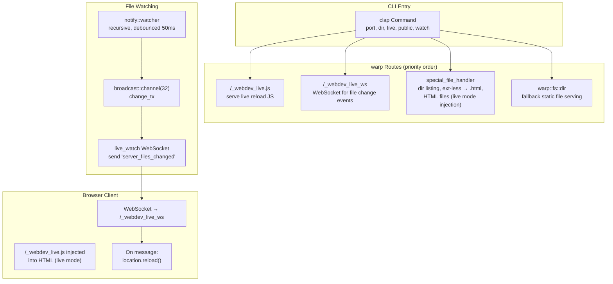

# rust-webdev — Overview

**Source:** `src/` — 5 Rust files + 1 JavaScript file. Lightweight static file server on `warp` with live reload.

`webdev` is a static file server built on `warp`. It serves local directories over HTTP with automatic directory listing, extension-less URL routing (auto-appending `.html`), and live reload via WebSocket-based file watching.

## CLI Usage

```
webdev [OPTIONS]
```

### Flags and Options

| Flag | Short | Description |
|------|-------|-------------|
| `--public` | | Listen on `0.0.0.0` instead of `127.0.0.1` |
| `--port` | `-p` | Port number (default: 8080) |
| `--dir` | `-d` | Root local directory to serve (default: `./`) |
| `--live` | `-l` | Auto-inject live reload script tag into all served HTML files |
| `--watch` | `-w` | File watch paths (can be multiple). Default: serving root directory |

### Examples

```bash
# Serve current directory on port 8080
webdev

# Serve a specific directory on custom port
webdev -d ./docs -p 3000

# Live reload mode (auto-injects script tag)
webdev -l

# Live reload with custom watch paths
webdev -l -w ./src -w ./templates

# Public mode (accessible from other machines)
webdev --public -p 8080
```

## Architecture



## Routing

The warp server composes three route tiers, tried in order:

### 1. Live Reload Endpoints

```rust
// main.rs:73-91
let webdev_live_watch = webdev_live_js.or(webdev_watch_ws);

// GET /_webdev_live.js — serves the live reload JavaScript
// WS /_webdev_live_ws — WebSocket for file change notifications
```

### 2. Special File Handler

```rust
// main.rs:94-96
let special_filter = with_path_type(Arc::new(root_dir.clone()))
    .and(warp::any().map(move || live_mode))
    .and_then(special_file_handler);
```

The `with_path_type` filter classifies incoming paths:

| Path Type | Detection | Handling |
|-----------|-----------|----------|
| Directory | `target_path.is_dir()` | Serve custom directory listing HTML |
| Extension-less file | no `.`, not ending with `/` | Append `.html` and serve |
| HTML file | `.html` or `.HTML` extension | Serve with optional live reload injection |
| Other | everything else | `NotSpecial` → fallback to static serving |

### 3. Fallback Static Serving

```rust
// main.rs:99
let warp_dir_filter = warp::fs::dir(root_dir.clone());
```

Standard `warp::fs::dir` serves any remaining files.

## Extension-less Routing

```rust
// main.rs:214-218
let target_path = if !web_path.is_empty() && !web_path.contains('.') && !web_path.ends_with('/') {
    root_dir.join(format!("{web_path}.html"))
} else {
    root_dir.join(web_path)
};
```

URL paths without extensions are mapped to `.html` files:

| Requested URL | Served File |
|---------------|-------------|
| `/about` | `./about.html` |
| `/docs/getting-started` | `./docs/getting-started.html` |
| `/styles.css` | `./styles.css` (has extension, served as-is) |
| `/` | Directory listing |

**Aha:** The comment on line 213 says "Later, this might be a config property" — the extension-less routing is hardcoded but was intended to be configurable. The detection is simple: no `.` in the path and doesn't end with `/`.

## Directory Listing

```rust
// main.rs:241-265
SpecialPath::Dir(path_info) => {
    let paths = fs::read_dir(&target_path);
    for path in paths {
        let diff = diff_paths(&path, root_dir)?;
        let suffix = if path.is_dir() { "/" } else { "" };
        let href = format!("/{}{suffix}", diff);
        html.push_str(&format!(r#"<a href="{}">{}{suffix}</a>"#, href, disp));
    }
    let html = f!("{HTML_DIR_LIST_START}{html}{HTML_DIR_LIST_END}");
    Ok(warp::reply::html(html))
}
```

Generates a simple HTML page with links to all directory contents. Directories get a trailing `/`. Uses `pathdiff::diff_paths` to compute relative paths from the served root.

## Live Reload System

### File Watching

```rust
// main.rs:136-172
async fn do_watch_paths(watch_paths: Vec<PathBuf>) -> (broadcast::Sender<()>, broadcast::Receiver<()>) {
    let (change_tx, change_rx) = broadcast::channel(32);

    tokio::task::spawn_blocking(move || {
        let (tx, rx) = std::sync::mpsc::channel();
        let mut debouncer = new_debouncer(Duration::from_millis(50), tx).unwrap();

        for watch_path in &watch_paths {
            debouncer.watcher().watch(watch_path, RecursiveMode::Recursive).unwrap();
        }

        for _events in rx {
            let _ = change_tx.send(());  // Broadcast change to all WebSocket clients
        }
    });

    (change_tx, change_rx)
}
```

The file watcher runs in a blocking tokio task because `notify`'s receiver blocks. Debounce is set to 50ms — shorter than the default 200ms used in other projects — for faster reload response.

### WebSocket Communication

```rust
// main.rs:174-187
async fn live_watch(ws: WebSocket, mut change_rx: broadcast::Receiver<()>, _live_ws_counter: Arc<Counter>) {
    let (mut ws_tx, _) = ws.split();
    tokio::task::spawn(async move {
        loop {
            let _ = change_rx.recv().await;
            let _ = ws_tx.send(Message::text("server_files_changed")).await;
            if send_res.is_err() { break; }  // Client disconnected
        }
    });
}
```

Each connected browser client gets its own WebSocket. When a file change is detected, `"server_files_changed"` is sent to all connected clients. If sending fails (client disconnected), the loop breaks and the WebSocket is dropped.

### Client-Side Script

```javascript
// _webdev_live.js
(function() {
    let ws = new WebSocket(`ws://${location.host}/_webdev_live_ws`);
    ws.onmessage = function() {
        location.reload();
    };
    ws.onclose = function() {
        setTimeout(function() {
            location.reload();
        }, 1000);
    };
})();
```

The injected script opens a WebSocket to `/_webdev_live_ws`. On receiving a change notification, it reloads the page. On WebSocket close, it waits 1 second then reloads — this handles server restarts during development.

### Live Mode Injection

```rust
// main.rs:267-274
SpecialPath::ExtLessFile(path_info) | SpecialPath::HtmlFile(path_info) => {
    let mut html = fs::read_to_string(path_info.target_path).unwrap();
    if live_mode {
        html.push_str(JS_LIVE_SCRIPT_TAG);
    }
    Ok(warp::reply::html(html))
}
```

When `-l` is enabled, the live reload script tag is appended to the body of every HTML file served:

```html
<script src="/_webdev_live.js"></script>
```

The script is served from `/_webdev_live.js` which returns the embedded JavaScript content:

```rust
// tmpl/mod.rs:5
pub const JS_LIVE_CONTENT: &str = include_str!("./_webdev_live.js");
```

**Aha:** The script tag is appended at the end of the HTML, after the `</body>` tag. This works because browsers are forgiving about script placement, but ideally it would be inserted before `</body>`. The startup message mentions an alternative: manually adding the script tag to HTML files without using `-l` mode.

## Public Mode

```rust
// main.rs:122-130
let is_public = app.get_flag("public");
let ip = if is_public {
    println!("! public mode on (listening on 0.0.0.0)");
    [0, 0, 0, 0]
} else {
    [127, 0, 0, 1]
};
warp::serve(routes).run((ip, port)).await;
```

By default, the server binds to `127.0.0.1` (localhost only). `--public` binds to `0.0.0.0`, making it accessible from other machines on the network.

## Request Logging

```rust
// main.rs:282-290
fn log_req(info: Info) {
    println!(
        " {} {} {} ({}ms)",
        info.method(),
        info.status(),
        info.path(),
        info.elapsed().as_micros() as f64 / 1000.
    );
}
```

Each request is logged with method, status code, path, and elapsed time in milliseconds. Applied via `warp::log::custom`:

```rust
let routes = routes.with(warp::log::custom(log_req));
```

## XString Trait

```rust
// xts/x_string.rs:6-8
pub trait XString {
    fn x_string(&self) -> Option<String>;
}
```

A convenience trait for converting `PathBuf`, `Option<PathBuf>`, `DirEntry`, and `Option<DirEntry>` to `Option<String>`. Used in the directory listing handler to safely convert paths to strings.

## Module Structure

```
src/
├── main.rs           # warp server setup, live reload WebSocket, routing
├── cmd.rs            # clap CLI argument definitions
├── tmpl/
│   ├── mod.rs        # JS_LIVE_CONTENT (include_str!), JS_LIVE_SCRIPT_TAG
│   └── html_dir_list.rs  # HTML_DIR_LIST_START, HTML_DIR_LIST_END templates
└── xts/
    ├── mod.rs        # Re-export x_string
    └── x_string.rs   # XString trait for path→string conversion
```

## Dependencies

| Dependency | Purpose |
|------------|---------|
| `warp` | HTTP server and WebSocket support |
| `tokio` | Async runtime |
| `clap` | CLI argument parsing |
| `futures` | Stream/Sink traits for WebSocket |
| `notify` | File system watching |
| `notify-debouncer-mini` | Debounced file events |
| `pathdiff` | Relative path computation |
