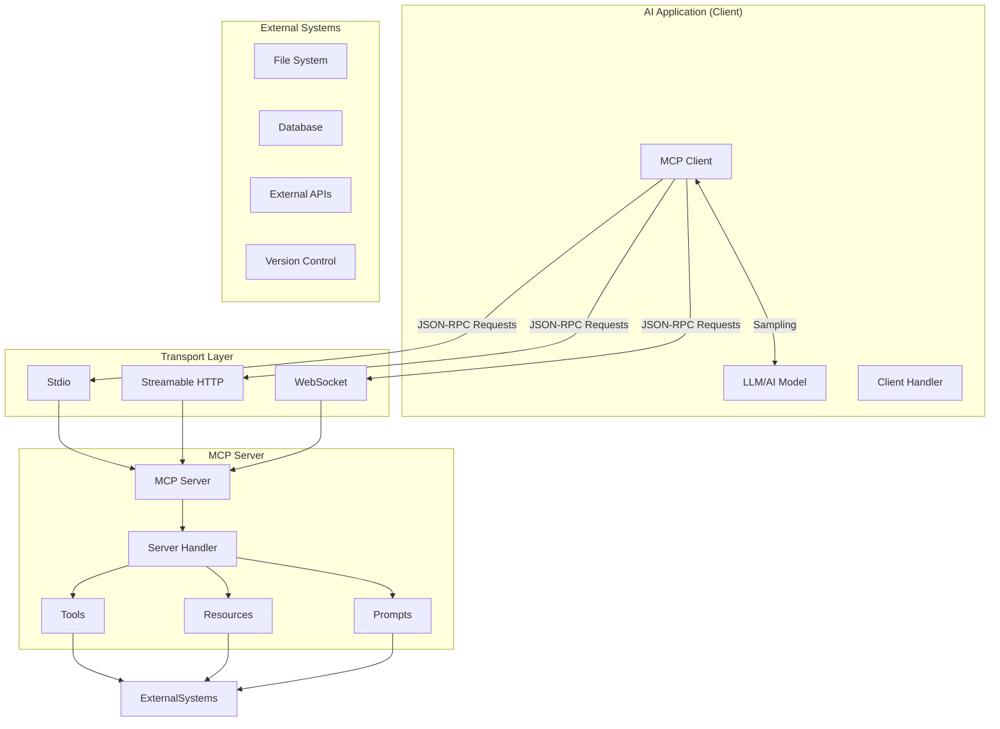
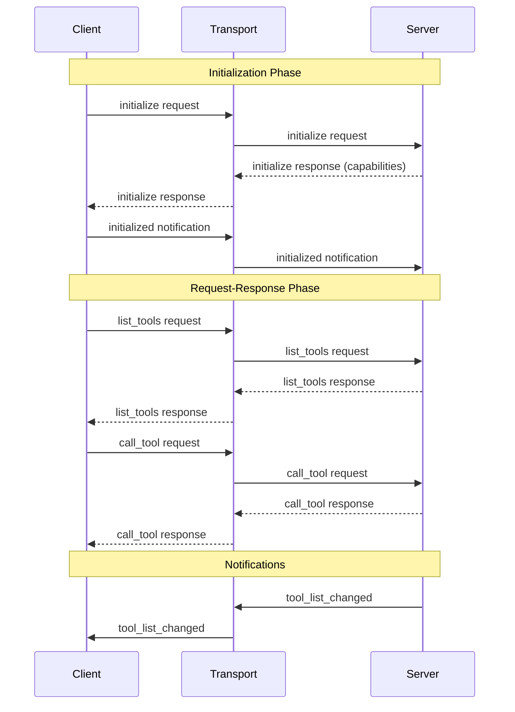

# Project Exploration: Model Context Protocol (MCP)

## Overview

Model Context Protocol (MCP) is an open standard that enables AI applications (clients) to connect with external systems (servers) through a unified interface. It provides a standardized way for AI models to interact with tools, resources, prompts, and external services.

The protocol is built on JSON-RPC 2.0 and defines:
- **Client-Server Architecture**: Clear separation between AI clients and capability-providing servers
- **Capability Negotiation**: Clients and servers exchange supported features during initialization
- **Extensible Features**: Tools, Resources, Prompts, Sampling, Roots, Logging, and Completions
- **Multiple Transports**: Stdio, HTTP (Streamable), WebSocket, and custom transports

The MCP ecosystem includes official SDK implementations in TypeScript and Rust, along with example servers and conformance tests.

## Repository Structure

```
src.MCP/
├── modelcontextprotocol/          # Official MCP specification and documentation
│   ├── schema/                    # JSON Schema definitions (TypeScript-first)
│   ├── docs/                      # Mintlify-based documentation
│   ├── seps/                      # Standards Enhancement Proposals
│   └── tools/                     # Protocol tooling
│
├── typescript-sdk/                # Official TypeScript SDK
│   ├── packages/
│   │   ├── core/                  # Shared core types and utilities
│   │   ├── client/                # Client SDK implementation
│   │   ├── server/                # Server SDK implementation
│   │   └── middleware/            # Middleware layer
│   ├── examples/                  # Usage examples
│   └── test/                      # Test fixtures
│
├── rust-sdk/                      # Official Rust SDK (RMCP)
│   ├── crates/
│   │   ├── rmcp/                  # Core protocol implementation
│   │   └── rmcp-macros/           # Procedural macros for tools/prompts
│   ├── examples/                  # Example clients and servers
│   └── conformance/               # Protocol conformance tests
│
├── python-sdk/                    # Python SDK implementation
├── ruby-sdk/                      # Ruby SDK implementation
├── go-sdk/                        # Go SDK implementation
├── csharp-sdk/                    # C# SDK implementation
│
├── servers/                       # Reference server implementations
├── inspector/                     # MCP Inspector tool (debugging)
└── ext-apps/                      # External application integrations
```

## Architecture

### High-Level Protocol Architecture



### Protocol Message Flow



## Core Protocol Components

### 1. JSON-RPC Foundation

MCP uses JSON-RPC 2.0 as its wire protocol:

```typescript
// Request
{
  jsonrpc: "2.0",
  id: number | string,
  method: string,
  params?: { ... }
}

// Response
{
  jsonrpc: "2.0",
  id: number | string,
  result?: { ... },
  error?: { code: number, message: string, data?: unknown }
}

// Notification
{
  jsonrpc: "2.0",
  method: string,
  params?: { ... }
}
```

### 2. Protocol Versioning

The current protocol version is `2025-11-25`. Version negotiation happens during initialization:

```rust
// Rust SDK protocol versions
pub const V_2024_11_05: ProtocolVersion = ProtocolVersion::new("2024-11-05");
pub const V_2025_03_26: ProtocolVersion = ProtocolVersion::new("2025-03-26");
pub const V_2025_06_18: ProtocolVersion = ProtocolVersion::new("2025-06-18");
pub const LATEST: ProtocolVersion = V_2025_06_18;
```

### 3. Capability Negotiation

Clients and servers declare supported capabilities:

```typescript
// Client capabilities
interface ClientCapabilities {
  roots?: { listChanged?: boolean };
  sampling?: { context?: object; tools?: object };
  elicitation?: { form?: object; url?: object };
  tasks?: { list?: object; cancel?: object; requests?: {...} };
}

// Server capabilities
interface ServerCapabilities {
  logging?: object;
  completions?: object;
  prompts?: { listChanged?: boolean };
  resources?: { subscribe?: boolean; listChanged?: boolean };
  tools?: { listChanged?: boolean };
  tasks?: { list?: object; cancel?: object };
}
```

### 4. Core Features

| Feature | Description | Direction |
|---------|-------------|-----------|
| **Tools** | Callable functions with JSON Schema args | Server -> Client |
| **Resources** | URI-identified data (text/binary) | Server -> Client |
| **Prompts** | Reusable message templates | Server -> Client |
| **Sampling** | Server requests LLM completion from Client | Server -> Client |
| **Roots** | Client workspace directories | Client -> Server |
| **Logging** | Structured log messages | Server -> Client |
| **Completions** | Argument auto-completion | Server -> Client |

## SDK Implementations

### Rust SDK (RMCP)

**Location:** `/home/darkvoid/Boxxed/@formulas/src.rust/src.llamacpp/src.AICoders/src.MCP/rust-sdk`

A production-ready Rust implementation featuring:
- Tokio async runtime
- Full protocol coverage
- Procedural macros for tools/prompts
- Multiple transport implementations
- OAuth 2.0 authentication support

**Crates:**
- `rmcp` (v1.2.0): Core protocol library
- `rmcp-macros` (v1.2.0): Procedural macros

### TypeScript SDK

**Location:** `/home/darkvoid/Boxxed/@formulas/src.rust/src.llamacpp/src.AICoders/src.MCP/typescript-sdk`

The reference SDK implementation featuring:
- Modular package structure (core, client, server, middleware)
- Full TypeScript type safety
- Browser and Node.js support
- OAuth 2.0 authentication

### Other SDKs

| Language | Location | Status |
|----------|----------|--------|
| Python | `python-sdk/` | Official |
| Ruby | `ruby-sdk/` | Official |
| Go | `go-sdk/` | Official |
| C# | `csharp-sdk/` | Official |

## Key Insights

1. **Protocol-First Design**: The schema is defined in TypeScript first, then exported as JSON Schema for other languages

2. **Transport Agnostic**: MCP supports multiple transport layers (stdio, HTTP, WebSocket) without changing the core protocol

3. **Capability-Based**: Features are opt-in via capability declaration during initialization

4. **Extensibility**: Custom methods and capabilities can be added without breaking compatibility

5. **Production Ready**: Both Rust and TypeScript SDKs include OAuth 2.0, streaming, and comprehensive error handling

## Entry Points

### Rust SDK - Server Example

```rust
use rmcp::{ServerHandler, ServiceExt, transport::stdio, model::*};

#[derive(Clone)]
struct MyServer;

impl ServerHandler for MyServer {
    fn get_info(&self) -> ServerInfo {
        ServerInfo {
            capabilities: ServerCapabilities::builder()
                .enable_tools()
                .build(),
            ..Default::default()
        }
    }

    async fn call_tool(...) -> Result<CallToolResult, ErrorData> {
        // Handle tool invocation
    }
}

#[tokio::main]
async fn main() {
    let transport = stdio();
    let server = MyServer.serve(transport).await?;
    server.waiting().await?;
}
```

### TypeScript SDK - Client Example

```typescript
import { Client } from '@modelcontextprotocol/sdk/client/index.js';
import { StdioClientTransport } from '@modelcontextprotocol/sdk/client/stdio.js';

const transport = new StdioClientTransport({
  command: 'npx',
  args: ['-y', '@modelcontextprotocol/server-everything'],
});

const client = new Client({ name: 'my-client' }, { capabilities: {} });
await client.connect(transport);

const tools = await client.listTools();
const result = await client.callTool({ name: 'example-tool', arguments: {} });
```

## Open Questions

1. **Task Augmentation**: The protocol includes task-based request handling for long-running operations - full implementation details would benefit from deeper exploration

2. **Elicitation**: URL-based elicitation flow requires further investigation for complete understanding

3. **Streamable HTTP**: The bidirectional HTTP streaming implementation has nuanced session management

## Related Projects

- **Goose**: AI agent built with rmcp
- **Apollo MCP Server**: GraphQL integration
- **RustFS MCP**: S3-compatible storage server
- **McpMux**: Desktop MCP gateway

## References

- [Official Documentation](https://modelcontextprotocol.io)
- [Protocol Schema](https://github.com/modelcontextprotocol/specification/blob/main/schema/2025-11-25/schema.ts)
- [Rust SDK Documentation](https://docs.rs/rmcp)
- [TypeScript SDK README](./typescript-sdk/README.md)
