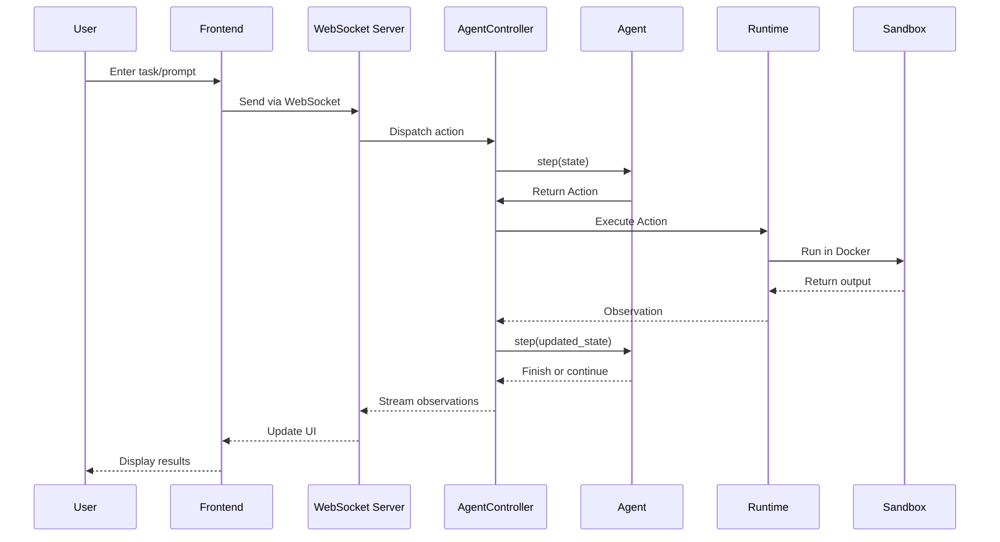

# Project Exploration: OpenHands (OpenDevin)

## Overview

OpenHands (formerly OpenDevin) is an open-source platform for AI-powered software development agents. It enables AI agents to perform software development tasks similar to what a human developer can do: modify code, run commands, browse the web, call APIs, and more.

The project is designed as a multi-agentic system where different specialized agents can collaborate to complete complex tasks. The default CodeActAgent can delegate tasks to other agents like BrowsingAgent for web-related tasks.

OpenHands supports multiple LLM providers through the LiteLLM library, with Anthropic's Claude Sonnet recommended as the primary model. The system can run locally via Docker or be deployed in cloud environments.

## Repository

- **Location:** `/home/darkvoid/Boxxed/@formulas/src.openDevin/OpenHands`
- **Remote:** N/A (snapshot copy, not a git repository)
- **Primary Language:** Python 3.12+ (backend), TypeScript/React (frontend)
- **License:** MIT
- **Version:** 0.48.0

## Directory Structure

```
OpenHands/
├── openhands/                    # Core Python backend code
│   ├── agenthub/                 # Agent implementations
│   │   ├── codeact_agent/        # Default coding agent
│   │   ├── browsing_agent/       # Web browsing agent
│   │   ├── readonly_agent/       # Read-only file exploration
│   │   ├── loc_agent/            # Lines of code agent
│   │   └── visualbrowsing_agent/ # Visual browsing agent
│   ├── controller/               # Agent controller and state management
│   ├── core/                     # Core utilities
│   ├── events/                   # Action and Observation event types
│   ├── runtime/                  # Runtime environment and sandbox
│   ├── server/                   # WebSocket server and API
│   ├── llm/                      # LLM abstraction layer
│   ├── memory/                   # Agent memory systems
│   ├── microagent/               # Microagent framework
│   ├── resolver/                 # Task resolution logic
│   ├── security/                 # Security analysis
│   └── utils/                    # Utility functions
├── frontend/                     # React/Remix web UI
│   ├── src/
│   │   ├── components/
│   │   ├── routes/
│   │   ├── state/                # Redux state management
│   │   ├── api/                  # API integration
│   │   └── hooks/
│   └── __tests__/
├── containers/                   # Docker container configurations
│   ├── app/                      # Main application container
│   ├── dev/                      # Development container
│   └── runtime/                  # Runtime sandbox container
├── microagents/                  # Pre-defined microagent prompts
├── docs/                         # Documentation (Docusaurus)
├── evaluation/                   # Evaluation benchmarks and tests
├── tests/                        # Unit and integration tests
└── dev_config/                   # Development configuration
```

## Architecture

### High-Level Diagram

```mermaid
flowchart TB
    subgraph Client ["Frontend (React/Remix)"]
        UI[Web UI - localhost:3001]
    end

    subgraph Server ["Backend Server"]
        CM[ConversationManager]
        S1[Session 1]
        S2[Session 2]
    end

    subgraph Agent ["Agent System"]
        AC[AgentController]
        Agent[CodeActAgent/BrowsingAgent/etc]
        State[State]
    end

    subgraph Runtime ["Runtime Environment"]
        ES[EventStream]
        RT[Runtime]
        Sandbox[Docker Sandbox]
    end

    UI <-->|WebSocket| CM
    CM --> S1
    CM --> S2
    S1 --> AC
    AC --> Agent
    Agent <-->|State| State
    AC --> ES
    ES <--> RT
    RT --> Sandbox
```

### Component Breakdown

#### Agent Hub (`openhands/agenthub/`)

Contains multiple agent implementations that can be used interchangeably:

- **CodeActAgent**: The default agent for coding tasks. Uses a "code as action" approach where the agent can execute bash commands, run Python code, and edit files directly.
- **BrowsingAgent**: Specialized for web browsing tasks with browser automation capabilities.
- **ReadonlyAgent**: For read-only file exploration tasks without making modifications.
- **LocAgent**: For code analysis and counting lines of code.
- **VisualBrowsingAgent**: Enhanced browsing agent with visual capabilities.

Each agent implements a `step(state) -> Action` interface where it receives the current state and returns an action to execute.

#### Controller (`openhands/controller/`)

The `AgentController` is responsible for:
- Initializing agents with proper configuration
- Managing state transitions
- Running the main agent loop
- Handling event streaming between components

#### Runtime (`openhands/runtime/`)

The runtime layer is responsible for:
- Executing actions in a sandboxed environment
- Managing Docker containers for code execution
- Handling file operations
- Browser automation
- Jupyter kernel management for interactive Python

Key files:
- `base.py`: Base runtime abstraction
- `action_execution_server.py`: Handles action execution
- `file_viewer_server.py`: File viewing capabilities

#### Server (`openhands/server/`)

FastAPI-based WebSocket server:
- Manages multiple concurrent sessions
- Handles WebSocket connections for real-time updates
- Provides REST API endpoints
- Manages file uploads
- Security analysis integration

#### Events (`openhands/events/`)

The event system is the backbone for all communication:

**Actions** (agent -> runtime):
- `CmdRunAction`: Execute shell commands
- `IPythonRunCellAction`: Execute Python code
- `FileReadAction` / `FileWriteAction`: File operations
- `BrowseURLAction`: Web browsing
- `AddTaskAction` / `ModifyTaskAction`: Task management
- `AgentFinishAction`: Signal task completion
- `MessageAction`: Chat messages

**Observations** (runtime -> agent):
- `CmdOutputObservation`: Command execution results
- `BrowserOutputObservation`: Web page content
- `FileReadObservation`: File contents
- `ErrorObservation`: Error messages
- `SuccessObservation`: Success confirmations

## Entry Points

### Backend Server

**File:** `openhands/server/listen.py`

The main entry point for the backend WebSocket server. It:
1. Creates a FastAPI application
2. Configures CORS and static file serving
3. Sets up WebSocket endpoints
4. Manages conversation sessions

```python
# Pseudocode flow
app = FastAPI()
conversation_manager = ConversationManager()

@app.websocket("/ws")
async def ws_endpoint(websocket):
    session = await conversation_manager.add_connection(websocket)
    await session.start()
```

### Frontend Application

**File:** `frontend/src/root.tsx`

Remix-based React application entry point. Handles:
- Initial routing and rendering
- WebSocket connection management
- Redux store initialization

### CLI Mode

**File:** `openhands/cli/main.py`

Command-line interface for headless operation:
```bash
poetry run openhands  # Start CLI mode
```

## Data Flow



## External Dependencies

| Dependency | Purpose |
|------------|---------|
| LiteLLM | Unified LLM API abstraction |
| Anthropic SDK | Claude model integration |
| Docker | Sandbox runtime |
| FastAPI | WebSocket server framework |
| React/Remix | Frontend framework |
| Redux | State management |
| Poetry | Python dependency management |
| browsergym-core | Browser automation |
| jupyter_kernel_gateway | Interactive Python execution |
| redis | Caching and session storage |
| minio | Object storage |

## Configuration

### Environment Variables

| Variable | Description | Default |
|----------|-------------|---------|
| `LLM_API_KEY` | API key for LLM provider | Required |
| `LLM_MODEL` | Model to use | `claude-sonnet-4-20250514` |
| `SANDBOX_RUNTIME_CONTAINER_IMAGE` | Docker image for runtime | `docker.all-hands.dev/all-hands-ai/runtime:0.48-nikolaik` |
| `WORKSPACE_DIR` | Path to workspace | `~/.openhands/workspace` |
| `DEBUG` | Enable debug logging | `false` |

### Configuration File

Configuration is stored in `~/.openhands/config.toml`:

```toml
[core]
llm_api_key = "sk-..."
llm_model = "claude-sonnet-4-20250514"

[sandbox]
runtime_container_image = "docker.all-hands.dev/..."
```

## Testing

### Unit Tests

Located in `tests/unit/`:
```bash
poetry run pytest ./tests/unit/test_*.py
```

### Integration Tests

The project uses pytest with async support:
```bash
poetry run pytest -m integration
```

### Frontend Tests

```bash
cd frontend
npm run test
npm run test:coverage
```

Uses Vitest with React Testing Library and MSW for API mocking.

## Key Insights

1. **Multi-Agent Architecture**: OpenHands uses a delegation model where agents can delegate subtasks to other specialized agents, enabling complex task decomposition.

2. **Event-Driven Design**: All communication flows through an EventStream, making the system highly modular and testable.

3. **Sandboxed Execution**: All code execution happens in Docker containers, providing isolation and security.

4. **Model Agnostic**: Through LiteLLM, the system can work with any LLM provider (Anthropic, OpenAI, Google, local models).

5. **Microagents System**: Supports small, specialized prompt-based agents for specific tasks (GitHub, Docker, Kubernetes, etc.).

6. **Dual Mode Operation**: Can run in interactive UI mode or headless CLI mode.

7. **Session Management**: The ConversationManager handles multiple concurrent sessions, each with isolated agent instances.

## Open Questions

1. How does the security analyzer work and what kind of threats does it detect?
2. What is the exact mechanism for agent delegation and state transfer?
3. How are long-running tasks handled (timeouts, persistence)?
4. What is the memory system architecture and how does it persist across sessions?
5. How does the evaluation framework benchmark agent performance?

## Related Documentation

- [Main Documentation](https://docs.all-hands.dev)
- [Development Guide](./Development.md)
- [Contributing Guidelines](./CONTRIBUTING.md)
- [Backend Architecture](./openhands/README.md)
- [Frontend Guide](./frontend/README.md)
- [Server Documentation](./openhands/server/README.md)
- [Runtime Documentation](./openhands/runtime/README.md)
