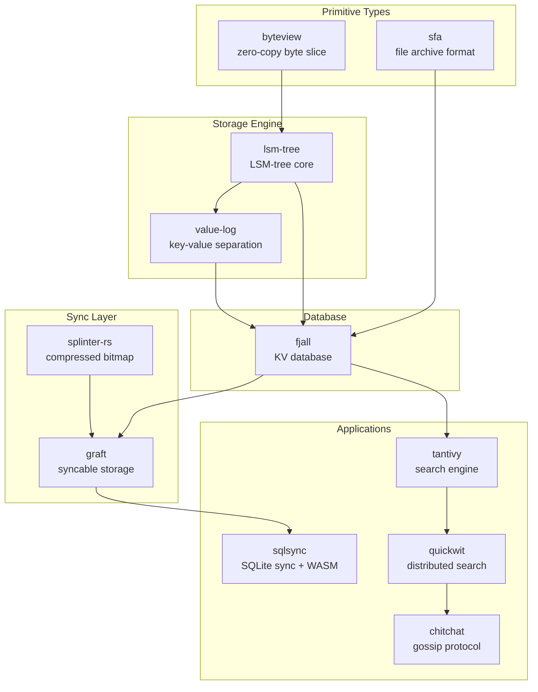
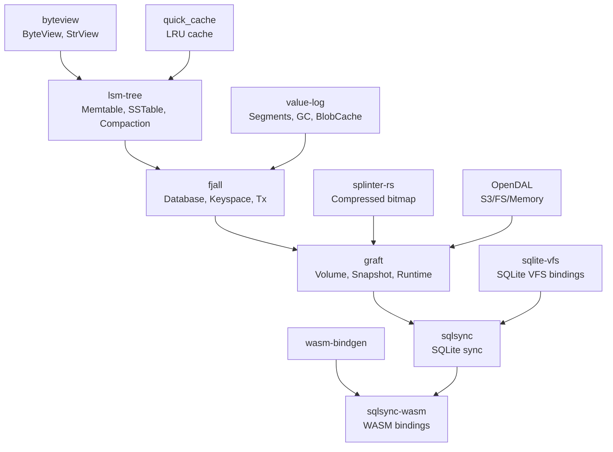

# Orbitinghail Rust Projects -- Architecture and Layer Map

The orbitinghail ecosystem is organized into layers: primitive types at the bottom, storage engines in the middle, and application-level systems at the top.

**Aha:** The dependency graph is a pyramid. At the base are single-purpose crates with no dependencies (`byteview`, `sfa`). On top of those sits `lsm-tree`, which depends on both. `fjall` depends on `lsm-tree` and adds transactions, multiple keyspaces, and crash recovery. `graft` depends on `fjall` and adds remote sync. At the very top, `sqlsync` depends on `graft` for storage and `splinter-rs` for page tracking. Each layer adds exactly one concern.

## Layer Diagram



## Module Dependency Graph



## Technology Stack

| Concern | Choice | Rationale |
|---------|--------|-----------|
| Storage engine | LSM-tree (lsm-tree crate) | Append-only writes, crash-safe, good read performance with compaction |
| Indexing | B-tree in memtable (crossbeam-skiplist) | Concurrent, lock-free inserts |
| Block compression | LZ4 | Fast decompression, good ratio for structured data |
| Block checksums | XXH3 128-bit | Fast, strong hash for corruption detection |
| Commit hashes | BLAKE3 32 bytes | Cryptographic hash with magic prefix for type safety |
| Bitmap compression | Splinter-rs (run-length + sparse) | Efficient for small, sparse sets of u32s |
| Remote storage | OpenDAL abstraction | Unified API for S3, filesystem, memory backends |
| SQLite integration | Custom VFS | No SQLite modification, standard extension mechanism |
| WASM compilation | wasm-bindgen + tsify | TypeScript interop, Cloudflare Workers support |
| Cluster communication | Chitchat gossip protocol | Decentralized membership, eventual consistency |
| Fault injection | Precept framework | Controlled testing of crash scenarios |

## Entry Points

### Fjall Database

Source: `fjall/src/lib.rs`

```rust
let db = ConfigBuilder::new()
    .path("/tmp/my-db")
    .open()?;

let keyspace = db.open_keyspace("my-data")?;
keyspace.insert(b"key", b"value")?;
db.persist(PersistMode::SyncAll)?;
```

### Graft Volume

Source: `graft/crates/graft/src/core/volume.rs`

Graft volumes are created through the setup/configuration process, not via a runtime builder. Autosync is configured via `GraftConfig.autosync` at construction time:

```rust
// fjall database
let db = ConfigBuilder::new().path("/tmp/my-db").open()?;

// graft storage wrapping fjall
let storage = FjallStorage::new(&db)?;

// remote config
let remote = RemoteConfig::S3Compatible {
    bucket: "my-bucket".to_string(),
    region: "us-east-1".to_string(),
    // ... credentials
};

// autosync configured in GraftConfig, not on Runtime
let config = GraftConfig::new(storage, remote).autosync(true);
let runtime = Runtime::new(tokio_handle, remote, storage, config)?;

// volume operations
let volume = runtime.volume("my-volume")?;
volume.write_page(PageIdx::new(1)?, page_data)?;
// Background sync runs automatically when autosync is enabled
```

### SQLSync WASM

Source: `sqlsync-wasm/src/lib.rs`

```typescript
// TypeScript (generated by tsify)
const db = await Database.open("my-volume");
const conn = await db.connect();
const rows = await conn.query("SELECT * FROM users WHERE id = ?", [1]);
```

## Key Files

```
lsm-tree/
├── src/memtable.rs           # In-memory write buffer (crossbeam-skiplist)
├── src/table/                # SSTable implementation
│   ├── block/                # Data block with prefix compression
│   ├── index/                # Binary + hash index blocks
│   └── filter/               # Bloom filter
├── src/compaction/           # Leveled, tiered, FIFO compaction
└── src/blob/                 # Key-value separation (WiscKey pattern)

fjall/
├── src/database.rs           # Database with multiple keyspaces
├── src/journal/              # WAL for crash recovery
├── src/transaction/          # Serializable transactions
└── src/snapshot/             # MVCC snapshot tracking

graft/
├── crates/graft/src/core/    # Core data model (Page, GID, Commit, LSN)
├── crates/graft/src/remote/  # Remote storage (S3, segments, commits)
├── crates/graft/src/oracle.rs # LEAP prefetching algorithm
└── crates/graft-sqlite/      # SQLite VFS on graft

splinter-rs/
├── src/lib.rs                # Compressed bitmap operations
└── src/bitmap/               # Bitmap encoding

sqlsync/
├── src/replication.rs        # Replication protocol
├── src/vfs.rs                # SQLite virtual file system
└── src/reducer/              # WASM conflict resolution
```

See [LSM-Tree](02-lsm-tree.md) for the core storage algorithm.
See [Fjall Database](03-fjall-database.md) for the KV database.
See [Graft Storage](04-graft-storage.md) for the syncable storage engine.
