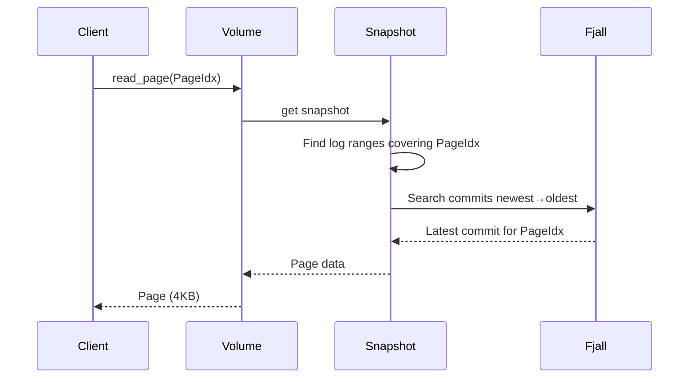

# Orbitinghail -- Graft Syncable Storage Engine

Graft is a page-oriented, syncable storage engine designed for offline-first applications. It sits on top of Fjall for local storage and OpenDAL for remote storage (S3, filesystem, memory). It uses a log-based replication model where commits are appended to a log and synced to remote object storage as compressed segments.

**Aha:** Graft's core abstraction is the **Page** — a fixed 4KB unit of data indexed by a 1-based `PageIdx`. Unlike a KV store where keys are arbitrary bytes, pages have a strict positional index. This simplifies sync: instead of reconciling arbitrary key changes, graft syncs page ranges. A commit records which pages were modified at which LSN (Log Sequence Number), and the remote sync task uploads only pages that haven't been synced yet.

Source: `graft/crates/graft/src/core/` — core data model (Page, GID, LSN, Commit)
Source: `graft/crates/graft/src/remote/` — remote storage and sync

## Core Data Model

### Page

```rust
// graft/crates/graft/src/core/page.rs
pub const PAGESIZE: ByteUnit = ByteUnit::from_kb(4);  // 4KB pages

pub struct Page(Bytes);  // Newtype wrapper for zero-copy sharing
pub struct PageIdx(NonZero<u32>);  // 1-based index, newtype with validation
pub struct PageCount(u32);  // Newtype with validation
```

Pages are the atomic unit of storage. Every read and write operates on a full page. This is the same design as database page files and filesystem blocks.

### PageSet (Compressed Bitmap)

```rust
// Uses splinter-rs for compressed bitmap
pub struct PageSet {
    splinter: CowSplinter<Bytes>,
}
```

A `PageSet` tracks which pages exist in a set. Instead of a `Vec<PageIdx>` or `HashSet<PageIdx>`, it uses a compressed bitmap — for sparse sets of 100 pages within a 10GB volume, the bitmap uses ~12 bytes instead of 400 bytes.

Source: `splinter-rs/` — compressed bitmap implementation

### LSN (Log Sequence Number)

```rust
pub struct LSN(NonZero<u64>);  // Newtype wrapper for log sequence numbers
```

LSNs are monotonically increasing integers assigned to each commit. They provide a total ordering of writes within a log. LSNs wrap around using modular arithmetic for circular logs.

### GID (Global ID)

```
┌──────────────┬──────────────────────────┐
│ Timestamp    │ Random                   │
│ 7 bytes      │ 9 bytes                  │
└──────────────┴──────────────────────────┘
```

A 16-byte globally unique identifier with type-safe prefixes:
- `VolumeId` — identifies a volume
- `LogId` — identifies a log
- `SegmentId` — identifies a segment

Serialized as Base58 for alphanumeric sorting (filesystem-friendly).

### Commit

```rust
// graft/crates/graft/src/core/commit.rs
// Protobuf-like message using bilrost
pub struct Commit {
    pub log: LogId,
    pub lsn: LSN,
    pub page_count: PageCount,
    pub commit_hash: Option<CommitHash>,
    pub segment_idx: Option<SegmentIdx>,
    pub checkpoints: ThinVec<LSN>,
    // SegmentIdx contains a pageset: PageSet field
}
```

A commit records that `page_count` pages were written at `lsn` in `log_id`. The `commit_hash` provides integrity verification. The `segment_idx` points to the segment file containing the actual page data.

### CommitHash

```
┌────────────────────────────────────┐
│ 4-byte magic │ BLAKE3 hash (28b)   │
│ [0x68,0xA4,0x19,0x30]             │
└────────────────────────────────────┘
```

Hash covers: magic + log + lsn + page_count + commit_page_count + ordered (pageidx, page_data) pairs. Total 32 bytes (`COMMIT_HASH_SIZE`). Base58 encoded (44 chars).

**Aha:** The 4-byte magic prefix `[0x68, 0xA4, 0x19, 0x30]` in the commit hash serves as a type tag. This prevents confusion with other hash types — if the first 4 bytes don't match the magic, it's not a commit hash. This is a lightweight form of tagged typing without a full schema system.

### Checksum (Order-Independent)

```rust
// Order-independent checksum for unordered sets
// Uses ChecksumBuilder struct with add()/build()/pretty() methods
pub struct ChecksumBuilder {
    sum: u128,
    count: u64,
    total_bytes: u64,
}

impl ChecksumBuilder {
    pub fn add(&mut self, item: &[u8]) {
        let hash = xxhash_rust::xxh3::xxh3_128(item);
        self.sum = self.sum.wrapping_add(hash);
        self.sum ^= hash;  // XOR for order independence
        self.count += 1;
        self.total_bytes += item.len() as u64;
    }

    pub fn build(&self) -> u128 {
        self.sum ^ (self.count as u128) ^ (self.total_bytes as u128)
    }
}
```

The checksum is order-independent: `checksum([a, b]) == checksum([b, a])`. The `LeapOracle` (in `oracle.rs`) is a separate component for prefetch prediction using Boyer-Moore majority voting — it is unrelated to checksum computation.

## FjallStorage Layout

Graft uses six fjall keyspaces:

| Keyspace | Key | Value | Purpose |
|----------|-----|-------|---------|
| `tags` | `ByteString` | `VolumeId` | Named volume references (like git refs) |
| `volumes` | `VolumeId` | `Volume` | Volume metadata |
| `checkpoints` | `LogRef` | `()` | Checkpoint index |
| `log` | `LogRef` | `Commit` | Commit log, LSNs ordered descending |
| `page_versions` | `PageVersion` | `()` | Page version index: latest-wins lookup |
| `pages` | `PageKey` | `Page` | Actual page data (KV separation enabled) |

**Aha:** Keys in the `log` keyspace are designed so that descending lexicographic order corresponds to "newest first." This means iterating the log from the beginning gives you the most recent commits first — no reverse scan needed. The `page_versions` index uses the same trick: the key encodes the LSN in descending order, so the first entry for a page is always the latest version.

## Reading a Page



Reading a page involves:
1. Get the current snapshot
2. Search commits from newest to oldest across all log ranges
3. Find the latest commit that contains the target PageIdx
4. Read the page from the `pages` keyspace using the PageKey (log_id + lsn + pageidx)

## Snapshot Model

A `Snapshot` is a logical view of a Volume composed of LSN ranges from multiple Logs:

```rust
pub struct Snapshot {
    pub volume_id: VolumeId,
    pub path: ThinVec<LogRangeRef>,  // Path of log ranges
}

pub struct LogRangeRef {
    pub log_id: LogId,
    pub lsns: RangeInclusive<LSN>,
    // Note: no checkpoints field on LogRangeRef
}
```

A snapshot captures the state at a point in time. It can include local log ranges and remote log ranges (from S3). Reading from a snapshot automatically fetches pages from the appropriate source.

## LEAP Prefetching Oracle

Source: `graft/crates/graft/src/oracle.rs`

The `LeapOracle` implements the **LEAP prefetching algorithm** (Maruf & Chowdhury, USENIX ATC 2020):

```
Access pattern:  10, 11, 12, 13, 14, ...
Delta buffer:    +1, +1, +1, +1, ...
Majority vote:   +1 (100% confidence)
Prediction:      Next page will be current + 1
```

The oracle tracks recent page access deltas in a 32-entry circular buffer. It uses Boyer-Moore strict majority voting to find access trends. When a trend is detected (sequential, stride, reverse), it prefetches along the trend. When no trend is detected, it falls back to neighborhood prefetching.

**Aha:** LEAP is designed for the specific access patterns of database workloads: sequential scans, index lookups with predictable strides, and reverse scans. A generic LRU cache doesn't prefetch — it only caches what was read. LEAP predicts what will be read next and fetches it proactively.

## Replicating in Rust

```rust
use graft::{Runtime, Volume, GraftConfig, RemoteConfig, Page, PageIdx};

// fjall database
let db = ConfigBuilder::new().path("/tmp/my-db").open()?;
let storage = FjallStorage::new(&db)?;

// remote config
let remote = RemoteConfig::S3Compatible {
    bucket: "my-bucket".to_string(),
    region: "us-east-1".to_string(),
    // ... credentials
};

// autosync configured in GraftConfig
let config = GraftConfig::new(storage, remote).autosync(true);
let runtime = Runtime::new(tokio_handle, remote, storage, config)?;

// Write pages
let volume = runtime.volume("my-data")?;
volume.write_page(PageIdx::new(1)?, page_data)?;
// Background sync runs automatically when autosync is enabled
```

See [Architecture](01-architecture.md) for the layer diagram.
See [Remote Sync](05-remote-sync.md) for the S3 sync process.
See [Storage Formats](08-storage-formats.md) for the segment format.
