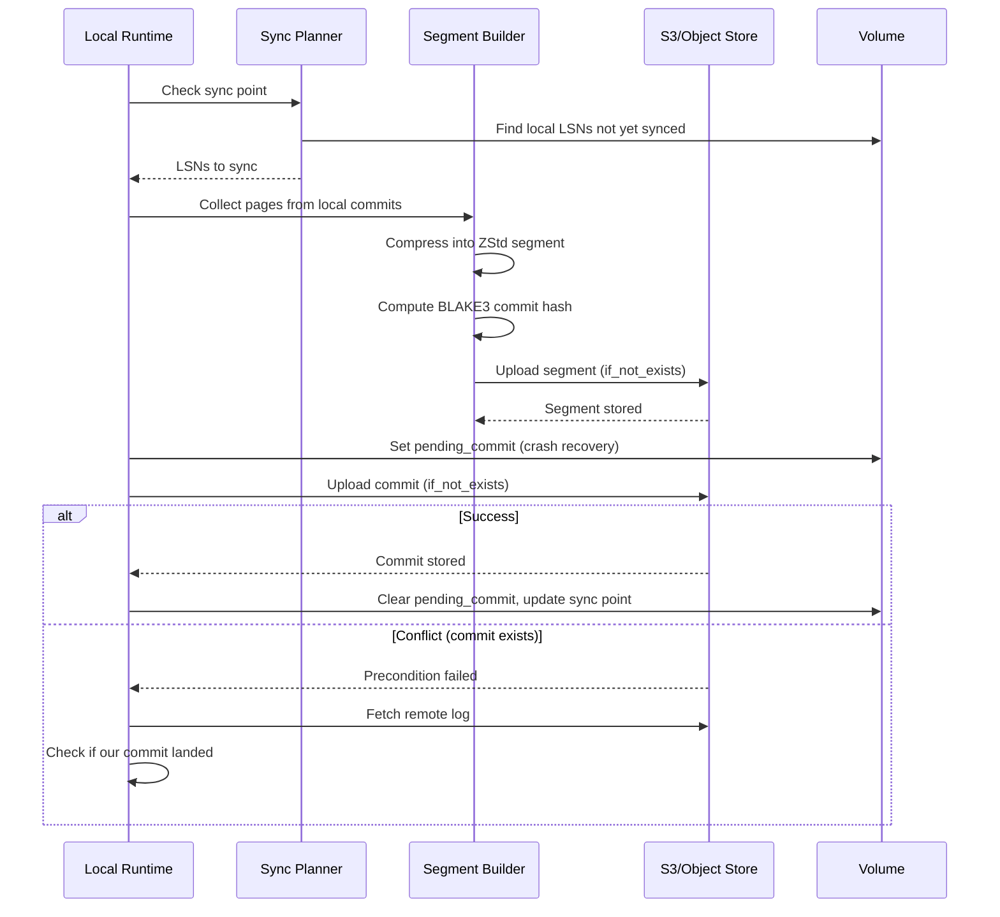

# Orbitinghail -- Remote Sync to S3

Graft syncs local changes to remote object storage (S3, filesystem, memory) through OpenDAL. The sync process uploads compressed segments containing pages and atomic commit records. The design ensures crash safety, idempotency, and efficient byte-range reads.

**Aha:** Remote storage uses CBE (Complement Big-Endian) encoding for LSNs in object paths. An LSN of 1000 becomes `CBE64(1000)` which sorts *descending* lexicographically. This means listing objects under `/logs/{logid}/commits/` in reverse order gives you the most recent commits first — the same ordering trick used in the local fjall keyspaces. The local and remote use the same ordering principle.

Source: `graft/crates/graft/src/remote/` — remote storage
Source: `graft/crates/graft/src/remote/segment.rs` — segment builder

## Object Path Layout

```
/logs/{logid}/commits/{CBE64-hex-LSN}    # Commit records
/segments/{sid}                          # Compressed page segments
```

Commits are stored one per file, named by their CBE-encoded LSN. Segments are stored by their SegmentId and contain multiple pages.

## CBE Encoding

CBE (Complement Big-Endian) encodes integers so that lexicographic string order matches numeric *descending* order:

```rust
// CBE64: ones-complement big-endian encoding
fn cbe64(n: u64) -> [u8; 8] {
    (!n).to_be_bytes()  // Complement then big-endian
}
```

Example: LSN 1 → all-ones complement → `0xFFFFFFFFFFFFFFFE` in hex. LSN 1000 → complement → sorts before LSN 1.

**Aha:** Without CBE, listing S3 objects would return commits in ascending LSN order (oldest first). You'd need to list all objects and then reverse the list to find the newest commits. With CBE, a simple reverse listing gives you newest first. For a log with millions of commits, this avoids listing the entire prefix.

## Segment Format

Source: `graft/crates/graft/src/remote/segment.rs`

Segments contain compressed pages using ZStd level 3:

```
┌──────────────────────────────────────────────────┐
│                   Segment File                    │
├──────────────────────────────────────────────────┤
│  Frame 1: ZStd compressed (up to 64 pages)      │
│  - Frame header (ZStd format)                    │
│  - Pages 1..N concatenated, sorted by PageIdx   │
├──────────────────────────────────────────────────┤
│  Frame 2: ZStd compressed                        │
├──────────────────────────────────────────────────┤
│  ...                                             │
└──────────────────────────────────────────────────┘
```

**Frame properties:**
- Each frame contains up to 64 pages (256 KB uncompressed max)
- Pages within a frame are strictly increasing by PageIdx
- ZStd checksum flag enabled — each frame has an integrity check
- Content size flag disabled — frames are stream-chunked

### Streaming Segment Builder

```rust
// Reusable ZStd compression context from zstd_safe
use zstd::zstd_safe::{CCtx, CParameter};

let mut cctx = CCtx::create();
cctx.set_parameter(CParameter::ChecksumFlag(true))?;

// Push pages in order
builder.push(PageIdx::new(1)?, page_data_1)?;
builder.push(PageIdx::new(2)?, page_data_2)?;
// ... auto-flush when 64 pages reached
```

The builder uses a reusable `CCtx` to avoid allocation overhead. Output is chunked for memory efficiency — frames are emitted as they fill, not buffered entirely in memory.

## Remote Commit Process



### Step-by-Step

1. **Plan**: Compare local sync point with remote log. Determine which local LSNs need syncing.
2. **Build segment**: Collect pages from local commits, compress into ZStd segment, compute BLAKE3 commit hash.
3. **Upload segment**: Push to remote with `if_not_exists: true` — if the segment already exists, skip (deduplication).
4. **Prepare**: Set `pending_commit` on the volume. This is the crash recovery point — if the process dies here, the next sync knows an upload was in progress.
5. **Upload commit**: Atomically write commit to remote with `if_not_exists: true`. This is the actual durability point — the commit record is the authoritative reference.
6. **Success**: Clear `pending_commit`, update the local sync point.
7. **Recovery**: If the precondition failed (commit already exists), fetch the remote log and check if our commit landed. If it did (matching hash), the sync succeeded. If not, the sync was a no-op (another process synced the same data).

**Aha:** The `if_not_exists` precondition check makes the commit upload idempotent. Two processes syncing the same data concurrently won't corrupt each other — the second one's upload will fail the precondition check, and it will verify that the first one's commit is correct. This eliminates the need for distributed locking.

## S3 Optimizations

Source: `graft/crates/graft/src/remote.rs` — `RemoteConfig` and client setup

| Optimization | Implementation | Effect |
|-------------|---------------|--------|
| **HTTP/1 only** | `hyper::client::HttpConnector` with HTTP/1 | Avoids HTTP/2 head-of-line blocking for concurrent object uploads |
| **DNS caching** | Hickory DNS resolver | Reduces DNS lookup latency for repeated S3 requests |
| **Connect timeout** | 5 seconds | Fast failure when S3 endpoint is unreachable |
| **TCP user timeout** | 60 seconds | Detects dead connections quickly |
| **RetryLayer** | OpenDAL `RetryLayer::new()` | Automatic retry on transient errors |
| **Concurrency** | `REMOTE_CONCURRENCY = 5` | Parallel reads/writes for throughput |

**Aha:** HTTP/1 is faster than HTTP/2 for object storage workloads. HTTP/2 multiplexes requests over a single connection, which means a slow request blocks all others (head-of-line blocking). For S3, where each request is independent and the bottleneck is network latency, multiple HTTP/1 connections give better throughput.

## Byte-Range Reads

To read a single page from a remote segment:

1. Read the commit to find the `segment_idx`
2. Read the segment's frame index (small, typically <1KB)
3. Find which frame contains the target PageIdx
4. Make an S3 `Range` request for just that frame's byte range
5. Decompress the frame and extract the page

This means reading one 4KB page from a 100MB segment only downloads the frame containing that page (typically 32-256KB), not the entire segment.

**Aha:** The frame index is the key to efficient random access. Without it, you'd need to download and decompress the entire segment to find one page. With it, you make a targeted `Range` request for just the bytes you need. The frame index is small because there are at most `ceil(total_pages / 64)` entries.

## Autosync Task

The `AutosyncTask` runs periodically in the background:

```rust
async fn autosync(&self, volume: &Volume) {
    loop {
        tokio::time::sleep(interval).await;
        // Push local changes to remote
        self.push_pending(volume).await;
        // Pull remote changes to local
        self.pull_remote(volume).await;
    }
}
```

Push and pull are independent — a client can work offline, accumulate local commits, and sync when connectivity is restored. Remote commits are pulled into the local log automatically.

## Replicating in Rust

For a simpler S3 sync without the full graft stack:

```rust
use opendal::{Operator, Scheme};

let op = Operator::via_env(Scheme::S3)?;

// Atomic write with precondition
let mut writer = op.writer_with("path/to/object")
    .if_not_exists(true)
    .await?;
writer.write(data).await?;
writer.close().await?;

// Range read
let reader = op.reader_with("path/to/object")
    .range(100..200)  // Bytes 100-199
    .await?;
let chunk = reader.read().await?;
```

See [Graft Storage](04-graft-storage.md) for the core data model.
See [S3 Remote Optimizations](10-s3-remote-optimizations.md) for detailed S3 patterns.
See [Checksums and Validation](09-checksums-validation.md) for commit hash verification.
