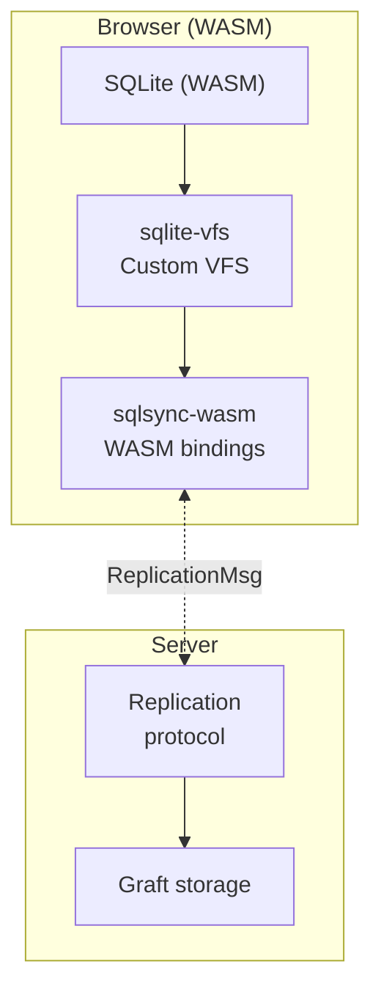
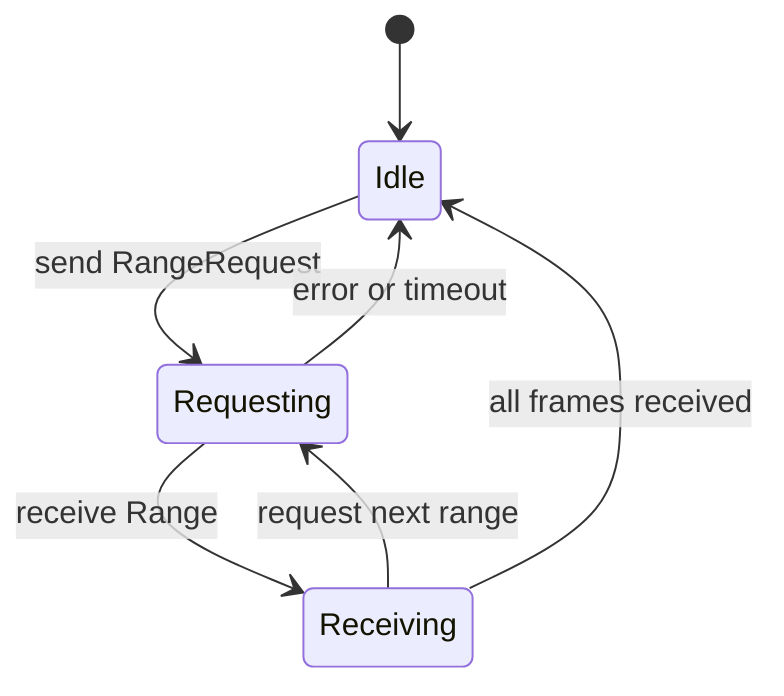

# Orbitinghail -- SQLSync Offline-First SQLite

SQLSync is a collaborative offline-first wrapper around SQLite for web applications. It provides journal-based replication, WASM reducers for conflict resolution, and a custom SQLite VFS that runs on top of Graft. The browser runs a full SQLite database compiled to WASM, with sync handled through a replication protocol.

**Aha:** SQLSync doesn't sync SQL statements — it syncs SQLite journal frames (WAL frames). Each frame is an atomic page-level change to the database file. The replication protocol transfers frame ranges between peers, and WASM reducers transform frames to resolve conflicts. This is fundamentally different from CRDT-based approaches — SQLite's ACID guarantees are preserved because the underlying storage is always a valid SQLite database file.

Source: `sqlsync/src/replication.rs` — replication protocol
Source: `sqlsync-wasm/src/lib.rs` — WASM bindings

## Architecture



## Replication Protocol

Source: `sqlsync/src/replication.rs`

```rust
pub enum ReplicationMsg {
    RangeRequest { id: JournalId, source_range: LsnRange },
    Range { range: LsnRange },
    Frame { id: JournalId, lsn: Lsn, len: u64 },
}
```

The protocol uses typed identifiers: `JournalId` identifies a journal, `LsnRange` describes a range of LSNs, and individual frames carry their journal identity, LSN, and payload length.

The protocol is a state machine with a maximum of 100 outstanding frames:



### Traits

```rust
pub trait ReplicationSource {
    fn get_frame_range(&self, start: LSN, end: LSN) -> Result<Vec<Frame>>;
    fn get_frame_count(&self) -> Result<u64>;
}

pub trait ReplicationDestination {
    fn apply_frame(&mut self, frame: &Frame) -> Result<()>;
    fn get_current_lsn(&self) -> Result<LSN>;
}
```

### Contiguous LSN Enforcement

SQLSync enforces that LSNs are contiguous — there can be no gaps in the frame sequence. If a peer is missing frames, it must request them all from the last contiguous LSN. This ensures database consistency: applying frames out of order would corrupt the SQLite file.

## WASM Integration

Source: `sqlsync-wasm/src/lib.rs`

Compiled to `cdylib` for both core and WASM packages:

```toml
# Cargo.toml
[lib]
crate-type = ["cdylib", "rlib"]

[dependencies]
wasm-bindgen = "0.2"
wasm-bindgen-futures = "0.4"
web-sys = { version = "0.3", features = ["Crypto", "Window"] }
tsify = "0.4"
console_error_panic_hook = "0.1"
```

Key integrations:
- **tsify**: Generates TypeScript types from Rust structs
- **web-sys Crypto**: Uses browser's WebCrypto for cryptographic operations
- **console_error_panic_hook**: Panics are routed to `console.error` for debugging
- **Cloudflare Workers**: Support via `worker` crate for edge deployment

## TypeScript Bindings (Generated)

```typescript
// Generated by tsify from Rust structs
interface ReplicationMsg {
    type: 'RangeRequest' | 'Range' | 'Frame';
    id?: string;           // JournalId
    source_range?: object; // LsnRange
    range?: object;        // LsnRange
    lsn?: bigint;
    len?: bigint;
}

interface Database {
    open(volumeId: string): Promise<Database>;
    connect(): Promise<Connection>;
}

interface Connection {
    query(sql: string, params: any[]): Promise<Row[]>;
    execute(sql: string, params: any[]): Promise<void>;
}
```

## SQLite VFS

Source: `sqlite-vfs/` — SQLite virtual file system bindings

SQLSync implements a custom SQLite VFS that reads and writes pages through Graft:

```
SQLite operation → VFS layer → Graft page read/write
```

When SQLite reads page N, the VFS reads `PageIdx(N)` from the graft volume. When SQLite writes page N, the VFS writes to `PageIdx(N)` and the change is tracked in the graft commit log.

This means every SQLite change is automatically part of the graft replication log — no separate WAL parsing or change detection needed.

## Reducer System

Reducers are WASM modules that transform frames to resolve conflicts:

```rust
// Reducer: transforms incoming frames
pub trait Reducer {
    fn apply(&self, local_frames: &[Frame], remote_frames: &[Frame]) -> Result<Vec<Frame>>;
}
```

For example, a guestbook reducer might resolve conflicting inserts by ordering them by timestamp. The reducer runs in the browser as WASM, so conflict resolution happens client-side.

## Reactive Queries

```rust
pub struct ReactiveQuery {
    sql: String,
    params: Vec<Value>,
    last_result: Option<Vec<Row>>,
}

impl ReactiveQuery {
    pub fn poll(&mut self, conn: &Connection) -> Option<&[Row]> {
        let new_result = conn.query(&self.sql, &self.params)?;
        if new_result != self.last_result {
            self.last_result = Some(new_result);
            Some(&self.last_result)
        } else {
            None  // No change
        }
    }
}
```

Reactive queries detect when query results have changed and notify the UI. This is the WASM equivalent of a reactive signal — the query result is the signal, and changes are propagated through the replication protocol.

## Replicating in Rust

For a non-WASM Rust application:

```rust
use sqlsync::{Database, ReplicationProtocol};

let db = Database::open("my-volume")?;
let conn = db.connect()?;

// Standard SQLite operations
conn.execute("CREATE TABLE users (id INTEGER PRIMARY KEY, name TEXT)", ())?;
conn.execute("INSERT INTO users (name) VALUES (?)", ("Alice",))?;

// Replication
let mut protocol = ReplicationProtocol::new();
let frames = db.get_frame_range(LSN::new(1)?, LSN::new(100)?)?;
protocol.apply_frames(&frames)?;
```

See [Graft Storage](04-graft-storage.md) for the underlying storage.
See [WASM and Web Patterns](13-wasm-web-patterns.md) for WASM build details.
See [Architecture](01-architecture.md) for the dependency graph.
